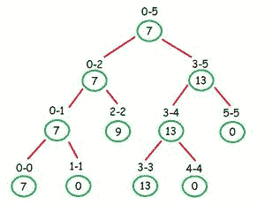

# 使用段树

查询给定索引范围内大于 K 的元素

> 原文:[https://www . geeksforgeeks . org/查询给定索引范围内大于 k 的元素使用段树/](https://www.geeksforgeeks.org/queries-for-elements-greater-than-k-in-the-given-index-range-using-segment-tree/)

给定一个由 **N** 元素组成的数组 **arr[]** 和多个查询，其中每个查询将包含三个整数 **L** 、 **R** 和 **K** 。对于每个查询，任务是找到子数组**arr【L…R】**中大于 **K** 的元素个数。

**示例:**

> **输入:** arr[] = {7，3，9，13，5，4}，q[] = {{0，3，6}，{1，5，8}}
> **输出:**
> 3
> 2
> 查询 1:在子阵列{7，3，9，13}中只有 7，9 和 13 大于
> 。
> 查询 2:子阵{3，9，13，5，4}中只有 9 和 13 大于
> 。
> 
> **输入:** arr[] = {0，1，2，3，4，5，6，7}，q[] = {{0，7，3}，{4，6，10 } }
> T3】输出:T5】4
> 0

**先决条件:** [段树](https://www.geeksforgeeks.org/segment-tree-set-1-range-minimum-query/)

**天真的方法:**通过简单地遍历数组从索引 **l** 到 **r** 来找到每个查询的答案，并且每当数组元素大于 **k** 时，继续将 **1** 添加到计数中。这种方法的时间复杂度为 **O(n * q)** 。

**有效的方法:**建立一个[分段树](https://www.geeksforgeeks.org/segment-tree-set-1-sum-of-given-range/)，在每个节点有一个向量，包含子范围中所有元素的排序顺序。使用段树回答每个查询，其中[二分搜索法](https://www.geeksforgeeks.org/binary-search/)可用于计算子范围位于大于 **K** 的查询范围内的每个节点中存在多少个数字。该方法的时间复杂度将为 **O(q * log(n) * log(n))**

下面是上述方法的实现:

## C++

```
// C++ implementation of the approach
#include <bits/stdc++.h>
using namespace std;

// Merge procedure to merge two
// vectors into a single vector
vector<int> merge(vector<int>& v1, vector<int>& v2)
{
    int i = 0, j = 0;

    // Final vector to return
    // after merging
    vector<int> v;

    // Loop continues until it reaches
    // the end of one of the vectors
    while (i < v1.size() && j < v2.size()) {
        if (v1[i] <= v2[j]) {
            v.push_back(v1[i]);
            i++;
        }
        else {
            v.push_back(v2[j]);
            j++;
        }
    }

    // Here, simply add the remaining
    // elements to the vector v
    for (int k = i; k < v1.size(); k++)
        v.push_back(v1[k]);
    for (int k = j; k < v2.size(); k++)
        v.push_back(v2[k]);
    return v;
}

// Procedure to build the segment tree
void buildTree(vector<int>* tree, int* arr,
               int index, int s, int e)
{

    // Reached the leaf node
    // of the segment tree
    if (s == e) {
        tree[index].push_back(arr[s]);
        return;
    }

    // Recursively call the buildTree
    // on both the nodes of the tree
    int mid = (s + e) / 2;
    buildTree(tree, arr, 2 * index, s, mid);
    buildTree(tree, arr, 2 * index + 1, mid + 1, e);

    // Storing the final vector after merging
    // the two of its sorted child vector
    tree[index] = merge(tree[2 * index], tree[2 * index + 1]);
}

// Query procedure to get the answer
// for each query l and r are query range
int query(vector<int>* tree, int index, int s,
          int e, int l, int r, int k)
{

    // out of bound or no overlap
    if (r < s || l > e)
        return 0;

    // Complete overlap
    // Query range completely lies in
    // the segment tree node range
    if (s >= l && e <= r) {
        // binary search to find index of k
        return (tree[index].size()
                - (lower_bound(tree[index].begin(),
                               tree[index].end(), k)
                   - tree[index].begin()));
    }

    // Partially overlap
    // Query range partially lies in
    // the segment tree node range
    int mid = (s + e) / 2;
    return (query(tree, 2 * index, s,
                  mid, l, r, k)
            + query(tree, 2 * index + 1, mid + 1,
                    e, l, r, k));
}

// Function to perform the queries
void performQueries(int L[], int R[], int K[],
                    int n, int q, vector<int> tree[])
{
    for (int i = 0; i < q; i++) {
        cout << query(tree, 1, 0, n - 1,
                      L[i] - 1, R[i] - 1, K[i])
             << endl;
    }
}

// Driver code
int main()
{
    int arr[] = { 7, 3, 9, 13, 5, 4 };
    int n = sizeof(arr) / sizeof(arr[0]);
    vector<int> tree[4 * n + 1];
    buildTree(tree, arr, 1, 0, n - 1);

    // 1-based indexing
    int L[] = { 1, 2 };
    int R[] = { 4, 6 };
    int K[] = { 6, 8 };

    // Number of queries
    int q = sizeof(L) / sizeof(L[0]);

    performQueries(L, R, K, n, q, tree);

    return 0;
}
```

## Java 语言(一种计算机语言，尤用于创建网站)

```
// Java implementation of the approach
import java.util.*;

class GFG {

    // Merge procedure to merge two
    // vectors into a single vector
    static Vector<Integer> merge(Vector<Integer> v1,
                               Vector<Integer> v2)
    {
        int i = 0, j = 0;

        // Final vector to return
        // after merging
        Vector<Integer> v = new Vector<>();

        // Loop continues until it reaches
        // the end of one of the vectors
        while (i < v1.size() && j < v2.size())
        {
            if (v1.elementAt(i) <= v2.elementAt(j))
            {
                v.add(v1.elementAt(i));
                i++;
            }
            else
            {
                v.add(v2.elementAt(j));
                j++;
            }
        }

        // Here, simply add the remaining
        // elements to the vector v
        for (int k = i; k < v1.size(); k++)
            v.add(v1.elementAt(k));
        for (int k = j; k < v2.size(); k++)
            v.add(v2.elementAt(k));
        return v;
    }

    // Procedure to build the segment tree
    static void buildTree(Vector<Integer>[] tree, int[] arr,
                        int index, int s, int e)
    {

        // Reached the leaf node
        // of the segment tree
        if (s == e)
        {
            tree[index].add(arr[s]);
            return;
        }

        // Recursively call the buildTree
        // on both the nodes of the tree
        int mid = (s + e) / 2;
        buildTree(tree, arr, 2 * index, s, mid);
        buildTree(tree, arr, 2 * index + 1, mid + 1, e);

        // Storing the final vector after merging
        // the two of its sorted child vector
        tree[index] = merge(tree[2 * index], tree[2 * index + 1]);
    }

    // Query procedure to get the answer
    // for each query l and r are query range
    static int query(Vector<Integer>[] tree, int index, int s,
                    int e, int l, int r, int k)
    {

        // out of bound or no overlap
        if (r < s || l > e)
            return 0;

        // Complete overlap
        // Query range completely lies in
        // the segment tree node range
        if (s >= l && e <= r)
        {

            // binary search to find index of k
            return (tree[index].size() - lowerBound(tree[index],
                    tree[index].size(), k));
        }

        // Partially overlap
        // Query range partially lies in
        // the segment tree node range
        int mid = (s + e) / 2;
        return (query(tree, 2 * index, s, mid, l, r, k) +
                query(tree, 2 * index + 1, mid + 1, e, l, r, k));
    }

    // Function to perform the queries
    static void performQueries(int L[], int R[], int K[],
                        int n, int q, Vector<Integer> tree[])
    {
        for (int i = 0; i < q; i++)
        {
            System.out.println(query(tree, 1, 0, n - 1,
                                    L[i] - 1, R[i] - 1, K[i]));
        }
    }

    static int lowerBound(Vector<Integer> array,
                        int length, int value)
    {
        int low = 0;
        int high = length;
        while (low < high)
        {
            final int mid = (low + high) / 2;
            if (value <= array.elementAt(mid))
            {
                high = mid;
            }
            else
            {
                low = mid + 1;
            }
        }
        return low;
    }

    // Driver Code
    public static void main(String[] args)
    {
        int arr[] = { 7, 3, 9, 13, 5, 4 };
        int n = arr.length;
        @SuppressWarnings("unchecked")
        Vector<Integer>[] tree = new Vector[4 * n + 1];
        for (int i = 0; i < (4 * n + 1); i++)
        {
            tree[i] = new Vector<>();
        }

        buildTree(tree, arr, 1, 0, n - 1);

        // 1-based indexing
        int L[] = { 1, 2 };
        int R[] = { 4, 6 };
        int K[] = { 6, 8 };

        // Number of queries
        int q = L.length;

        performQueries(L, R, K, n, q, tree);
    }
}

// This code is contributed by
// sanjeev2552
```

## 蟒蛇 3

```
# Python3 implementation of the approach
from bisect import bisect_left as lower_bound

# Merge procedure to merge two
# vectors into a single vector
def merge(v1, v2):
    i = 0
    j = 0

    # Final vector to return
    # after merging
    v = []

    # Loop continues until it reaches
    # the end of one of the vectors
    while (i < len(v1) and j < len(v2)):
        if (v1[i] <= v2[j]):
            v.append(v1[i])
            i += 1
        else:
            v.append(v2[j])
            j += 1

    # Here, simply add the remaining
    # elements to the vector v
    for k in range(i, len(v1)):
        v.append(v1[k])
    for k in range(j, len(v2)):
        v.append(v2[k])
    return v

# Procedure to build the segment tree
def buildTree(tree,arr,index, s, e):

    # Reached the leaf node
    # of the segment tree
    if (s == e):
        tree[index].append(arr[s])
        return

    # Recursively call the buildTree
    # on both the nodes of the tree
    mid = (s + e) // 2
    buildTree(tree, arr, 2 * index, s, mid)
    buildTree(tree, arr, 2 * index + 1, mid + 1, e)

    # Storing the final vector after merging
    # the two of its sorted child vector
    tree[index] = merge(tree[2 * index], tree[2 * index + 1])

# Query procedure to get the answer
# for each query l and r are query range
def query(tree, index, s, e, l, r, k):

    # out of bound or no overlap
    if (r < s or l > e):
        return 0

    # Complete overlap
    # Query range completely lies in
    # the segment tree node range
    if (s >= l and e <= r):

        # binary search to find index of k
        return len(tree[index]) - (lower_bound(tree[index], k))

    # Partially overlap
    # Query range partially lies in
    # the segment tree node range
    mid = (s + e) // 2
    return (query(tree, 2 * index, s,mid, l, r, k)
            + query(tree, 2 * index + 1, mid + 1,e, l, r, k))

# Function to perform the queries
def performQueries(L, R, K,n, q,tree):
    for i in range(q):
        print(query(tree, 1, 0, n - 1,L[i] - 1, R[i] - 1, K[i]))

# Driver code
if __name__ == '__main__':
    arr = [7, 3, 9, 13, 5, 4]
    n = len(arr)
    tree = [[] for i in range(4 * n + 1)]
    buildTree(tree, arr, 1, 0, n - 1)

    # 1-based indexing
    L = [1, 2]
    R = [4, 6]
    K = [6, 8]

    # Number of queries
    q = len(L)

     performQueries(L, R, K, n, q, tree)

# This code is contributed by mohit kumar 29        
```

## C#

```
// C# implementation of the approach
using System;
using System.Collections.Generic;

class GFG {

    // Merge procedure to merge two
    // vectors into a single vector
    static List<int> merge(List<int> v1,
                               List<int> v2)
    {
        int i = 0, j = 0;

        // Final vector to return
        // after merging
        List<int> v = new List<int>();

        // Loop continues until it reaches
        // the end of one of the vectors
        while (i < v1.Count && j < v2.Count)
        {
            if (v1[i] <= v2[j])
            {
                v.Add(v1[i]);
                i++;
            }
            else
            {
                v.Add(v2[j]);
                j++;
            }
        }

        // Here, simply add the remaining
        // elements to the vector v
        for (int k = i; k < v1.Count; k++)
            v.Add(v1[k]);
        for (int k = j; k < v2.Count; k++)
            v.Add(v2[k]);
        return v;
    }

    // Procedure to build the segment tree
    static void buildTree(List<int>[] tree, int[] arr,
                        int index, int s, int e)
    {

        // Reached the leaf node
        // of the segment tree
        if (s == e)
        {
            tree[index].Add(arr[s]);
            return;
        }

        // Recursively call the buildTree
        // on both the nodes of the tree
        int mid = (s + e) / 2;
        buildTree(tree, arr, 2 * index, s, mid);
        buildTree(tree, arr, 2 * index + 1, mid + 1, e);

        // Storing the readonly vector after merging
        // the two of its sorted child vector
        tree[index] = merge(tree[2 * index], tree[2 * index + 1]);
    }

    // Query procedure to get the answer
    // for each query l and r are query range
    static int query(List<int>[] tree, int index, int s,
                    int e, int l, int r, int k)
    {

        // out of bound or no overlap
        if (r < s || l > e)
            return 0;

        // Complete overlap
        // Query range completely lies in
        // the segment tree node range
        if (s >= l && e <= r)
        {

            // binary search to find index of k
            return (tree[index].Count - lowerBound(tree[index],
                    tree[index].Count, k));
        }

        // Partially overlap
        // Query range partially lies in
        // the segment tree node range
        int mid = (s + e) / 2;
        return (query(tree, 2 * index, s, mid, l, r, k) +
                query(tree, 2 * index + 1, mid + 1, e, l, r, k));
    }

    // Function to perform the queries
    static void performQueries(int []L, int []R, int []K,
                        int n, int q, List<int> []tree)
    {
        for (int i = 0; i < q; i++)
        {
            Console.WriteLine(query(tree, 1, 0, n - 1,
                                    L[i] - 1, R[i] - 1, K[i]));
        }
    }

    static int lowerBound(List<int> array,
                        int length, int value)
    {
        int low = 0;
        int high = length;
        while (low < high)
        {
            int mid = (low + high) / 2;
            if (value <= array[mid])
            {
                high = mid;
            }
            else
            {
                low = mid + 1;
            }
        }
        return low;
    }

    // Driver Code
    public static void Main(String[] args)
    {
        int []arr = { 7, 3, 9, 13, 5, 4 };
        int n = arr.Length;
        List<int>[] tree = new List<int>[4 * n + 1];
        for (int i = 0; i < (4 * n + 1); i++)
        {
            tree[i] = new List<int>();
        }

        buildTree(tree, arr, 1, 0, n - 1);

        // 1-based indexing
        int []L = { 1, 2 };
        int []R = { 4, 6 };
        int []K = { 6, 8 };

        // Number of queries
        int q = L.Length;

        performQueries(L, R, K, n, q, tree);
    }
}

// This code is contributed by PrinciRaj1992
```

## java 描述语言

```
<script>

// JavaScript implementation of the approach

// Merge procedure to merge two
// vectors into a single vector
function merge(v1, v2) {
    let i = 0, j = 0;

    // Final vector to return
    // after merging
    let v = new Array();

    // Loop continues until it reaches
    // the end of one of the vectors
    while (i < v1.length && j < v2.length) {
        if (v1[i] <= v2[j]) {
            v.push(v1[i]);
            i++;
        }
        else {
            v.push(v2[j]);
            j++;
        }
    }

    // Here, simply add the remaining
    // elements to the vector v
    for (let k = i; k < v1.length; k++)
        v.push(v1[k]);
    for (let k = j; k < v2.length; k++)
        v.push(v2[k]);
    return v;
}

// Procedure to build the segment tree
function buildTree(tree, arr, index, s, e) {

    // Reached the leaf node
    // of the segment tree
    if (s == e) {
        tree[index].push(arr[s]);
        return;
    }

    // Recursively call the buildTree
    // on both the nodes of the tree
    let mid = Math.floor((s + e) / 2);
    buildTree(tree, arr, 2 * index, s, mid);
    buildTree(tree, arr, 2 * index + 1, mid + 1, e);

    // Storing the final vector after merging
    // the two of its sorted child vector
    tree[index] = merge(tree[2 * index], tree[2 * index + 1]);
}

// Query procedure to get the answer
// for each query l and r are query range
function query(tree, index, s, e, l, r, k) {

    // out of bound or no overlap
    if (r < s || l > e)
        return 0;

    // Complete overlap
    // Query range completely lies in
    // the segment tree node range
    if (s >= l && e <= r) {
        // binary search to find index of k
        return (tree[index].length
            - (lowerBound(tree[index], tree[index].length, k)));
    }

    // Partially overlap
    // Query range partially lies in
    // the segment tree node range
    let mid = Math.floor((s + e) / 2);
    return (query(tree, 2 * index, s,
        mid, l, r, k)
        + query(tree, 2 * index + 1, mid + 1,
            e, l, r, k));
}

function lowerBound(array, length, value) {
    let low = 0;
    let high = length;
    while (low < high) {
        let mid = Math.floor((low + high) / 2);
        if (value <= array[mid]) {
            high = mid;
        }
        else {
            low = mid + 1;
        }
    }
    return low;
}

// Function to perform the queries
function performQueries(L, R, K, n, q, tree) {
    for (let i = 0; i < q; i++) {
        document.write(
        query(tree, 1, 0, n - 1, L[i] - 1, R[i] - 1, K[i]) +
        "<br>"
        );
    }
}

// Driver code

let arr = [7, 3, 9, 13, 5, 4];
let n = arr.length;
let tree = new Array();

for (let i = 0; i < 4 * n + 1; i++) {
    tree.push([])
}
buildTree(tree, arr, 1, 0, n - 1);

// 1-based indexing
let L = [1, 2];
let R = [4, 6];
let K = [6, 8];

// Number of queries
let q = L.length;

performQueries(L, R, K, n, q, tree);

</script>
```

**Output:** 

```
3
2
```

**另一种方法:**

使用段树的另一种方法是在该范围内的每个节点(如果存在)中存储大于 **K** 的第一个元素，否则存储 **0** 。

这里，我们需要考虑 3 种情况来构建树。

1.  如果左右子代都包含 0 以外的数字，则答案始终是左子代。(我们需要考虑大于 **K** 的数字的第一次出现。)
2.  如果左或右孩子中的任何一个包含 **0** ，则答案总是除 **0** 之外的数字。
3.  如果左右儿童都包含 **0** ，则答案始终为 **0** (表示该范围内不存在大于 **K** 的数字)。

查询功能保持不变。

考虑以下示例: **arr[] = {7，3，9，13，5，4}，K = 6**

这种情况下的树如下所示:



下面是上述方法的实现:

## C++

```
// C++ implementation of the approach
#include <bits/stdc++.h>
using namespace std;

vector<int> arr(1000000), tree(4 * arr.size());

// combine function to make parent node
int combine(int a, int b)
{
    if (a != 0 && b != 0) {
        return a;
    }
    if (a >= b) {
        return a;
    }
    return b;
}

// building the tree
void buildTree(int ind, int low, int high, int x)
{
    // leaf node
    if (low == high) {
        if (arr[low] > x) {
            tree[ind] = arr[low];
        }
        else {
            tree[ind] = 0;
        }
        return;
    }
    int mid = (low + high) / 2;
    buildTree(2 * ind + 1, low, mid, x);
    buildTree(2 * ind + 2, mid + 1, high, x);

    // merging the nodes while backtracking.
    tree[ind]
        = combine(tree[2 * ind + 1], tree[2 * ind + 2]);
}
// performing query
int query(int ind, int low, int high, int l, int r)
{
    int mid = (low + high) / 2;
    // Out of Bounds
    if (low > r || high < l) {
        return 0;
    }
    // completely overlaps
    if (l <= low && r >= high) {
        return tree[ind];
    }
    // partially overlaps
    return combine(query(2 * ind + 1, low, mid, l, r),
                   query(2 * ind + 2, mid + 1, high, l, r));
}

// Driver Code
int main()
{
    arr = { 7, 3, 9, 13, 5, 4 };
    int n = 6;
    int k = 6;

    // 1-based indexing
    int l = 1, r = 4;
    buildTree(0, 0, n - 1, k);
    cout << query(0, 0, n - 1, l - 1, r - 1);
    return 0;
}
// This code is contributed by yashbeersingh42
```

## Java 语言(一种计算机语言，尤用于创建网站)

```
// Java implementation of the approach
public class GFG {
    int[] arr, tree;

    // combine function to make parent node
    int combine(int a, int b)
    {
        if (a != 0 && b != 0) {
            return a;
        }
        if (a >= b) {
            return a;
        }
        return b;
    }

    // building the tree
    void buildTree(int ind, int low, int high, int x)
    {
        // leaf node
        if (low == high) {
            if (arr[low] > x) {
                tree[ind] = arr[low];
            }
            else {
                tree[ind] = 0;
            }
            return;
        }

        int mid = (high - low) / 2 + low;
        buildTree(2 * ind + 1, low, mid, x);
        buildTree(2 * ind + 2, mid + 1, high, x);

        // merging the nodes while backtracking
        tree[ind]
            = combine(tree[2 * ind + 1], tree[2 * ind + 2]);
    }

    // performing query
    int query(int ind, int low, int high, int l, int r)
    {
        int mid = (high - low) / 2 + low;

        // Out of Bounds
        if (low > r || high < l) {
            return 0;
        }

        // completely overlaps
        if (l <= low && r >= high) {
            return tree[ind];
        }

        // partially overlaps
        return combine(
            query(2 * ind + 1, low, mid, l, r),
            query(2 * ind + 2, mid + 1, high, l, r));
    }

    // Driver Code
    public static void main(String args[])
    {
        GFG ob = new GFG();

        ob.arr = new int[] { 7, 3, 9, 13, 5, 4 };
        int n = ob.arr.length;
        int k = 6;
        ob.tree = new int[4 * n];

        // 1-based indexing
        int l = 1, r = 4;
        ob.buildTree(0, 0, n - 1, k);
        System.out.println(
            ob.query(0, 0, n - 1, l - 1, r - 1));
    }
}

// This code is contributed by sarvjot.
```

## 蟒蛇 3

```
# Python implementation of the approach
import math

# combine function to make parent node
def combine(a, b):
    if a != 0 and b != 0:
        return a
    if a >= b:
        return a
    return b

# building the tree
def build_tree(arr, tree, ind, low, high, x):

    # leaf node
    if low == high:
        if arr[low] > x:
            tree[ind] = arr[low]
        else:
            tree[ind] = 0
        return

    mid = (high - low) / 2 + low
    mid = math.floor(mid)
    mid = int(mid)
    build_tree(arr, tree, 2 * ind + 1, low, mid, x)
    build_tree(arr, tree, 2 * ind + 2, mid + 1, high, x)

    # merging the nodes while backtracking
    tree[ind] = combine(tree[2 * ind + 1], tree[2 * ind + 2])

# performing query
def query(tree, ind, low, high, l, r):
    mid = (high - low) / 2 + low
    mid = math.floor(mid)
    mid = int(mid)

    # out of bounds
    if low > r or high < l:
        return 0

    # complete overlaps
    if l <= low and r >= high:
        return tree[ind]

    # partial overlaps
    q1 = query(tree, 2 * ind + 1, low, mid, l, r)
    q2 = query(tree, 2 * ind + 2, mid + 1, high, l, r)

    return combine(q1, q2)

# Driver Code
if __name__ == '__main__':
    arr = [7, 3, 9, 13, 5, 4]
    n = len(arr)
    k = 6
    tree = [[] for i in range(4 * n)]

    # 1-based indexing
    l = 1
    r = 4

    build_tree(arr, tree, 0, 0, n - 1, k)
    print(query(tree, 0, 0, n - 1, l - 1, r - 1))

    # This code is contributed by sarvjot.
```

## C#

```
// C# implementation of the approach
using System;
class GFG {

    static int[] arr, tree;

    // combine function to make parent node
    static int combine(int a, int b)
    {
        if (a != 0 && b != 0) {
            return a;
        }
        if (a >= b) {
            return a;
        }
        return b;
    }

    // building the tree
    static void buildTree(int ind, int low, int high, int x)
    {
        // leaf node
        if (low == high) {
            if (arr[low] > x) {
                tree[ind] = arr[low];
            }
            else {
                tree[ind] = 0;
            }
            return;
        }

        int mid = (high - low) / 2 + low;
        buildTree(2 * ind + 1, low, mid, x);
        buildTree(2 * ind + 2, mid + 1, high, x);

        // merging the nodes while backtracking
        tree[ind]
            = combine(tree[2 * ind + 1], tree[2 * ind + 2]);
    }

    // performing query
    static int query(int ind, int low, int high, int l, int r)
    {
        int mid = (high - low) / 2 + low;

        // Out of Bounds
        if (low > r || high < l) {
            return 0;
        }

        // completely overlaps
        if (l <= low && r >= high) {
            return tree[ind];
        }

        // partially overlaps
        return combine(
            query(2 * ind + 1, low, mid, l, r),
            query(2 * ind + 2, mid + 1, high, l, r));
    }

  static void Main() {
    arr = new int[] { 7, 3, 9, 13, 5, 4 };
    int n = arr.Length;
    int k = 6;
    tree = new int[4 * n];

    // 1-based indexing
    int l = 1, r = 4;
    buildTree(0, 0, n - 1, k);
    Console.Write(query(0, 0, n - 1, l - 1, r - 1));
  }
}

// This code is contributed by suresh07.
```

## java 描述语言

```
<script>
    // Javascript implementation of the approach

    let arr, tree;

    // combine function to make parent node
    function combine(a, b)
    {
        if (a != 0 && b != 0) {
            return a;
        }
        if (a >= b) {
            return a;
        }
        return b;
    }

    // building the tree
    function buildTree(ind, low, high, x)
    {
        // leaf node
        if (low == high) {
            if (arr[low] > x) {
                tree[ind] = arr[low];
            }
            else {
                tree[ind] = 0;
            }
            return;
        }

        let mid = parseInt((high - low) / 2, 10) + low;
        buildTree(2 * ind + 1, low, mid, x);
        buildTree(2 * ind + 2, mid + 1, high, x);

        // merging the nodes while backtracking
        tree[ind]
            = combine(tree[2 * ind + 1], tree[2 * ind + 2]);
    }

    // performing query
    function query(ind, low, high, l, r)
    {
        let mid = parseInt((high - low) / 2, 10) + low;

        // Out of Bounds
        if (low > r || high < l) {
            return 0;
        }

        // completely overlaps
        if (l <= low && r >= high) {
            return tree[ind];
        }

        // partially overlaps
        return combine(
            query(2 * ind + 1, low, mid, l, r),
            query(2 * ind + 2, mid + 1, high, l, r));
    }

    arr = [ 7, 3, 9, 13, 5, 4 ];
    let n = arr.length;
    let k = 6;
    tree = new Array(4 * n);
    tree.fill(0);

    // 1-based indexing
    let l = 1, r = 4;
    buildTree(0, 0, n - 1, k);
    document.write(query(0, 0, n - 1, l - 1, r - 1));

    // This code is contributed by divyesh072019.
</script>
```

**输出:**

```
7
```

**时间复杂度:** O(N * log N)为每个查询构建树和 O(log N)。

**空间复杂度:** O(N)