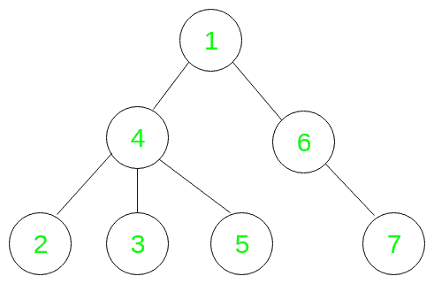

# 查询节点子树中值小于 V 的节点数

> 原文:[https://www . geeksforgeeks . org/query-for-number-of-node 的子树中值小于 v 的节点数/](https://www.geeksforgeeks.org/queries-for-the-number-of-nodes-having-values-less-than-v-in-the-subtree-of-a-node/)

给定 **N** 节点和 **Q** 查询的根树(假设根是 **1** )，每个表单 **(Val，Node)** 。对于每个查询，任务是在**节点**的子树中找到值小于 **Val** 的节点数，包括自身。
注意，根据定义，该树中的节点是唯一的。
**举例:**

```
Input: N = 7, Q = 3
Val = 4, Node = 4
Val = 7, Node = 6
Val = 5, Node = 1
Given tree:
```



```
Output: 2
1
4
Explanation: For given queries:
Q1 -> Val = 4, Node = 4
  The required nodes are 2 and 3
  Hence the output is 2

Q2 -> Val = 7, Node = 6
  The required node is 6 only
  Hence the output is 1

Q3 -> Val = 5, Node = 1
  The required nodes are 1, 2, 3 and 4
  Hence the output is 4
```

**天真的方法:**解决这个问题的简单方法是从给定节点为每个查询运行 [DFS](https://www.geeksforgeeks.org/depth-first-traversal-for-a-graph/) ，并计算小于给定值的节点数。给定节点的父节点必须从 [DFS](https://www.geeksforgeeks.org/depth-first-traversal-for-a-graph/) 中排除。
**时间复杂度:** **O(N*Q)** ，其中 **Q** 为查询数， **N** 为树中节点数。
**高效方法:**我们可以将查找子树中元素数量的问题简化为在数组的连续段中查找它们。为了生成这样的表示，我们从根节点运行一个 [DFS](https://www.geeksforgeeks.org/depth-first-traversal-for-a-graph/) ，当我们第一次进入一个数组时和最后一次退出时，将该节点推入一个数组。这种树的表现形式被称为树的[欧拉巡回](https://www.geeksforgeeks.org/euler-tour-tree/)。
例如


上述树的欧拉之旅将是:

```
1 4 2 2 3 3 5 5 4 6 7 7 6 1
```

树的这种表示具有这样的性质，即每个节点 **X** 的子树包含在数组中第一个和最后一个出现的 **X** 中。每个节点恰好出现两次。因此，计算第一次和最后一次出现**节点**之间小于**值**的节点数将给出该查询的两倍答案。
使用这种表示，可以使用[二进制索引树](https://www.geeksforgeeks.org/binary-indexed-tree-or-fenwick-tree-2/)在 **O(log(N))** 中离线处理每个查询。
**预处理:**

1.  我们将游览中每个节点的第一次和最后一次出现的索引存储在两个数组中，**开始**和**结束**。让**开始【X】**和**结束【X】**代表节点 **X** 的这些指标。这可以在 **O(N)** 中完成
2.  在欧拉漫游中，我们将元素和节点的位置存储为一对**(index interne，indexInTour)** ，然后根据**index interne**进行排序。让这个数组成为**排序图**
3.  同样，我们维护一个查询数组，其形式为 **(Val，Node)** ，并根据 **Val** 进行排序。让这个数组成为**排序查询**
4.  初始化大小为 **2N** 的二进制索引树，所有条目为 0。让这个成为**位**
5.  然后按以下步骤进行。在**排序列表**和**排序查询**中各维护一个指针
6.  对于**排序的查询**中的每个查询，从开始的**排序的**中选择具有**索引的节点进入<值**，并将它们的**索引增加到**位**中的**。那么该查询的答案将是从**开始【节点】**到**结束【节点】**的总和的一半
7.  对于**排序查询**中的下一个查询，我们从**排序中选择任何先前未选择的节点，将具有**索引的**放入<值**，并将它们的**索引增加到**位**中的**，并像以前一样回答查询。
8.  对每个查询重复这个过程，我们可以在 **O(Qlog(N))中回答它们。**

下面是上述方法的 C++实现:

## 卡片打印处理机（Card Print Processor 的缩写）

```
// C++ program Queries to find the Number of
// Nodes having Smaller Values from a Given
// Value in the Subtree of a Node
#include <bits/stdc++.h>
using namespace std;

// Takes a tree and generates a Euler tour for that
// tree in 'tour' parameter This is a modified form
// of DFS in which we push the node while entering for
// the first time and when exiting from it
void eulerTour(vector<vector<int> >& tree,
               vector<int>& vst,
               int root,
               vector<int>& tour)
{

    // Push node in tour while entering
    tour.push_back(root);

    // DFS
    vst[root] = 1;
    for (auto& x : tree[root]) {
        if (!vst[x]) {
            eulerTour(tree, vst, x, tour);
        }
    }

    // Push ndode in tour while exiting
    tour.push_back(root);
}

// Creates the start and end array as described in
// pre-processing section. Traverse the tour from
// left to right and update start for 1st occurrence
// and end for 2nd occurrence of each node
void createStartEnd(vector<int>& tour,
                    vector<int>& start,
                    vector<int>& end)
{
    for (int i = 1; i < tour.size(); ++i) {
        if (start[tour[i]] == -1) {
            start[tour[i]] = i;
        }
        else {
            end[tour[i]] = i;
        }
    }
}

// Returns a sorted array of pair containing node and
// tourIndex as described in pre-processing section
vector<pair<int, int> >
createSortedTour(vector<int>& tour)
{
    vector<pair<int, int> > arr;
    for (int i = 1; i < tour.size(); ++i) {
        arr.push_back(make_pair(tour[i], i));
    }
    sort(arr.begin(), arr.end());
    return arr;
}

// Binary Indexed Tree Implementation
// This function will add 1 from the position
void increment(vector<int>& bit, int pos)
{
    for (; pos < bit.size(); pos += pos & -pos) {
        bit[pos]++;
    }
}

// It will give the range sum
int query(vector<int>& bit,
              int start,
              int end)
{
    --start;
    int s1 = 0, s2 = 0;
    for (; start > 0; start -= start & -start) {
        s1 += bit[start];
    }
    for (; end > 0; end -= end & -end) {
        s2 += bit[end];
    }
    return s2 - s1;
}

// Function to calculate the ans for each query
map<pair<int, int>, int> cal(int N,
                                         int Q,
                      vector<vector<int>> tree,
            vector<pair<int, int>> queries)
{
    // Preprocessing
    // Creating the vector to store the tours and queries
    vector<int> tour, vst(N + 1, 0),
        start(N + 1, -1),
        end(N + 1, -1),
        bit(2 * N + 4, 0);

    // For one based indexing in tour.
    // Simplifies code for Binary Indexed Tree.
    // We will ignore the 1st element in tour
    tour.push_back(-1);

    // Create Euler Tour
    eulerTour(tree, vst, 1, tour);

    // Create Start and End Array
    createStartEnd(tour, start, end);

    // Create sortedTour and sortedQuery
    auto sortedTour = createSortedTour(tour);

    auto sortedQuery = queries;

    sort(sortedQuery.begin(), sortedQuery.end());

    // For storing answers to query
    map<pair<int, int>, int> queryAns;

    // We maintain pointers each for sortedTour and
    // sortedQuery.For each element X in sortedTour
    // we first process any queries with val smaller
    // than X's node and update queryptr to first
    // unprocessed query.Then update the position
    // of X in BIT.

    int tourptr = 0, queryptr = 0;
    while (queryptr < sortedQuery.size()) {

        // Queries lies in the range then
        while (queryptr < sortedQuery.size()
               && sortedQuery[queryptr].first
                      <= sortedTour[tourptr].first){

            auto node = sortedQuery[queryptr].second;

            // Making the query on BIT and dividing by 2.
            queryAns[sortedQuery[queryptr]]
                = query(bit, start[node], end[node]) / 2;
            ++queryptr;
        }
        if (tourptr < sortedTour.size()) {
            increment(bit, sortedTour[tourptr].second);
            ++tourptr;
        }
    }

    return queryAns;
}

// Driver Code
int main()
{

    int N = 7, Q = 3;

    // Tree edges
    vector<vector<int> > tree = { {},
                                      { 4, 6 },
                                      { 4 },
                                      { 4 },
                                      { 1, 2, 3, 5 },
                                      { 4 },
                                      { 1, 7 },
                                      { 6 } };

    // Queries vector
    vector<pair<int, int> > queries
        = { make_pair(4, 1),
            make_pair(7, 6),
            make_pair(5, 1) };

    // Calling the function
    map<pair<int, int>, int> queryAns =
                    cal(N, Q, tree, queries);

    // Print answer in order of input.
    for (auto& x : queries) {
        cout << queryAns[x] << '\n';
    }

    return 0;
}
```

**Output:** 

```
3
1
4
```