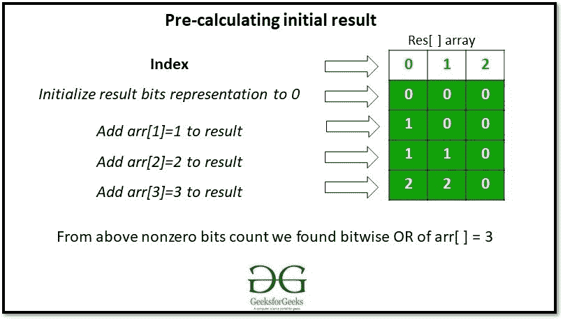
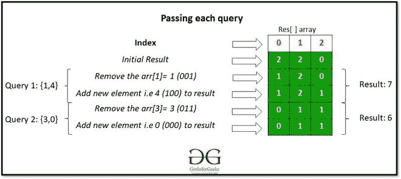

# 通过更新计算数组按位或的查询

> 原文:[https://www . geeksforgeeks . org/带有更新的按位运算数组查询/](https://www.geeksforgeeks.org/queries-to-calculate-bitwise-or-of-an-array-with-updates/)

给定一个由 **N** 正整数组成的[数组](https://www.geeksforgeeks.org/introduction-to-arrays/) **arr[ ]** 和一个由形式为 **{i，val}** 的查询组成的 [2D 数组](https://www.geeksforgeeks.org/multidimensional-arrays-c-cpp/) **Q[][]** ，每个查询的任务是用 **val** 替换**arr【I】**，并计算修改后数组的[位“或”](https://www.geeksforgeeks.org/bitwise-operators-in-c-cpp/)。

**示例:**

> **输入:** arr[ ]= {1，2，3}，Q[ ][] = {{1，4}，{3，0}}
> **输出:** 7 6
> **解释:**
> 用 4 替换 arr[1]将 arr[ ]修改为{4，2，3}。按位或= 7。
> 将 arr[2]替换为 0 会将 arr[]修改为{4，2，0}。按位或= 6。
> 
> **输入:** arr[ ]= {1，2，3，4}，Q[][ ] = {{4，0}，{2，8}}
> **输出:** 3 11
> **解释:**
> 将 arr[3]替换为 0 将 arr[ ]修改为{1，2，3，0}。按位或= 3。
> 用 8 替换 arr[2]将 arr[]修改为{1，8，3，0}。按位或= 11。

**天真法:**解决问题最简单的方法是通过 **Q[i][1]** 更新**arr[Q[I][0]】**后，针对每一个**I**T6 查询遍历数组 **arr[ ]** 来计算数组的[位运算](https://www.geeksforgeeks.org/bitwise-operators-in-c-cpp/)。

***时间复杂度:**O(N * sizeof(Q))*
***辅助空间:** O(1)*

**高效方法:**按照以下步骤解决问题:

*   初始化大小为 32 的数组**结果[]** 。将其所有元素设置为 0。
*   [穿越阵](https://www.geeksforgeeks.org/c-program-to-traverse-an-array/)T2【arr】。
    *   迭代每个数组元素的位。
    *   对于在当前数组元素中找到的每个 **j** <sup>第</sup>个未设置位，递增**结果【j】**。

> 

*   现在，[遍历数组](https://www.geeksforgeeks.org/c-program-to-traverse-an-array/) **Q[][]** 并执行以下操作:
    *   通过从各自的位置移除 **Q[i][0]** 的设定位来修改**结果[]** 。
    *   通过从各自的位置添加 **Q[i][0]** 的设置位来更新**结果[]** 。
    *   将**结果[]** 数组转换为其等价的十进制值并打印出来。

> 

下面是上述方法的实现:

## C++

```
// C++ implementation of the approach
#include <bits/stdc++.h>
using namespace std;
#define bitsSize 32

// Function to convert a binary array
// to equivalent decimal representation
int toDecimal(int result[], int size)
{
    // Stores the decimal result
    int ans = 0;

    // Traverse the array
    for (int i = 0; i < size; i++) {
        // If non-zero element
        // is encountered
        if (result[i] != 0)
            ans += pow(2, i);
    }

    return ans;
}

// Function to replace an array
// element old_value by new_value
void findOrUtil(int result[],
                int old_value,
                int new_value)
{
    int i = 0;

    // Removing old value from result
    while (old_value != 0) {
        result[i] -= old_value % 2;
        old_value = old_value / 2;
        i++;
    }

    i = 0;

    // Adding new value to result
    while (new_value != 0) {
        result[i] += new_value % 2;
        new_value = new_value / 2;
        i++;
    }
}

// Function to calculate and print
// Bitwise OR of array for each query
void findOR(vector<int> arr,
            vector<pair<int, int> > queries)
{
    int result[bitsSize];

    // Initialize all bits to zero
    memset(result, 0, sizeof(result));

    // Precompute and fill result[]
    for (int i = 0; i < arr.size(); i++) {
        int val = arr[i];
        int j = 0;

        // Add all set bits to result[]
        while (val != 0) {
            result[j] += val % 2;
            val = val / 2;
            j++;
        }
    }

    // Traverse the queries
    for (int q = 0; q < queries.size(); q++) {
        int index = queries[q].first;
        int new_value = queries[q].second;

        // Update result[] by replacing
        // arr[index] by new_value
        findOrUtil(result, arr[index], new_value);

        // Modify arr[]
        arr[index] = new_value;

        // Calculate Bitwise OR
        int ans = toDecimal(result, bitsSize);

        // Print the value of Bitwise OR
        cout << ans << endl;
    }
}

// Driver Code
int main()
{

    // Given array
    vector<int> arr = { 1, 2, 3, 4 };

    // Queries of the form {i, value}
    vector<pair<int, int> > queries;

    // 0-indexed queries
    queries.push_back({ 3, 0 });
    queries.push_back({ 1, 8 });

    findOR(arr, queries);

    return 0;
}
```

## Java 语言(一种计算机语言，尤用于创建网站)

```
// Java implementation of the approach
import java.util.ArrayList;

class GFG{

static int bitsSize = 32;

static class Pair{

    int first;
    int second;

    Pair(int first, int second)
    {
        this.first = first;
        this.second = second;
    }
}

// Function to convert a binary array
// to equivalent decimal representation
static int toDecimal(int result[], int size)
{

    // Stores the decimal result
    int ans = 0;

    // Traverse the array
    for(int i = 0; i < size; i++)
    {

        // If non-zero element
        // is encountered
        if (result[i] != 0)
            ans += Math.pow(2, i);
    }
    return ans;
}

// Function to replace an array
// element old_value by new_value
static void findOrUtil(int result[],
                       int old_value,
                       int new_value)
{
    int i = 0;

    // Removing old value from result
    while (old_value != 0)
    {
        result[i] -= old_value % 2;
        old_value = old_value / 2;
        i++;
    }

    i = 0;

    // Adding new value to result
    while (new_value != 0)
    {
        result[i] += new_value % 2;
        new_value = new_value / 2;
        i++;
    }
}

// Function to calculate and print
// Bitwise OR of array for each query
static void findOR(int[] arr, ArrayList<Pair> queries)
{
    int result[] = new int[bitsSize];

    // Precompute and fill result[]
    for(int i = 0; i < arr.length; i++)
    {
        int val = arr[i];
        int j = 0;

        // Add all set bits to result[]
        while (val != 0)
        {
            result[j] += val % 2;
            val = val / 2;
            j++;
        }
    }

    // Traverse the queries
    for(int q = 0; q < queries.size(); q++)
    {
        int index = queries.get(q).first;
        int new_value = queries.get(q).second;

        // Update result[] by replacing
        // arr[index] by new_value
        findOrUtil(result, arr[index], new_value);

        // Modify arr[]
        arr[index] = new_value;

        // Calculate Bitwise OR
        int ans = toDecimal(result, bitsSize);

        // Print the value of Bitwise OR
        System.out.println(ans);
    }
}

// Driver code
public static void main(String[] args)
{

    // Given array
    int arr[] = { 1, 2, 3, 4 };

    // Queries of the form {i, value}
    ArrayList<Pair> queries = new ArrayList<>();

    // 0-indexed queries
    queries.add(new Pair(3, 0));
    queries.add(new Pair(1, 8));

    findOR(arr, queries);
}
}

// This code is contributed by abhinavjain194
```

## 蟒蛇 3

```
# Python3 implementation of the approach

# Function to convert a binary array
# to equivalent decimal representation
def toDecimal(result, size):

    # Stores the decimal result
    ans = 0

    # Traverse the array
    for i in range(size):

        # If non-zero element
        # is encountered
        if (result[i] != 0):
            ans += pow(2, i)

    return ans

# Function to replace an array
# element old_value by new_value
def findOrUtil(result, old_value, new_value):

    i = 0

    # Removing old value from result
    while (old_value != 0):
        result[i] -= old_value % 2
        old_value = old_value // 2
        i += 1

    i = 0

    # Adding new value to result
    while (new_value != 0):
        result[i] += new_value % 2
        new_value = new_value // 2
        i += 1

# Function to calculate and print
# Bitwise OR of array for each query
def findOR(arr, queries):

    result = [0] * 32

    # Initialize all bits to zero
    # memset(result, 0, sizeof(result))

    # Precompute and fill result[]
    for i in range(len(arr)):
        val = arr[i]
        j = 0

        # Add all set bits to result[]
        while (val != 0):
            result[j] += val % 2
            val = val // 2
            j += 1

    # Traverse the queries
    for q in range(len(queries)):
        index = queries[q][0]
        new_value = queries[q][1]

        # Update result[] by replacing
        # arr[index] by new_value
        findOrUtil(result, arr[index],
                   new_value)

        # Modify arr[]
        arr[index] = new_value

        # Calculate Bitwise OR
        ans = toDecimal(result, 32)

        # Print the value of Bitwise OR
        print (ans)

# Driver Code
if __name__ == '__main__':

    # Given array
    arr = [ 1, 2, 3, 4 ]

    # Queries of the form {i, value}
    queries = []

    # 0-indexed queries
    queries.append([3, 0])
    queries.append([1, 8])

    findOR(arr, queries)

# This code is contributed by mohit kumar 29
```

## C#

```
// C# implementation of the approach
using System;
using System.Collections.Generic;

class GFG{

static int bitsSize = 32;

class Pair{

    public int first;
    public int second;

    public Pair(int first, int second)
    {
        this.first = first;
        this.second = second;
    }
}

// Function to convert a binary array
// to equivalent decimal representation
static int toDecimal(int []result, int size)
{

    // Stores the decimal result
    int ans = 0;

    // Traverse the array
    for(int i = 0; i < size; i++)
    {

        // If non-zero element
        // is encountered
        if (result[i] != 0)
            ans += (int)Math.Pow(2, i);
    }
    return ans;
}

// Function to replace an array
// element old_value by new_value
static void findOrUtil(int []result,
                       int old_value,
                       int new_value)
{
    int i = 0;

    // Removing old value from result
    while (old_value != 0)
    {
        result[i] -= old_value % 2;
        old_value = old_value / 2;
        i++;
    }
    i = 0;

    // Adding new value to result
    while (new_value != 0)
    {
        result[i] += new_value % 2;
        new_value = new_value / 2;
        i++;
    }
}

// Function to calculate and print
// Bitwise OR of array for each query
static void findOR(int[] arr, List<Pair> queries)
{
    int []result = new int[bitsSize];

    // Precompute and fill result[]
    for(int i = 0; i < arr.Length; i++)
    {
        int val = arr[i];
        int j = 0;

        // Add all set bits to result[]
        while (val != 0)
        {
            result[j] += val % 2;
            val = val / 2;
            j++;
        }
    }

    // Traverse the queries
    for(int q = 0; q < queries.Count; q++)
    {
        int index = queries[q].first;
        int new_value = queries[q].second;

        // Update result[] by replacing
        // arr[index] by new_value
        findOrUtil(result, arr[index], new_value);

        // Modify []arr
        arr[index] = new_value;

        // Calculate Bitwise OR
        int ans = toDecimal(result, bitsSize);

        // Print the value of Bitwise OR
        Console.WriteLine(ans);
    }
}

// Driver code
public static void Main(String[] args)
{

    // Given array
    int []arr = { 1, 2, 3, 4 };

    // Queries of the form {i, value}
    List<Pair> queries = new List<Pair>();

    // 0-indexed queries
    queries.Add(new Pair(3, 0));
    queries.Add(new Pair(1, 8));

    findOR(arr, queries);
}
}

// This code is contributed by 29AjayKumar
```

## java 描述语言

```
<script>

// JavaScript implementation of the approach
var bitsSize = 32;

// Function to convert a binary array
// to equivalent decimal representation
function toDecimal(result, size)
{
    // Stores the decimal result
    var ans = 0;
    var i;
    // Traverse the array
    for (i = 0; i < size; i++) {
        // If non-zero element
        // is encountered
        if (result[i] != 0)
            ans += Math.pow(2, i);
    }

    return ans;
}

// Function to replace an array
// element old_value by new_value
function findOrUtil(result, old_value, new_value)
{
    var i = 0;

    // Removing old value from result
    while (old_value != 0) {
        result[i] -= old_value % 2;
        old_value = parseInt(old_value / 2);
        i++;
    }

    i = 0;

    // Adding new value to result
    while(new_value != 0) {
        result[i] += new_value % 2;
        new_value = parseInt(new_value / 2);
        i++;
    }
}

// Function to calculate and print
// Bitwise OR of array for each query
function findOR(arr, queries)
{
    var result = Array(bitsSize).fill(0);

    var i;
    // Precompute and fill result[]
    for (i = 0; i < arr.length; i++) {
        var val = arr[i];
        var j = 0;

        // Add all set bits to result[]
        while (val != 0) {
            result[j] += val % 2;
            val = parseInt(val / 2);
            j++;
        }
    }

    var q;
    // Traverse the queries
    for (q = 0; q < queries.length; q++) {
        var index = queries[q][0];
        var new_value = queries[q][1];

        // Update result[] by replacing
        // arr[index] by new_value
        findOrUtil(result, arr[index], new_value);

        // Modify arr[]
        arr[index] = new_value;

        // Calculate Bitwise OR
        var ans = toDecimal(result, bitsSize);

        // Print the value of Bitwise OR
        document.write(ans+"<br>");
    }
}

// Driver Code

    // Given array
    var arr = [1, 2, 3, 4];

    // Queries of the form {i, value}
    var queries = [[3, 0],[1, 8]]

    findOR(arr, queries);

</script>
```

**Output:** 

```
3
11
```

***时间复杂度** : O(N)*
***辅助空间:** O(1)*