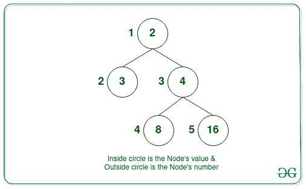

# 计算 N 元树中给定节点的每个子树的按位或的查询

> 原文:[https://www . geeksforgeeks . org/查询-计算-n 元树中给定节点的每个子树的位或/](https://www.geeksforgeeks.org/queries-to-calculate-bitwise-or-of-each-subtree-of-a-given-node-in-an-n-ary-tree/)

给定一个由从 **1** 到 **N** 的 **N** 节点组成的 [N 元树](https://www.geeksforgeeks.org/generic-treesn-array-trees/)，一个由 **N** 正整数组成的[数组](https://www.geeksforgeeks.org/introduction-to-arrays/)**arr【】**，其中 **arr[i]** 是与 i <sup>第</sup>节点相关联的值，以及 **Q** 查询，每个查询由一个节点组成。每个查询的任务是找到给定节点的子树中存在的节点值的 [**【按位或】**](https://www.geeksforgeeks.org/bitwise-operators-in-c-cpp/) 。

**示例:**

> **输入:** arr[] = {2，3，4，8，16}查询[]: {2，3，1}
> 
> 
> 
> **输出:** 3 28 31
> **解释:**
> **查询 1:** 按位 OR(子树(节点 2)) =按位 OR(节点 2) =按位 OR(3) = 3
> **查询 2:** 按位 OR(子树(节点 3)) =按位 OR(节点 3、节点 4、节点 5) =按位 OR(4、8、16) = 28
> **查询 3:** 按位 OR(子树(节点 1
> 
> **输入:** arr[] = {2，3，4，8，16}查询[]: {4，5}
> 
> 
> 
> **输出:** 8 16
> **解释:**
> **查询 1:** 按位 OR(子树(节点 4)) =按位 OR(节点 4) = 8
> **查询 2:** 按位 OR(子树(节点 5)) =按位 OR(节点 5) = 16

**天真方法:**解决这个问题最简单的方法是[遍历给定节点](https://www.geeksforgeeks.org/queries-for-dfs-of-a-subtree-in-a-tree/)的子树，对于每个查询，[计算该节点子树中每个节点的按位 OR](https://www.geeksforgeeks.org/bitwise-and-or-of-a-range/) 并打印该值。
***时间复杂度:** O(Q * N)*
***辅助空间:** O(Q * N)*

**高效方法:**为了优化上述方法，想法是预先计算给定树中存在的所有子树的**按位“或”**，并且对于每个查询，找到每个给定节点的子树的按位“异或”。按照以下步骤解决问题:

*   初始化一个[向量](https://www.geeksforgeeks.org/vector-in-cpp-stl/) **和**来存储给定树中所有子树的位或。
*   使用[深度优先搜索](https://www.geeksforgeeks.org/depth-first-search-or-dfs-for-a-graph/)预计算每个子树的位或。
*   如果该节点是[叶节点](https://www.geeksforgeeks.org/write-a-c-program-to-get-count-of-leaf-nodes-in-a-binary-tree/)，则该节点的按位“或”就是节点值本身。
*   否则，子树的按位“或”等于其子树的所有子树值的按位“或”。
*   完成上述步骤后，为每个 i <sup>次</sup>查询打印存储在**和【查询[I]】**中的值。

下面是上述方法的实现:

## C++

```
// C++ program for the above approach

#include <bits/stdc++.h>
using namespace std;

// Maximum Number of nodes
const int N = 1e5 + 5;

// Adjacency list
vector<int> adj[N];

// Stores Bitwise OR of each node
vector<int> answer(N);

// Function to add edges to the Tree
void addEdgesToGraph(int Edges[][2],
                     int N)
{
    // Traverse the edges
    for (int i = 0; i < N - 1; i++) {
        int u = Edges[i][0];
        int v = Edges[i][1];

        // Add edges
        adj[u].push_back(v);
        adj[v].push_back(u);
    }
}

// Function to perform DFS
// Traversal on the given tree
void DFS(int node, int parent, int Val[])
{
    // Initialize answer with bitwise
    // OR of current node
    answer[node] = Val[node];

    // Iterate over each child
    // of the current node
    for (int child : adj[node]) {

        // Skip parent node
        if (child == parent)
            continue;

        // Call DFS for each child
        DFS(child, node, Val);

        // Taking bitwise OR of the
        // answer of the child to
        // find node's OR value
        answer[node] = (answer[node]
                        | answer[child]);
    }
}

// Function to call DFS from the'=
// root for precomputing answers
void preprocess(int Val[])
{
    DFS(1, -1, Val);
}

// Function to calculate and print
// the Bitwise OR for Q queries
void findSubtreeOR(int Queries[], int Q,
                   int Val[])
{
    // Perform preprocessing
    preprocess(Val);

    // Iterate over each given query
    for (int i = 0; i < Q; i++) {

        cout << answer[Queries[i]]
             << ' ';
    }
}

// Utility function to find and
// print bitwise OR for Q queries
void findSubtreeORUtil(
    int N, int Edges[][2], int Val[],
    int Queries[], int Q)
{
    // Function to add edges to graph
    addEdgesToGraph(Edges, N);

    // Function call
    findSubtreeOR(Queries, Q, Val);
}

// Driver Code
int main()
{
    // Number of nodes
    int N = 5;
    int Edges[][2]
        = { { 1, 2 }, { 1, 3 },
            { 3, 4 }, { 3, 5 } };

    int Val[] = { 0, 2, 3, 4, 8, 16 };
    int Queries[] = { 2, 3, 1 };

    int Q = sizeof(Queries)
            / sizeof(Queries[0]);

    // Function call
    findSubtreeORUtil(N, Edges, Val,
                      Queries, Q);

    return 0;
}
```

## Java 语言(一种计算机语言，尤用于创建网站)

```
// Java program for above approach
import java.util.*;
import java.lang.*;
import java.io.*;

class GFG
{

  // Maximum Number of nodes
  static int N = (int)1e5 + 5;

  // Adjacency list
  static ArrayList<ArrayList<Integer>> adj;

  // Stores Bitwise OR of each node
  static int[] answer;

  // Function to add edges to the Tree
  static void addEdgesToGraph(int Edges[][],
                              int N)
  {
    // Traverse the edges
    for (int i = 0; i < N - 1; i++)
    {
      int u = Edges[i][0];
      int v = Edges[i][1];

      // Add edges
      adj.get(u).add(v);
      adj.get(v).add(u);
    }
  }

  // Function to perform DFS
  // Traversal on the given tree
  static void DFS(int node, int parent, int Val[])
  {

    // Initialize answer with bitwise
    // OR of current node
    answer[node] = Val[node];

    // Iterate over each child
    // of the current node
    for (Integer child : adj.get(node))
    {

      // Skip parent node
      if (child == parent)
        continue;

      // Call DFS for each child
      DFS(child, node, Val);

      // Taking bitwise OR of the
      // answer of the child to
      // find node's OR value
      answer[node] = (answer[node]
                      | answer[child]);
    }
  }

  // Function to call DFS from the'=
  // root for precomputing answers
  static void preprocess(int Val[])
  {
    DFS(1, -1, Val);
  }

  // Function to calculate and print
  // the Bitwise OR for Q queries
  static void findSubtreeOR(int Queries[], int Q,
                            int Val[])
  {

    // Perform preprocessing
    preprocess(Val);

    // Iterate over each given query
    for (int i = 0; i < Q; i++)
    {
      System.out.println(answer[Queries[i]] + " ");
    }
  }

  // Utility function to find and
  // print bitwise OR for Q queries
  static void findSubtreeORUtil(int N, int Edges[][],
                                int Val[], int Queries[],
                                int Q)
  {

    // Function to add edges to graph
    addEdgesToGraph(Edges, N);

    // Function call
    findSubtreeOR(Queries, Q, Val);
  }

  // Driver function
  public static void main (String[] args)
  {

    adj = new ArrayList<>();
    for(int i = 0; i < N; i++)
      adj.add(new ArrayList<>());
    answer = new int[N];
    N = 5;
    int Edges[][] = { { 1, 2 }, { 1, 3 },
                     { 3, 4 }, { 3, 5 } };

    int Val[] = { 0, 2, 3, 4, 8, 16 };
    int Queries[] = { 2, 3, 1 };
    int Q = Queries.length;

    // Function call
    findSubtreeORUtil(N, Edges, Val,
                      Queries, Q);
  }
}

// This code is contributed by offbeat
```

## 蟒蛇 3

```
# Python3 program for the above approach

# Maximum Number of nodes
N = 100005;

# Adjacency list
adj = [[] for i in range(N)];

# Stores Bitwise OR of each node
answer = [0 for i in range(N)]

# Function to add edges to the Tree
def addEdgesToGraph(Edges, N):

    # Traverse the edges
    for i in range(N - 1):

        u = Edges[i][0];
        v = Edges[i][1];

        # Add edges
        adj[u].append(v);
        adj[v].append(u);

# Function to perform DFS
# Traversal on the given tree
def DFS(node, parent, Val):

    # Initialize answer with bitwise
    # OR of current node
    answer[node] = Val[node];

    # Iterate over each child
    # of the current node
    for child in adj[node]:

        # Skip parent node
        if (child == parent):
            continue;

        # Call DFS for each child
        DFS(child, node, Val);

        # Taking bitwise OR of the
        # answer of the child to
        # find node's OR value
        answer[node] = (answer[node]
                        | answer[child]);

# Function to call DFS from the'=
# root for precomputing answers
def preprocess( Val):

    DFS(1, -1, Val);

# Function to calculate and print
# the Bitwise OR for Q queries
def findSubtreeOR(Queries, Q, Val):

    # Perform preprocessing
    preprocess(Val);

    # Iterate over each given query
    for i in range(Q):

        print(answer[Queries[i]], end=' ')

# Utility function to find and
# print bitwise OR for Q queries
def findSubtreeORUtil( N, Edges, Val, Queries, Q):

    # Function to add edges to graph
    addEdgesToGraph(Edges, N);

    # Function call
    findSubtreeOR(Queries, Q, Val);

# Driver Code
if __name__=='__main__':

    # Number of nodes
    N = 5;
    Edges = [ [ 1, 2 ], [ 1, 3 ], [ 3, 4 ], [ 3, 5 ] ];

    Val = [ 0, 2, 3, 4, 8, 16 ];
    Queries = [ 2, 3, 1 ];

    Q = len(Queries)

    # Function call
    findSubtreeORUtil(N, Edges, Val,Queries, Q);

    # This code is contributed by rutvik_56
```

## C#

```
// C# program to generate
// n-bit Gray codes
using System;
using System.Collections.Generic;
class GFG
{

  // Maximum Number of nodes
  static int N = (int)1e5 + 5;

  // Adjacency list
  static List<List<int> > adj;

  // Stores Bitwise OR of each node
  static int[] answer;

  // Function to Add edges to the Tree
  static void AddEdgesToGraph(int[, ] Edges, int N)
  {

    // Traverse the edges
    for (int i = 0; i < N - 1; i++) {
      int u = Edges[i, 0];
      int v = Edges[i, 1];

      // Add edges
      adj[u].Add(v);
      adj[v].Add(u);
    }
  }

  // Function to perform DFS
  // Traversal on the given tree
  static void DFS(int node, int parent, int[] Val)
  {

    // Initialize answer with bitwise
    // OR of current node
    answer[node] = Val[node];

    // Iterate over each child
    // of the current node
    foreach(int child in adj[node])
    {

      // Skip parent node
      if (child == parent)
        continue;

      // Call DFS for each child
      DFS(child, node, Val);

      // Taking bitwise OR of the
      // answer of the child to
      // find node's OR value
      answer[node] = (answer[node] | answer[child]);
    }
  }

  // Function to call DFS from the'=
  // root for precomputing answers
  static void preprocess(int[] Val) { DFS(1, -1, Val); }

  // Function to calculate and print
  // the Bitwise OR for Q queries
  static void findSubtreeOR(int[] Queries, int Q,
                            int[] Val)
  {

    // Perform preprocessing
    preprocess(Val);

    // Iterate over each given query
    for (int i = 0; i < Q; i++) {
      Console.Write(answer[Queries[i]] + " ");
    }
  }

  // Utility function to find and
  // print bitwise OR for Q queries
  static void findSubtreeORUtil(int N, int[, ] Edges,
                                int[] Val, int[] Queries,
                                int Q)
  {

    // Function to Add edges to graph
    AddEdgesToGraph(Edges, N);

    // Function call
    findSubtreeOR(Queries, Q, Val);
  }

  // Driver function
  public static void Main(String[] args)
  {

    adj = new List<List<int> >();
    for (int i = 0; i < N; i++)
      adj.Add(new List<int>());
    answer = new int[N];
    N = 5;
    int[, ] Edges
      = { { 1, 2 }, { 1, 3 }, { 3, 4 }, { 3, 5 } };

    int[] Val = { 0, 2, 3, 4, 8, 16 };
    int[] Queries = { 2, 3, 1 };
    int Q = Queries.Length;

    // Function call
    findSubtreeORUtil(N, Edges, Val, Queries, Q);
  }
}

// This code is contributed by grand_master.
```

## java 描述语言

```
<script>
// Javascript program for the above approach

// Maximum Number of nodes
const N = 1e5 + 5;

// Adjacency list
let adj = [];

for (let i = 0; i < N; i++) {
    adj.push([])
}

// Stores Bitwise OR of each node
let answer = new Array(N);

// Function to add edges to the Tree
function addEdgesToGraph(Edges, N) {
    // Traverse the edges
    for (let i = 0; i < N - 1; i++) {
        let u = Edges[i][0];
        let v = Edges[i][1];

        // Add edges
        adj[u].push(v);
        adj[v].push(u);
    }
}

// Function to perform DFS
// Traversal on the given tree
function DFS(node, parent, Val) {
    // Initialize answer with bitwise
    // OR of current node
    answer[node] = Val[node];

    // Iterate over each child
    // of the current node
    for (let child of adj[node]) {

        // Skip parent node
        if (child == parent)
            continue;

        // Call DFS for each child
        DFS(child, node, Val);

        // Taking bitwise OR of the
        // answer of the child to
        // find node's OR value
        answer[node] = (answer[node] | answer[child]);
    }
}

// Function to call DFS from the'=
// root for precomputing answers
function preprocess(Val) {
    DFS(1, -1, Val);
}

// Function to calculate and print
// the Bitwise OR for Q queries
function findSubtreeOR(Queries, Q, Val) {
    // Perform preprocessing
    preprocess(Val);

    // Iterate over each given query
    for (let i = 0; i < Q; i++) {

        document.write(answer[Queries[i]] + ' ');
    }
}

// Utility function to find and
// print bitwise OR for Q queries
function findSubtreeORUtil(N, Edges, Val, Queries, Q) {
    // Function to add edges to graph
    addEdgesToGraph(Edges, N);

    // Function call
    findSubtreeOR(Queries, Q, Val);
}

// Driver Code

// Number of nodes
let n = 5;
let Edges
    = [[1, 2], [1, 3],
       [3, 4], [3, 5]];

let Val = [0, 2, 3, 4, 8, 16];
let Queries = [2, 3, 1];

let Q = Queries.length;

// Function call
findSubtreeORUtil(n, Edges, Val, Queries, Q);

// This code is contributed by _saurabh_jaiswal
</script>
```

**Output:** 

```
3 28 31
```

***时间复杂度:** O(N + Q)*
***辅助空间:** O(N)*