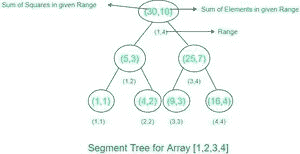

# 通过更新计算索引[L，R]范围内数组元素平方和的查询

> 原文:[https://www . geeksforgeeks . org/查询-计算数组元素的平方和-超出索引范围-l-r-带更新/](https://www.geeksforgeeks.org/queries-to-calculate-sum-of-squares-of-array-elements-over-range-of-indices-l-r-with-updates/)

给定一个大小为 n 的正整数数组 arr[]。我们需要对给定数组执行以下 3 个查询–

1)给定 L 和 R，我们必须找到范围[L，R]内所有元素的平方和

2)给定 L，R 和 X，我们必须设置所有位于[L，R]到 X 范围内的元素

3)给定 L，R 和 X，我们必须将范围[L，R]内所有元素的值增加 X

**输入格式**:第一行包含测试用例 T 的数量

下一行包含两个正整数——N(数组大小)和 Q(要询问的查询数)。

下一行包含 N 个整数的数组

接下来的每一行都包含要询问的问题。每一行都以一个数字开始，该数字指示查询的类型，后跟所需的输入参数。所有 3 个查询的输入格式如下所示–

0 L R X:将[L，R]范围内的所有数字设置为“X”

1 L R X:将“X”加到范围[L，R]中的所有数字上

2 L R:返回范围{L，R }内数字的平方和

**输出格式**:对于每个测试用例，在第一行输出“Case < TestCaseNo >:”，然后在单独的行中输出类型 2 的每个查询的平方和。

```
Input:
1
3 3
1 2 3
0 1 2 2
1 1 3 3
2 1 3

Output : Case 1:
         86
Explanation : With 1st query (type 0), array elements from range [1,2] will set as 2\. Updated array will become [2,2,3]
              With 2nd query (type 1), array elements from range [1,3] will be incremented by 3\. Updated array will become [5,5,6]
              With 3rd query (type 2), Sum of Squares for range [1,3] will be 5^2+5^2+6^2 =86
Input:              
1
4 5
1 2 3 4
2 1 4
0 3 4 1
2 1 4
1 3 4 1
2 1 4
Output : Case 1:
         30
         7
         13        
```

**优化方案**



样本段树

借助带有惰性传播的段树，我们可以在 O(logn)时间内执行所有给定的查询。

要了解分段树的工作原理，请点击此链接–[https://www . geeksforgeeks . org/Segment-Tree-set-1-给定范围的总和/](https://www.geeksforgeeks.org/segment-tree-set-1-sum-of-given-range/)

为此，我们将创建一个包含两个变量的段树——第一个变量将存储一个范围内的平方和，另一个变量将存储给定范围内的元素和。(我们将在后面讨论为什么这里需要两个变量)。为了更新给定范围内的值，我们将使用惰性传播技术。

有关惰性传播的更多信息，请使用链接–[https://www . geeksforgeeks . org/惰性传播段内树/](https://www.geeksforgeeks.org/lazy-propagation-in-segment-tree/)

在这里，如果我们必须将给定范围内的所有数字都设置为 X，那么我们可以使用这个公式来更新一个特定节点(位于给定范围内)的值–

更新的平方和= (R-L+1)*X*X

更新总和= (R-L+1)*X

**(因为在该特定节点下存在需要设置为 X 的 R-L+1 元素)**

如果我们需要用值 X 递增给定范围[L，R]中的所有值，我们可以使用这个公式来更新一个特定节点(位于给定范围内)的值–

更新的平方和=范围[L，R]内的平方和+ (R-L+1)*X*X + 2*X*(范围[L，R]内的和)

更新总和=范围内的总和[左，右] + (R-L+1)*X

**(因为在该特定节点下存在需要增加 X 的 R-L+1 元素。每个节点的值可以表示为:(Previous_val + X)。要计算根节点的新平方和，我们可以使用以下表达式–**

**(上一个 _val1+ x)^2 +(上一个 _val2 + x)^2 + …..(适用于所有子节点)**

**以上表达式将简化为[L，R] + (R-L+1)*X*X + 2*X*(范围[L，R]内的和)**内的平方和

在这里你可以看到，我们需要元素的总和来进行计算，因此我们将它与平方和一起存储在我们的段树中，以加快我们的计算。

**如何使用懒树更新**

这里你可以看到我们需要 3 棵懒人树——

1.用于维护集合更新

2.用于通过 X 更新保持增量

3.为了维护操作的顺序，在单个节点出现多个查询的情况下

现在创造 3 棵懒人树，不会有空间效益。但是我们可以通过创建一个带有两个变量的惰性树(变更，类型)来解决这个问题——一个用于维护更新值(X)，另一个用于类型(我们需要进行增量或设置的更新)。

**现在在单个节点上处理多个查询的顺序，可以有两种可能性–**

1) **先递增再设置查询**–这种情况下我们其实不需要递增数值，可以直接将数值设置为 X，因为将一个节点的数值设置为 X，递增前后会保持不变。

2) **先设置后增量查询**–这里我们有效地将每个节点的值更新为:X(设置查询)+ X(增量查询)。因此，我们可以将查询类型保持为 set，将更改值(即，将设置到哪些节点的值)保持为(X_set + X_increment)

对于 ex–arr[]=[1，2，3，4]首先用 2 设置[3，4]，然后用 1 递增[3，4]

集合查询后的数组= [1，2，2，2]

增量查询后的数组= [1，2，3，3]

我们可以通过将所有给定范围节点的值设置为:

(X_set + X_increment) = 2 + 1 = 3

更新的数组= [1，2，3，3]

## C++

```
// We will use 1 based indexing
// type 0 = Set
// type 1 = increment

#include<bits/stdc++.h>
using namespace std;
class segmenttree{
    public:
    int sum_of_squares;
    int sum_of_element;
};
class lazytree{
    public:
    int change;
    int type;
};

// Query On segment Tree

int query(segmenttree*tree,lazytree*lazy,int start,int end,int low,int high,int treeindex){
    if(lazy[treeindex].change!=0){
        int change=lazy[treeindex].change;
        int type=lazy[treeindex].type;
        if(lazy[treeindex].type==0){
            tree[treeindex].sum_of_squares=(end-start+1)*change*change;
            tree[treeindex].sum_of_element=(end-start+1)*change;
            if(start!=end){
                lazy[2*treeindex].change=change;
                lazy[2*treeindex].type=type;
                lazy[2*treeindex+1].change=change;
                lazy[2*treeindex+1].type=type;
            }
        }
        else{
            tree[treeindex].sum_of_squares+=((end-start+1)*change*change)+(2*change*tree[treeindex].sum_of_element);
            tree[treeindex].sum_of_element+=(end-start+1)*change;
            if(start!=end){
                if(lazy[2*treeindex].change==0 || lazy[2*treeindex].type==1){
                    lazy[2*treeindex].change+=change;
                    lazy[2*treeindex].type=type;
                }else{
                    lazy[2*treeindex].change+=change;
                }
                if(lazy[2*treeindex+1].change==0 || lazy[2*treeindex+1].type==1){
                    lazy[2*treeindex+1].change+=change;
                    lazy[2*treeindex+1].type=type;
                }else{
                    lazy[2*treeindex+1].change+=change;
                }
            }
        }
        lazy[treeindex].change=0;
    }
    if(start>high || end<low){
        return 0;
    }
    if(start>=low && high>=end){
        return tree[treeindex].sum_of_squares;
    }
    int mid=(start+end)/2;
    int ans=query(tree,lazy,start,mid,low,high,2*treeindex);
    int ans1=query(tree,lazy,mid+1,end,low,high,2*treeindex+1);
    return ans+ans1;
}

//  Update on Segment Tree

void update(int*arr,segmenttree*tree,lazytree*lazy,int start,int end,int low,int high,int change,int type,int treeindex){
    if(lazy[treeindex].change!=0){
        int change=lazy[treeindex].change;
        int type=lazy[treeindex].type;
        if(lazy[treeindex].type==0){
            tree[treeindex].sum_of_squares=(end-start+1)*change*change;
            tree[treeindex].sum_of_element=(end-start+1)*change;
            if(start!=end){
                lazy[2*treeindex].change=change;
                lazy[2*treeindex].type=type;
                lazy[2*treeindex+1].change=change;
                lazy[2*treeindex+1].type=type;
            }
        }
        else{
            tree[treeindex].sum_of_squares+=((end-start+1)*change*change)+(2*change*tree[treeindex].sum_of_element);
            tree[treeindex].sum_of_element+=(end-start+1)*change;
            if(start!=end){
                if(lazy[2*treeindex].change==0 || lazy[2*treeindex].type==1){
                    lazy[2*treeindex].change+=change;
                    lazy[2*treeindex].type=type;
                }else{
                    lazy[2*treeindex].change+=change;
                }
                if(lazy[2*treeindex+1].change==0 || lazy[2*treeindex+1].type==1){
                    lazy[2*treeindex+1].change+=change;
                    lazy[2*treeindex+1].type=type;
                }else{
                    lazy[2*treeindex+1].change+=change;
                }
            }
        }
        lazy[treeindex].change=0;
    }
    if(start>high || end<low){
        return;
    }
    if(start>=low && high>=end){
        if(type==0){
            tree[treeindex].sum_of_squares=(end-start+1)*change*change;
            tree[treeindex].sum_of_element=(end-start+1)*change;
            if(start!=end){
                lazy[2*treeindex].change=change;
                lazy[2*treeindex].type=type;
                lazy[2*treeindex+1].change=change;
                lazy[2*treeindex+1].type=type;
            }
        }else{
            tree[treeindex].sum_of_squares+=((end-start+1)*change*change)+(2*change*tree[treeindex].sum_of_element);
            tree[treeindex].sum_of_element+=(end-start+1)*change;
            if(start!=end){
                if(lazy[2*treeindex].change==0 || lazy[2*treeindex].type==1){
                    lazy[2*treeindex].change+=change;
                    lazy[2*treeindex].type=type;
                }else{
                    lazy[2*treeindex].change+=change;
                }
                if(lazy[2*treeindex+1].change==0 || lazy[2*treeindex+1].type==1){
                    lazy[2*treeindex+1].change+=change;
                    lazy[2*treeindex+1].type=type;
                }else{
                    lazy[2*treeindex+1].change+=change;
                }
            }
        }
        return;
    }
    int mid=(start+end)/2;
    update(arr,tree,lazy,start,mid,low,high,change,type,2*treeindex);
    update(arr,tree,lazy,mid+1,end,low,high,change,type,2*treeindex+1);
    tree[treeindex].sum_of_squares=tree[2*treeindex].sum_of_squares+tree[2*treeindex+1].sum_of_squares;
    tree[treeindex].sum_of_element=tree[2*treeindex].sum_of_element+tree[2*treeindex+1].sum_of_element;
}

// creation of segment tree

void create(int*arr,segmenttree*tree,int start,int end,int treeindex){
    if(start==end){
        tree[treeindex].sum_of_squares=start*start;
        tree[treeindex].sum_of_element=start;
        return;
    }
    int mid=(start+end)/2;
    create(arr,tree,start,mid,treeindex*2);
    create(arr,tree,mid+1,end,2*treeindex+1);
    tree[treeindex].sum_of_squares=tree[treeindex*2].sum_of_squares+tree[2*treeindex+1].sum_of_squares;
    tree[treeindex].sum_of_element=tree[treeindex*2].sum_of_element+tree[2*treeindex+1].sum_of_element;
}
int main() {
    int t;
    cin>>t;
    int case1=1;
    while(t--){
        cout<<"Case "<<case1++<<":"<<endl;
        int n,q;
        cin>>n>>q;
        int*arr=new int[n+1];
        for(int i=1;i<=n;i++){
            cin>>arr[i];
        }
        segmenttree*tree=new segmenttree[2*n];
        lazytree*lazy=new lazytree[2*n];
        create(arr,tree,1,n,1);
        while(q--){
            int type;
            cin>>type;
            if(type==2){
                int start,end;
                cin>>start>>end;
                cout<<query(tree,lazy,1,n,start,end,1)<<endl;
            }else{
                int start,end,change;
                cin>>start>>end>>change;
                update(arr,tree,lazy,1,n,start,end,change,type,1);
            }
        }
    }
}
```

**时间复杂度:**

树构造的时间复杂度为 0(n)。总共有 2n-1 个节点，每个节点的值在树构造中只计算一次。

查询的时间复杂度为 0(Logn)。

更新的时间复杂度也是 O(Logn)。

**空间复杂度:** O(2*N)。