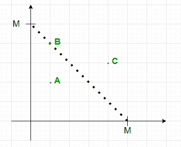

# 对位于等边长度等腰三角形上或等腰三角形内的点进行计数的查询

> 原文:[https://www . geesforgeks . org/query-to-count-points-躺在等腰三角形里面/](https://www.geeksforgeeks.org/queries-to-count-points-lying-inside-an-isosceles-triangle/)

给定一个表示 **N** 点坐标的维度 **N * 2** 的[数组](https://www.geeksforgeeks.org/array-data-structure/)**arr【】【】【】】**以及一个由 **M** 个整数组成的[数组](https://www.geeksforgeeks.org/array-data-structure/)**Q【】**，则**Q【I】**中每个元素的任务是找出位于长度相等的两个边的正坐标轴上形成的直角等腰三角形内或上的点数

**示例:**

> **输入:**N =**T3】4，arr[][] = { {2.1，3.0}，{3.7，1.2}，{1.5，6.5}，{1.2，0.0} }，Q[] = { 2，8，5}，M = 3
> T5】输出:**1 4 2
> T8】解释:
> 
> *   第一个查询:点(1.2，0.0)位于三角形内部。
> *   第二个查询:点{ (2.1，3.0)，(3.7，1.2)，(1.2，0.0) }位于三角形内部，点(1.5，6.5)位于三角形上。
> *   第三个查询:点{(3.7，1.2)，(1.2，0.0)}位于三角形内部。
> 
> **输入:**N =**T3】3，arr[][] = { {0，0}，{1，1}，{2，1} }，Q[] = {1，2，3}，M = 3
> T5】输出:**1 2 3
> T8】解释:
> 
> *   第一个查询:点(0，0)位于三角形内部。
> *   第二个查询:点{ (0，0)，(1，1) }位于三角形内部。
> *   第三个查询:所有的点都在三角形里面。

**天真方法:**最简单的方法是在每个查询中[遍历点的数组](https://www.geeksforgeeks.org/c-program-to-traverse-an-array/)，并检查它是否位于形成的直角三角形内。完成上述步骤后，打印计数。
***时间复杂度:** O(N * M)*
***辅助空间:** O(1)*

**高效方法:**上述方法可以基于以下观察进行优化:

> 
> 
> *   点 **(x，y)** 位于坐标轴上形成的等腰直角三角形内，该三角形的两条等边为 **X** ，如果:
>     *   **x≥0&&y≥0&&x+y≤x**
> *   通过预先存储**坐标和≤ X** 的点数，可以在恒定时间内回答查询。

按照以下步骤解决问题:

*   初始化一个[数组](https://www.geeksforgeeks.org/array-data-structure/)，比如说**最大尺寸**的 **pre[]** ，存储坐标之和小于等于数组索引的点数。
*   [遍历数组](https://www.geeksforgeeks.org/c-program-to-traverse-an-array/) **arr[][]** 并将**cell(arr[I][0]+arr[I][1])的计数增加**1。
*   [计算数组 **pre[]的前缀和数组**](https://www.geeksforgeeks.org/prefix-sum-array-implementation-applications-competitive-programming/)。
*   [遍历数组](https://www.geeksforgeeks.org/c-program-to-traverse-an-array/) **Q[]** 并打印**pre【Q[I]】**。

下面是上述方法的实现:

## C++

```
// C++ implementation of above approach

#include <bits/stdc++.h>
using namespace std;

int const MAX = 1e6 + 5;

// Function to find answer of each query
int query(vector<vector<float> > arr,
          vector<int> Q)
{
    // Stores the count of points with sum
    // less than or equal to their indices
    int pre[MAX] = { 0 };

    // Traverse the array
    for (int i = 0; i < arr.size(); i++) {

        // If both x and y-coordinate < 0
        if (arr[i][0] < 0 || arr[i][1] < 0)
            continue;

        // Stores the sum of co-ordinates
        int sum = ceil((arr[i][0] + arr[i][1]));

        // Increment count of sum by 1
        pre[sum]++;
    }

    // Prefix array
    for (int i = 1; i < MAX; i++)
        pre[i] += pre[i - 1];

    // Perform queries
    for (int i = 0; i < Q.size(); i++) {
        cout << pre[Q[i]] << " ";
    }
    cout << endl;
}
// Drivers Code
int main()
{
    vector<vector<float> > arr = { { 2.1, 3.0 },
                                   { 3.7, 1.2 },
                                   { 1.5, 6.5 },
                                   { 1.2, 0.0 } };
    vector<int> Q = { 2, 8, 5 };
    int N = arr.size();
    int M = Q.size();

    query(arr, Q);
}
```

## Java 语言(一种计算机语言，尤用于创建网站)

```
// Java implementation of above approach
import java.util.*;
class GFG
{

static int MAX = (int) (1e6 + 5);

// Function to find answer of each query
static void query(double [][]arr,
          int []Q)
{

    // Stores the count of points with sum
    // less than or equal to their indices
    int pre[] = new int[MAX];

    // Traverse the array
    for (int i = 0; i < arr.length; i++)
    {

        // If both x and y-coordinate < 0
        if (arr[i][0] < 0 || arr[i][1] < 0)
            continue;

        // Stores the sum of co-ordinates
        int sum = (int) Math.ceil((arr[i][0] + arr[i][1]));

        // Increment count of sum by 1
        pre[sum]++;
    }

    // Prefix array
    for (int i = 1; i < MAX; i++)
        pre[i] += pre[i - 1];

    // Perform queries
    for (int i = 0; i < Q.length; i++)
    {
        System.out.print(pre[Q[i]]+ " ");
    }
    System.out.println();
}

// Drivers Code
public static void main(String[] args)
{
    double[][] arr = { { 2.1, 3.0 },
                                   { 3.7, 1.2 },
                                   { 1.5, 6.5 },
                                   { 1.2, 0.0 } };
    int []Q = { 2, 8, 5 };
    int N = arr.length;
    int M = Q.length;

    query(arr, Q);
}
}

// This code is contributed by 29AjayKumar
```

## 蟒蛇 3

```
# Python3 implementation of above approach
MAX = 10**6 + 5
from math import ceil

# Function to find answer of each query
def query(arr, Q):

    # Stores the count of points with sum
    # less than or equal to their indices
    pre = [0]*(MAX)

    # Traverse the array
    for i in range(len(arr)):

        #` If both x and y-coordinate < 0
        if (arr[i][0] < 0 or arr[i][1] < 0):
            continue

        # Stores the sum of co-ordinates
        sum = ceil((arr[i][0] + arr[i][1]));

        # Increment count of sum by 1
        pre[sum] += 1

    # Prefix array
    for i in range(1, MAX):
        pre[i] += pre[i - 1]

    # Perform queries
    for i in range(len(Q)):
        print(pre[Q[i]], end = " ")

# Drivers Code
if __name__ == '__main__':
    arr = [[ 2.1, 3.0],
          [ 3.7, 1.2],
          [ 1.5, 6.5],
          [ 1.2, 0.0]]
    Q = [2, 8, 5]
    N = len(arr)
    M = len(Q)

    query(arr, Q)

    # This code is contributed by mohit kumar 29.
```

## C#

```
// C# implementation of above approach
using System;
public class GFG
{

  static int MAX = (int) (1e6 + 5);

  // Function to find answer of each query
  static void query(double [,]arr,
                    int []Q)
  {

    // Stores the count of points with sum
    // less than or equal to their indices
    int []pre = new int[MAX];

    // Traverse the array
    for (int i = 0; i < arr.GetLength(0); i++)
    {

      // If both x and y-coordinate < 0
      if (arr[i,0] < 0 || arr[i,1] < 0)
        continue;

      // Stores the sum of co-ordinates
      int sum = (int) Math.Ceiling((arr[i,0] + arr[i,1]));

      // Increment count of sum by 1
      pre[sum]++;
    }

    // Prefix array
    for (int i = 1; i < MAX; i++)
      pre[i] += pre[i - 1];

    // Perform queries
    for (int i = 0; i < Q.Length; i++)
    {
      Console.Write(pre[Q[i]]+ " ");
    }
    Console.WriteLine();
  }

  // Drivers Code
  public static void Main(String[] args)
  {
    double[,] arr = { { 2.1, 3.0 },
                     { 3.7, 1.2 },
                     { 1.5, 6.5 },
                     { 1.2, 0.0 } };
    int []Q = { 2, 8, 5 };
    int N = arr.GetLength(0);
    int M = Q.Length;
    query(arr, Q);
  }
}

// This code is contributed by 29AjayKumar
```

## java 描述语言

```
<script>
// Javascript implementation of above approach

let MAX =  (1e6 + 5)

// Function to find answer of each query
function query(arr,Q)
{
    // Stores the count of points with sum
    // less than or equal to their indices
    let pre = new Array(MAX);
     for(let i=0;i<MAX;i++)
        pre[i]=0;
    // Traverse the array
    for (let i = 0; i < arr.length; i++)
    {

        // If both x and y-coordinate < 0
        if (arr[i][0] < 0 || arr[i][1] < 0)
            continue;

        // Stores the sum of co-ordinates
        let sum = Math.ceil((arr[i][0] + arr[i][1]));

        // Increment count of sum by 1
        pre[sum]++;
    }

    // Prefix array
    for (let i = 1; i < MAX; i++)
        pre[i] += pre[i - 1];

    // Perform queries
    for (let i = 0; i < Q.length; i++)
    {
        document.write(pre[Q[i]]+ " ");
    }
    document.write("<br>");
}
// Drivers Code
let arr=[[ 2.1, 3.0 ],
                                   [ 3.7, 1.2 ],
                                   [ 1.5, 6.5 ],
                                   [ 1.2, 0.0 ] ];

let Q=[2, 8, 5];
let N = arr.length;
let M = Q.length;
query(arr, Q);

// This code is contributed by unknown2108
</script>
```

**Output:** 

```
1 4 2
```

***时间复杂度:**O(N)*
T5**辅助空间:** O(N)