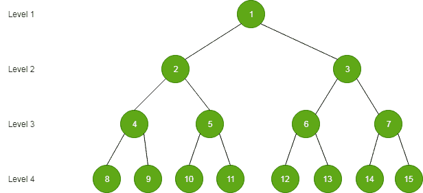

# 查询寻找 X 和完美二叉树的给定级别的节点之间的最大 Xor 值

> 原文:[https://www . geeksforgeeks . org/query-to-find-x-与给定级别的完美二叉树的节点之间的最大异或值/](https://www.geeksforgeeks.org/queries-to-find-the-maximum-xor-value-between-x-and-the-nodes-of-a-given-level-of-a-perfect-binary-tree/)

给定 N 个节点的完美二叉树，节点的值从 1 到 N，如下图所示，以及 **Q** 查询，其中每个查询由两个整数组成 **L** 和 **X** 。任务是找到 **X XOR Y** 的最大可能值，其中 **Y** 可以是 **L** 级的任意节点。



**示例:**

> **输入:** Q[] = {{2，5}，{3，15}}
> **输出:**
> 7
> 11
> 第一次查询:2 级有数字 2 和 3。
> 因此，2^5 = 7，3^5 = 6。
> 因此，答案是 7。
> 第二次查询:3 级有数字 4、5、6 和 7
> ，4^15 = 11 是最大可能。
> 
> **输入:** Q[] = {{ 1，15 }，{ 5，23 } }
> T3】输出:T5】14
> 15

**方法:**等级 **L** 中的数字包含 **L** 位，例如，在等级 2 中，数字是 2 和 3，可以用二进制的 2 位来表示。类似地，在第 3 级中，数字是 4、5、6 和 7，可以用 3 位来表示。
所以我们必须找到一个 **L** 的比特数，它与 **X** 进行最大异或运算。将 **X** 的位存储在一个数组 **a[]** 中。现在，用与 **a[]** 中的元素相反的元素填充大小为 **L** 的数组 **b[]** ，即如果 **a[i]** 等于 0，则将 **b[i]** 等于 1，反之亦然。
注意，**b【】**的 **L-1** 指数必须始终为 1。如果**a【】**的大小小于**b【】**的大小，则用 1 填充**b【】**的剩余索引。数组 **b[]** 的填充方向与数组 **a[]** 的填充方向相反，因此由数组 **b[]** 的位组成的数给出最大异或值。最后，计算由 **b[]** 生成的数字，并返回其与 **X** 的异或作为查询的答案。

下面是上述方法的实现:

## C++

```
// C++ implementation of the approach
#include <bits/stdc++.h>
using namespace std;
#define MAXN 60

// Function to solve queries of the maximum xor value
// between the nodes in a given level L of a
// perfect binary tree and a given value X
int solveQuery(int L, int X)
{
    // Initialize result
    int res;

    // Initialize array to store bits
    int a[MAXN], b[L];

    // Initialize a copy of X
    // and size of array
    int ref = X, size_a = 0;

    // Storing the bits of X
    // in the array a[]
    while (ref > 0) {
        a[size_a] = ref % 2;
        ref /= 2;
        size_a++;
    }

    // Filling the array b[]
    for (int i = 0; i < min(size_a, L); i++) {
        if (a[i] == 1)
            b[i] = 0;
        else
            b[i] = 1;
    }

    for (int i = min(size_a, L); i < L; i++)
        b[i] = 1;

    b[L - 1] = 1;

    // Initializing variable which gives
    // maximum xor
    int temp = 0, p = 1;

    for (int i = 0; i < L; i++) {
        temp += b[i] * p;
        p *= 2;
    }

    // Getting the maximum xor value
    res = temp ^ X;

    // Return the result
    return res;
}

// Driver code
int main()
{
    int queries[][2] = { { 2, 5 }, { 3, 15 } };
    int q = sizeof(queries) / sizeof(queries[0]);

    // Perform queries
    for (int i = 0; i < q; i++)
        cout << solveQuery(queries[i][0],
                           queries[i][1])
             << endl;

    return 0;
}
```

## Java 语言(一种计算机语言，尤用于创建网站)

```
// Java implementation of the approach

class GFG
{

    static int MAXN = 60;

    // Function to solve queries of the maximum xor value
    // between the nodes in a given level L of a
    // perfect binary tree and a given value X
    static int solveQuery(int L, int X)
    {
        // Initialize result
        int res;

        // Initialize array to store bits
        int []a = new int [MAXN];
        int []b = new int[L];

        // Initialize a copy of X
        // and size of array
        int refer = X, size_a = 0;

        // Storing the bits of X
        // in the array a[]
        while (refer > 0)
        {
            a[size_a] = refer % 2;
            refer /= 2;
            size_a++;
        }

        // Filling the array b[]
        for (int i = 0; i < Math.min(size_a, L); i++)
        {
            if (a[i] == 1)
                b[i] = 0;
            else
                b[i] = 1;
        }

        for (int i = Math.min(size_a, L); i < L; i++)
            b[i] = 1;

        b[L - 1] = 1;

        // Initializing variable which gives
        // maximum xor
        int temp = 0, p = 1;

        for (int i = 0; i < L; i++)
        {
            temp += b[i] * p;
            p *= 2;
        }

        // Getting the maximum xor value
        res = temp ^ X;

        // Return the result
        return res;
    }

    // Driver code
    static public void main (String args[])
    {
        int [][]queries= { { 2, 5 }, { 3, 15 } };
        int q = queries.length;

        // Perform queries
        for (int i = 0; i < q; i++)
            System.out.println( solveQuery(queries[i][0],
                            queries[i][1]) );

    }
}

// This code is contributed by AnkitRai01
```

## 蟒蛇 3

```
# Python3 implementation of the approach

MAXN = 60

# Function to solve queries of the maximum xor value
# between the nodes in a given level L of a
# perfect binary tree and a given value X
def solveQuery(L, X):

    # Initialize result
    res = 0

    # Initialize array to store bits
    a = [0 for i in range(MAXN)]
    b = [0 for i in range(MAXN)]

    # Initialize a copy of X
    # and size of array
    ref = X
    size_a = 0

    # Storing the bits of X
    # in the array a[]
    while (ref > 0):
        a[size_a] = ref % 2
        ref //= 2
        size_a+=1

    # Filling the array b[]
    for i in range(min(size_a,L)):
        if (a[i] == 1):
            b[i] = 0
        else:
            b[i] = 1

    for i in range(min(size_a, L),L):
        b[i] = 1

    b[L - 1] = 1

    # Initializing variable which gives
    # maximum xor
    temp = 0
    p = 1

    for i in range(L):
        temp += b[i] * p
        p *= 2

    # Getting the maximum xor value
    res = temp ^ X

    # Return the result
    return res

# Driver code
queries= [ [ 2, 5 ], [ 3, 15 ] ]

q = len(queries)

# Perform queries
for i in range(q):
    print(solveQuery(queries[i][0],queries[i][1]))

# This code is contributed by mohit kumar 29
```

## C#

```
// C# implementation of the approach
using System;

class GFG
{

    static int MAXN = 60;

    // Function to solve queries of the maximum xor value
    // between the nodes in a given level L of a
    // perfect binary tree and a given value X
    static int solveQuery(int L, int X)
    {
        // Initialize result
        int res;

        // Initialize array to store bits
        int []a = new int [MAXN];
        int []b = new int[L];

        // Initialize a copy of X
        // and size of array
        int refer = X, size_a = 0;

        // Storing the bits of X
        // in the array a[]
        while (refer > 0)
        {
            a[size_a] = refer % 2;
            refer /= 2;
            size_a++;
        }

        // Filling the array b[]
        for (int i = 0; i < Math.Min(size_a, L); i++)
        {
            if (a[i] == 1)
                b[i] = 0;
            else
                b[i] = 1;
        }

        for (int i = Math.Min(size_a, L); i < L; i++)
            b[i] = 1;

        b[L - 1] = 1;

        // Initializing variable which gives
        // maximum xor
        int temp = 0, p = 1;

        for (int i = 0; i < L; i++)
        {
            temp += b[i] * p;
            p *= 2;
        }

        // Getting the maximum xor value
        res = temp ^ X;

        // Return the result
        return res;
    }

    // Driver code
    static public void Main ()
    {
        int [,]queries= { { 2, 5 }, { 3, 15 } };
        int q = queries.Length;

        // Perform queries
        for (int i = 0; i < q; i++)
            Console.WriteLine( solveQuery(queries[i,0],
                            queries[i,1]) );

    }
}

// This code is contributed by anuj_67..
```

## java 描述语言

```
<script>

// Javascript implementation of the approach
var MAXN = 60;

// Function to solve queries of the maximum
// xor value between the nodes in a given
// level L of a perfect binary tree and a
// given value X
function solveQuery(L, X)
{

    // Initialize result
    var res;

    // Initialize array to store bits
    var a = Array(MAXN), b = Array(L);

    // Initialize a copy of X
    // and size of array
    var ref = X, size_a = 0;

    // Storing the bits of X
    // in the array a[]
    while (ref > 0)
    {
        a[size_a] = ref % 2;
        ref = parseInt(ref / 2);
        size_a++;
    }

    // Filling the array b[]
    for(var i = 0; i < Math.min(size_a, L); i++)
    {
        if (a[i] == 1)
            b[i] = 0;
        else
            b[i] = 1;
    }

    for(var i = Math.min(size_a, L); i < L; i++)
        b[i] = 1;

    b[L - 1] = 1;

    // Initializing variable which gives
    // maximum xor
    var temp = 0, p = 1;

    for(var i = 0; i < L; i++)
    {
        temp += b[i] * p;
        p *= 2;
    }

    // Getting the maximum xor value
    res = temp ^ X;

    // Return the result
    return res;
}

// Driver code
var queries = [ [ 2, 5 ], [ 3, 15 ] ];
var q = queries.length;

// Perform queries
for(var i = 0; i < q; i++)
    document.write(solveQuery(queries[i][0],
                              queries[i][1]) + "<br>");

// This code is contributed by rutvik_56

</script>
```

**Output:** 

```
7
11
```