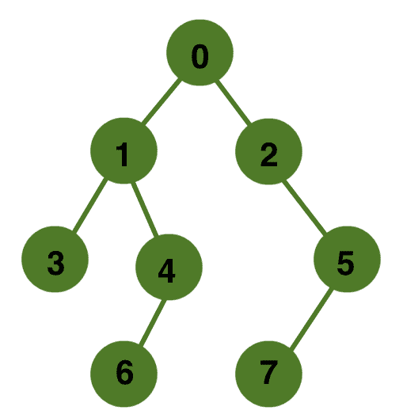

# 查询树中的祖先-后代关系

> 原文:[https://www . geesforgeks . org/query-祖先-后代-关系-树/](https://www.geeksforgeeks.org/query-ancestor-descendant-relationship-tree/)

给定一棵有 N 个顶点和 N-1 条边的有根树。我们会得到很多对顶点 u 和 v，我们需要判断 u 是否是 v 的祖先。给定的树将扎根于索引为 0 的顶点。

**示例:**



```
u = 1    v = 6
we can see from above tree that node 
1 is ancestor of node 6 so the answer 
will be yes.

u = 1    v = 7
we can see from above tree that node 1 
is not an ancestor of node 7 so the
answer will be no.
```

我们可以使用树的深度优先搜索来解决这个问题。在进行 dfs 时，我们可以观察到访问节点的顺序与其祖先之间的关系。如果我们在进入和离开 dfs 中的每个节点时为该节点分配入时间和出时间，那么我们可以看到，对于每对祖先-后代，祖先的入时间小于后代的入时间，祖先的出时间大于后代的出时间，因此利用这种关系，我们可以在 O(1)时间内找到每对节点的结果。

因此预处理的时间复杂度为 0(N)，查询的时间复杂度为 0(1)。

## C++

```
// C++ program to query whether two node has
// ancestor-descendant relationship or not
#include <bits/stdc++.h>
using namespace std;

// Utility dfs method to assign in and out time
// to each node
void dfs(vector<int> g[], int u, int parent,
         int timeIn[], int timeOut[], int& cnt)
{
    // assign In-time to node u
    timeIn[u] = cnt++;

    // call dfs over all neighbors except parent
    for (int i = 0; i < g[u].size(); i++) {
        int v = g[u][i];
        if (v != parent)
            dfs(g, v, u, timeIn, timeOut, cnt);
    }

    // assign Out-time to node u
    timeOut[u] = cnt++;
}

// method to preprocess all nodes for assigning time
void preProcess(int edges[][2], int V, int timeIn[],
                int timeOut[])
{
    vector<int> g[V];

    // construct array of vector data structure
    // for tree
    for (int i = 0; i < V - 1; i++) {
        int u = edges[i][0];
        int v = edges[i][1];

        g[u].push_back(v);
        g[v].push_back(u);
    }

    int cnt = 0;

    // call dfs method from root
    dfs(g, 0, -1, timeIn, timeOut, cnt);
}

// method returns "yes" if u is a ancestor
// node of v
string isAncestor(int u, int v, int timeIn[],
                  int timeOut[])
{
    bool b = (timeIn[u] <= timeIn[v] &&
             timeOut[v] <= timeOut[u]);
    return (b ? "yes" : "no");
}

// Driver code to test abovea methods
int main()
{
    int edges[][2] = {
        { 0, 1 },
        { 0, 2 },
        { 1, 3 },
        { 1, 4 },
        { 2, 5 },
        { 4, 6 },
        { 5, 7 }
    };

    int E = sizeof(edges) / sizeof(edges[0]);
    int V = E + 1;

    int timeIn[V], timeOut[V];
    preProcess(edges, V, timeIn, timeOut);

    int u = 1;
    int v = 6;
    cout << isAncestor(u, v, timeIn, timeOut) << endl;

    u = 1;
    v = 7;
    cout << isAncestor(u, v, timeIn, timeOut) << endl;

    return 0;
}
```

## Java 语言(一种计算机语言，尤用于创建网站)

```
// Java program to query whether two node has
// ancestor-descendant relationship or not
import java.util.Vector;

class GFG
{
  static int cnt;

  // Utility dfs method to assign in and out time
  // to each node
  static void dfs(Vector<Integer> []g, int u, int parent,
                  int []timeIn, int []timeOut)
  {

    // Assign In-time to node u
    timeIn[u] = cnt++;

    // Call dfs over all neighbors except parent
    for(int i = 0; i < g[u].size(); i++)
    {
      int v = g[u].get(i);       
      if (v != parent)
        dfs(g, v, u, timeIn, timeOut);
    }

    // Assign Out-time to node u
    timeOut[u] = cnt++;
  }

  // Method to preprocess all nodes for assigning time
  static void preProcess(int [][]edges, int V,
                         int []timeIn, int []timeOut)
  {
    @SuppressWarnings("unchecked")
    Vector<Integer> []g = new Vector[V];
    for (int i = 0; i < g.length; i++)
      g[i] = new Vector<Integer>();

    // Conarray of vector data structure
    // for tree
    for(int i = 0; i < V - 1; i++)
    {
      int u = edges[i][0];
      int v = edges[i][1];
      g[u].add(v);
      g[v].add(u);
    }
    cnt = 0;

    // Call dfs method from root
    dfs(g, 0, -1, timeIn, timeOut);
  }

  // Method returns "yes" if u is a ancestor
  // node of v
  static String isAncestor(int u, int v, int []timeIn,
                           int []timeOut)
  {
    boolean b = (timeIn[u] <= timeIn[v] &&
                 timeOut[v] <= timeOut[u]);
    return (b ? "yes" : "no");
  }

  // Driver code   
  public static void main(String[] args)
  {
    int edges[][] = { { 0, 1 },
                     { 0, 2 },
                     { 1, 3 },
                     { 1, 4 },
                     { 2, 5 },
                     { 4, 6 },
                     { 5, 7 } };   
    int E = edges.length;
    int V = E + 1;  
    int []timeIn = new int[V];
    int []timeOut = new int[V];  
    preProcess(edges, V, timeIn, timeOut);   
    int u = 1;
    int v = 6;
    System.out.println(isAncestor(u, v, timeIn,
                                  timeOut));   
    u = 1;
    v = 7;
    System.out.println(isAncestor(u, v, timeIn,
                                  timeOut));
  }
}

// This code is contributed by gauravrajput1
```

## 蟒蛇 3

```
# Python program to query whether two node has
# ancestor-descendant relationship or not

cnt = 0

# Utility dfs method to assign in and out time
# to each node
def dfs(g: list, u: int, parent: int, timeIn: list, timeOut: list):
    global cnt

    # assign In-time to node u
    timeIn[u] = cnt
    cnt += 1

    # call dfs over all neighbors except parent
    for i in range(len(g[u])):
        v = g[u][i]
        if v != parent:
            dfs(g, v, u, timeIn, timeOut)

    # assign Out-time to node u
    timeOut[u] = cnt
    cnt += 1

# method to preprocess all nodes for assigning time
def preProcess(edges: list, V: int, timeIn: list, timeOut: list):
    global cnt
    g = [[] for i in range(V)]

    # construct array of vector data structure
    # for tree
    for i in range(V - 1):
        u = edges[i][0]
        v = edges[i][1]

        g[u].append(v)
        g[v].append(u)

    cnt = 0

    # call dfs method from root
    dfs(g, 0, -1, timeIn, timeOut)

# method returns "yes" if u is a ancestor
# node of v
def isAncestor(u: int, v: int, timeIn: list, timeOut: list) -> str:
    b = timeIn[u] <= timeIn[u] and timeOut[v] <= timeOut[u]
    return "yes" if b else "no"

# Driver Code
if __name__ == "__main__":
    edges = [(0, 1), (0, 2), (1, 3), (1, 4), (2, 5), (4, 6), (5, 7)]
    E = len(edges)
    V = E + 1

    timeIn = [0] * V
    timeOut = [0] * V
    preProcess(edges, V, timeIn, timeOut)

    u = 1
    v = 6
    print(isAncestor(u, v, timeIn, timeOut))

    u = 1
    v = 7
    print(isAncestor(u, v, timeIn, timeOut))

# This code is contributed by
# sanjeev2552
```

## C#

```
// C# program to query whether two node has
// ancestor-descendant relationship or not
using System;
using System.Collections;

class GFG{

// Utility dfs method to assign in and out time
// to each node
static void dfs(ArrayList []g, int u, int parent,
                int []timeIn, int []timeOut,
                ref int cnt)
{

    // Assign In-time to node u
    timeIn[u] = cnt++;

    // Call dfs over all neighbors except parent
    for(int i = 0; i < g[u].Count; i++)
    {
        int v = (int)g[u][i];

        if (v != parent)
            dfs(g, v, u, timeIn, timeOut, ref cnt);
    }

    // Assign Out-time to node u
    timeOut[u] = cnt++;
}

// Method to preprocess all nodes for assigning time
static void preProcess(int [,]edges, int V,
                       int []timeIn, int []timeOut)
{
    ArrayList []g = new ArrayList[V];

    for(int i = 0; i < V; i++)
    {
        g[i] = new ArrayList();
    }

    // Construct array of vector data structure
    // for tree
    for(int i = 0; i < V - 1; i++)
    {
        int u = edges[i, 0];
        int v = edges[i, 1];

        g[u].Add(v);
        g[v].Add(u);
    }

    int cnt = 0;

    // Call dfs method from root
    dfs(g, 0, -1, timeIn, timeOut, ref cnt);
}

// Method returns "yes" if u is a ancestor
// node of v
static string isAncestor(int u, int v, int []timeIn,
                                       int []timeOut)
{
    bool b = (timeIn[u] <= timeIn[v] &&
             timeOut[v] <= timeOut[u]);
    return (b ? "yes" : "no");
}

// Driver code   
static void Main()
{
    int [,]edges = { { 0, 1 },
                     { 0, 2 },
                     { 1, 3 },
                     { 1, 4 },
                     { 2, 5 },
                     { 4, 6 },
                     { 5, 7 } };

    int E = edges.GetLength(0);
    int V = E + 1;

    int []timeIn = new int[V];
    int []timeOut = new int[V];

    preProcess(edges, V, timeIn, timeOut);

    int u = 1;
    int v = 6;
    Console.Write(isAncestor(u, v, timeIn,
                             timeOut) + "\n");

    u = 1;
    v = 7;
    Console.Write(isAncestor(u, v, timeIn,
                             timeOut) + "\n");
}
}

// This code is contributed by rutvik_56
```

## java 描述语言

```
<script>

// Javascript program to query whether
// two node has ancestor-descendant
// relationship or not
let cnt;

// Utility dfs method to assign in and out time
// to each node
function dfs(g, u, parent, timeIn, timeOut)
{

    // Assign In-time to node u
    timeIn[u] = cnt++;

    // Call dfs over all neighbors except parent
    for(let i = 0; i < g[u].length; i++)
    {
        let v = g[u][i];      
        if (v != parent)
            dfs(g, v, u, timeIn, timeOut);
    }

    // Assign Out-time to node u
    timeOut[u] = cnt++;
}

// Method to preprocess all nodes for assigning time
function preProcess(edges, V, timeIn, timeOut)
{
    let g = new Array(V);
    for(let i = 0; i < g.length; i++)
        g[i] = [];

    // Conarray of vector data structure
    // for tree
    for(let i = 0; i < V - 1; i++)
    {
        let u = edges[i][0];
        let v = edges[i][1];
        g[u].push(v);
        g[v].push(u);
    }
    cnt = 0;

    // Call dfs method from root
    dfs(g, 0, -1, timeIn, timeOut);
}

// Method returns "yes" if u is a ancestor
// node of v
function isAncestor(u, v, timeIn, timeOut)
{
    let b = (timeIn[u] <= timeIn[v] &&
             timeOut[v] <= timeOut[u]);
    return (b ? "yes" : "no");
}

// Driver code
let edges = [ [ 0, 1 ], [ 0, 2 ],
              [ 1, 3 ], [ 1, 4 ],
              [ 2, 5 ], [ 4, 6 ],
              [ 5, 7 ] ];  
let E = edges.length;
let V = E + 1; 
let timeIn = new Array(V);
let timeOut = new Array(V); 
preProcess(edges, V, timeIn, timeOut);

let u = 1;
let v = 6;
document.write(isAncestor(u, v, timeIn,
                          timeOut) + "</br>");  
u = 1;
v = 7;
document.write(isAncestor(u, v, timeIn,
                          timeOut));

// This code is contributed by divyeshrabadiya07

</script>
```

**输出:**

```
yes
no
```

本文由 [**乌卡什·特里维迪**](https://in.linkedin.com/in/utkarsh-trivedi-253069a7) 供稿。如果你喜欢 GeeksforGeeks 并想投稿，你也可以使用[write.geeksforgeeks.org](https://write.geeksforgeeks.org)写一篇文章或者把你的文章邮寄到 review-team@geeksforgeeks.org。看到你的文章出现在极客博客主页上，帮助其他极客。
如果发现有不正确的地方，或者想分享更多关于上述话题的信息，请写评论。