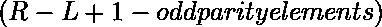

# 查询对 K 进行异或运算后的子阵中奇偶校验元素进行计数

> 原文:[https://www . geesforgeks . org/query-to-count-奇数和偶数-奇偶校验-与-k 异或后的子数组中的元素/](https://www.geeksforgeeks.org/query-to-count-odd-and-even-parity-elements-in-subarray-after-xor-with-k/)

给定由 **N** 元素和 **Q** 查询组成的数组 **arr[]** ，这些查询由 **L** 、 **R** 和 **K** 表示。任务是打印子阵列**【L，R】**中奇偶校验元素与 k 按位异或后的计数。

**示例:**

> **输入:** arr[] = {5，2，3，1，4，8，10}
> 查询[] = {{0，5，3}，{1，4，8}，{4，6，10}}
> **输出:**
> 4 2
> 1 3
> 2 1
> **说明:**
> 在查询 1 中，子数组【0:5】中的奇偶校验元素为【2，1，4 现在 K = 3 异或后，奇偶校验元素的个数分别是 4 和 2。
> 在查询 2 中，子阵[1:4]中的奇偶校验元素为[2，1，4]和[3]。现在 K = 8 异或后，奇偶校验元素的个数分别是 1 和 3。
> 在查询 3 中，子阵[4:6]中的奇偶校验元素为[4，8]和[10]。现在 K = 10 异或后，奇偶校验元素的个数分别是 2 和 1。

**方法:**想法是使用 [MO 的算法](https://www.geeksforgeeks.org/mos-algorithm-query-square-root-decomposition-set-1-introduction/)对所有查询进行预处理，以便一个查询的结果可以用于下一个查询。

*   对所有查询进行排序，将 L 值从 **0 到√n–1**的查询放在一起，然后是从 **√n 到 2×√n–1**的查询，依此类推。一个块中的所有查询都按照 R 值的递增顺序进行排序。
*   计算**奇宇称**元素，然后计算**偶宇称**元素如下



*   奇偶校验元素异或后的观察:
    *   **两个奇宇称**元素的异或是一个**偶宇称**元素。
    *   **两个偶宇称**元素的异或就是一个**偶宇称**元素。
    *   **一个偶宇称**元素和**另一个奇宇称**元素的异或是一个**奇宇称**元素，反之亦然。
*   逐一处理所有查询，增加奇数奇偶元素的计数，现在我们将**检查 K** 的奇偶。如果 **K** 有一个**偶宇称**，那么**奇数**和**偶宇称**的计数保持不变**不变**否则我们**交换**它们。
    *   让 **count_oddP** 存储上一次查询中奇数奇偶校验元素的计数。
    *   移除先前查询的额外元素，并为当前查询添加新元素。例如，如果以前的查询是[0，8]，而当前的查询是[3，9]，那么删除元素 arr[0]，arr[1]和 arr[2]并添加 arr[9]。
*   为了显示结果，请按照提供的顺序对查询进行排序。

**添加元素**

*   如果当前元素有奇偶性，那么增加奇偶性的计数。

**移除元素**

*   如果当前元素具有奇数奇偶校验，则减少奇数奇偶校验的计数。

下面是上述方法的实现:

## C++

```
// C++ program to count odd and
// even parity elements in subarray
// after XOR with K

#include <bits/stdc++.h>
using namespace std;

#define MAX 100000

// Variable to represent block size.
// This is made global so compare()
// of sort can use it
int block;

// Structure to represent
// a query range
struct Query {
    // Starting index
    int L, R, K, index;

    // Count of odd
    // parity elements
    int odd;

    // Count of even
    // parity elements
    int even;
};

// To store the count of
// odd parity elements
int count_oddP;

// Function used to sort all queries so that
// all queries of the same block are arranged
// together and within a block, queries are
// sorted in increasing order of R values.
bool compare(Query x, Query y)
{
    // Different blocks, sort by block.
    if (x.L / block != y.L / block)
        return x.L / block < y.L / block;

    // Same block, sort by R value
    return x.R < y.R;
}

// Function used to sort all queries
// in order of their index value so
// that results of queries can be
// printed in same order as of input
bool compare1(Query x, Query y)
{
    return x.index < y.index;
}

// Function to Add elements
// of current range
void add(int currL, int a[])
{
    // _builtin_parity(x)returns true(1)
    // if the number has odd parity else
    // it returns false(0) for even parity.
    if (__builtin_parity(a[currL]))
        count_oddP++;
}

// Function to remove elements
// of previous range
void remove(int currR, int a[])
{
    // _builtin_parity(x)returns true(1)
    // if the number has odd parity else
    // it returns false(0) for even parity.
    if (__builtin_parity(a[currR]))
        count_oddP--;
}

// Function to generate the result of queries
void queryResults(int a[], int n, Query q[],
                  int m)
{

    // Initialize number of odd parity
    // elements to 0
    count_oddP = 0;

    // Find block size
    block = (int)sqrt(n);

    // Sort all queries so that queries of
    // same blocks are arranged together.
    sort(q, q + m, compare);

    // Initialize current L, current R and
    // current result
    int currL = 0, currR = 0;

    for (int i = 0; i < m; i++) {

        // L and R values of current range
        int L = q[i].L,
            R = q[i].R,
            k = q[i].K;

        // Add Elements of current range
        while (currR <= R) {
            add(currR, a);
            currR++;
        }
        while (currL > L) {
            add(currL - 1, a);
            currL--;
        }

        // Remove element of previous range
        while (currR > R + 1)

        {
            remove(currR - 1, a);
            currR--;
        }
        while (currL < L) {
            remove(currL, a);
            currL++;
        }

        // If parity of K is even
        // then the count of odd
        // and even parity remains
        // the same
        if (!__builtin_parity(k)) {
            q[i].odd = count_oddP;
            q[i].even
                = R - L + 1 - count_oddP;
        }
        // If parity of K is odd
        // we swap the count of
        // odd and even parity
        // elements
        else {
            q[i].odd
                = R - L + 1 - count_oddP;
            q[i].even = count_oddP;
        }
    }
}

// Function to display the results of
// queries in their initial order
void printResults(Query q[], int m)
{
    sort(q, q + m, compare1);
    for (int i = 0; i < m; i++) {
        cout << q[i].odd << " "
             << q[i].even << endl;
    }
}

// Driver Code
int main()
{

    int arr[] = { 5, 2, 3, 1, 4, 8, 10 };
    int n = sizeof(arr) / sizeof(arr[0]);

    Query q[] = { { 0, 5, 3, 0, 0, 0 },
                  { 1, 4, 8, 1, 0, 0 },
                  { 4, 6, 10, 2, 0, 0 } };

    int m = sizeof(q) / sizeof(q[0]);

    queryResults(arr, n, q, m);

    printResults(q, m);

    return 0;
}
```

## Java 语言(一种计算机语言，尤用于创建网站)

```
// Java program to count odd and
// even parity elements in subarray
// after XOR with K
import java.io.*;
import java.util.*;

// Class to represent
// a query range
class Query
{
    int L, R, K, index;

    // Count of odd
    // parity elements
    int odd;

    // Count of even
    // parity elements
    int even;

    Query(int L, int R, int K,
          int index, int odd, int even)
    {
        this.L = L;
        this.R = R;
        this.K = K;
        this.index = index;
        this.odd = odd;
        this.even = even;
    }
}

class GFG{

// Variable to represent block size.
static int block;

// To store the count of
// odd parity elements
static int count_oddP;

// Function to Add elements
// of current range
static void add(int currL, int a[])
{

    // _builtin_parity(x)returns true
    // if the number has odd parity else
    // it returns false for even parity.
    if (__builtin_parity(a[currL]))
        count_oddP++;
}

// Function to remove elements
// of previous range
static void remove(int currR, int a[])
{

    // _builtin_parity(x)returns true
    // if the number has odd parity else
    // it returns false for even parity.
    if (__builtin_parity(a[currR]))
        count_oddP--;
}

// Function to generate the result of queries
static void queryResults(int a[], int n, Query q[],
                         int m)
{

    // Initialize number of odd parity
    // elements to 0
    count_oddP = 0;

    // Find block size
    block = (int)(Math.sqrt(n));

    // sort all queries so that all queries
    // of the same block are arranged together
    // and within a block, queries are sorted
    // in increasing order of R values.
    Arrays.sort(q, (Query x, Query y) ->
    {

        // Different blocks, sort by block.
        if (x.L / block != y.L / block)
            return x.L / block - y.L / block;

        // Same block, sort by R value
        return x.R - y.R;
    });

    // Initialize current L, current R and
    // current result
    int currL = 0, currR = 0;

    for(int i = 0; i < m; i++)
    {

        // L and R values of current range
        int L = q[i].L, R = q[i].R, k = q[i].K;

        // Add Elements of current range
        while (currR <= R)
        {
            add(currR, a);
            currR++;
        }
        while (currL > L)
        {
            add(currL - 1, a);
            currL--;
        }

        // Remove element of previous range
        while (currR > R + 1)
        {
            remove(currR - 1, a);
            currR--;
        }
        while (currL < L)
        {
            remove(currL, a);
            currL++;
        }

        // If parity of K is even
        // then the count of odd
        // and even parity remains
        // the same
        if (!__builtin_parity(k))
        {
            q[i].odd = count_oddP;
            q[i].even = R - L + 1 - count_oddP;
        }

        // If parity of K is odd
        // we swap the count of
        // odd and even parity
        // elements
        else
        {
            q[i].odd = R - L + 1 - count_oddP;
            q[i].even = count_oddP;
        }
    }
}

static boolean __builtin_parity(int K)
{
    return (Integer.bitCount(K) % 2) == 1;
}

// Function to display the results of
// queries in their initial order
static void printResults(Query q[], int m)
{
    Arrays.sort(q, (Query x, Query y) ->

                // sort all queries
                // in order of their
                // index value so that results
                // of queries can be printed
                // in same order as of input);
                x.index - y.index);

    for(int i = 0; i < m; i++)
    {
        System.out.println(q[i].odd + " " +
                           q[i].even);
    }
}

// Driver Code
public static void main(String[] args)
{
    int arr[] = { 5, 2, 3, 1, 4, 8, 10 };
    int n = arr.length;

    Query q[] = new Query[3];
    q[0] = new Query(0, 5, 3, 0, 0, 0);
    q[1] = new Query(1, 4, 8, 1, 0, 0);
    q[2] = new Query(4, 6, 10, 2, 0, 0);

    int m = q.length;

    queryResults(arr, n, q, m);

    printResults(q, m);
}
}

// This code is contributed by jithin
```

**Output:** 

```
4 2
1 3
2 1
```