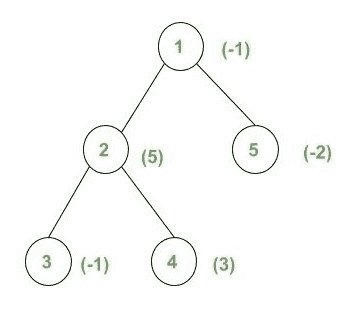

# 使用 LCA 查询找到给定树中两个节点之间的最大和最小权重。

> 原文:[https://www . geeksforgeeks . org/query-查找给定树中两个节点之间的最大和最小权重-使用 lca/](https://www.geeksforgeeks.org/query-to-find-the-maximum-and-minimum-weight-between-two-nodes-in-the-given-tree-using-lca/)

给定一棵**树**，所有节点的**权重**。每个查询包含两个整数 **u** 和 **v** ，任务是在 u 和 v(包括两者)之间的简单路径上找到**最小**和**最大**权重。

**示例:**

> **输入:**
> 
> 
> 
> 查询=[{1，3}，{2，4}，{3，5}]
> **输出:**
> -1 5
> 3 5
> -2 5
> **解释:**
> 路径 1 到 3 上的权重为[-1，5，-1]。因此，最小和最大重量分别为-1 和 5。
> 路径 2 至 4 的权重为[5，3]。因此，最小和最大重量分别为 3 和 5。
> 路径 2 至 4 上的权重为[-1，5，-1，-2]。因此，最小和最大重量分别为-2 和 5。

**方法:**想法是使用二元提升技术在树中使用[生命周期评价。](https://www.geeksforgeeks.org/lca-in-a-tree-using-binary-lifting-technique/)

*   二进制提升是一种动态编程方法，其中我们预先计算一个数组 **lca[i][j]** ，其中 i = [1，n]，j = [1，log(n)]，lca[i][j]包含节点 I 的第 2 个祖先 <sup>j</sup> 。
    *   为了计算 lca[][]的值，可以使用以下递归

> 如果 j = 0，lca[i][j] =父[i]，如果 j > 0，LCA[I][j]= LCA[LCA[I][j–1]][j–1]。

*   在计算 lca[][]数组时，我们还将计算**最小权重[][]** 和**最大权重[][]** ，其中最小权重[i][j]包含从节点 I 到其第 2 个 <sup>j</sup> 祖先的最小权重，最大权重[i][j]包含从节点 I 到其第 2 个 <sup>j</sup> 祖先的最大权重
    *   为了计算最小重量[][]和最大重量[]，可以使用以下递归。

![MinWeight[i][j] =\begin{cases} min (weight[i], weight[parent[i]]) & \text{ ;if } j=0 \\ min( MinWeight[i][j-1], MinWeight[lca[i][j - 1]][j - 1]) & \text{ ;if } j>0 \end{cases}               ](img/8fb8e768c5c949d03262aa1582c2752b.png "Rendered by QuickLaTeX.com")[Tex]MaxWatch[I][j]= \ begin { cases } max(weight[I]，weight[parent[I]])&\ text {；if } j=0 \\ max( MaxWeight[i][j-1]，MaxWeight[LCA[I][j–1]][j–1])&\ text {；if } j > 0 \end{cases} [/Tex]

*   在预计算之后，我们找到了(u，v)之间的**最小**和**最大**权重，就像我们找到了(u，v)的最小共同祖先一样。

下面是上述方法的实现:

## C++

```
// C++ Program to find the maximum and
// minimum weight between two nodes
// in the given tree using LCA

#include <bits/stdc++.h>
using namespace std;

#define MAX 1000

#define log 10 // log2(MAX)

// Array to store the level
// of each node
int level[MAX];

int lca[MAX][log];
int minWeight[MAX][log];
int maxWeight[MAX][log];

// Vector to store tree
vector<int> graph[MAX];
// Array to store weight of nodes
int weight[MAX];

void addEdge(int u, int v)
{
    graph[u].push_back(v);
    graph[v].push_back(u);
}

// Pre-Processing to calculate
// values of lca[][], MinWeight[][]
// and MaxWeight[][]
void dfs(int node, int parent, int h)
{
    // Using recursion formula to
    // calculate the values
    // of lca[][]
    lca[node][0] = parent;

    // Storing the level of
    // each node
    level[node] = h;
    if (parent != -1)
    {
        minWeight[node][0]
            = min(weight[node], weight[parent]);
        maxWeight[node][0]
            = max(weight[node], weight[parent]);
    }

    for (int i = 1; i < log; i++)
    {
        if (lca[node][i - 1] != -1)
        {

            // Using recursion formula to
            // calculate the values of lca[][],
            // MinWeight[][] and MaxWeight[][]
            lca[node][i] = lca[lca[node][i - 1]][i - 1];
            minWeight[node][i]
                = min(minWeight[node][i - 1],
                      minWeight[lca[node][i - 1]][i - 1]);
            maxWeight[node][i]
                = max(maxWeight[node][i - 1],
                      maxWeight[lca[node][i - 1]][i - 1]);
        }
    }

    for (int i : graph[node])
    {
        if (i == parent)
            continue;
        dfs(i, node, h + 1);
    }
}

// Function to find the minimum and
// maximum weights in the given range
void findMinMaxWeight(int u, int v)
{

    int minWei = INT_MAX;
    int maxWei = INT_MIN;

    // The node which is present
    // farthest from the root node
    // is taken as v If u is
    // farther from root node
    // then swap the two
    if (level[u] > level[v])
        swap(u, v);

    // Finding the ancestor of v
    // which is at same level as u
    for (int i = log - 1; i >= 0; i--)
    {

        if (lca[v][i] != -1
            && level[lca[v][i]] >= level[u])
        {

            // Calculating Minimum and
            // Maximum Weight of node
            // v till its 2^i-th ancestor
            minWei = min(minWei, minWeight[v][i]);
            maxWei = max(maxWei, maxWeight[v][i]);
            v = lca[v][i];
        }
    }

    // If u is the ancestor of v
    // then u is the LCA of u and v
    if (v == u)
    {
        cout << minWei << " " << maxWei << endl;
    }

    else {

        // Finding the node closest to the
        // root which is not the common
        // ancestor of u and v i.e. a node
        // x such that x is not the common
        // ancestor of u and v but lca[x][0] is
        for (int i = log - 1; i >= 0; i--)
        {

            if (lca[v][i] != lca[u][i])
            {

                // Calculating the minimum of
                // MinWeight of v to its 2^i-th
                // ancestor and MinWeight of u
                // to its 2^i-th ancestor
                minWei = min(minWei, min(minWeight[v][i],
                                         minWeight[u][i]));

                // Calculating the maximum of
                // MaxWeight of v to its 2^i-th
                // ancestor and MaxWeight of u
                // to its 2^i-th ancestor
                maxWei = max(maxWei, max(maxWeight[v][i],
                                         maxWeight[u][i]));

                v = lca[v][i];
                u = lca[u][i];
            }
        }

        // Calculating the Minimum of
        // first ancestor of u and v
        minWei = min(minWei,
                     min(minWeight[v][0], minWeight[u][0]));

        // Calculating the maximum of
        // first ancestor of u and v
        maxWei = max(maxWei,
                     max(maxWeight[v][0], maxWeight[u][0]));

        cout << minWei << " " << maxWei << endl;
    }
}

// Driver Code
int main()
{

    // Number of nodes
    int n = 5;

    // Add edges
    addEdge(1, 2);
    addEdge(1, 5);
    addEdge(2, 4);
    addEdge(2, 3);

    weight[1] = -1;
    weight[2] = 5;
    weight[3] = -1;
    weight[4] = 3;
    weight[5] = -2;

    // Initialising lca values with -1
    // Initialising MinWeight values
    // with INT_MAX
    // Initialising MaxWeight values
    // with INT_MIN
    for (int i = 1; i <= n; i++) {
        for (int j = 0; j < log; j++) {
            lca[i][j] = -1;
            minWeight[i][j] = INT_MAX;
            maxWeight[i][j] = INT_MIN;
        }
    }

    // Perform DFS
    dfs(1, -1, 0);

    // Query 1: {1, 3}
    findMinMaxWeight(1, 3);

    // Query 2: {2, 4}
    findMinMaxWeight(2, 4);

    // Query 3: {3, 5}
    findMinMaxWeight(3, 5);

    return 0;
}
```

## Java 语言(一种计算机语言，尤用于创建网站)

```
// Java Program to find the maximum and
// minimum weight between two nodes
// in the given tree using LCA
import java.util.*;
class GFG{

static final int MAX = 1000;

// Math.log(MAX)
static final int log = 10 ;

// Array to store the
// level of each node
static int []level =
       new int[MAX];

static int [][]lca =
       new int[MAX][log];
static int [][]minWeight =
       new int[MAX][log];
static int [][]maxWeight =
       new int[MAX][log];

// Vector to store tree
static Vector<Integer> []graph =
              new Vector[MAX];

// Array to store
// weight of nodes
static int []weight =
       new int[MAX];

private static void swap(int x,
                         int y)
{
  int temp = x;
  x = y;
  y = temp;
}

static void addEdge(int u,
                    int v)
{
  graph[u].add(v);
  graph[v].add(u);
}

// Pre-Processing to
// calculate values of
// lca[][], MinWeight[][]
// and MaxWeight[][]
static void dfs(int node,
                int parent, int h)
{
  // Using recursion formula to
  // calculate the values
  // of lca[][]
  lca[node][0] = parent;

  // Storing the level of
  // each node
  level[node] = h;

  if (parent != -1)
  {
    minWeight[node][0] = Math.min(weight[node],
                                  weight[parent]);
    maxWeight[node][0] = Math.max(weight[node],
                                  weight[parent]);
  }

  for (int i = 1; i < log; i++)
  {
    if (lca[node][i - 1] != -1)
    {
      // Using recursion formula to
      // calculate the values of lca[][],
      // MinWeight[][] and MaxWeight[][]
      lca[node][i] =
          lca[lca[node][i - 1]][i - 1];

      minWeight[node][i] =
                Math.min(minWeight[node][i - 1],
                         minWeight[lca[node][i - 1]][i - 1]);
      maxWeight[node][i] =
                Math.max(maxWeight[node][i - 1],
                         maxWeight[lca[node][i - 1]][i - 1]);
    }
  }

  for (int i : graph[node])
  {
    if (i == parent)
      continue;
    dfs(i, node, h + 1);
  }
}

// Function to find the minimum and
// maximum weights in the given range
static void findMinMaxWeight(int u,
                             int v)
{
  int minWei = Integer.MAX_VALUE;
  int maxWei = Integer.MIN_VALUE;

  // The node which is present
  // farthest from the root node
  // is taken as v If u is
  // farther from root node
  // then swap the two
  if (level[u] > level[v])
    swap(u, v);

  // Finding the ancestor of v
  // which is at same level as u
  for (int i = log - 1; i >= 0; i--)
  {
    if (lca[v][i] != -1 &&
        level[lca[v][i]] >= level[u])
    {
      // Calculating Minimum and
      // Maximum Weight of node
      // v till its 2^i-th ancestor
      minWei = Math.min(minWei,
                        minWeight[v][i]);
      maxWei = Math.max(maxWei,
                        maxWeight[v][i]);
      v = lca[v][i];
    }
  }

  // If u is the ancestor of v
  // then u is the LCA of u and v
  if (v == u)
  {
    System.out.print(minWei + " " + 
                     maxWei + "\n");
  }
  else
  {
    // Finding the node closest to the
    // root which is not the common
    // ancestor of u and v i.e. a node
    // x such that x is not the common
    // ancestor of u and v but lca[x][0] is
    for (int i = log - 1; i >= 0; i--)
    {
      if(v == -1)
        v++;
      if (lca[v][i] != lca[u][i])
      {
        // Calculating the minimum of
        // MinWeight of v to its 2^i-th
        // ancestor and MinWeight of u
        // to its 2^i-th ancestor
        minWei = Math.min(minWei,
                          Math.min(minWeight[v][i],
                                   minWeight[u][i]));

        // Calculating the maximum of
        // MaxWeight of v to its 2^i-th
        // ancestor and MaxWeight of u
        // to its 2^i-th ancestor
        maxWei = Math.max(maxWei,
                          Math.max(maxWeight[v][i],
                                   maxWeight[u][i]));

        v = lca[v][i];
        u = lca[u][i];
      }
    }

    // Calculating the Minimum of
    // first ancestor of u and v
    if(u == -1)
      u++;
    minWei = Math.min(minWei,
                      Math.min(minWeight[v][0],
                               minWeight[u][0]));

    // Calculating the maximum of
    // first ancestor of u and v
    maxWei = Math.max(maxWei,
                      Math.max(maxWeight[v][0],
                               maxWeight[u][0]));

    System.out.print(minWei + " " + 
                     maxWei + "\n");
  }
}

// Driver Code
public static void main(String[] args)
{
  // Number of nodes
  int n = 5;

  for (int i = 0; i < graph.length; i++)
    graph[i] = new Vector<Integer>();

  // Add edges
  addEdge(1, 2);
  addEdge(1, 5);
  addEdge(2, 4);
  addEdge(2, 3);

  weight[1] = -1;
  weight[2] = 5;
  weight[3] = -1;
  weight[4] = 3;
  weight[5] = -2;

  // Initialising lca values with -1
  // Initialising MinWeight values
  // with Integer.MAX_VALUE
  // Initialising MaxWeight values
  // with Integer.MIN_VALUE
  for (int i = 1; i <= n; i++)
  {
    for (int j = 0; j < log; j++)
    {
      lca[i][j] = -1;
      minWeight[i][j] = Integer.MAX_VALUE;
      maxWeight[i][j] = Integer.MIN_VALUE;
    }
  }

  // Perform DFS
  dfs(1, -1, 0);

  // Query 1: {1, 3}
  findMinMaxWeight(1, 3);

  // Query 2: {2, 4}
  findMinMaxWeight(2, 4);

  // Query 3: {3, 5}
  findMinMaxWeight(3, 5);
}
}

// This code is contributed by Rajput-Ji
```

## 蟒蛇 3

```
# Python3 Program to find the
# maximum and minimum weight
# between two nodes in the
# given tree using LCA
import sys
MAX = 1000

# log2(MAX)
log = 10

# Array to store the level
# of each node
level = [0 for i in range(MAX)];

# Initialising lca values with -1
# Initialising MinWeight values
# with INT_MAX
# Initialising MaxWeight values
# with INT_MIN
lca = [[-1 for j in range(log)]
           for i in range(MAX)]
minWeight = [[sys.maxsize for j in range(log)]
                          for i in range(MAX)]
maxWeight = [[-sys.maxsize for j in range(log)]
                           for i in range(MAX)]

# Vector to store tree
graph = [[] for i in range(MAX)]

# Array to store weight of nodes
weight = [0 for i in range(MAX)]

def addEdge(u, v):

    graph[u].append(v);
    graph[v].append(u);

# Pre-Processing to calculate
# values of lca[][], MinWeight[][]
# and MaxWeight[][]
def dfs(node, parent, h):

    # Using recursion formula to
    # calculate the values
    # of lca[][]
    lca[node][0] = parent;

    # Storing the level of
    # each node
    level[node] = h;

    if (parent != -1):   
        minWeight[node][0] = (min(weight[node],
                                  weight[parent]));
        maxWeight[node][0] = (max(weight[node],
                                  weight[parent]));   

    for i in range(1, log):
        if (lca[node][i - 1] != -1):

            # Using recursion formula to
            # calculate the values of lca[][],
            # MinWeight[][] and MaxWeight[][]
            lca[node][i] = lca[lca[node][i - 1]][i - 1];
            minWeight[node][i] = min(minWeight[node][i - 1],
                                     minWeight[lca[node][i - 1]][i - 1]);
            maxWeight[node][i] = max(maxWeight[node][i - 1],
                                     maxWeight[lca[node][i - 1]][i - 1]);

    for i in graph[node]:  
        if (i == parent):
            continue;
        dfs(i, node, h + 1);

# Function to find the minimum
# and maximum weights in the
# given range
def findMinMaxWeight(u, v):

    minWei = sys.maxsize
    maxWei = -sys.maxsize

    # The node which is present
    # farthest from the root node
    # is taken as v If u is
    # farther from root node
    # then swap the two
    if (level[u] > level[v]):
        u, v = v, u       

    # Finding the ancestor of v
    # which is at same level as u
    for i in range(log - 1, -1, -1):

        if (lca[v][i] != -1 and
            level[lca[v][i]] >=
            level[u]):

            # Calculating Minimum and
            # Maximum Weight of node
            # v till its 2^i-th ancestor
            minWei = min(minWei,
                         minWeight[v][i]);
            maxWei = max(maxWei,
                         maxWeight[v][i]);
            v = lca[v][i];       

    # If u is the ancestor of v
    # then u is the LCA of u and v
    if (v == u):        
        print(str(minWei) + ' ' +
              str(maxWei))

    else:

        # Finding the node closest to the
        # root which is not the common
        # ancestor of u and v i.e. a node
        # x such that x is not the common
        # ancestor of u and v but lca[x][0] is
        for i in range(log - 1, -1, -1):

            if (lca[v][i] != lca[u][i]):

                # Calculating the minimum of
                # MinWeight of v to its 2^i-th
                # ancestor and MinWeight of u
                # to its 2^i-th ancestor
                minWei = (min(minWei,
                              min(minWeight[v][i],
                                  minWeight[u][i])));

                # Calculating the maximum of
                # MaxWeight of v to its 2^i-th
                # ancestor and MaxWeight of u
                # to its 2^i-th ancestor
                maxWei = max(maxWei,
                             max(maxWeight[v][i],
                                 maxWeight[u][i]));

                v = lca[v][i];
                u = lca[u][i];       

        # Calculating the Minimum of
        # first ancestor of u and v
        minWei = min(minWei,
                     min(minWeight[v][0],
                         minWeight[u][0]));

        # Calculating the maximum of
        # first ancestor of u and v
        maxWei = max(maxWei,
                     max(maxWeight[v][0],
                         maxWeight[u][0]));

        print(str(minWei) + ' ' +
              str(maxWei))   

# Driver code
if __name__ == "__main__":

    # Number of nodes
    n = 5;

    # Add edges
    addEdge(1, 2);
    addEdge(1, 5);
    addEdge(2, 4);
    addEdge(2, 3);

    weight[1] = -1;
    weight[2] = 5;
    weight[3] = -1;
    weight[4] = 3;
    weight[5] = -2;

    # Perform DFS
    dfs(1, -1, 0);

    # Query 1: {1, 3}
    findMinMaxWeight(1, 3);

    # Query 2: {2, 4}
    findMinMaxWeight(2, 4);

    # Query 3: {3, 5}
    findMinMaxWeight(3, 5);

# This code is contributed by Rutvik_56
```

## C#

```
// C# Program to find the
// maximum and minimum
// weight between two nodes
// in the given tree using LCA
using System;
using System.Collections.Generic;
class GFG{

static readonly int MAX = 1000;

// Math.Log(MAX)
static readonly int log = 10 ;

// Array to store the
// level of each node
static int []level =
       new int[MAX];

static int [,]lca =
       new int[MAX, log];
static int [,]minWeight =
       new int[MAX, log];
static int [,]maxWeight =
       new int[MAX, log];

// List to store tree
static List<int> []graph =
            new List<int>[MAX];

// Array to store
// weight of nodes
static int []weight =
       new int[MAX];

private static void swap(int x,
                         int y)
{
  int temp = x;
  x = y;
  y = temp;
}

static void addEdge(int u,
                    int v)
{
  graph[u].Add(v);
  graph[v].Add(u);
}

// Pre-Processing to
// calculate values of
// lca[,], MinWeight[,]
// and MaxWeight[,]
static void dfs(int node,
                int parent, int h)
{
  // Using recursion formula to
  // calculate the values
  // of lca[,]
  lca[node, 0] = parent;

  // Storing the level of
  // each node
  level[node] = h;

  if (parent != -1)
  {
    minWeight[node, 0] = Math.Min(weight[node],
                                  weight[parent]);
    maxWeight[node, 0] = Math.Max(weight[node],
                                  weight[parent]);
  }

  for (int i = 1; i < log; i++)
  {
    if (lca[node, i - 1] != -1)
    {
      // Using recursion formula to
      // calculate the values of lca[,],
      // MinWeight[,] and MaxWeight[,]
      lca[node, i] =
          lca[lca[node, i - 1],
              i - 1];

      minWeight[node, i] =
                Math.Min(minWeight[node, i - 1],
                         minWeight[lca[node, i - 1],
                                   i - 1]);
      maxWeight[node, i] =
                Math.Max(maxWeight[node, i - 1],
                         maxWeight[lca[node, i - 1],
                                   i - 1]);
    }
  }

  foreach (int i in graph[node])
  {
    if (i == parent)
      continue;
    dfs(i, node, h + 1);
  }
}

// Function to find the minimum and
// maximum weights in the given range
static void findMinMaxWeight(int u,
                             int v)
{
  int minWei = int.MaxValue;
  int maxWei = int.MinValue;

  // The node which is present
  // farthest from the root node
  // is taken as v If u is
  // farther from root node
  // then swap the two
  if (level[u] > level[v])
    swap(u, v);

  // Finding the ancestor of v
  // which is at same level as u
  for (int i = log - 1; i >= 0; i--)
  {
    if (lca[v, i] != -1 &&
        level[lca[v, i]] >= level[u])
    {
      // Calculating Minimum and
      // Maximum Weight of node
      // v till its 2^i-th ancestor
      minWei = Math.Min(minWei,
                        minWeight[v, i]);
      maxWei = Math.Max(maxWei,
                        maxWeight[v, i]);
      v = lca[v, i];
    }
  }

  // If u is the ancestor of v
  // then u is the LCA of u and v
  if (v == u)
  {
    Console.Write(minWei + " " + 
                  maxWei + "\n");
  }
  else
  {
    // Finding the node closest to the
    // root which is not the common
    // ancestor of u and v i.e. a node
    // x such that x is not the common
    // ancestor of u and v but lca[x,0] is
    for (int i = log - 1; i >= 0; i--)
    {
      if(v == -1)
        v++;
      if (lca[v, i] != lca[u, i])
      {
        // Calculating the minimum of
        // MinWeight of v to its 2^i-th
        // ancestor and MinWeight of u
        // to its 2^i-th ancestor
        minWei = Math.Min(minWei,
                 Math.Min(minWeight[v, i],
                          minWeight[u, i]));

        // Calculating the maximum of
        // MaxWeight of v to its 2^i-th
        // ancestor and MaxWeight of u
        // to its 2^i-th ancestor
        maxWei = Math.Max(maxWei,
                 Math.Max(maxWeight[v, i],
                          maxWeight[u, i]));

        v = lca[v, i];
        u = lca[u, i];
      }
    }

    // Calculating the Minimum of
    // first ancestor of u and v
    if(u == -1)
      u++;
    minWei = Math.Min(minWei,
             Math.Min(minWeight[v, 0],
                      minWeight[u, 0]));

    // Calculating the maximum of
    // first ancestor of u and v
    maxWei = Math.Max(maxWei,
             Math.Max(maxWeight[v, 0],
                      maxWeight[u, 0]));

    Console.Write(minWei + " " + 
                  maxWei + "\n");
  }
}

// Driver Code
public static void Main(String[] args)
{
  // Number of nodes
  int n = 5;

  for (int i = 0; i < graph.Length; i++)
    graph[i] = new List<int>();

  // Add edges
  addEdge(1, 2);
  addEdge(1, 5);
  addEdge(2, 4);
  addEdge(2, 3);

  weight[1] = -1;
  weight[2] = 5;
  weight[3] = -1;
  weight[4] = 3;
  weight[5] = -2;

  // Initialising lca values with -1
  // Initialising MinWeight values
  // with int.MaxValue
  // Initialising MaxWeight values
  // with int.MinValue
  for (int i = 1; i <= n; i++)
  {
    for (int j = 0; j < log; j++)
    {
      lca[i, j] = -1;
      minWeight[i, j] = int.MaxValue;
      maxWeight[i, j] = int.MinValue;
    }
  }

  // Perform DFS
  dfs(1, -1, 0);

  // Query 1: {1, 3}
  findMinMaxWeight(1, 3);

  // Query 2: {2, 4}
  findMinMaxWeight(2, 4);

  // Query 3: {3, 5}
  findMinMaxWeight(3, 5);
}
}

// This code is contributed by Rajput-Ji
```

## java 描述语言

```
<script>

    // JavaScript Program to find the maximum and
    // minimum weight between two nodes
    // in the given tree using LCA

    let MAX = 1000;

    // Math.log(MAX)
    let log = 10 ;

    // Array to store the
    // level of each node
    let level = new Array(MAX);
    level.fill(0);

    let lca = new Array(MAX);
    let minWeight = new Array(MAX);
    let maxWeight = new Array(MAX);

    // Vector to store tree
    let graph = new Array(MAX);

    // Array to store
    // weight of nodes
    let weight = new Array(MAX);
    weight.fill(0);

    function addEdge(u, v)
    {
      graph[u].push(v);
      graph[v].push(u);
    }

    // Pre-Processing to
    // calculate values of
    // lca[][], MinWeight[][]
    // and MaxWeight[][]
    function dfs(node, parent, h)
    {
      // Using recursion formula to
      // calculate the values
      // of lca[][]
      lca[node][0] = parent;

      // Storing the level of
      // each node
      level[node] = h;

      if (parent != -1)
      {
        minWeight[node][0] = Math.min(weight[node],
                                      weight[parent]);
        maxWeight[node][0] = Math.max(weight[node],
                                      weight[parent]);
      }

      for (let i = 1; i < log; i++)
      {
        if (lca[node][i - 1] != -1)
        {
          // Using recursion formula to
          // calculate the values of lca[][],
          // MinWeight[][] and MaxWeight[][]
          lca[node][i] =
              lca[lca[node][i - 1]][i - 1];

          minWeight[node][i] =
                    Math.min(minWeight[node][i - 1],
                             minWeight[lca[node][i - 1]][i - 1]);
          maxWeight[node][i] =
                    Math.max(maxWeight[node][i - 1],
                             maxWeight[lca[node][i - 1]][i - 1]);
        }
      }

      for (let i = 0; i < graph[node].length; i++)
      {
        if (graph[node][i] == parent)
          continue;
        dfs(graph[node][i], node, h + 1);
      }
    }

    // Function to find the minimum and
    // maximum weights in the given range
    function findMinMaxWeight(u, v)
    {
      let minWei = Number.MAX_VALUE;
      let maxWei = Number.MIN_VALUE;

      // The node which is present
      // farthest from the root node
      // is taken as v If u is
      // farther from root node
      // then swap the two
      if (level[u] > level[v])
      {
        let temp = u;
        u = v;
        v = temp;
      }

      // Finding the ancestor of v
      // which is at same level as u
      for (let i = log - 1; i >= 0; i--)
      {
        if (lca[v][i] != -1 &&
            level[lca[v][i]] >= level[u])
        {
          // Calculating Minimum and
          // Maximum Weight of node
          // v till its 2^i-th ancestor
          minWei = Math.min(minWei,
                            minWeight[v][i]);
          maxWei = Math.max(maxWei,
                            maxWeight[v][i]);
          v = lca[v][i];
        }
      }

      // If u is the ancestor of v
      // then u is the LCA of u and v
      if (v == u)
      {
        document.write(minWei + " " + maxWei + "</br>");
      }
      else
      {
        // Finding the node closest to the
        // root which is not the common
        // ancestor of u and v i.e. a node
        // x such that x is not the common
        // ancestor of u and v but lca[x][0] is
        for (let i = log - 1; i >= 0; i--)
        {
          if(v == -1)
            v++;
          if (lca[v][i] != lca[u][i])
          {
            // Calculating the minimum of
            // MinWeight of v to its 2^i-th
            // ancestor and MinWeight of u
            // to its 2^i-th ancestor
            minWei = Math.min(minWei,
                              Math.min(minWeight[v][i],
                                       minWeight[u][i]));

            // Calculating the maximum of
            // MaxWeight of v to its 2^i-th
            // ancestor and MaxWeight of u
            // to its 2^i-th ancestor
            maxWei = Math.max(maxWei,
                              Math.max(maxWeight[v][i],
                                       maxWeight[u][i]));

            v = lca[v][i];
            u = lca[u][i];
          }
        }

        // Calculating the Minimum of
        // first ancestor of u and v
        if(u == -1)
          u++;
        minWei = Math.min(minWei,
                          Math.min(minWeight[v][0],
                                   minWeight[u][0]));

        // Calculating the maximum of
        // first ancestor of u and v
        maxWei = Math.max(maxWei,
                          Math.max(maxWeight[v][0],
                                   maxWeight[u][0]));

        document.write(minWei + " " + maxWei + "</br>");
      }
    }

    // Number of nodes
    let n = 5;

    for (let i = 0; i < graph.length; i++)
      graph[i] = [];

    // Add edges
    addEdge(1, 2);
    addEdge(1, 5);
    addEdge(2, 4);
    addEdge(2, 3);

    weight[1] = -1;
    weight[2] = 5;
    weight[3] = -1;
    weight[4] = 3;
    weight[5] = -2;

    // Initialising lca values with -1
    // Initialising MinWeight values
    // with Integer.MAX_VALUE
    // Initialising MaxWeight values
    // with Integer.MIN_VALUE
    for (let i = 1; i <= n; i++)
    {
      lca[i] = new Array(log);
      minWeight[i] = new Array(log);
      maxWeight[i] = new Array(log);
      for (let j = 0; j < log; j++)
      {
        lca[i][j] = -1;
        minWeight[i][j] = Number.MAX_VALUE;
        maxWeight[i][j] = Number.MIN_VALUE;
      }
    }

    // Perform DFS
    dfs(1, -1, 0);

    // Query 1: {1, 3}
    findMinMaxWeight(1, 3);

    // Query 2: {2, 4}
    findMinMaxWeight(2, 4);

    // Query 3: {3, 5}
    findMinMaxWeight(3, 5);

</script>
```

**Output**

```
-1 5
3 5
-2 5
```

**时间复杂度:**预处理花费的时间为 **O(N logN)** ，每次查询花费 **O(logN)** 时间。所以解的整体时间复杂度是 **O(N logN)** 。