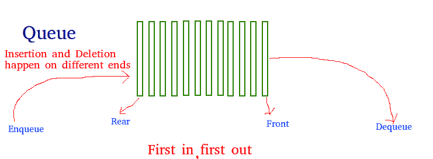

# Python 中的队列

> 原文:[https://www.geeksforgeeks.org/queue-in-python/](https://www.geeksforgeeks.org/queue-in-python/)

与堆栈一样，队列是以先进先出(FIFO)方式存储项目的线性数据结构。在队列中，最近添加最少的项目首先被移除。队列的一个很好的例子是资源的消费者队列，其中先到的消费者先被服务。



与队列关联的操作有:

*   **入队:**向队列中添加一个项目。如果队列已满，则称其为溢出情况–时间复杂性:0(1)
*   **出列:**从队列中移除一个项目。项目按推送的相同顺序弹出。如果队列为空，则称其为下溢条件-时间复杂度:0(1)
*   **前置:**从队列中获取前置项目–时间复杂度:O(1)
*   **后方:**从队列中获取最后一个项目–时间复杂度:O(1)

## 履行

在 Python 中实现队列有多种方法。本文介绍了使用 Python 库中的数据结构和模块来实现队列。
Python 中的队列可以通过以下方式实现:

*   目录
*   collections.deque
*   尾巴！尾巴！伫列

#### 使用列表实现

List 是 Python 的内置数据结构，可以用作队列。使用 append()和 pop()函数代替了 enqueue()和出列()函数。然而，列表对于这个目的来说非常慢，因为在开始插入或删除一个元素需要将所有其他元素移动一个，需要 O(n)个时间。

## 蟒蛇 3

```
# Python program to
# demonstrate queue implementation
# using list

# Initializing a queue
queue = []

# Adding elements to the queue
queue.append('a')
queue.append('b')
queue.append('c')

print("Initial queue")
print(queue)

# Removing elements from the queue
print("\nElements dequeued from queue")
print(queue.pop(0))
print(queue.pop(0))
print(queue.pop(0))

print("\nQueue after removing elements")
print(queue)

# Uncommenting print(queue.pop(0))
# will raise and IndexError
# as the queue is now empty
```

**输出:**

```
Initial queue
['a', 'b', 'c']

Elements dequeued from queue
a
b
c

Queue after removing elements
[]

```

```
Traceback (most recent call last):
  File "/home/ef51acf025182ccd69d906e58f17b6de.py", line 25, in 
    print(queue.pop(0))
IndexError: pop from empty list

```

#### 使用集合实现

Python 中的队列可以使用集合模块中的 deque 类来实现。在我们需要从容器两端进行更快的追加和弹出操作的情况下，dequee 优于 list，因为 dequee 为追加和弹出操作提供了 O(1)的时间复杂度，而 list 提供了 O(n)的时间复杂度。使用 append()和 popleft()函数代替 enqueue 和 deque。

## 蟒蛇 3

```
# Python program to
# demonstrate queue implementation
# using collections.dequeue

from collections import deque

# Initializing a queue
q = deque()

# Adding elements to a queue
q.append('a')
q.append('b')
q.append('c')

print("Initial queue")
print(q)

# Removing elements from a queue
print("\nElements dequeued from the queue")
print(q.popleft())
print(q.popleft())
print(q.popleft())

print("\nQueue after removing elements")
print(q)

# Uncommenting q.popleft()
# will raise an IndexError
# as queue is now empty
```

**输出:**

```
Initial queue
deque(['a', 'b', 'c'])

Elements dequeued from the queue
a
b
c

Queue after removing elements
deque([])

```

```
Traceback (most recent call last):
  File "/home/b2fa8ce438c2a9f82d6c3e5da587490f.py", line 23, in 
    q.popleft()
IndexError: pop from an empty deque

```

#### 使用队列实现。长队

队列是 Python 的内置模块，用于实现队列。排队。Queue(maxsize)将变量初始化为 maxsize 的最大大小。最大大小为零“0”意味着无限队列。该队列遵循先进先出规则。
本模块有各种功能:

*   **最大大小**–队列中允许的项目数。
*   **空()**–如果队列为空，则返回真，否则返回假。
*   **full()**–如果队列中有 maxsize 项，则返回 True。如果队列初始化时 maxsize=0(默认值)，则 full()永远不会返回 True。
*   **get()**–从队列中移除并返回一个项目。如果队列为空，请等到某个项目可用。
*   **get _ nowait()**–如果一个项目立即可用，则返回该项目，否则引发 QueueEmpty。
*   **将(物品)**–将物品放入队列。如果队列已满，请等到有可用的空位后再添加项目。
*   **Put _ nowait(item)**–将一个项目放入队列而不阻塞。如果没有立即可用的空闲插槽，请提高 QueueFull。
*   **qsize()**–返回队列中的项目数。

## 蟒蛇 3

```
# Python program to
# demonstrate implementation of
# queue using queue module

from queue import Queue

# Initializing a queue
q = Queue(maxsize = 3)

# qsize() give the maxsize
# of the Queue
print(q.qsize())

# Adding of element to queue
q.put('a')
q.put('b')
q.put('c')

# Return Boolean for Full
# Queue
print("\nFull: ", q.full())

# Removing element from queue
print("\nElements dequeued from the queue")
print(q.get())
print(q.get())
print(q.get())

# Return Boolean for Empty
# Queue
print("\nEmpty: ", q.empty())

q.put(1)
print("\nEmpty: ", q.empty())
print("Full: ", q.full())

# This would result into Infinite
# Loop as the Queue is empty.
# print(q.get())
```

**输出:**

```
0

Full:  True

Elements dequeued from the queue
a
b
c

Empty:  True

Empty:  False
Full:  False

```