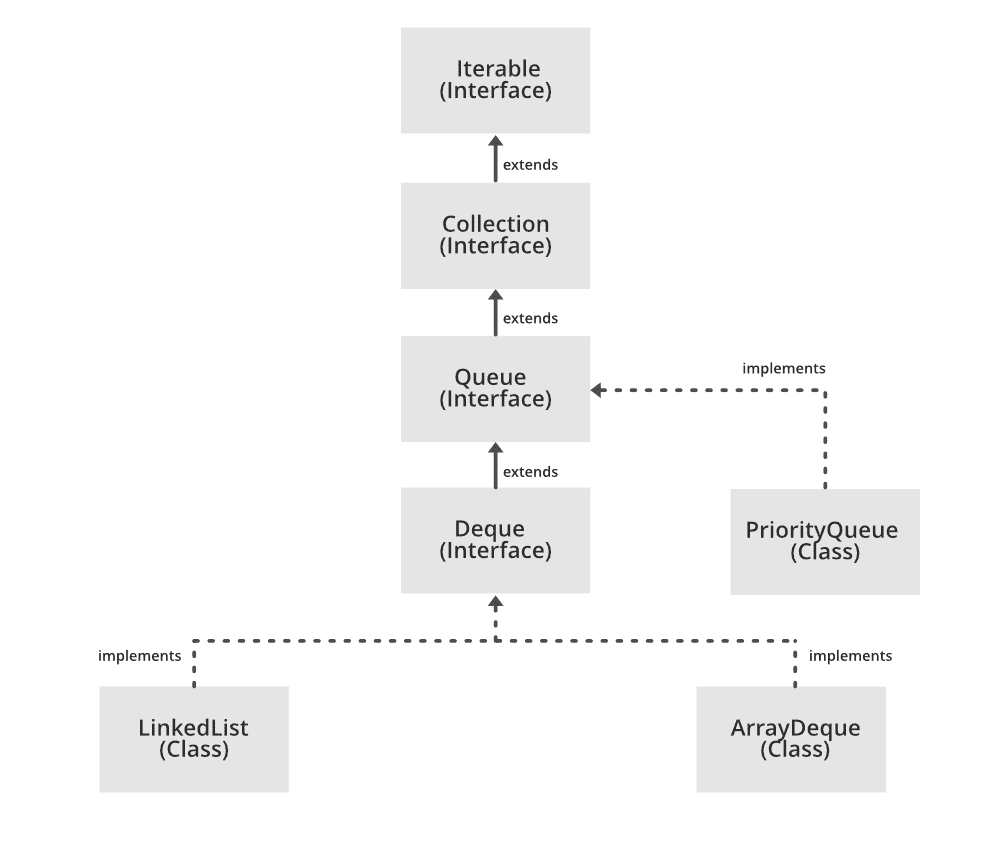

# Java 中的队列接口

> 原文:[https://www.geeksforgeeks.org/queue-interface-java/](https://www.geeksforgeeks.org/queue-interface-java/)

出现在 [java.util](https://www.geeksforgeeks.org/java-util-package-java/) 包中并扩展了[收集接口](https://www.geeksforgeeks.org/collections-in-java-2/)的队列接口用于以先进先出的顺序保存将要处理的元素。它是一个有序的对象列表，其用途仅限于在列表末尾插入元素和从列表开头删除元素(即，它遵循先进先出原则)。



作为一个接口，队列需要一个具体的类来声明，最常见的类是 Java 中的 [PriorityQueue](https://www.geeksforgeeks.org/priority-queue-class-in-java-2/) 和 [LinkedList](https://www.geeksforgeeks.org/linked-list-in-java/) 。请注意，这两种实现都不是线程安全的。[如果需要线程安全实现，优先级阻塞队列](https://www.geeksforgeeks.org/priorityblockingqueue-class-in-java/)是一个替代实现。

**声明:**队列接口声明为:

> 公共接口队列扩展集合

**创建队列对象**
由于*队列*是[接口](https://www.geeksforgeeks.org/interfaces-in-java/)，因此不能创建队列类型的对象。我们总是需要一个扩展这个列表的类来创建一个对象。此外，在 Java 1.5 中引入[泛型](https://www.geeksforgeeks.org/generics-in-java/)后，可以限制可以存储在队列中的对象类型。这种类型安全队列可以定义为:

> // Obj 是要存储在 Queue
> Queue<Obj>Queue =新优先级 Queue<Obj>()；

**队列示例:**

## Java 语言(一种计算机语言，尤用于创建网站)

```
// Java program to demonstrate a Queue

import java.util.LinkedList;
import java.util.Queue;

public class QueueExample {

    public static void main(String[] args)
    {
        Queue<Integer> q
            = new LinkedList<>();

        // Adds elements {0, 1, 2, 3, 4} to
        // the queue
        for (int i = 0; i < 5; i++)
            q.add(i);

        // Display contents of the queue.
        System.out.println("Elements of queue "
                           + q);

        // To remove the head of queue.
        int removedele = q.remove();
        System.out.println("removed element-"
                           + removedele);

        System.out.println(q);

        // To view the head of queue
        int head = q.peek();
        System.out.println("head of queue-"
                           + head);

        // Rest all methods of collection
        // interface like size and contains
        // can be used with this
        // implementation.
        int size = q.size();
        System.out.println("Size of queue-"
                           + size);
    }
}
```

**Output:** 

```
Elements of queue [0, 1, 2, 3, 4]
removed element-0
[1, 2, 3, 4]
head of queue-1
Size of queue-4
```

### 队列接口上的操作

让我们看看如何使用[优先级队列类](https://www.geeksforgeeks.org/priority-queue-class-in-java-2/)对队列执行一些常用的操作。
T3】1。添加元素:为了在队列中添加一个元素，我们可以使用 [add()方法](https://www.geeksforgeeks.org/queue-add-method-in-java/)。插入顺序不会保留在优先级队列中。元素是根据优先级顺序存储的，默认情况下，优先级顺序是升序。

## Java 语言(一种计算机语言，尤用于创建网站)

```
// Java program to add elements
// to a Queue

import java.util.*;

public class GFG {

    public static void main(String args[])
    {
        Queue<String> pq = new PriorityQueue<>();

        pq.add("Geeks");
        pq.add("For");
        pq.add("Geeks");

        System.out.println(pq);
    }
}
```

**Output:** 

```
[For, Geeks, Geeks]
```

**2。移除元素:**为了从队列中移除元素，我们可以使用[移除()方法。](https://www.geeksforgeeks.org/queue-remove-method-in-java/)如果有多个这样的对象，则移除对象的第一个出现。除此之外，poll()方法也用于移除头部并将其返回。

## Java 语言(一种计算机语言，尤用于创建网站)

```
// Java program to remove elements
// from a Queue

import java.util.*;

public class GFG {

    public static void main(String args[])
    {
        Queue<String> pq = new PriorityQueue<>();

        pq.add("Geeks");
        pq.add("For");
        pq.add("Geeks");

        System.out.println("Initial Queue " + pq);

        pq.remove("Geeks");

        System.out.println("After Remove " + pq);

        System.out.println("Poll Method " + pq.poll());

        System.out.println("Final Queue " + pq);
    }
}
```

**Output:** 

```
Initial Queue [For, Geeks, Geeks]
After Remove [For, Geeks]
Poll Method For
Final Queue [Geeks]
```

**3。迭代队列:**有多种方法迭代队列。最著名的方法是将队列转换为数组，并使用 for 循环遍历。然而，队列还有一个内置的迭代器，可以用来遍历队列。

## Java 语言(一种计算机语言，尤用于创建网站)

```
// Java program to iterate elements
// to a Queue

import java.util.*;

public class GFG {

    public static void main(String args[])
    {
        Queue<String> pq = new PriorityQueue<>();

        pq.add("Geeks");
        pq.add("For");
        pq.add("Geeks");

        Iterator iterator = pq.iterator();

        while (iterator.hasNext()) {
            System.out.print(iterator.next() + " ");
        }
    }
}
```

**Output:** 

```
For Geeks Geeks
```

**队列的特征:**队列的特征如下:

*   队列用于在队列的末尾插入元素，并从队列的开头移除元素。它遵循先进先出的概念。
*   Java 队列支持集合接口的所有方法，包括插入、删除等。
*   [链表](https://www.geeksforgeeks.org/linked-list-in-java/)、数组锁定队列和[优先级队列](https://www.geeksforgeeks.org/priority-queue-class-in-java-2/)是最常用的实现。
*   如果对阻塞队列执行任何空操作，将引发空指针异常。
*   java.util 包中可用的队列是无界队列。
*   java.util.concurrent 包中可用的队列是有界队列。
*   除了 Deques 之外的所有队列都支持分别在队列的尾部和头部插入和移除。Deques 支持在两端插入和移除元素。

### 实现队列接口的类:

[**1。PriorityQueue:**](https://www.geeksforgeeks.org/priority-queue-class-in-java-2/) 在集合框架中实现的 PriorityQueue 类为我们提供了一种基于优先级处理对象的方法。众所周知，队列遵循先进先出算法，但有时队列的元素需要根据优先级进行处理，也就是优先级队列开始发挥作用的时候。让我们看看如何使用这个类创建一个队列对象。

## Java 语言(一种计算机语言，尤用于创建网站)

```
// Java program to demonstrate the
// creation of queue object using the
// PriorityQueue class

import java.util.*;

class GfG {

    public static void main(String args[])
    {
        // Creating empty priority queue
        Queue<Integer> pQueue
            = new PriorityQueue<Integer>();

        // Adding items to the pQueue
        // using add()
        pQueue.add(10);
        pQueue.add(20);
        pQueue.add(15);

        // Printing the top element of
        // the PriorityQueue
        System.out.println(pQueue.peek());

        // Printing the top element and removing it
        // from the PriorityQueue container
        System.out.println(pQueue.poll());

        // Printing the top element again
        System.out.println(pQueue.peek());
    }
}
```

**Output:** 

```
10
10
15
```

**2。** [**链表:**](https://www.geeksforgeeks.org/linked-list-in-java/) 链表是在集合框架中实现的类，集合框架本身就实现了[链表数据结构](https://www.geeksforgeeks.org/data-structures/linked-list/)。它是一种线性数据结构，其中元素不存储在连续的位置，每个元素都是一个独立的对象，有数据部分和地址部分。这些元素使用指针和地址进行链接。每个元素都被称为一个节点。由于插入和删除的动态性和简易性，它们比数组或队列更受欢迎。让我们看看如何使用这个类创建一个队列对象。

## Java 语言(一种计算机语言，尤用于创建网站)

```
// Java program to demonstrate the
// creation of queue object using the
// LinkedList class

import java.util.*;

class GfG {

    public static void main(String args[])
    {
        // Creating empty LinkedList
        Queue<Integer> ll
            = new LinkedList<Integer>();

        // Adding items to the ll
        // using add()
        ll.add(10);
        ll.add(20);
        ll.add(15);

        // Printing the top element of
        // the LinkedList
        System.out.println(ll.peek());

        // Printing the top element and removing it
        // from the LinkedList container
        System.out.println(ll.poll());

        // Printing the top element again
        System.out.println(ll.peek());
    }
}
```

**Output:** 

```
10
10
20
```

**3。** [**优先级阻塞队列:**](https://www.geeksforgeeks.org/priorityblockingqueue-class-in-java/) 需要注意的是，优先级队列和链接列表这两个实现都不是线程安全的。如果需要线程安全实现，PriorityBlockingQueue 是一种替代实现。PriorityBlockingQueue 是一个无界阻塞队列，它使用与类 [PriorityQueue](https://www.geeksforgeeks.org/priority-queue-class-in-java-2/) 相同的排序规则，并提供阻塞检索操作。
由于它是无界的，添加元素有时会因为资源耗尽而失败，导致 [OutOfMemoryError](https://www.geeksforgeeks.org/understanding-outofmemoryerror-exception-java/) 。让我们看看如何使用这个类创建一个队列对象。

## Java 语言(一种计算机语言，尤用于创建网站)

```
// Java program to demonstrate the
// creation of queue object using the
// PriorityBlockingQueue class

import java.util.concurrent.PriorityBlockingQueue;
import java.util.*;

class GfG {
    public static void main(String args[])
    {
        // Creating empty priority
        // blocking queue
        Queue<Integer> pbq
            = new PriorityBlockingQueue<Integer>();

        // Adding items to the pbq
        // using add()
        pbq.add(10);
        pbq.add(20);
        pbq.add(15);

        // Printing the top element of
        // the PriorityBlockingQueue
        System.out.println(pbq.peek());

        // Printing the top element and
        // removing it from the
        // PriorityBlockingQueue
        System.out.println(pbq.poll());

        // Printing the top element again
        System.out.println(pbq.peek());
    }
}
```

**Output:** 

```
10
10
15
```

### 队列接口的方法

队列接口继承了[集合接口](https://www.geeksforgeeks.org/collections-in-java-2/)中的所有方法，同时实现了以下方法:

<figure class="table">

| 

方法

 | 

描述

 |
| --- | --- |
| [**添加(int index，element)**](https://www.geeksforgeeks.org/list-addint-index-e-element-method-in-java/) | 此方法用于在列表中的特定索引处添加元素。当传递单个参数时，它只是在列表的末尾添加元素。 |
| [**addAll(int index，Collection collection)**](https://www.geeksforgeeks.org/list-addall-method-in-java-with-examples/) | 此方法用于将给定集合中的所有元素添加到列表中。当传递单个参数时，它会在列表的末尾添加给定集合的所有元素。 |
| [**大小()**](https://www.geeksforgeeks.org/list-size-method-in-java-with-examples/) | 此方法用于返回列表的大小。 |
| [**晴()**](https://www.geeksforgeeks.org/list-clear-method-in-java-with-examples/) | 此方法用于移除列表中的所有元素。但是，创建的列表的引用仍然被存储。 |
| [**移除(int index)**](https://www.geeksforgeeks.org/list-removeint-index-method-in-java-with-examples/) | 此方法从指定的索引中移除元素。它将后续元素(如果有)向左移动，并将它们的索引减少 1。 |
| **移除(元素)** | 此方法用于移除列表中给定元素的第一个匹配项。 |
| [**获得(int 指数)**](https://www.geeksforgeeks.org/list-get-method-in-java-with-examples/) | 此方法返回指定索引处的元素。 |
| [**集合(int index，element)**](https://www.geeksforgeeks.org/arraylist-set-method-in-java-with-examples/) | 此方法用新元素替换给定索引处的元素。该函数返回刚刚被新元素替换的元素。 |
| [**【元素指数】**](https://www.geeksforgeeks.org/list-indexof-method-in-java-with-examples/) | 此方法返回给定元素的第一次出现，如果列表中没有该元素，则返回 *-1* 。 |
| [**【元素的最后索引】**](https://www.geeksforgeeks.org/list-lastindexof-method-in-java-with-examples/) | 此方法返回给定元素的最后一次出现，如果列表中没有该元素，则返回 *-1* 。 |
| **等于(元素)** | 此方法用于比较给定元素与列表元素的相等性。 |
| **hashCode()** | 此方法用于返回给定列表的 hashcode 值。 |
| **【isempty()** | 此方法用于检查列表是否为空。如果列表为空，则返回 true，否则返回 false。 |
| **含有(元素)** | 此方法用于检查列表是否包含给定的元素。如果列表包含元素，则返回 true。 |
| [**containsAll(集合集合)**](https://www.geeksforgeeks.org/list-containsall-method-in-java-with-examples/) | 此方法用于检查列表是否包含所有元素集合。 |
| **排序(比较器比较)** | 该方法用于根据给定的[比较器](https://www.geeksforgeeks.org/comparator-interface-java/)对列表中的元素进行排序。 |

</figure>