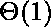

# 使用堆栈排队

> 原文:[https://www.geeksforgeeks.org/queue-using-stacks/](https://www.geeksforgeeks.org/queue-using-stacks/)

问题与[这个](https://www.geeksforgeeks.org/implement-stack-using-queue/)帖子相反。我们给出了一个带有推和弹出操作的堆栈数据结构，任务是使用堆栈数据结构的实例和对它们的操作来实现一个队列。


一个队列可以使用两个堆栈来实现。假设要实现的队列是 q，用于实现 q 的堆栈是 stack1 和 stack2。q 可以通过两种方式实现:

**方法 1(通过使 enQueue 操作代价高昂)**该方法确保最早输入的元素始终位于堆栈 1 的顶部，这样出列操作就从堆栈 1 中弹出。要将元素放在 stack1 的顶部，需要使用 stack2。

> 入队(q，x):
> 
> *   当 stack1 不为空时，将 stack1 的所有内容推送到 stack2。
> *   将 x 推送到堆栈 1(假设堆栈大小不受限制)。
> *   把一切都推回到 stack1。
> 
> 这里时间复杂度为 0(n)
> 
> 出列(q):
> 
> *   如果堆栈 1 为空，则出错
> *   从堆栈中弹出一个项目并返回
> 
> 这里时间复杂度为 0(1)

下面是上述方法的实现:

## C++

```
// CPP program to implement Queue using
// two stacks with costly enQueue()
#include <bits/stdc++.h>
using namespace std;

struct Queue {
    stack<int> s1, s2;

    void enQueue(int x)
    {
        // Move all elements from s1 to s2
        while (!s1.empty()) {
            s2.push(s1.top());
            s1.pop();
        }

        // Push item into s1
        s1.push(x);

        // Push everything back to s1
        while (!s2.empty()) {
            s1.push(s2.top());
            s2.pop();
        }
    }

    // Dequeue an item from the queue
    int deQueue()
    {
        // if first stack is empty
        if (s1.empty()) {
            cout << "Q is Empty";
            exit(0);
        }

        // Return top of s1
        int x = s1.top();
        s1.pop();
        return x;
    }
};

// Driver code
int main()
{
    Queue q;
    q.enQueue(1);
    q.enQueue(2);
    q.enQueue(3);

    cout << q.deQueue() << '\n';
    cout << q.deQueue() << '\n';
    cout << q.deQueue() << '\n';

    return 0;
}
```

## Java 语言(一种计算机语言，尤用于创建网站)

```
// Java program to implement Queue using
// two stacks with costly enQueue()
import java.util.*;

class GFG
{
static class Queue
{
    static Stack<Integer> s1 = new Stack<Integer>();
    static Stack<Integer> s2 = new Stack<Integer>();

    static void enQueue(int x)
    {
        // Move all elements from s1 to s2
        while (!s1.isEmpty())
        {
            s2.push(s1.pop());
            //s1.pop();
        }

        // Push item into s1
        s1.push(x);

        // Push everything back to s1
        while (!s2.isEmpty())
        {
            s1.push(s2.pop());
            //s2.pop();
        }
    }

    // Dequeue an item from the queue
    static int deQueue()
    {
        // if first stack is empty
        if (s1.isEmpty())
        {
            System.out.println("Q is Empty");
            System.exit(0);
        }

        // Return top of s1
        int x = s1.peek();
        s1.pop();
        return x;
    }
};

// Driver code
public static void main(String[] args)
{
    Queue q = new Queue();
    q.enQueue(1);
    q.enQueue(2);
    q.enQueue(3);

    System.out.println(q.deQueue());
    System.out.println(q.deQueue());
    System.out.println(q.deQueue());
}
}

// This code is contributed by Prerna Saini
```

## 蟒蛇 3

```
# Python3 program to implement Queue using
# two stacks with costly enQueue()

class Queue:
    def __init__(self):
        self.s1 = []
        self.s2 = []

    def enQueue(self, x):

        # Move all elements from s1 to s2
        while len(self.s1) != 0:
            self.s2.append(self.s1[-1])
            self.s1.pop()

        # Push item into self.s1
        self.s1.append(x)

        # Push everything back to s1
        while len(self.s2) != 0:
            self.s1.append(self.s2[-1])
            self.s2.pop()

    # Dequeue an item from the queue
    def deQueue(self):

            # if first stack is empty
        if len(self.s1) == 0:
            print("Q is Empty")

        # Return top of self.s1
        x = self.s1[-1]
        self.s1.pop()
        return x

# Driver code
if __name__ == '__main__':
    q = Queue()
    q.enQueue(1)
    q.enQueue(2)
    q.enQueue(3)

    print(q.deQueue())
    print(q.deQueue())
    print(q.deQueue())

# This code is contributed by PranchalK
```

## C#

```
// C# program to implement Queue using
// two stacks with costly enQueue()
using System;
using System.Collections;

class GFG
{

public class Queue
{
    public Stack s1 = new Stack();
    public Stack s2 = new Stack();

    public void enQueue(int x)
    {
        // Move all elements from s1 to s2
        while (s1.Count > 0)
        {
            s2.Push(s1.Pop());
            //s1.Pop();
        }

        // Push item into s1
        s1.Push(x);

        // Push everything back to s1
        while (s2.Count > 0)
        {
            s1.Push(s2.Pop());
            //s2.Pop();
        }
    }

    // Dequeue an item from the queue
    public int deQueue()
    {
        // if first stack is empty
        if (s1.Count == 0)
        {
            Console.WriteLine("Q is Empty");

        }

        // Return top of s1
        int x = (int)s1.Peek();
        s1.Pop();
        return x;
    }
};

// Driver code
public static void Main()
{
    Queue q = new Queue();
    q.enQueue(1);
    q.enQueue(2);
    q.enQueue(3);

    Console.Write(q.deQueue()+" ");
    Console.Write(q.deQueue()+" ");
    Console.Write(q.deQueue());
}
}

// This code is contributed by
// Subhadeep Gupta
```

## java 描述语言

```
<script>

// Javascript program to implement Queue using 
// two stacks with costly enQueue() 
class Queue{

constructor()
{
    this.s1 = [];
    this.s2 = [];
}

enQueue(x)
{

    // Move all elements from s1 to s2
    while (this.s1.length != 0)
    {
        this.s2.push(this.s1.pop());
        //s1.pop();
    }

    // Push item into s1
    this.s1.push(x);

    // Push everything back to s1
    while (this.s2.length != 0)
    {
        this.s1.push(this.s2.pop());
        //s2.pop();
    }
}

// Dequeue an item from the queue 
deQueue()
{

    // If first stack is empty
    if (this.s1.length == 0)
    {
        document.write("Q is Empty");
    }

    // Return top of s1
    let x = this.s1[this.s1.length - 1];
    this.s1.pop();
    return x;
}
}

// Driver code
let q = new Queue();
q.enQueue(1);
q.enQueue(2);
q.enQueue(3);

document.write(q.deQueue() + "<br>");
document.write(q.deQueue() + "<br>");
document.write(q.deQueue() + "<br>");

// This code is contributed by rag2127

</script>
```

**输出:**

```
1
2
3
```

**复杂度分析:**

*   **时间复杂度:**
    *   **推送操作:** O(N)。
        在最坏的情况下，我们将堆栈 1 的全部内容清空到堆栈 2 中。
    *   **Pop 操作:** O(1)。
        同栈中 pop 操作。
*   **辅助空间:** O(N)。
    使用堆栈存储值。

**方法 2(通过使出列操作代价高昂)**在该方法中，在入队列操作中，新元素在堆栈顶部输入。在去队列操作中，如果 stack2 为空，则所有元素都被移动到 stack2，最后 stack2 的顶部被返回。

```
enQueue(q,  x)
  1) Push x to stack1 (assuming size of stacks is unlimited).
Here time complexity will be O(1)

deQueue(q)
  1) If both stacks are empty then error.
  2) If stack2 is empty
       While stack1 is not empty, push everything from stack1 to stack2.
  3) Pop the element from stack2 and return it.
Here time complexity will be O(n)
```

方法 2 肯定比方法 1 好。
方法 1 在 enQueue 操作中移动所有元素两次，而方法 2(在出列操作中)移动元素一次，并且仅当 stack2 为空时才移动元素。因此，出列操作的摊余复杂度变为。
方法 2 的实施:

## C++

```
// CPP program to implement Queue using
// two stacks with costly deQueue()
#include <bits/stdc++.h>
using namespace std;

struct Queue {
    stack<int> s1, s2;

    // Enqueue an item to the queue
    void enQueue(int x)
    {
        // Push item into the first stack
        s1.push(x);
    }

    // Dequeue an item from the queue
    int deQueue()
    {
        // if both stacks are empty
        if (s1.empty() && s2.empty()) {
            cout << "Q is empty";
            exit(0);
        }

        // if s2 is empty, move
        // elements from s1
        if (s2.empty()) {
            while (!s1.empty()) {
                s2.push(s1.top());
                s1.pop();
            }
        }

        // return the top item from s2
        int x = s2.top();
        s2.pop();
        return x;
    }
};

// Driver code
int main()
{
    Queue q;
    q.enQueue(1);
    q.enQueue(2);
    q.enQueue(3);

    cout << q.deQueue() << '\n';
    cout << q.deQueue() << '\n';
    cout << q.deQueue() << '\n';

    return 0;
}
```

## C

```
/* C Program to implement a queue using two stacks */
#include <stdio.h>
#include <stdlib.h>

/* structure of a stack node */
struct sNode {
    int data;
    struct sNode* next;
};

/* Function to push an item to stack*/
void push(struct sNode** top_ref, int new_data);

/* Function to pop an item from stack*/
int pop(struct sNode** top_ref);

/* structure of queue having two stacks */
struct queue {
    struct sNode* stack1;
    struct sNode* stack2;
};

/* Function to enqueue an item to queue */
void enQueue(struct queue* q, int x)
{
    push(&q->stack1, x);
}

/* Function to deQueue an item from queue */
int deQueue(struct queue* q)
{
    int x;

    /* If both stacks are empty then error */
    if (q->stack1 == NULL && q->stack2 == NULL) {
        printf("Q is empty");
        getchar();
        exit(0);
    }

    /* Move elements from stack1 to stack 2 only if
       stack2 is empty */
    if (q->stack2 == NULL) {
        while (q->stack1 != NULL) {
            x = pop(&q->stack1);
            push(&q->stack2, x);
        }
    }

    x = pop(&q->stack2);
    return x;
}

/* Function to push an item to stack*/
void push(struct sNode** top_ref, int new_data)
{
    /* allocate node */
    struct sNode* new_node = (struct sNode*)malloc(sizeof(struct sNode));
    if (new_node == NULL) {
        printf("Stack overflow \n");
        getchar();
        exit(0);
    }

    /* put in the data */
    new_node->data = new_data;

    /* link the old list off the new node */
    new_node->next = (*top_ref);

    /* move the head to point to the new node */
    (*top_ref) = new_node;
}

/* Function to pop an item from stack*/
int pop(struct sNode** top_ref)
{
    int res;
    struct sNode* top;

    /*If stack is empty then error */
    if (*top_ref == NULL) {
        printf("Stack underflow \n");
        getchar();
        exit(0);
    }
    else {
        top = *top_ref;
        res = top->data;
        *top_ref = top->next;
        free(top);
        return res;
    }
}

/* Driver function to test anove functions */
int main()
{
    /* Create a queue with items 1 2 3*/
    struct queue* q = (struct queue*)malloc(sizeof(struct queue));
    q->stack1 = NULL;
    q->stack2 = NULL;
    enQueue(q, 1);
    enQueue(q, 2);
    enQueue(q, 3);

    /* Dequeue items */
    printf("%d ", deQueue(q));
    printf("%d ", deQueue(q));
    printf("%d ", deQueue(q));

    return 0;
}
```

## Java 语言(一种计算机语言，尤用于创建网站)

```
/* Java Program to implement a queue using two stacks */
// Note that Stack class is used for Stack implementation

import java.util.Stack;

public class GFG {
    /* class of queue having two stacks */
    static class Queue {
        Stack<Integer> stack1;
        Stack<Integer> stack2;
    }

    /* Function to push an item to stack*/
    static void push(Stack<Integer> top_ref, int new_data)
    {
        // Push the data onto the stack
        top_ref.push(new_data);
    }

    /* Function to pop an item from stack*/
    static int pop(Stack<Integer> top_ref)
    {
        /*If stack is empty then error */
        if (top_ref.isEmpty()) {
            System.out.println("Stack Underflow");
            System.exit(0);
        }

        // pop the data from the stack
        return top_ref.pop();
    }

    // Function to enqueue an item to the queue
    static void enQueue(Queue q, int x)
    {
        push(q.stack1, x);
    }

    /* Function to deQueue an item from queue */
    static int deQueue(Queue q)
    {
        int x;

        /* If both stacks are empty then error */
        if (q.stack1.isEmpty() && q.stack2.isEmpty()) {
            System.out.println("Q is empty");
            System.exit(0);
        }

        /* Move elements from stack1 to stack 2 only if
        stack2 is empty */
        if (q.stack2.isEmpty()) {
            while (!q.stack1.isEmpty()) {
                x = pop(q.stack1);
                push(q.stack2, x);
            }
        }
        x = pop(q.stack2);
        return x;
    }

    /* Driver function to test above functions */
    public static void main(String args[])
    {
        /* Create a queue with items 1 2 3*/
        Queue q = new Queue();
        q.stack1 = new Stack<>();
        q.stack2 = new Stack<>();
        enQueue(q, 1);
        enQueue(q, 2);
        enQueue(q, 3);

        /* Dequeue items */
        System.out.print(deQueue(q) + " ");
        System.out.print(deQueue(q) + " ");
        System.out.println(deQueue(q) + " ");
    }
}
// This code is contributed by Sumit Ghosh
```

## 蟒蛇 3

```
# Python3 program to implement Queue using
# two stacks with costly deQueue()

class Queue:
    def __init__(self):
        self.s1 = []
        self.s2 = []

    # EnQueue item to the queue
    def enQueue(self, x):
        self.s1.append(x)

    # DeQueue item from the queue
    def deQueue(self):

        # if both the stacks are empty
        if len(self.s1) == 0 and len(self.s2) == 0:
            print("Q is Empty")
            return

        # if s2 is empty and s1 has elements
        elif len(self.s2) == 0 and len(self.s1) > 0:
            while len(self.s1):
                temp = self.s1.pop()
                self.s2.append(temp)
            return self.s2.pop()

        else:
            return self.s2.pop()

    # Driver code
if __name__ == '__main__':
    q = Queue()
    q.enQueue(1)
    q.enQueue(2)
    q.enQueue(3)

    print(q.deQueue())
    print(q.deQueue())
    print(q.deQueue())

# This code is contributed by Pratyush Kumar
```

## C#

```
/* C# Program to implement a queue using two stacks */
// Note that Stack class is used for Stack implementation
using System;
using System.Collections.Generic;

class GFG
{
    /* class of queue having two stacks */
    public class Queue
    {
        public Stack<int> stack1;
        public Stack<int> stack2;
    }

    /* Function to push an item to stack*/
    static void push(Stack<int> top_ref, int new_data)
    {
        // Push the data onto the stack
        top_ref.Push(new_data);
    }

    /* Function to pop an item from stack*/
    static int pop(Stack<int> top_ref)
    {
        /*If stack is empty then error */
        if (top_ref.Count == 0)
        {
            Console.WriteLine("Stack Underflow");
            Environment.Exit(0);
        }

        // pop the data from the stack
        return top_ref.Pop();
    }

    // Function to enqueue an item to the queue
    static void enQueue(Queue q, int x)
    {
        push(q.stack1, x);
    }

    /* Function to deQueue an item from queue */
    static int deQueue(Queue q)
    {
        int x;

        /* If both stacks are empty then error */
        if (q.stack1.Count == 0 && q.stack2.Count == 0)
        {
            Console.WriteLine("Q is empty");
            Environment.Exit(0);
        }

        /* Move elements from stack1 to stack 2 only if
        stack2 is empty */
        if (q.stack2.Count == 0)
        {
            while (q.stack1.Count != 0)
            {
                x = pop(q.stack1);
                push(q.stack2, x);
            }
        }
        x = pop(q.stack2);
        return x;
    }

    /* Driver code */
    public static void Main(String []args)
    {
        /* Create a queue with items 1 2 3*/
        Queue q = new Queue();
        q.stack1 = new Stack<int>();
        q.stack2 = new Stack<int>();
        enQueue(q, 1);
        enQueue(q, 2);
        enQueue(q, 3);

        /* Dequeue items */
        Console.Write(deQueue(q) + " ");
        Console.Write(deQueue(q) + " ");
        Console.WriteLine(deQueue(q) + " ");
    }
}

// This code is contributed by 29AjayKumar
```

**输出:**

```
1 2 3 
```

**复杂度分析:**

*   **时间复杂度:**
    *   **推送操作:** O(1)。
        同栈中 pop 操作。
    *   **Pop 操作:** O(N)。
        在最坏的情况下，我们将堆栈 1 的全部内容清空到堆栈 2 中
*   **辅助空间:** O(N)。
    使用堆栈存储值。

**队列也可以使用一个用户栈和一个函数调用栈来实现。**下面是修改后的方法 2，其中递归(或函数调用堆栈)用于仅使用一个用户定义的堆栈来实现队列。

```
*enQueue(x)*
  1) Push *x* to *stack1*.

*deQueue:*
  1) If *stack1* is empty then error.
  2) If *stack1* has only one element then return it.
  3) Recursively pop everything from the stack1, store the popped item 
    in a variable *res*,  push the *res* back to stack1 and return *res*
```

步骤 3 确保总是返回最后一个弹出的项目，并且由于递归在 *stack1* 中只有一个项目时停止(步骤 2)，所以我们在出列()中获得 *stack1* 的最后一个元素，并且所有其他项目在步骤中被推回

**3。使用函数调用栈实现方法 2:**

## C++

```
// CPP program to implement Queue using
// one stack and recursive call stack.
#include <bits/stdc++.h>
using namespace std;

struct Queue {
    stack<int> s;

    // Enqueue an item to the queue
    void enQueue(int x)
    {
        s.push(x);
    }

    // Dequeue an item from the queue
    int deQueue()
    {
        if (s.empty()) {
            cout << "Q is empty";
            exit(0);
        }

        // pop an item from the stack
        int x = s.top();
        s.pop();

        // if stack becomes empty, return
        // the popped item
        if (s.empty())
            return x;

        // recursive call
        int item = deQueue();

        // push popped item back to the stack
        s.push(x);

        // return the result of deQueue() call
        return item;
    }
};

// Driver code
int main()
{
    Queue q;
    q.enQueue(1);
    q.enQueue(2);
    q.enQueue(3);

    cout << q.deQueue() << '\n';
    cout << q.deQueue() << '\n';
    cout << q.deQueue() << '\n';

    return 0;
}
```

## C

```
/* Program to implement a queue using one user defined stack
and one Function Call Stack */
#include <stdio.h>
#include <stdlib.h>

/* structure of a stack node */
struct sNode {
    int data;
    struct sNode* next;
};

/* structure of queue having two stacks */
struct queue {
    struct sNode* stack1;
};

/* Function to push an item to stack*/
void push(struct sNode** top_ref, int new_data);

/* Function to pop an item from stack*/
int pop(struct sNode** top_ref);

/* Function to enqueue an item to queue */
void enQueue(struct queue* q, int x)
{
    push(&q->stack1, x);
}

/* Function to deQueue an item from queue */
int deQueue(struct queue* q)
{
    int x, res;

    /* If both stacks are empty then error */
    if (q->stack1 == NULL) {
        printf("Q is empty");
        getchar();
        exit(0);
    }
    else if (q->stack1->next == NULL) {
        return pop(&q->stack1);
    }
    else {
        /* pop an item from the stack1 */
        x = pop(&q->stack1);

        /* store the last deQueued item */
        res = deQueue(q);

        /* push everything back to stack1 */
        push(&q->stack1, x);
        return res;
    }
}

/* Function to push an item to stack*/
void push(struct sNode** top_ref, int new_data)
{
    /* allocate node */
    struct sNode* new_node = (struct sNode*)malloc(sizeof(struct sNode));

    if (new_node == NULL) {
        printf("Stack overflow \n");
        getchar();
        exit(0);
    }

    /* put in the data */
    new_node->data = new_data;

    /* link the old list off the new node */
    new_node->next = (*top_ref);

    /* move the head to point to the new node */
    (*top_ref) = new_node;
}

/* Function to pop an item from stack*/
int pop(struct sNode** top_ref)
{
    int res;
    struct sNode* top;

    /*If stack is empty then error */
    if (*top_ref == NULL) {
        printf("Stack underflow \n");
        getchar();
        exit(0);
    }
    else {
        top = *top_ref;
        res = top->data;
        *top_ref = top->next;
        free(top);
        return res;
    }
}

/* Driver function to test above functions */
int main()
{
    /* Create a queue with items 1 2 3*/
    struct queue* q = (struct queue*)malloc(sizeof(struct queue));
    q->stack1 = NULL;

    enQueue(q, 1);
    enQueue(q, 2);
    enQueue(q, 3);

    /* Dequeue items */
    printf("%d ", deQueue(q));
    printf("%d ", deQueue(q));
    printf("%d ", deQueue(q));

    return 0;
}
```

## Java 语言(一种计算机语言，尤用于创建网站)

```
// Java Program to implement a queue using one stack

import java.util.Stack;

public class QOneStack {
    // class of queue having two stacks
    static class Queue {
        Stack<Integer> stack1;
    }

    /* Function to push an item to stack*/
    static void push(Stack<Integer> top_ref, int new_data)
    {
        /* put in the data */
        top_ref.push(new_data);
    }

    /* Function to pop an item from stack*/
    static int pop(Stack<Integer> top_ref)
    {
        /*If stack is empty then error */
        if (top_ref == null) {
            System.out.println("Stack Underflow");
            System.exit(0);
        }
        // return element from stack
        return top_ref.pop();
    }

    /* Function to enqueue an item to queue */
    static void enQueue(Queue q, int x)
    {
        push(q.stack1, x);
    }

    /* Function to deQueue an item from queue */
    static int deQueue(Queue q)
    {
        int x, res = 0;
        /* If the stacks is empty then error */
        if (q.stack1.isEmpty()) {
            System.out.println("Q is Empty");
            System.exit(0);
        }
        // Check if it is a last element of stack
        else if (q.stack1.size() == 1) {
            return pop(q.stack1);
        }
        else {

            /* pop an item from the stack1 */
            x = pop(q.stack1);

            /* store the last deQueued item */
            res = deQueue(q);

            /* push everything back to stack1 */
            push(q.stack1, x);
            return res;
        }
        return 0;
    }

    /* Driver function to test above functions */
    public static void main(String[] args)
    {
        /* Create a queue with items 1 2 3*/
        Queue q = new Queue();
        q.stack1 = new Stack<>();

        enQueue(q, 1);
        enQueue(q, 2);
        enQueue(q, 3);

        /* Dequeue items */
        System.out.print(deQueue(q) + " ");
        System.out.print(deQueue(q) + " ");
        System.out.print(deQueue(q) + " ");
    }
}
// This code is contributed by Sumit Ghosh
```

## 蟒蛇 3

```
# Python3 program to implement Queue using 
# one stack and recursive call stack.
class Queue:
    def __init__(self):
        self.s = []

    # Enqueue an item to the queue
    def enQueue(self, data):
        self.s.append(data)

    # Dequeue an item from the queue
    def deQueue(self):
        # Return if queue is empty
        if len(self.s) <= 0:
            print('Queue is empty')
            return

        # pop an item from the stack
        x = self.s[len(self.s) - 1]
        self.s.pop()

        # if stack become empty
        # return the popped item
        if len(self.s) <= 0:
            return x

        # recursive call
        item = self.deQueue()

        # push popped item back to
        # the stack
        self.s.append(x)

        # return the result of
        # deQueue() call
        return item

# Driver code 
if __name__ == '__main__':
    q = Queue()
    q.enQueue(1)
    q.enQueue(2)
    q.enQueue(3)

    print(q.deQueue())
    print(q.deQueue())
    print(q.deQueue()) 

# This code is contributed by iArman
```

## C#

```
// C# Program to implement a queue using one stack
using System;
using System.Collections.Generic;

public class QOneStack
{
    // class of queue having two stacks
    public class Queue
    {
        public Stack<int> stack1;
    }

    /* Function to push an item to stack*/
    static void push(Stack<int> top_ref, int new_data)
    {
        /* put in the data */
        top_ref.Push(new_data);
    }

    /* Function to pop an item from stack*/
    static int pop(Stack<int> top_ref)
    {
        /*If stack is empty then error */
        if (top_ref == null)
        {
            Console.WriteLine("Stack Underflow");
            Environment.Exit(0);
        }
        // return element from stack
        return top_ref.Pop();
    }

    /* Function to enqueue an item to queue */
    static void enQueue(Queue q, int x)
    {
        push(q.stack1, x);
    }

    /* Function to deQueue an item from queue */
    static int deQueue(Queue q)
    {
        int x, res = 0;

        /* If the stacks is empty then error */
        if (q.stack1.Count == 0)
        {
            Console.WriteLine("Q is Empty");
            Environment.Exit(0);
        }

        // Check if it is a last element of stack
        else if (q.stack1.Count == 1)
        {
            return pop(q.stack1);
        }
        else
        {

            /* pop an item from the stack1 */
            x = pop(q.stack1);

            /* store the last deQueued item */
            res = deQueue(q);

            /* push everything back to stack1 */
            push(q.stack1, x);
            return res;
        }
        return 0;
    }

    /* Driver function to test above functions */
    public static void Main(String[] args)
    {
        /* Create a queue with items 1 2 3*/
        Queue q = new Queue();
        q.stack1 = new Stack<int>();

        enQueue(q, 1);
        enQueue(q, 2);
        enQueue(q, 3);

        /* Dequeue items */
        Console.Write(deQueue(q) + " ");
        Console.Write(deQueue(q) + " ");
        Console.Write(deQueue(q) + " ");
    }
}

// This code is contributed by Princi Singh
```

**输出:**

```
1 2 3 
```

**复杂度分析:**

*   **时间复杂度:**
    *   **推送操作:** O(1)。
        同栈中 pop 操作。
    *   **Pop 操作:** O(N)。
        与上述方法的区别在于，在该方法中，元素被返回，所有元素在一次调用中被恢复。
*   **辅助空间:** O(N)。
    使用堆栈存储值。

Asked in: [Inmobi](https://practice.geeksforgeeks.org/company/ Inmobi/), [Accolite](https://practice.geeksforgeeks.org/company/Accolite/), [Adobe](https://practice.geeksforgeeks.org/company/Adobe/), [Amazon](https://practice.geeksforgeeks.org/company/Amazon/), [DE Shaw](https://practice.geeksforgeeks.org/company/DE Shaw/), [Flipkart](https://practice.geeksforgeeks.org/company/Flipkart/), [Goldman Sachs](https://practice.geeksforgeeks.org/company/Goldman Sachs/), [InfoEdge](https://practice.geeksforgeeks.org/company/InfoEdge/), [MakeMyTrip](https://practice.geeksforgeeks.org/company/MakeMyTrip/), [Microsoft](https://practice.geeksforgeeks.org/company/Microsoft/), [Oracle](https://practice.geeksforgeeks.org/company/Oracle/)

如果您发现上面的任何代码/算法不正确，请写评论，或者找到更好的方法来解决同样的问题。