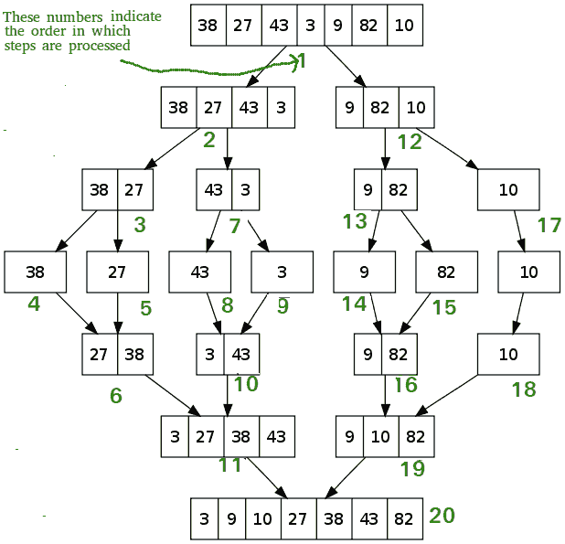

# 快速排序 vs 合并排序

> 原文:[https://www.geeksforgeeks.org/quick-sort-vs-merge-sort/](https://www.geeksforgeeks.org/quick-sort-vs-merge-sort/)

**Prerequisite** :[Merge Sort](https://www.geeksforgeeks.org/merge-sort/) and [Quick Sort](https://www.geeksforgeeks.org/quick-sort/)

**快速排序**是基于分治策略的内部算法。在这方面:

*   元素数组被重复划分为多个部分，直到无法进一步划分为止。
*   又称**“分区交换排序”**。
*   它使用一个关键元素(pivot)来划分元素。
*   一个左分区包含所有小于轴心的元素，一个右分区包含所有大于关键元素的元素。

**[归并排序](https://www.geeksforgeeks.org/merge-sort/)** 是一种外部算法，基于分治策略。在这方面:

*   这些元素被一次又一次地分成两个子阵列(n/2)，直到只剩下一个元素。
*   合并排序使用额外的存储空间对辅助数组进行排序。
*   合并排序使用三个数组，其中两个用于存储每一半，第三个外部数组用于通过合并其他两个数组来存储最终的排序列表，然后每个数组被递归排序。
*   最后，合并所有子数组，使其成为数组的 n 个元素大小。

### 快速排序与合并排序

1.  **数组中元素的划分** :
    在合并排序中，数组被分成两部分(即 n/2)。
    而
    在快速排序的情况下，数组被分成任意比例。在快速排序中，没有必要将元素数组分成相等的部分。
2.  **最坏情况复杂度** :
    快速排序的最坏情况复杂度为 O(n2)，因为在最坏的情况下需要大量的比较。
    而
    在合并排序中，最坏情况和平均情况具有相同的复杂度 O(n log n)。
3.  **数据集的用法** :
    合并排序可以在任何类型的数据集上很好地工作，而不管其大小(大或小)。
    而
    快速排序不能很好地处理大数据集。
4.  **额外存储空间要求** :
    合并排序不到位，因为它需要额外的内存空间来存储辅助数组。
    而
    快速分类已经到位，因为它不需要任何额外的存储。
5.  **效率** :
    在更大的数组大小或数据集的情况下，合并排序比快速排序更有效、更快。
    而
    快速排序在数组大小或数据集较小的情况下比合并排序效率更高、速度更快。
6.  **排序方式** :
    快速排序是数据在主存中排序的内部排序方式。
    而
    合并排序是一种外部排序方法，其中要排序的数据不能容纳在内存中，需要辅助内存进行排序。
7.  **稳定性** :
    合并排序是稳定的，因为两个具有相同值的元素在排序的输出中以相同的顺序出现，就像它们在输入的未排序数组中一样。
    而
    快速排序在这种情况下不稳定。但是使用代码中的一些变化可以使它变得稳定。
8.  首选**:
    数组首选快速排序。
    而
    合并排序更适合链表。**
9.  **引用位置** :
    快速排序表现出良好的缓存位置，这使得快速排序比合并排序更快(在许多情况下，如在虚拟内存环境中)。

| 比较的基础 | 快速排序 | 合并排序 |
| --- | --- | --- |
| 

##### Partition of elements in array

 | 元素数组的拆分是任意比例的，不一定要分成两半。 | 在合并排序中，数组被分成两部分(即 n/2)。 |
| 

##### Worst-case complexity

 | O(n2) | 他(波兰) |
| 

##### is very suitable for

 | 它在较小的阵列上运行良好 | 它可以在任何大小的阵列上正常工作 |
| 

##### Execution speed

 | 对于像选择排序等小数据集，它比其他排序算法工作得更快 | 它对任何大小的数据都具有一致的速度 |
| 

##### Additional storage space requirements

 | 较少(就地) | 更多(不在原位) |
| 

##### Efficiency

 | 对于较大的阵列效率低下 | 效率更高 |
| 

##### Classification method

 | 内部的 | 外部的 |
| 

##### Stability

 | 不稳定 | 稳定的 |
| 

##### is preferred for

 | 对于数组 | 对于链接列表 |
| 

##### Reference location

 | 好的 | 贫穷的；贫困的 |