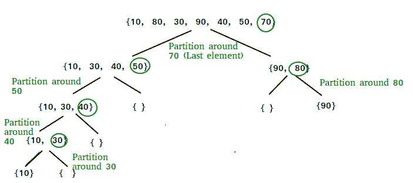
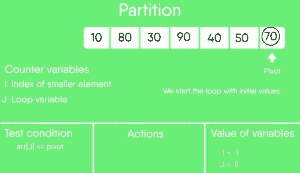
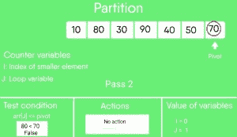
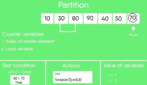
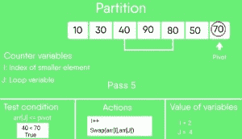
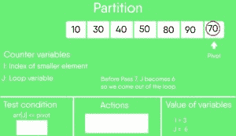
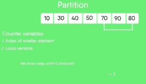
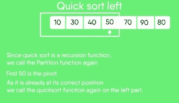
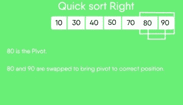

# 快速排序

> 原文:[https://www.geeksforgeeks.org/quick-sort/](https://www.geeksforgeeks.org/quick-sort/)

像[合并排序](https://www.geeksforgeeks.org/merge-sort/)一样，快速排序是一种分治算法。它选取一个元素作为透视，并围绕选取的透视对给定数组进行分区。快速排序有许多不同的版本，它们以不同的方式选取轴心。

1.  始终选择第一个元素作为轴心。
2.  始终选择最后一个元素作为轴心(在下面实现)
3.  选择一个随机元素作为轴心。
4.  选择中线作为枢轴。

快速排序中的关键过程是分区()。分区的目标是，给定一个数组和数组的元素 x 作为轴心，将 x 放在排序数组中正确的位置，将所有较小的元素(小于 x)放在 x 之前，将所有较大的元素(大于 x)放在 x 之后。所有这些都应该在线性时间内完成。

**递归快速排序函数伪代码:**

```
/* low  --> Starting index,  high  --> Ending index */
quickSort(arr[], low, high)
{
    if (low < high)
    {
        /* pi is partitioning index, arr[pi] is now
           at right place */
        pi = partition(arr, low, high);

        quickSort(arr, low, pi - 1);  // Before pi
        quickSort(arr, pi + 1, high); // After pi
    }
}
```



**分区算法**
做分区的方法可以有很多种，下面伪代码采用 CLRS 书中给出的方法。逻辑很简单，我们从最左边的元素开始，跟踪较小(或等于)元素的索引作为 I，遍历时，如果找到较小的元素，我们用 arr[i]交换当前元素。否则我们忽略当前元素。

```
/* low  --> Starting index,  high  --> Ending index */
quickSort(arr[], low, high)
{
    if (low < high)
    {
        /* pi is partitioning index, arr[pi] is now
           at right place */
        pi = partition(arr, low, high);

        quickSort(arr, low, pi - 1);  // Before pi
        quickSort(arr, pi + 1, high); // After pi
    }
}
```

**分区()的伪码**

```
/* This function takes last element as pivot, places
   the pivot element at its correct position in sorted
    array, and places all smaller (smaller than pivot)
   to left of pivot and all greater elements to right
   of pivot */
partition (arr[], low, high)
{
    // pivot (Element to be placed at right position)
    pivot = arr[high];  

    i = (low - 1)  // Index of smaller element and indicates the 
                   // right position of pivot found so far

    for (j = low; j <= high- 1; j++)
    {
        // If current element is smaller than the pivot
        if (arr[j] < pivot)
        {
            i++;    // increment index of smaller element
            swap arr[i] and arr[j]
        }
    }
    swap arr[i + 1] and arr[high])
    return (i + 1)
}
```

**分区()图解:**

```
arr[] = {10, 80, 30, 90, 40, 50, 70}
Indexes:  0   1   2   3   4   5   6 

low = 0, high =  6, pivot = arr[h] = 70
Initialize index of smaller element, i = -1

Traverse elements from j = low to high-1
j = 0 : Since arr[j] <= pivot, do i++ and swap(arr[i], arr[j])
i = 0 
arr[] = {10, 80, 30, 90, 40, 50, 70} // No change as i and j 
                                     // are same

j = 1 : Since arr[j] > pivot, do nothing
// No change in i and arr[]

j = 2 : Since arr[j] <= pivot, do i++ and swap(arr[i], arr[j])
i = 1
arr[] = {10, 30, 80, 90, 40, 50, 70} // We swap 80 and 30 

j = 3 : Since arr[j] > pivot, do nothing
// No change in i and arr[]

j = 4 : Since arr[j] <= pivot, do i++ and swap(arr[i], arr[j])
i = 2
arr[] = {10, 30, 40, 90, 80, 50, 70} // 80 and 40 Swapped
j = 5 : Since arr[j] <= pivot, do i++ and swap arr[i] with arr[j] 
i = 3 
arr[] = {10, 30, 40, 50, 80, 90, 70} // 90 and 50 Swapped 

We come out of loop because j is now equal to high-1.
Finally we place pivot at correct position by swapping
arr[i+1] and arr[high] (or pivot) 
arr[] = {10, 30, 40, 50, 70, 90, 80} // 80 and 70 Swapped 

Now 70 is at its correct place. All elements smaller than
70 are before it and all elements greater than 70 are after
it.
```

**实现:**
以下是快速排序的实现:

## C++14

```
/* C++ implementation of QuickSort */
#include <bits/stdc++.h>
using namespace std; 

// A utility function to swap two elements 
void swap(int* a, int* b) 
{ 
    int t = *a; 
    *a = *b; 
    *b = t; 
} 

/* This function takes last element as pivot, places 
the pivot element at its correct position in sorted 
array, and places all smaller (smaller than pivot) 
to left of pivot and all greater elements to right 
of pivot */
int partition (int arr[], int low, int high) 
{ 
    int pivot = arr[high]; // pivot 
    int i = (low - 1); // Index of smaller element and indicates the right position of pivot found so far

    for (int j = low; j <= high - 1; j++) 
    { 
        // If current element is smaller than the pivot 
        if (arr[j] < pivot) 
        { 
            i++; // increment index of smaller element 
            swap(&arr[i], &arr[j]); 
        } 
    } 
    swap(&arr[i + 1], &arr[high]); 
    return (i + 1); 
} 

/* The main function that implements QuickSort 
arr[] --> Array to be sorted, 
low --> Starting index, 
high --> Ending index */
void quickSort(int arr[], int low, int high) 
{ 
    if (low < high) 
    { 
        /* pi is partitioning index, arr[p] is now 
        at right place */
        int pi = partition(arr, low, high); 

        // Separately sort elements before 
        // partition and after partition 
        quickSort(arr, low, pi - 1); 
        quickSort(arr, pi + 1, high); 
    } 
} 

/* Function to print an array */
void printArray(int arr[], int size) 
{ 
    int i; 
    for (i = 0; i < size; i++) 
        cout << arr[i] << " "; 
    cout << endl; 
} 

// Driver Code
int main() 
{ 
    int arr[] = {10, 7, 8, 9, 1, 5}; 
    int n = sizeof(arr) / sizeof(arr[0]); 
    quickSort(arr, 0, n - 1); 
    cout << "Sorted array: \n"; 
    printArray(arr, n); 
    return 0; 
} 

// This code is contributed by rathbhupendra
```

## Java 语言(一种计算机语言，尤用于创建网站)

```
// Java implementation of QuickSort 
import java.io.*;

class GFG{

// A utility function to swap two elements
static void swap(int[] arr, int i, int j)
{
    int temp = arr[i];
    arr[i] = arr[j];
    arr[j] = temp;
}

/* This function takes last element as pivot, places
   the pivot element at its correct position in sorted
   array, and places all smaller (smaller than pivot)
   to left of pivot and all greater elements to right
   of pivot */
static int partition(int[] arr, int low, int high)
{

    // pivot
    int pivot = arr[high]; 

    // Index of smaller element and
    // indicates the right position
    // of pivot found so far
    int i = (low - 1); 

    for(int j = low; j <= high - 1; j++)
    {

        // If current element is smaller 
        // than the pivot
        if (arr[j] < pivot) 
        {

            // Increment index of 
            // smaller element
            i++; 
            swap(arr, i, j);
        }
    }
    swap(arr, i + 1, high);
    return (i + 1);
}

/* The main function that implements QuickSort
          arr[] --> Array to be sorted,
          low --> Starting index,
          high --> Ending index
 */
static void quickSort(int[] arr, int low, int high)
{
    if (low < high) 
    {

        // pi is partitioning index, arr[p]
        // is now at right place 
        int pi = partition(arr, low, high);

        // Separately sort elements before
        // partition and after partition
        quickSort(arr, low, pi - 1);
        quickSort(arr, pi + 1, high);
    }
}

// Function to print an array 
static void printArray(int[] arr, int size)
{
    for(int i = 0; i < size; i++)
        System.out.print(arr[i] + " ");

    System.out.println();
}

// Driver Code
public static void main(String[] args)
{
    int[] arr = { 10, 7, 8, 9, 1, 5 };
    int n = arr.length;

    quickSort(arr, 0, n - 1);
    System.out.println("Sorted array: ");
    printArray(arr, n);
}
}

// This code is contributed by Ayush Choudhary
```

## 蟒蛇 3

```
# Python3 implementation of QuickSort  

# This Function handles sorting part of quick sort
# start and end points to first and last element of
# an array respectively
def partition(start, end, array):

    # Initializing pivot's index to start
    pivot_index = start 
    pivot = array[pivot_index]

    # This loop runs till start pointer crosses 
    # end pointer, and when it does we swap the
    # pivot with element on end pointer
    while start < end:

        # Increment the start pointer till it finds an 
        # element greater than  pivot 
        while start < len(array) and array[start] <= pivot:
            start += 1

        # Decrement the end pointer till it finds an 
        # element less than pivot
        while array[end] > pivot:
            end -= 1

        # If start and end have not crossed each other, 
        # swap the numbers on start and end
        if(start < end):
            array[start], array[end] = array[end], array[start]

    # Swap pivot element with element on end pointer.
    # This puts pivot on its correct sorted place.
    array[end], array[pivot_index] = array[pivot_index], array[end]

    # Returning end pointer to divide the array into 2
    return end

# The main function that implements QuickSort 
def quick_sort(start, end, array):

    if (start < end):

        # p is partitioning index, array[p] 
        # is at right place
        p = partition(start, end, array)

        # Sort elements before partition 
        # and after partition
        quick_sort(start, p - 1, array)
        quick_sort(p + 1, end, array)

# Driver code
array = [ 10, 7, 8, 9, 1, 5 ]
quick_sort(0, len(array) - 1, array)

print(f'Sorted array: {array}')

# This code is contributed by Adnan Aliakbar
```

**Output**

```
Sorted array: 
1 5 7 8 9 10 
```

**分析快速排序**
快速排序所花费的时间，一般可以写成如下。

```
 T(n) = T(k) + T(n-k-1) + (n)
```

前两项用于两次递归调用，最后一项用于分区过程。k 是小于 pivot 的元素数。
快速排序花费的时间取决于输入数组和分区策略。以下是三个案例。

***最差情况:*** 最差情况发生在分区过程总是选取最大或最小的元素作为轴心的时候。如果我们考虑上面的分区策略，其中最后一个元素总是被选作轴心，那么当数组已经按照递增或递减的顺序排序时，最坏的情况就会发生。以下是最坏情况下的重现。

```
 T(n) = T(0) + T(n-1) + (n)
which is equivalent to  
T(n) = T(n-1) + (n)
```

上述复发的解决方案为 (n <sup>2</sup> )。

***最佳情况:*** 最佳情况发生在分区过程总是选取中间元素作为枢轴的时候。以下是最佳情况下的重现。

```
 T(n) = 2T(n/2) + (n)
```

上述递推的解是 (nLogn)。使用[主定理](http://en.wikipedia.org/wiki/Master_theorem)的案例 2 可以解决。

***平均格:***
要做平均格分析，我们需要[考虑数组所有可能的排列，计算每一个看起来不容易的排列所花费的时间](https://www.geeksforgeeks.org/analysis-of-algorithms-set-2-asymptotic-analysis/)。
通过考虑分区将 O(n/9)个元素放在一个集合中，将 O(9n/10)个元素放在另一个集合中的情况，我们可以得到平均情况的想法。以下是此案例的重现。

```
 T(n) = T(n/9) + T(9n/10) + (n)
```

上述递归的解决方案也是 O(nLogn)
虽然快速排序的最坏情况时间复杂度是 O(n <sup>2</sup> )，比很多其他排序算法如[合并排序](https://www.geeksforgeeks.org/merge-sort/)和[堆排序](https://www.geeksforgeeks.org/heap-sort/)都要多，但快速排序在实际中更快，因为它的内部循环可以在大多数架构上，以及在大多数现实数据中高效实现。快速排序可以通过改变数据透视表的选择以不同的方式实现，因此对于给定的数据类型，最坏的情况很少发生。然而，当数据很大并且存储在外部存储器中时，通常认为合并排序更好。

**是[快速通道](https://www.geeksforgeeks.org/stability-in-sorting-algorithms/)**还是稳定通道 T6？
默认实现不稳定。然而，通过将索引作为比较参数，任何排序算法都可以变得稳定。

**是快速排序** [**到位**](https://www.geeksforgeeks.org/in-place-algorithm/) **吗？**
根据就地算法的广义定义，它属于就地排序算法，因为它只使用额外的空间来存储递归函数调用，而不用于操作输入。

**什么是 3 路快速排序？**
在简单的快速排序算法中，我们选择一个元素作为轴心，围绕轴心对数组进行分区，并对轴心左右的子数组进行递归。
考虑一个有许多冗余元素的阵列。例如，{1，4，2，4，2，4，1，2，4，1，2，2，2，2，4，1，4，4，4}。如果在简单快速排序中选择 4 作为轴心，我们只修复一个 4，并递归处理剩余的事件。在 3 路快速排序中，一个数组 arr[l..分为 3 个部分:
a)arr【l..i]小于枢轴的元素。
b) arr[i+1..j-1]等于枢轴的元素。
c) arr[j..r]大于枢轴的元素。
执行参见[本](https://www.geeksforgeeks.org/3-way-quicksort/)。

**如何实现链表快速排序？**
[在单链表上快速排序](https://www.geeksforgeeks.org/quicksort-on-singly-linked-list/)
[在双链表上快速排序](https://www.geeksforgeeks.org/quicksort-for-linked-list/)

**我们可以迭代实现快速排序吗？**
可以，请参考[迭代快速排序](https://www.geeksforgeeks.org/iterative-quick-sort/)。

**为什么快速排序比合并排序更适合排序数组**
快速排序的一般形式是就地排序(即不需要任何额外的存储空间)，而合并排序需要 O(N)个额外的存储空间，N 表示可能相当昂贵的数组大小。分配和取消分配用于合并排序的额外空间会增加算法的运行时间。比较平均复杂度，我们发现两种类型的排序都有平均复杂度，但是常数不同。对于数组，合并排序会因使用额外的存储空间而丢失。
快速排序的大多数实际实现使用随机化版本。随机化版本的时间复杂度预计为 0(nLogn)。在随机化版本中，最坏的情况也是可能的，但最坏的情况不会出现在特定的模式(如排序数组)中，随机化快速排序在实践中效果很好。
快速排序也是一种缓存友好的排序算法，因为它在用于数组时具有良好的引用局部性。
快速排序也是尾部递归，因此尾部调用优化完成。

**为什么链表优先选择合并排序而不是快速排序？**
在链表的情况下，情况不同主要是由于数组和链表的内存分配不同。与数组不同，链表节点在内存中可能不相邻。与数组不同，在链表中，我们可以在 O(1)的额外空间和 O(1)的时间里在中间插入项目。因此，合并排序的合并操作可以在没有额外的链表空间的情况下实现。
在数组中，我们可以进行随机访问，因为元素在内存中是连续的。假设我们有一个整数(4 字节)数组 A，让 A[0]的地址为 x，那么要访问 A[i]，我们可以直接访问(x + i*4)处的内存。与数组不同，我们不能在链表中进行随机访问。快速排序需要大量这种访问。在链表中，为了访问第 I 个索引，我们必须将每个节点从头到尾遍历一遍，因为我们没有连续的内存块。因此，快速排序的开销会增加。合并排序按顺序访问数据，随机访问的需求很低。

**如何优化快速排序，使其在最坏的情况下占用 O(Log n)个额外空间？**
请参见[快速排序尾呼优化(将最坏情况空间减少到日志 n )](https://www.geeksforgeeks.org/quicksort-tail-call-optimization-reducing-worst-case-space-log-n/)

**快照:**

 

     

*   [快速排序测验](https://www.geeksforgeeks.org/quiz-quicksort-gq/)
*   [最近关于快速排序的文章](https://www.geeksforgeeks.org/tag/quick-sort/)
*   [排序的编码练习。](https://practice.geeksforgeeks.org/tag-page.php?tag=sorting&isCmp=0)

**参考资料:**
[http://en . Wikipedia . org/wiki/quick port](http://en.wikipedia.org/wiki/Quicksort)

**geek forgeeks/geek squiz 上的其他排序算法:**
[选择排序](https://www.geeksforgeeks.org/selection-sort/)、[冒泡排序](https://www.geeksforgeeks.org/bubble-sort/)、[插入排序](https://www.geeksforgeeks.org/insertion-sort/)、[合并排序](https://www.geeksforgeeks.org/merge-sort/)、[堆排序](https://www.geeksforgeeks.org/heap-sort/)、[快速排序](https://www.geeksforgeeks.org/quick-sort/)、[基数排序](https://www.geeksforgeeks.org/radix-sort/)、[计数排序](https://www.geeksforgeeks.org/counting-sort/)、[桶排序](https://www.geeksforgeeks.org/bucket-sort-2/)、[壳排序](https://www.geeksforgeeks.org/shellsort/)、【