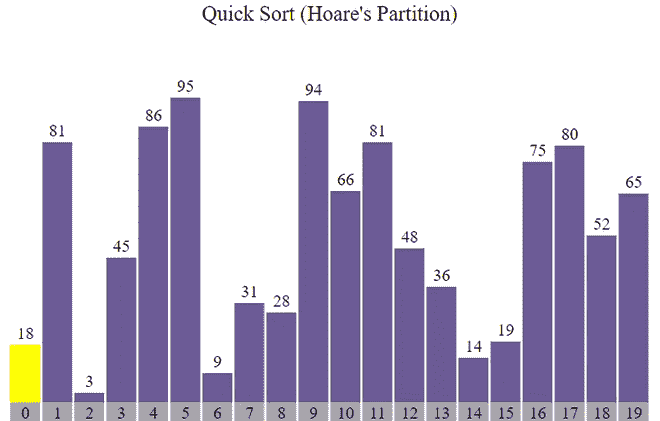
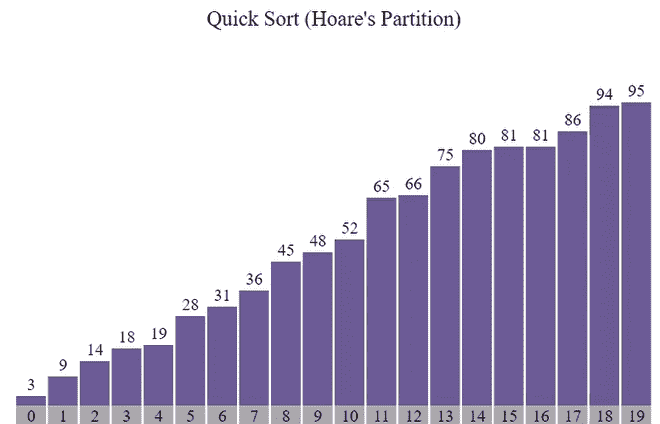
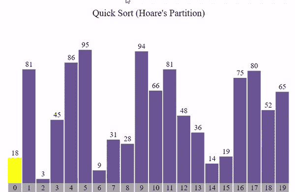

# 使用 JavaScript 快速排序(霍尔分区)可视化

> 原文:[https://www . geesforgeks . org/quick-sort hoares-partition-visualization-use-JavaScript/](https://www.geeksforgeeks.org/quick-sorthoares-partition-visualization-using-javascript/)

<video class="wp-video-shortcode" id="video-563421-1" width="665" height="435" preload="metadata" controls=""><source type="video/mp4" src="https://media.geeksforgeeks.org/wp-content/cdn-uploads/20210225121659/hoare.mp4?_=1">[https://media.geeksforgeeks.org/wp-content/cdn-uploads/20210225121659/hoare.mp4](https://media.geeksforgeeks.org/wp-content/cdn-uploads/20210225121659/hoare.mp4)</video>

**GUI(图形用户界面)**比程序更有助于理解。在本文中，我们将使用 JavaScript 可视化快速排序。我们将看到数组如何被分成两部分，以及我们如何得到最终的排序数组。我们还将可视化快速排序的时间复杂性。

**参考:**

*   [快速排序](https://www.geeksforgeeks.org/quick-sort/)
*   [霍尔分区](https://www.geeksforgeeks.org/hoares-vs-lomuto-partition-scheme-quicksort/)
*   [JavaScript 中的异步函数](https://www.geeksforgeeks.org/how-to-create-an-asynchronous-function-in-javascript/)

**进场:**

*   首先，我们将使用 [Math.random()](https://www.geeksforgeeks.org/javascript-math-random-method/) 函数生成一个随机数组。
*   不同的颜色用来表示哪些元素是**比较的，左分区和右分区**。
*   由于算法的运算速度非常快， [setTimeout()](https://www.geeksforgeeks.org/java-script-settimeout-setinterval-method/) 功能被用来减缓进程。
*   按**“Ctrl+R”**键可生成新数组。
*   使用 **hoare_partition()** 功能，使用**快速排序()**功能执行排序

**示例:**



排序前



排序后

下面是可视化[快速排序](https://www.geeksforgeeks.org/quick-sort/)算法的程序。

## index.html

```
<!DOCTYPE html>
<html lang="en">

<head>
    <link rel="stylesheet" href="style.css" />
</head>

<body>
    <br />
    <p class="header">Quick Sort (Hoare's Partition)</p>

    <div id="array"></div>
    <div id="count"></div>
    <br />
    <h2 class="range" style="text-align: center"></h2>

    <script src="script.js"></script>
</body>

</html>
```

## style.css

```
* {
    margin: 0px;
    padding: 0px;
    box-sizing: border-box;
}

.header {
    font-size: 20px;
    text-align: center;
}

#array {
    background-color: white;
    height: 288px;
    width: 598px;
    margin: auto;
    position: relative;
    margin-top: 64px;
}

.block {
    width: 28px;
    background-color: #6b5b95;
    position: absolute;
    bottom: 0px;
    transition: 0.2s all ease;
}

.block_id {
    position: absolute;
    color: black;
    margin-top: -20px;
    width: 100%;
    text-align: center;
}

.block_id2 {
    position: absolute;
    color: black;
    margin-top: 22px;
    width: 100%;
    text-align: center;
}

.block2 {
    width: 28px;
    background-color: darkgray;
    position: absolute;
    transition: 0.2s all ease;
}

.block_id3 {
    position: absolute;
    color: black;
    margin-top: 1px;
    width: 100%;
    text-align: center;
}

#count {
    height: 20px;
    width: 598px;
    margin: auto;
}
```

## script.js

```
var container = document.getElementById("array");

// Function to generate the array of blocks
function generatearray() {
    for (var i = 0; i < 20; i++) {
        // Return a value from 1 to 100 (both inclusive)
        var value = Math.ceil(Math.random() * 100);

        // Creating element div
        var array_ele = document.createElement("div");

        // Adding class 'block' to div
        array_ele.classList.add("block");

        // Adding style to div
        array_ele.style.height =
        `${value * 3}px`;
        array_ele.style.transform = 
        `translate(${i * 30}px)`;

        // Creating label element for displaying
        // size of particular block
        var array_ele_label = 
        document.createElement("label");
        array_ele_label.classList.add("block_id");
        array_ele_label.innerText = value;

        // Appending created elements to index.html
        array_ele.appendChild(array_ele_label);
        container.appendChild(array_ele);
    }
}

// Function to generate indexes
var count_container = document.getElementById("count");

function generate_idx() {
    for (var i = 0; i < 20; i++) {
        // Creating element div
        var array_ele2 = document.createElement("div");

        // Adding class 'block2' to div
        array_ele2.classList.add("block2");

        // Adding style to div
        array_ele2.style.height =
        `${20}px`;
        array_ele2.style.transform =
        `translate(${i * 30}px)`;

        //adding indexes
        var array_ele_label2 = 
        document.createElement("label");
        array_ele_label2.classList.add("block_id3");
        array_ele_label2.innerText = i;

        // Appending created elements to index.html
        array_ele2.appendChild(array_ele_label2);
        count_container.appendChild(array_ele2);
    }
}

async function hoare_partition(l, r, delay = 700) {
    var blocks = 
    document.querySelectorAll(".block");
    var pivot = 
    Number(blocks[l].childNodes[0].innerHTML);

    var i = l - 1;
    var j = r + 1;

    while (true) {
        // Find leftmost element greater than
        // or equal to pivot
        do {
            i++;
            if (i - 1 >= l) blocks[i - 1].style.backgroundColor = "red";
            blocks[i].style.backgroundColor = "yellow";
            //To wait for 700 milliseconds
            await new Promise((resolve) =>
                setTimeout(() => {
                    resolve();
                }, delay)
            );
        } while (Number(blocks[i].childNodes[0].innerHTML) < pivot);

        // Find rightmost element smaller than
        // or equal to pivot
        do {
            j--;
            if (j + 1 <= r) blocks[j + 1].style.backgroundColor = "green";
            blocks[j].style.backgroundColor = "yellow";
            //To wait for 700 milliseconds
            await new Promise((resolve) =>
                setTimeout(() => {
                    resolve();
                }, delay)
            );
        } while (Number(blocks[j].childNodes[0].innerHTML) > pivot);

        // If two pointers met.
        if (i >= j) {
            for (var k = 0; k < 20; k++) blocks[k].style.backgroundColor = "#6b5b95";
            return j;
        }

        //swapping ith and jth element
        var temp1 = blocks[i].style.height;
        var temp2 = blocks[i].childNodes[0].innerText;
        blocks[i].style.height = blocks[j].style.height;
        blocks[j].style.height = temp1;
        blocks[i].childNodes[0].innerText = blocks[j].childNodes[0].innerText;
        blocks[j].childNodes[0].innerText = temp2;
        //To wait for 700 milliseconds
        await new Promise((resolve) =>
            setTimeout(() => {
                resolve();
            }, delay)
        );
    }
}

// Asynchronous QuickSort function
async function QuickSort(l, r, delay = 100) {
    // QuickSort Algorithm
    if (l < r) {
        //Storing the index of pivot element after partition
        var pivot_idx = await hoare_partition(l, r);
        //Recursively calling quicksort for left partition
        await QuickSort(l, pivot_idx);
        //Recursively calling quicksort for right partition
        await QuickSort(pivot_idx + 1, r);
    }
}

// Calling generatearray function
generatearray();

// Calling generate_idx function
generate_idx();

// Calling QuickSort function
QuickSort(0, 19);
```

**输出:**

