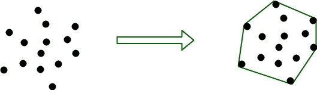

# 凸包的快速壳算法

> 原文:[https://www . geesforgeks . org/quick hull-算法-凸包/](https://www.geeksforgeeks.org/quickhull-algorithm-convex-hull/)

给定一组点，凸包是包含所有给定点的最小凸多边形。

[](https://media.geeksforgeeks.org/wp-content/uploads/convexHull.jpg)

输入是由 x 和 y 坐标指定的点的数组。输出是以 x 坐标升序排列的这组点的凸包。

示例:

```
Input : points[] = {{0, 3}, {1, 1}, {2, 2}, {4, 4},
                    {0, 0}, {1, 2}, {3, 1}, {3, 3}};
Output :  The points in convex hull are:
          (0, 0) (0, 3) (3, 1) (4, 4)

Input : points[] = {{0, 3}, {1, 1}
Output : Not Possible
There must be at least three points to form a hull.

Input  : points[] = {(0, 0), (0, 4), (-4, 0), (5, 0), 
                     (0, -6), (1, 0)};
Output : (-4, 0), (5, 0), (0, -6), (0, 4)

```

我们讨论了凸包问题的以下算法。
[凸包|集 1(贾维斯算法或包装)](https://www.geeksforgeeks.org/convex-hull-set-1-jarviss-algorithm-or-wrapping/)
[凸包|集 2(格雷厄姆扫描)](https://www.geeksforgeeks.org/convex-hull-set-2-graham-scan/)

快速外壳算法是一种类似于[快速排序](https://www.geeksforgeeks.org/quick-sort/)的分治算法。设 a[0…n-1]为输入点数组。以下是寻找这些点的凸包的步骤。

1.  找到 x 坐标最小的点，比如说，min_x，同样找到 x 坐标最大的点，max_x。
2.  把这两点连成一条线，说 **L** 。这条线将把整套分为两部分。把这两部分一个接一个地拿出来，然后继续。
3.  对于一个零件，求距直线 l 距离最大的点 P，P 与点 min_x，max_x 形成一个三角形，很明显，驻留在这个三角形内部的点永远不可能是凸包的一部分。
4.  以上步骤将问题分为两个子问题(递归求解)。现在连接点 P 和 min_x 的线和连接点 P 和 max_x 的线是新的线，位于三角形外部的点是点集。重复第 3 点，直到直线上没有剩余的点。将该点的端点添加到凸包中。

下面是上述思想的 C++实现。实现使用[设置](https://www.geeksforgeeks.org/set-in-cpp-stl/)存储点数，这样就可以按排序顺序打印点数。一个点表示为一对。

```
// C++ program to implement Quick Hull algorithm
// to find convex hull.
#include<bits/stdc++.h>
using namespace std;

// iPair is integer pairs
#define iPair pair<int, int>

// Stores the result (points of convex hull)
set<iPair> hull;

// Returns the side of point p with respect to line
// joining points p1 and p2.
int findSide(iPair p1, iPair p2, iPair p)
{
    int val = (p.second - p1.second) * (p2.first - p1.first) -
              (p2.second - p1.second) * (p.first - p1.first);

    if (val > 0)
        return 1;
    if (val < 0)
        return -1;
    return 0;
}

// returns a value proportional to the distance
// between the point p and the line joining the
// points p1 and p2
int lineDist(iPair p1, iPair p2, iPair p)
{
    return abs ((p.second - p1.second) * (p2.first - p1.first) -
               (p2.second - p1.second) * (p.first - p1.first));
}

// End points of line L are p1 and p2.  side can have value
// 1 or -1 specifying each of the parts made by the line L
void quickHull(iPair a[], int n, iPair p1, iPair p2, int side)
{
    int ind = -1;
    int max_dist = 0;

    // finding the point with maximum distance
    // from L and also on the specified side of L.
    for (int i=0; i<n; i++)
    {
        int temp = lineDist(p1, p2, a[i]);
        if (findSide(p1, p2, a[i]) == side && temp > max_dist)
        {
            ind = i;
            max_dist = temp;
        }
    }

    // If no point is found, add the end points
    // of L to the convex hull.
    if (ind == -1)
    {
        hull.insert(p1);
        hull.insert(p2);
        return;
    }

    // Recur for the two parts divided by a[ind]
    quickHull(a, n, a[ind], p1, -findSide(a[ind], p1, p2));
    quickHull(a, n, a[ind], p2, -findSide(a[ind], p2, p1));
}

void printHull(iPair a[], int n)
{
    // a[i].second -> y-coordinate of the ith point
    if (n < 3)
    {
        cout << "Convex hull not possible\n";
        return;
    }

    // Finding the point with minimum and
    // maximum x-coordinate
    int min_x = 0, max_x = 0;
    for (int i=1; i<n; i++)
    {
        if (a[i].first < a[min_x].first)
            min_x = i;
        if (a[i].first > a[max_x].first)
            max_x = i;
    }

    // Recursively find convex hull points on
    // one side of line joining a[min_x] and
    // a[max_x]
    quickHull(a, n, a[min_x], a[max_x], 1);

    // Recursively find convex hull points on
    // other side of line joining a[min_x] and
    // a[max_x]
    quickHull(a, n, a[min_x], a[max_x], -1);

    cout << "The points in Convex Hull are:\n";
    while (!hull.empty())
    {
        cout << "(" <<( *hull.begin()).first << ", "
             << (*hull.begin()).second << ") ";
        hull.erase(hull.begin());
    }
}

// Driver code
int main()
{
    iPair a[] = {{0, 3}, {1, 1}, {2, 2}, {4, 4},
               {0, 0}, {1, 2}, {3, 1}, {3, 3}};
    int n = sizeof(a)/sizeof(a[0]);
    printHull(a, n);
    return 0;
}
```

输入:

```
The points in Convex Hull are:
(0, 0) (0, 3) (3, 1) (4, 4) 

```

**时间复杂度:**分析类似快速排序。平均来说，我们得到的时间复杂度为 O(n Log n)，但在最坏的情况下，它可能变成 O(n <sup>2</sup>

本文由**阿姆利则雅格尼**供稿。如果你喜欢 GeeksforGeeks 并想投稿，你也可以使用[write.geeksforgeeks.org](https://write.geeksforgeeks.org)写一篇文章或者把你的文章邮寄到 review-team@geeksforgeeks.org。看到你的文章出现在极客博客主页上，帮助其他极客。

如果你发现任何不正确的地方，或者你想分享更多关于上面讨论的话题的信息，请写评论。