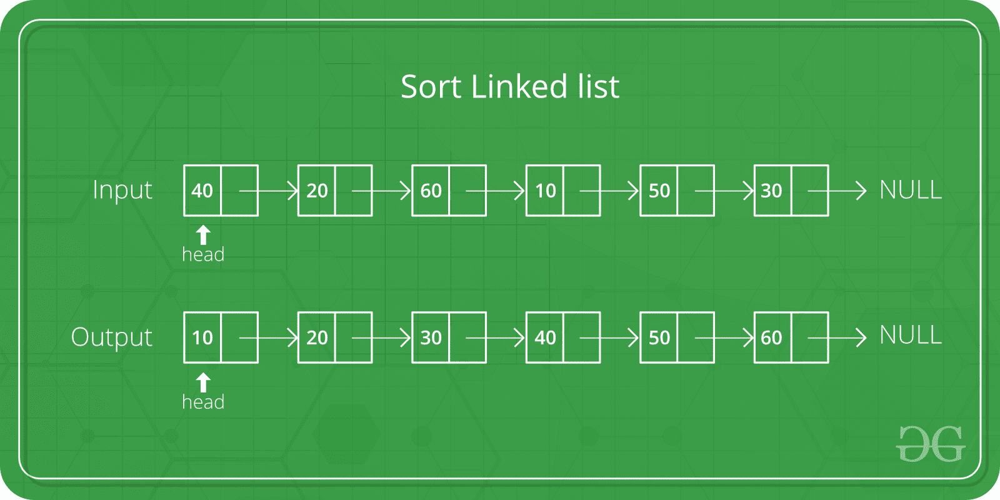

# 为什么快速排序比合并排序好？

> 原文:[https://www.geeksforgeeks.org/quicksort-better-mergesort/](https://www.geeksforgeeks.org/quicksort-better-mergesort/)

这是 DS 采访中常见的问题，尽管 mergesort 的最坏情况表现更好，但 [quicksort](https://www.geeksforgeeks.org/quick-sort/) 被认为比 [mergesort](https://www.geeksforgeeks.org/merge-sort/) 更好。由于某些原因，快速排序更好，尤其是在阵列的情况下:

1.  **辅助空间:** Mergesort 使用额外的空间，快速排序需要的空间很少，并且展现出良好的缓存局部性。快速排序是一种就地排序算法。就地排序意味着不需要额外的存储空间来执行排序。合并排序需要一个临时数组来合并排序后的数组，因此它不在适当的位置，从而使快速排序具有空间优势。
2.  **最差情况:**使用随机快速排序可以避免快速排序 **O(n 2 )** 的最差情况。选择正确的支点，很容易避免。通过选择正确的透视元素获得平均案例行为，使其即兴发挥性能，变得像合并排序一样高效。
3.  **引用的局部性:**快速排序尤其表现出良好的缓存局部性，这使得它在许多情况下比合并排序更快，比如在虚拟内存环境中。
4.  **合并排序更适合大数据结构:**合并排序是一种稳定的排序，不同于快速排序和堆排序，可以很容易地适应对存储在磁盘存储或网络连接存储等访问速度慢的介质上的链表和超大型列表进行操作。详见[本](https://www.geeksforgeeks.org/why-quick-sort-preferred-for-arrays-and-merge-sort-for-linked-lists/)

C++ STL 中的 **std::sort()** 函数是一种混合排序算法，提供了 **O(nlogn)** 的平均和最坏情况时间复杂度。它使用的排序算法被称为 Introsort。

**Introsort** 是 quicksort 和 heapsort 的组合，它以 quicksort 开始，如果递归深度超过基于被排序元素数量的级别，则切换到 heapsort。

**相关文章:** [为什么数组优先选择快速排序，链表优先选择合并排序？](https://www.geeksforgeeks.org/why-quick-sort-preferred-for-arrays-and-merge-sort-for-linked-lists/)

本文由 [**曼德普·辛格**](https://github.com/msdeep14) 供稿。如果你喜欢 GeeksforGeeks 并想投稿，你也可以使用[write.geeksforgeeks.org](https://write.geeksforgeeks.org)写一篇文章或者把你的文章邮寄到 review-team@geeksforgeeks.org。看到你的文章出现在极客博客主页上，帮助其他极客。

如果你发现任何不正确的地方，或者你想分享更多关于上面讨论的话题的信息，请写评论。