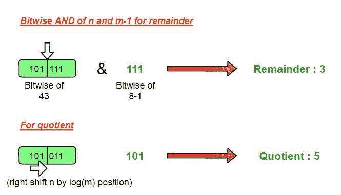

# 商和余数除以 2^k(2 的幂)

> 原文:[https://www . geesforgeks . org/商-余数-除-2k-幂-2/](https://www.geeksforgeeks.org/quotient-remainder-dividing-2k-power-2/)

给你一个正整数 n 作为被除数和另一个数 m(2^k 的形式)，你必须在不执行实际除法的情况下找到商和余数。
示例:

```
Input : n = 43, m = 8
Output : Quotient = 5, Remainder = 3

Input : n = 58, m = 16
Output : Quotient = 3, Remainder = 10
```

在本文中，我们使用一个数的按位表示来理解任何数除以 2^k.形式的除数的作用。所有 2 的幂的数在其表示中只包括 1 组位，我们将使用这个性质。
为了求余数，我们将取被除数(n)和除数减 1 (m-1)的逻辑“与”，这将只把被除数的设定位赋予除数的设定位，在这种情况下，除数是我们的实际余数。
此外，被除数的左边部分(从除数中设置位的位置)将被考虑用于商。因此，从被除数(n)中，从除数的设置位位置移除所有的位将产生商，并且将被除数 log2(m)次右移将完成求商的工作。

*   **余数= n & (m-1)**
*   **商= (n > > log2(m) )**

注:Log2(m)将给出 m 的二进制表示中的位数



## C++

```
// CPP to find remainder and quotient
#include<bits/stdc++.h>
using namespace std;

// function to print remainder and quotient
void divide(int n,int m)
{
    // print Remainder by
    // n AND (m-1)
    cout <<"Remainder = " << ((n) &(m-1));

    // print quotient by
    // right shifting n by (log2(m)) times
    cout <<"\nQuotient = " <<(n >> (int)(log2(m)));

}

// driver program
int main()
{
    int n = 43, m = 8;
    divide(n, m);
    return 0;
}
```

## Java 语言(一种计算机语言，尤用于创建网站)

```
// Java to find remainder and quotient
import java.io.*;

public class GFG {

    // function to print remainder and
    // quotient
    static void divide(int n, int m)
    {

        // print Remainder by
        // n AND (m-1)
        System.out.println("Remainder = "
                        + ((n) &(m-1)));

        // print quotient by right shifting
        // n by (log2(m)) times
        System.out.println("Quotient = "
            + (n >> (int)(Math.log(m) / Math.log(2))));
    }

    // driver program
    static public void main (String[] args)
    {
        int n = 43, m = 8;

        divide(n, m);
    }
}

// This code is contributed by vt_m.
```

## 蟒蛇 3

```
# Python 3 to find remainder and
# quotient
import math
# function to print remainder and
# quotient
def divide(n, m):

    # print Remainder by
    # n AND (m-1)
    print("Remainder = ",
                  ((n) &(m-1)))

    # print quotient by
    # right shifting n by
    # (log2(m)) times
    print("Quotient = " ,(n >>
          (int)(math.log2(m))))

# driver program
n = 43
m = 8
divide(n, m)

# This code is contributed by
# Smitha
```

## C#

```
// C# to find remainder and quotient
using System;

public class GFG
{
    // function to print remainder and quotient
    static void divide(int n,int m)
    {
        // print Remainder by
        // n AND (m-1)
        Console.WriteLine("Remainder = " +((n) & (m - 1)));

        // print quotient by
        // right shifting n by (log2(m)) times
        Console.WriteLine("Quotient = "
                           + (n >> (int)(Math.Log(m))));

    }

    // Driver program
    static public void Main ()
    {
        int n = 43, m = 8;
        divide(n, m);

    }
}

// This code is contributed by vt_m.
```

## 服务器端编程语言（Professional Hypertext Preprocessor 的缩写）

```
<?php
// PHP Code to find remainder
// and quotient

// function to print remainder
// and quotient
function divide($n,$m)
{

    // print Remainder by
    // n AND (m-1)
    echo "Remainder = ". (($n) &($m - 1));

    // print quotient by
    // right shifting n by
    // (log(m,2)) times 2
    // is base
    echo "\nQuotient = ".($n >> (int)(log($m, 2)));

}

    // Driver Code
    $n = 43;
    $m = 8;
    divide($n, $m);

//This code is contributed by mits
?>
```

## java 描述语言

```
<script>
// javascript program to find last index
// of character x in given string.

    // function to print remainder and
    // quotient
    function divide(n, m)
    {

        // print Remainder by
        // n AND (m-1)
        document.write("Remainder = "
                        + ((n) &(m-1)) + "<br/>");

        // print quotient by right shifting
        // n by (log2(m)) times
        document.write("Quotient = "
            + (n >> (Math.log(m) / Math.log(2))));
    }

// Driver code
    let n = 43, m = 8;
        divide(n, m);

    // This code is contributed by sanjoy_62.
</script>
```

输出:

```
Remainder = 3
Quotient = 5
```

**时间复杂度:O(1)**
**辅助空间:O(1)**