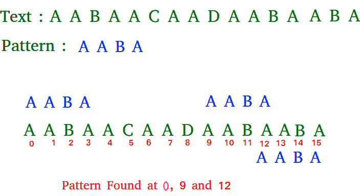

# 用于模式搜索的拉宾-卡普算法

> 原文:[https://www . geeksforgeeks . org/rabin-Karp-模式搜索算法/](https://www.geeksforgeeks.org/rabin-karp-algorithm-for-pattern-searching/)

给定一个文本*txt【0..n-1]* 和模式*帕特【0..m-1]* ，编写一个函数*搜索(char pat[]，char txt[])* ，打印 *txt[]* 中所有出现的 *pat[]* 。你可以假设 n > m。

**示例:**

```
Input:  txt[] = "THIS IS A TEST TEXT"
        pat[] = "TEST"
Output: Pattern found at index 10

Input:  txt[] =  "AABAACAADAABAABA"
        pat[] =  "AABA"
Output: Pattern found at index 0
        Pattern found at index 9
        Pattern found at index 12
```



[朴素字符串匹配](https://www.geeksforgeeks.org/searching-for-patterns-set-1-naive-pattern-searching/)算法逐个滑动模式。在每张幻灯片之后，它会逐一检查当前班次的字符，如果所有字符都匹配，则打印匹配的字符。
和朴素算法一样，拉宾-卡普算法也是一个一个的滑动模式。但与 Naive 算法不同的是，Rabin Karp 算法将模式的哈希值与文本的当前子串的哈希值进行匹配，如果哈希值匹配，那么只有它开始匹配单个字符。所以拉宾卡普算法需要为后面的字符串计算哈希值。
1)模式本身。
2)长度为 m 的文本的所有子字符串

因为我们需要有效地计算文本大小为 m 的所有子串的哈希值，所以我们必须有一个具有以下属性的哈希函数。
下一次移位时的散列必须能够从当前散列值和文本中的下一个字符有效地计算出来，或者我们可以说*散列(txt[s+1..s+m])* 必须能够从*哈希(txt[s..s+m-1])* 和 *txt[s+m]* 即 *hash(txt[s+1..s+m])* = *重新散列(txt[s+m]，散列(txt[s..s+m-1])*和再灰必须是 O(1)操作。
拉宾和卡普建议的散列函数计算一个整数值。字符串的整数值是字符串的数值。

例如，如果所有可能的字符都是从 1 到 10，数值“122”将是 122。可能的字符数大于 10(一般为 256)，并且模式长度可以很大。所以数值实际上不能存储为整数。因此，使用模块化算法计算数值，以确保哈希值可以存储在整数变量中(可以放入内存字中)。为了重新散列，我们需要去掉最高有效数字，并在哈希值中添加新的最低有效数字。使用下面的公式进行重新散列。

*哈希(txt[s+1..s+m] ) = ( d ( hash( txt[s..s+m-1])–txt[s]* h)+txt[s+m])mod q*
T3】hash(txt[s..s+m-1)】:班次 *s* 的哈希值。
*哈希(txt[s+1..s+m] )* :下一班次的哈希值(或班次 *s* +1)
*d* :字母表中的字符数
*q* :一个质数
*h: d^(m-1)*

**上面的** **表达是如何工作的？**

> 这是简单的数学，我们从前一个窗口计算当前窗口的十进制值。
> 例如，模式长度为 3，字符串为“23456”
> 您将第一个窗口(即“234”)的值计算为 234。
> 你将如何计算下一个窗口“345”的值？你将做(234–2 * 100)* 10+5，得到 345。

## C++

```
/* Following program is a C++ implementation of Rabin Karp 
Algorithm given in the CLRS book */
#include <bits/stdc++.h>
using namespace std;

// d is the number of characters in the input alphabet 
#define d 256 

/* pat -> pattern 
    txt -> text 
    q -> A prime number 
*/
void search(char pat[], char txt[], int q) 
{ 
    int M = strlen(pat); 
    int N = strlen(txt); 
    int i, j; 
    int p = 0; // hash value for pattern 
    int t = 0; // hash value for txt 
    int h = 1; 

    // The value of h would be "pow(d, M-1)%q" 
    for (i = 0; i < M - 1; i++) 
        h = (h * d) % q; 

    // Calculate the hash value of pattern and first 
    // window of text 
    for (i = 0; i < M; i++) 
    { 
        p = (d * p + pat[i]) % q; 
        t = (d * t + txt[i]) % q; 
    } 

    // Slide the pattern over text one by one 
    for (i = 0; i <= N - M; i++) 
    { 

        // Check the hash values of current window of text 
        // and pattern. If the hash values match then only 
        // check for characters one by one 
        if ( p == t ) 
        {   
            bool flag = true;
            /* Check for characters one by one */
            for (j = 0; j < M; j++) 
            { 
                if (txt[i+j] != pat[j])
                {
                  flag = false;
                  break;
                }
                  if(flag)
                  cout<<i<<" ";

            } 

            // if p == t and pat[0...M-1] = txt[i, i+1, ...i+M-1] 

            if (j == M) 
                cout<<"Pattern found at index "<< i<<endl; 
        } 

        // Calculate hash value for next window of text: Remove 
        // leading digit, add trailing digit 
        if ( i < N-M ) 
        { 
            t = (d*(t - txt[i]*h) + txt[i+M])%q; 

            // We might get negative value of t, converting it 
            // to positive 
            if (t < 0) 
            t = (t + q); 
        } 
    } 
} 

/* Driver code */
int main() 
{ 
    char txt[] = "GEEKS FOR GEEKS"; 
    char pat[] = "GEEK";

      // A prime number 
    int q = 101; 

      // Function Call
      search(pat, txt, q); 
    return 0; 
} 

// This is code is contributed by rathbhupendra
```

## C

```
/* Following program is a C implementation of Rabin Karp
Algorithm given in the CLRS book */
#include<stdio.h>
#include<string.h>

// d is the number of characters in the input alphabet
#define d 256

/* pat -> pattern
    txt -> text
    q -> A prime number
*/
void search(char pat[], char txt[], int q)
{
    int M = strlen(pat);
    int N = strlen(txt);
    int i, j;
    int p = 0; // hash value for pattern
    int t = 0; // hash value for txt
    int h = 1;

    // The value of h would be "pow(d, M-1)%q"
    for (i = 0; i < M-1; i++)
        h = (h*d)%q;

    // Calculate the hash value of pattern and first
    // window of text
    for (i = 0; i < M; i++)
    {
        p = (d*p + pat[i])%q;
        t = (d*t + txt[i])%q;
    }

    // Slide the pattern over text one by one
    for (i = 0; i <= N - M; i++)
    {

        // Check the hash values of current window of text
        // and pattern. If the hash values match then only
        // check for characters on by one
        if ( p == t )
        {
            /* Check for characters one by one */
            for (j = 0; j < M; j++)
            {
                if (txt[i+j] != pat[j])
                    break;
            }

            // if p == t and pat[0...M-1] = txt[i, i+1, ...i+M-1]
            if (j == M)
                printf("Pattern found at index %d \n", i);
        }

        // Calculate hash value for next window of text: Remove
        // leading digit, add trailing digit
        if ( i < N-M )
        {
            t = (d*(t - txt[i]*h) + txt[i+M])%q;

            // We might get negative value of t, converting it
            // to positive
            if (t < 0)
            t = (t + q);
        }
    }
}

/* Driver Code */
int main()
{
    char txt[] = "GEEKS FOR GEEKS";
    char pat[] = "GEEK";

      // A prime number
    int q = 101; 

      // function call
    search(pat, txt, q);
    return 0;
}
```

## Java 语言(一种计算机语言，尤用于创建网站)

```
// Following program is a Java implementation 
// of Rabin Karp Algorithm given in the CLRS book

public class Main 
{
    // d is the number of characters in the input alphabet
    public final static int d = 256;

    /* pat -> pattern
        txt -> text
        q -> A prime number
    */
    static void search(String pat, String txt, int q)
    {
        int M = pat.length();
        int N = txt.length();
        int i, j;
        int p = 0; // hash value for pattern
        int t = 0; // hash value for txt
        int h = 1;

        // The value of h would be "pow(d, M-1)%q"
        for (i = 0; i < M-1; i++)
            h = (h*d)%q;

        // Calculate the hash value of pattern and first
        // window of text
        for (i = 0; i < M; i++)
        {
            p = (d*p + pat.charAt(i))%q;
            t = (d*t + txt.charAt(i))%q;
        }

        // Slide the pattern over text one by one
        for (i = 0; i <= N - M; i++)
        {

            // Check the hash values of current window of text
            // and pattern. If the hash values match then only
            // check for characters on by one
            if ( p == t )
            {
                /* Check for characters one by one */
                for (j = 0; j < M; j++)
                {
                    if (txt.charAt(i+j) != pat.charAt(j))
                        break;
                }

                // if p == t and pat[0...M-1] = txt[i, i+1, ...i+M-1]
                if (j == M)
                    System.out.println("Pattern found at index " + i);
            }

            // Calculate hash value for next window of text: Remove
            // leading digit, add trailing digit
            if ( i < N-M )
            {
                t = (d*(t - txt.charAt(i)*h) + txt.charAt(i+M))%q;

                // We might get negative value of t, converting it
                // to positive
                if (t < 0)
                t = (t + q);
            }
        }
    }

    /* Driver Code */
    public static void main(String[] args)
    {
        String txt = "GEEKS FOR GEEKS";
        String pat = "GEEK";

          // A prime number
        int q = 101; 

          // Function Call
        search(pat, txt, q);
    }
}

// This code is contributed by nuclode
```

## 计算机编程语言

```
# Following program is the python implementation of
# Rabin Karp Algorithm given in CLRS book

# d is the number of characters in the input alphabet
d = 256

# pat  -> pattern
# txt  -> text
# q    -> A prime number

def search(pat, txt, q):
    M = len(pat)
    N = len(txt)
    i = 0
    j = 0
    p = 0    # hash value for pattern
    t = 0    # hash value for txt
    h = 1

    # The value of h would be "pow(d, M-1)%q"
    for i in xrange(M-1):
        h = (h*d)%q

    # Calculate the hash value of pattern and first window
    # of text
    for i in xrange(M):
        p = (d*p + ord(pat[i]))%q
        t = (d*t + ord(txt[i]))%q

    # Slide the pattern over text one by one
    for i in xrange(N-M+1):
        # Check the hash values of current window of text and
        # pattern if the hash values match then only check
        # for characters on by one
        if p==t:
            # Check for characters one by one
            for j in xrange(M):
                if txt[i+j] != pat[j]:
                    break
                else: j+=1

            # if p == t and pat[0...M-1] = txt[i, i+1, ...i+M-1]
            if j==M:
                print "Pattern found at index " + str(i)

        # Calculate hash value for next window of text: Remove
        # leading digit, add trailing digit
        if i < N-M:
            t = (d*(t-ord(txt[i])*h) + ord(txt[i+M]))%q

            # We might get negative values of t, converting it to
            # positive
            if t < 0:
                t = t+q

# Driver Code
txt = "GEEKS FOR GEEKS"
pat = "GEEK"

# A prime number
q = 101 

# Function Call
search(pat,txt,q)

# This code is contributed by Bhavya Jain
```

## C#

```
// Following program is a C# implementation 
// of Rabin Karp Algorithm given in the CLRS book 
using System;
public class GFG 
{ 
    // d is the number of characters in the input alphabet 
    public readonly static int d = 256; 

    /* pat -> pattern 
        txt -> text 
        q -> A prime number 
    */
    static void search(String pat, String txt, int q) 
    { 
        int M = pat.Length; 
        int N = txt.Length; 
        int i, j; 
        int p = 0; // hash value for pattern 
        int t = 0; // hash value for txt 
        int h = 1; 

        // The value of h would be "pow(d, M-1)%q" 
        for (i = 0; i < M-1; i++) 
            h = (h*d)%q; 

        // Calculate the hash value of pattern and first 
        // window of text 
        for (i = 0; i < M; i++) 
        { 
            p = (d*p + pat[i])%q; 
            t = (d*t + txt[i])%q; 
        } 

        // Slide the pattern over text one by one 
        for (i = 0; i <= N - M; i++) 
        { 

            // Check the hash values of current window of text 
            // and pattern. If the hash values match then only 
            // check for characters on by one 
            if ( p == t ) 
            { 
                /* Check for characters one by one */
                for (j = 0; j < M; j++) 
                { 
                    if (txt[i+j] != pat[j]) 
                        break; 
                } 

                // if p == t and pat[0...M-1] = txt[i, i+1, ...i+M-1] 
                if (j == M) 
                    Console.WriteLine("Pattern found at index " + i); 
            } 

            // Calculate hash value for next window of text: Remove 
            // leading digit, add trailing digit 
            if ( i < N-M ) 
            { 
                t = (d*(t - txt[i]*h) + txt[i+M])%q; 

                // We might get negative value of t, converting it 
                // to positive 
                if (t < 0) 
                t = (t + q); 
            } 
        } 
    } 

    /* Driver Code */
    public static void Main() 
    { 
        String txt = "GEEKS FOR GEEKS"; 
        String pat = "GEEK"; 

          // A prime number 
        int q = 101;

          // Function Call
        search(pat, txt, q); 
    } 
} 

// This code is contributed by PrinciRaj19992
```

## 服务器端编程语言（Professional Hypertext Preprocessor 的缩写）

```
<?php
// Following program is a PHP 
// implementation of Rabin Karp
// Algorithm given in the CLRS book 

// d is the number of characters
// in the input alphabet
$d = 256;

/* pat -> pattern
   txt -> text
   q -> A prime number
*/
function search($pat, $txt, $q)
{
    $M = strlen($pat);
    $N = strlen($txt);
    $i; $j;
    $p = 0; // hash value 
            // for pattern
    $t = 0; // hash value 
            // for txt
    $h = 1;
    $d =1;

    // The value of h would
    // be "pow(d, M-1)%q"
    for ($i = 0; $i < $M - 1; $i++)
        $h = ($h * $d) % $q;

    // Calculate the hash value
    // of pattern and first
    // window of text
    for ($i = 0; $i < $M; $i++)
    {
        $p = ($d * $p + $pat[$i]) % $q;
        $t = ($d * $t + $txt[$i]) % $q;
    }

    // Slide the pattern over
    // text one by one
    for ($i = 0; $i <= $N - $M; $i++)
    {

        // Check the hash values of 
        // current window of text
        // and pattern. If the hash
        // values match then only
        // check for characters on
        // by one
        if ($p == $t)
        {
            // Check for characters
            // one by one
            for ($j = 0; $j < $M; $j++)
            {
                if ($txt[$i + $j] != $pat[$j])
                    break;
            }

            // if p == t and pat[0...M-1] = 
            // txt[i, i+1, ...i+M-1]
            if ($j == $M)
                echo "Pattern found at index ",
                                      $i, "\n";
        }

        // Calculate hash value for 
        // next window of text: 
        // Remove leading digit,
        // add trailing digit
        if ($i < $N - $M)
        {
            $t = ($d * ($t - $txt[$i] * 
                        $h) + $txt[$i + 
                             $M]) % $q;

            // We might get negative 
            // value of t, converting
            // it to positive
            if ($t < 0)
            $t = ($t + $q);
        }
    }
}

// Driver Code
$txt = "GEEKS FOR GEEKS";
$pat = "GEEK";

// A prime number
$q = 101;

// Function Call
search($pat, $txt, $q);

// This code is contributed
// by ajit
?>
```

## java 描述语言

```
<script>

// Following program is a Javascript implementation 
// of Rabin Karp Algorithm given in the CLRS book 

// d is the number of characters in
// the input alphabet 
let d = 256; 

/* pat -> pattern 
    txt -> text 
    q -> A prime number 
*/
function search(pat, txt, q) 
{ 
    let M = pat.length; 
    let N = txt.length; 
    let i, j; 

    // Hash value for pattern 
    let p = 0; 

    // Hash value for txt 
    let t = 0; 
    let h = 1; 

    // The value of h would be "pow(d, M-1)%q" 
    for(i = 0; i < M - 1; i++) 
        h = (h * d) % q; 

    // Calculate the hash value of pattern and 
    // first window of text 
    for(i = 0; i < M; i++) 
    { 
        p = (d * p + pat[i].charCodeAt()) % q; 
        t = (d * t + txt[i].charCodeAt()) % q; 
    } 

    // Slide the pattern over text one by one 
    for(i = 0; i <= N - M; i++) 
    { 

        // Check the hash values of current
        // window of text and pattern. If the
        // hash values match then only 
        // check for characters on by one 
        if (p == t) 
        { 

            /* Check for characters one by one */
            for(j = 0; j < M; j++) 
            { 
                if (txt[i+j] != pat[j]) 
                    break; 
            } 

            // if p == t and pat[0...M-1] = 
            // txt[i, i+1, ...i+M-1] 
            if (j == M) 
                 document.write("Pattern found at index " + 
                                i + "<br/>"); 
        } 

        // Calculate hash value for next window 
        // of text: Remove leading digit, add 
        // trailing digit 
        if (i < N - M) 
        { 
            t = (d * (t - txt[i].charCodeAt() * h) + 
                      txt[i + M].charCodeAt()) % q; 

            // We might get negative value of t, 
            // converting it to positive 
            if (t < 0) 
                t = (t + q); 
        } 
    } 
} 

// Driver code
let txt = "GEEKS FOR GEEKS";
let pat = "GEEK";

// A prime number
let q = 101; 

// Function Call
search(pat, txt, q);

// This code is contributed by target_2

</script>
```

**输出:**

```
Pattern found at index 0
Pattern found at index 10
```

**时间复杂度:**
拉宾-卡普算法的平均和最佳运行时间为 O(n+m)，但其最差运行时间为 O(nm)。当模式和文本的所有字符都与 txt[]的所有子串的哈希值匹配 pat[]的哈希值时，出现 Rabin-Karp 算法的最坏情况。例如 pat[]=“AAA”和 txt[]=“AAAAAA”。

如果你发现任何不正确的地方，或者你想分享更多关于上面讨论的话题的信息，请写评论。
**参考文献:**
[http://net . pku . edu . cn/~ course/cs101/2007/resource/intro 2 Algorithm/book6/chap 34 . htm](http://net.pku.edu.cn/~course/cs101/2007/resource/Intro2Algorithm/book6/chap34.htm)
T7】http://www . cs . Princeton . edu/courses/archive/fall 04/cos226/讲座/string . 4 up . pdf
T10】http://en . Wikipedia . org/wiki/Rabin-Karp _ 等