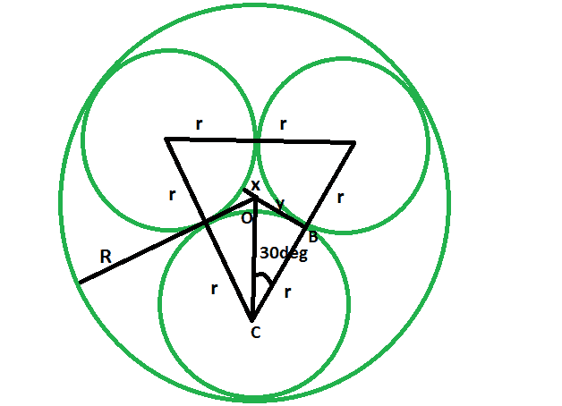

# 给定半径的圆内接的三个等半径相切圆的半径

> 原文:[https://www . geeksforgeeks . org/等半径三相切圆半径/给定半径内接圆/](https://www.geeksforgeeks.org/radii-of-the-three-tangent-circles-of-equal-radius-which-are-inscribed-within-a-circle-of-given-radius/)

这里给定的是一个给定半径的圆。在它里面，内接三个等半径的切圆。任务是找到这些相切圆的半径。
**例:**

```
Input: R = 4
Output: 1.858

Input: R = 11
Output:: 5.1095
```



**接近** :

*   设切圆的半径为 **r** ，外接圆的半径为
    R。 **x** 是切圆圆周到外接圆中心的较小距离。
*   从图上看，很明显，
    **2r + x = R**
*   现在在三角 **OBC** 、
    T3】cos 30 = r/(r+x)T5**rcos 30+xcos 30 = r**
    T9】x = r(1-cos30)/cos30
*   同样， **x = R-2r**
*   所以，
    **R-2r = R(1-cos30)/cos30**
    **R-2r = 0.133 R/0.867**
    T7】R-2r = 0.153 R
    T10】R = 2.153 R
    所以， **r = 0.4645R**


## C++

```
// C++ program to find the radii
// of the three tangent circles
// of equal radius when the radius
// of the circumscribed circle is given

#include <bits/stdc++.h>
using namespace std;

void threetangcircle(int R)
{
    cout << "The radii of the tangent circles is "
         << 0.4645 * R << endl;
}

// Driver code
int main()
{
    int R = 4;
    threetangcircle(R);
    return 0;
}
```

<gfg-tab role="tab" slot="tab" id="gfg-tab-1">爪哇</gfg-tab>T3

```
 // Java program to find the radii
// of the three tangent circles
// of equal radius when the radius
// of the circumscribed circle is given
import java.io.*;

class GFG 
{

static void threetangcircle(int R)
{
    System.out.print("The radii of the tangent circles is "
        + 0.4645 * R);
}

// Driver code
public static void main (String[] args) 
{
    int R = 4;
    threetangcircle(R);
}
}

// This code is contributed by anuj_67.. 
```

T4

## 蟒蛇 3

```
# Python3 program to find the radii
# of the three tangent circles
# of equal radius when the radius
# of the circumscribed circle is given

def threetangcircle(R):
    print("The radii of the tangent",
          "circles is ", end = "");
    print(0.4645 * R);

# Driver code
R = 4;
threetangcircle(R);

# This code is contributed
# by Princi Singh
```

## C#

```
// C# program to find the radii
// of the three tangent circles
// of equal radius when the radius
// of the circumscribed circle is given
using System;

class GFG
{

static void threetangcircle(int R)
{
    Console.WriteLine("The radii of the tangent circles is "
        + 0.4645 * R);
}

// Driver code
public static void Main ()
{
    int R = 4;
    threetangcircle(R);
}
}

// This code is contributed by anuj_67..
```

<gfg-tab role="tab" slot="tab" id="gfg-tab-4">PHP</gfg-tab><gfg-panel role="tabpanel" slot="panel" id="gfg-panel-4" data-code-lang="php"></gfg-panel>

```
 <?php
// PHP program to find the radii
// of the three tangent circles
// of equal radius when the radius
// of the circumscribed circle is given

function threetangcircle($R)
{
    echo "The radii of the tangent circles is ",
        ( 0.4645 * $R );
}

// Driver code
$R = 4;
threetangcircle($R);

// This code is contributed by ihritik
?> 
```

## java 描述语言

```
<script>
// javascript program to find the radii
// of the three tangent circles
// of equal radius when the radius
// of the circumscribed circle is given

function threetangcircle(R)
{
    document.write("The radii of the tangent circles is "
        + 0.4645 * R);
}

// Driver code
var R = 4;
threetangcircle(R);

// This code contributed by shikhasingrajput
</script>
```

**Output:** 

```
The radii of the tangent circles is 1.858
```