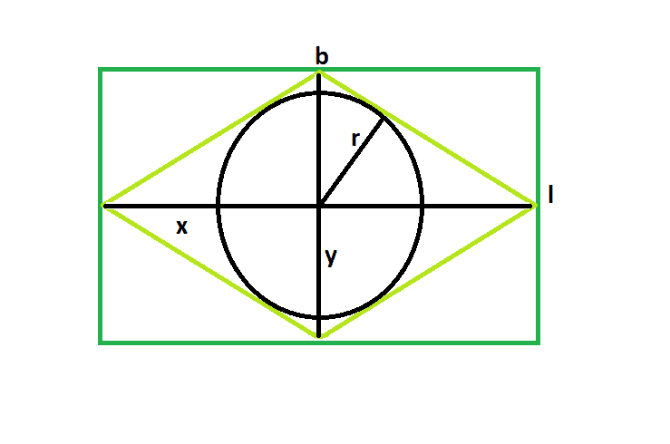

# 菱形内接的最大可能圆的半径，而菱形又内接在一个矩形内

> 原文:[https://www . geeksforgeeks . org/最大可能圆内接菱形半径依次内接矩形/](https://www.geeksforgeeks.org/radius-of-the-biggest-possible-circle-inscribed-in-rhombus-which-in-turn-is-inscribed-in-a-rectangle/)

给出一个长 **l** &宽 **b** 的长方形，上面刻一个菱形，菱形反过来又刻一个圆。任务是找到这个圆的半径。
**例:**

```
Input: l = 5, b = 3
Output: 1.28624

Input: l = 6, b = 4
Output: 1.6641
```



**逼近**:从图中可以明显看出，对角线 **x** & **y** 等于矩形的长宽。
也是圆的半径， **r** ，在菱形内部是= **xy/2√(x^2+y^2).**
所以，圆的半径就**l**t23**b**而言就是= **lb/2√(l^2+b^2).**
**以下是上述办法的实施方式** :

## C++

```
// C++ implementation of above approach
#include <bits/stdc++.h>
using namespace std;

// Function to find the radius
// of the inscribed circle
float circleradius(float l, float b)
{

    // the sides cannot be negative
    if (l < 0 || b < 0)
        return -1;

    // radius of the circle
    float r = (l * b) / (2 * sqrt((pow(l, 2) + pow(b, 2))));
    return r;
}

// Driver code
int main()
{
    float l = 5, b = 3;
    cout << circleradius(l, b) << endl;

    return 0;
}
```

## Java 语言(一种计算机语言，尤用于创建网站)

```
// Java implementation of above approach

import java.io.*;

class GFG {

// Function to find the radius
// of the inscribed circle
static float circleradius(float l, float b)
{

    // the sides cannot be negative
    if (l < 0 || b < 0)
        return -1;

    // radius of the circle
    float r = (float)((l * b) / (2 * Math.sqrt((Math.pow(l, 2) + Math.pow(b, 2)))));
    return r;
}

    // Driver code
    public static void main (String[] args) {
        float l = 5, b = 3;
    System.out.print (circleradius(l, b)) ;
    }
}
// This code is contributed by inder_verma..
```

## 蟒蛇 3

```
# Python 3 implementation of
# above approach
from math import sqrt

# Function to find the radius
# of the inscribed circle
def circleradius(l, b):

    # the sides cannot be negative
    if (l < 0 or b < 0):
        return -1

    # radius of the circle
    r = (l * b) / (2 * sqrt((pow(l, 2) +
                             pow(b, 2))));
    return r

# Driver code
if __name__ == '__main__':
    l = 5
    b = 3
    print("{0:.5}" . format(circleradius(l, b)))

# This code is contribute
# by Surendra_Gagwar
```

## C#

```
// C# implementation of above approach
using System;

class GFG
{

// Function to find the radius
// of the inscribed circle
static float circleradius(float l,
                          float b)
{

    // the sides cannot be negative
    if (l < 0 || b < 0)
        return -1;

    // radius of the circle
    float r = (float)((l * b) /
              (2 * Math.Sqrt((Math.Pow(l, 2) +
                   Math.Pow(b, 2)))));
    return r;
}

// Driver code
public static void Main ()
{
    float l = 5, b = 3;
    Console.WriteLine(circleradius(l, b));
}
}

// This code is contributed
// by inder_verma
```

## 服务器端编程语言（Professional Hypertext Preprocessor 的缩写）

```
<?php
// PHP implementation of above approach

// Function to find the radius
// of the inscribed circle
function circleradius($l, $b)
{

    // the sides cannot be negative
    if ($l < 0 || $b < 0)
        return -1;

    // radius of the circle
    $r = ($l * $b) / (2 * sqrt((pow($l, 2) +
                                pow($b, 2))));
    return $r;
}

// Driver code
$l = 5;
$b = 3;
echo circleradius($l, $b), "\n";

// This code is contributed by ajit
?>
```

## java 描述语言

```
<script>
// javascript implementation of above approach

// Function to find the radius
// of the inscribed circle
function circleradius(l , b)
{

    // the sides cannot be negative
    if (l < 0 || b < 0)
        return -1;

    // radius of the circle
    var r = ((l * b) / (2 * Math.sqrt((Math.pow(l, 2) + Math.pow(b, 2)))));
    return r;
}

var l = 5, b = 3;
document.write(circleradius(l, b).toFixed(5)) ;

// This code is contributed by shikhasingrajput
</script>
```

**Output:** 

```
1.28624
```