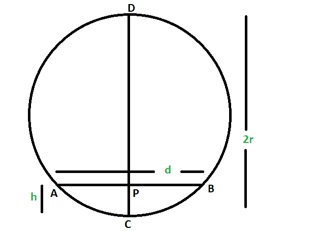
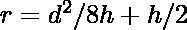

# 给定圆弧宽度和高度时的圆半径

> 原文:[https://www . geeksforgeeks . org/给定圆弧的宽度和高度时的圆半径/](https://www.geeksforgeeks.org/radius-of-the-circle-when-the-width-and-height-of-an-arc-is-given/)

给定一个圆，其中给出了弧的宽度和高度。任务是借助圆弧的宽度和高度找到圆的半径。
**例:**

```
Input: d = 4, h = 1 
Output: The radius of the circle is 2.5

Input: d = 14, h = 8
Output: The radius of the circle is 7.0625
```



**接近**T2】

*   让圆的半径为 **r**
*   让弧的高度和宽度为 **h** & **d**
*   现在，直径 DC 将弦 AB 分成两半，每一半长度为 **d/2**
*   同样，直径被弦分为两部分，弧内部分 **h** 和剩余部分 **2r-h**
*   现在从[相交和弦定理](https://en.wikipedia.org/wiki/Power_of_a_point#Theorems)，
    **h *(2r-h)=(d/2)^2**
    **or，2r h–h^2 = d^2/4**
    **所以，r = d^2/8h + h/2**
*   所以，圆的半径
    

## C++

```
// C++ program to find
// radius of the circle
// when the width and height
// of an arc is given

#include <bits/stdc++.h>
using namespace std;

// Function to find the radius
void rad(double d, double h)
{
    cout << "The radius of the circle is "
        << ((d * d) / (8 * h) + h / 2)
        << endl;
}

// Driver code
int main()
{
    double d = 4, h = 1;
    rad(d, h);
    return 0;
}
```

## Java 语言(一种计算机语言，尤用于创建网站)

```
// Java program to find
// radius of the circle
// when the width and height
// of an arc is given
class GFG
{

// Function to find the radius
static void rad(double d, double h)
{
    System.out.println( "The radius of the circle is "
        + ((d * d) / (8 * h) + h / 2));
}

// Driver code
public static void main(String[] args)
{
    double d = 4, h = 1;
    rad(d, h);
}
}

/* This code contributed by PrinciRaj1992 */
```

## 蟒蛇 3

```
# Python3 program to find
# radius of the circle
# when the width and height
# of an arc is given

# Function to find the radius
def rad(d, h):
    print("The radius of the circle is",
        ((d * d) / (8 * h) + h / 2))

# Driver code
d = 4; h = 1;
rad(d, h);

# This code is contributed by 29AjayKumar
```

## C#

```
// C# program to find
// radius of the circle
// when the width and height
// of an arc is given
using System;

class GFG
{

// Function to find the radius
static void rad(double d, double h)
{
    Console.WriteLine( "The radius of the circle is "
        + ((d * d) / (8 * h) + h / 2));
}

// Driver code
public static void Main()
{
    double d = 4, h = 1;
    rad(d, h);
}
}

// This code is contributed by AnkitRai01
```

## 服务器端编程语言（Professional Hypertext Preprocessor 的缩写）

```
<?php
// PHP program to find radius of
// the circle when the width and
// height of an arc is given

// Function to find the radius
function rad($d, $h)
{
    echo "The radius of the circle is ",
        (($d * $d) / (8 * $h) + $h / 2), "\n";
}

// Driver code
$d = 4;
$h = 1;
rad($d, $h);

// This code is contributed by ajit
?>
```

## java 描述语言

```
<script>

// Javascript program to find
// radius of the circle
// when the width and height
// of an arc is given

// Function to find the radius
function rad(d, h)
{
    document.write("The radius of the circle is "
    +((d * d) / (8 * h) + h / 2));
}

// Driver code
    var d = 4, h = 1;
    rad(d, h);

</script>
```

**输出:**

```
The radius of the circle is 2.5
```