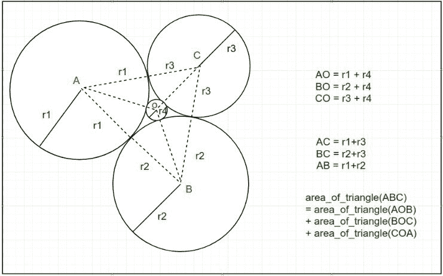
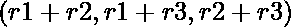
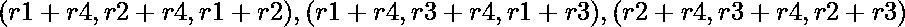
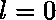
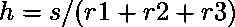
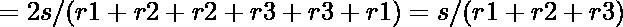
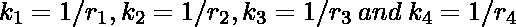
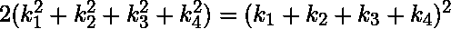
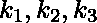
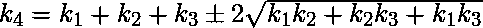

# 三个相切圆内接圆的半径

> 原文:[https://www . geeksforgeeks . org/三相切圆内接圆半径/](https://www.geeksforgeeks.org/radius-of-the-inscribed-circle-within-three-tangent-circles/)

有 **4** 个半径为正整数的圆 **r1** 、 **r2** 、 **r3** 和 **r4** ，如下图所示。



任务是在给定半径 **r1** 、 **r2** 、 **r3** 的情况下，求三个圆组成的圆的半径 **r4** 。
(注意上图中的圆是相切的。)

**示例:**

> **输入:** r1 = 1，r2 = 1，R3 = 1
> T3】输出: 0.154701
> 
> **输入:** r1 = 23，r2 = 46，R3 = 69
> T3】输出: 6.000000

**方法 1:(使用** [**【二分搜索法】**](https://www.geeksforgeeks.org/binary-search/) **) :**

1.  政策是连接所有圆的中心，形成 4 个三角形
2.  三角形形成后，用二分搜索法法尽可能将三个较小三角形的面积之和与主三角形相等。

**上述方法的分析:**

1.  这个方法有效，因为最初有 4 个三角形，如上图所示。
2.  有边的主三角形和有边的三个小三角形。
3.  主三角形由小三角形组成，所以主三角形的面积是小三角形面积的总和。

**形成搜索空间:**
这里[二分搜索法](https://www.geeksforgeeks.org/binary-search/)。可以选择 r 的值，并且可以计算所有三个较小三角形的面积之和，并与主三角形的面积进行比较。

1.  选择下限
2.  选择上限

凭直觉，r4 作为内接圆半径进入三角形的上界值小于:
r <sub>上界</sub>T5】现在[二分搜索法](https://www.geeksforgeeks.org/binary-search/)可应用于以下搜索空间。

下面是使用上述方法解决问题的方法。

## C++

```
// C++ implementation of the approach
#include <bits/stdc++.h>
using namespace std;

// Radius of the 3 given circles
// declared as double.
double r1, r2, r3;

// Calculation of area of a triangle by Heron's formula
double area(double a, double b, double c)
{
    double p = (a + b + c) / 2;
    return sqrt(p) * sqrt(p - a) * sqrt(p - b) * sqrt(p - c);
}

// Applying binary search to find the
// radius r4 of the required circle
double binary_search()
{
    // Area of main triangle
    double s = area(r1 + r2, r2 + r3, r3 + r1);
    double l = 0, h = s / (r1 + r2 + r3);
    // Loop runs until l and h becomes approximately equal
    while (h - l >= 1.e-7) {
        double mid = (l + h) / 2;

        // Area of smaller triangles
        double s1 = area(mid + r1, mid + r2, r1 + r2);
        double s2 = area(mid + r1, mid + r3, r1 + r3);
        double s3 = area(mid + r2, mid + r3, r2 + r3);

        // If sum of smaller triangles
        // is less than main triangle
        if (s1 + s2 + s3 < s) {
            l = mid;
        }
        // If sum of smaller triangles is
        // greater than or equal to main triangle
        else {
            h = mid;
        }
    }
    return (l + h) / 2;
}
// Driver code
int main()
{
    // Taking r1, r2, r3 as input
    r1 = 1.0;
    r2 = 2.0;
    r3 = 3.0;
    // Call to function binary search
    cout << fixed << setprecision(6) << binary_search() << endl;
    return 0;
}
```

## Java 语言(一种计算机语言，尤用于创建网站)

```
// Java implementation of the approach
import java.util.*;

class GFG
{

    // Radius of the 3 given circles
    // declared as double.
    static double r1, r2, r3;

    // Calculation of area of a triangle by Heron's formula
    static double area(double a, double b, double c)
    {
        double p = (a + b + c) / 2;
        return Math.sqrt(p) * Math.sqrt(p - a) *
               Math.sqrt(p - b) * Math.sqrt(p - c);
    }

    // Applying binary search to find the
    // radius r4 of the required circle
    static double binary_search()
    {
        // Area of main triangle
        double s = area(r1 + r2, r2 + r3, r3 + r1);
        double l = 0, h = s / (r1 + r2 + r3);

        // Loop runs until l and h becomes approximately equal
        while (h - l >= 1.e-7)
        {
            double mid = (l + h) / 2;

            // Area of smaller triangles
            double s1 = area(mid + r1, mid + r2, r1 + r2);
            double s2 = area(mid + r1, mid + r3, r1 + r3);
            double s3 = area(mid + r2, mid + r3, r2 + r3);

            // If sum of smaller triangles
            // is less than main triangle
            if (s1 + s2 + s3 < s)
            {
                l = mid;
            }

            // If sum of smaller triangles is
            // greater than or equal to main triangle
            else
            {
                h = mid;
            }
        }
        return (l + h) / 2;
    }

    // Driver code
    public static void main(String[] args)
    {
        // Taking r1, r2, r3 as input
        r1 = 1.0;
        r2 = 2.0;
        r3 = 3.0;

        // Call to function binary search
        System.out.printf("%.6f", binary_search());
    }
}

// This code is contributed by 29AjayKumar
```

## 蟒蛇 3

```
# Python3 implementation of the approach
import math

# Radius of the 3 given circles
r1 = 0
r2 = 0
r3 = 0

# Calculation of area of a
# triangle by Heron's formula
def area(a, b, c):

    p = (a + b + c) / 2

    return ((math.sqrt(p)) *
            (math.sqrt(p - a)) *
            (math.sqrt(p - b)) *
            (math.sqrt(p - c)))

# Applying binary search to find the
# radius r4 of the required circle
def binary_search():

    global r1, r2, r3

    # Area of main triangle
    s = area(r1 + r2, r2 + r3, r3 + r1)
    l = 0
    h = s / (r1 + r2 + r3)

    # Loop runs until l and h
    # becomes approximately equal
    while (h - l > 0.00000001):
        mid = (l + h) / 2

        # Area of smaller triangles
        s1 = area(mid + r1, mid + r2, r1 + r2)
        s2 = area(mid + r1, mid + r3, r1 + r3)
        s3 = area(mid + r2, mid + r3, r2 + r3)

        # If sum of smaller triangles
        # is less than main triangle
        if (s1 + s2 + s3 < s):
            l = mid

        # If sum of smaller triangles is
        # greater than or equal to main triangle
        else:
            h = mid

    return ((l + h) / 2)

# Driver code

# Taking r1, r2, r3 as input
r1 = 1
r2 = 2
r3 = 3

# Call to function binary search
print("{0:.6f}".format(binary_search()))

# This code is contributed by avanitrachhadiya2155
```

## C#

```
// C# implementation of the approach
using System;

class GFG
{

    // Radius of the 3 given circles
    // declared as double.
    static double r1, r2, r3;

    // Calculation of area of a triangle by Heron's formula
    static double area(double a, double b, double c)
    {
        double p = (a + b + c) / 2;
        return Math.Sqrt(p) * Math.Sqrt(p - a) *
            Math.Sqrt(p - b) * Math.Sqrt(p - c);
    }

    // Applying binary search to find the
    // radius r4 of the required circle
    static double binary_search()
    {
        // Area of main triangle
        double s = area(r1 + r2, r2 + r3, r3 + r1);
        double l = 0, h = s / (r1 + r2 + r3);

        // Loop runs until l and h
        // becomes approximately equal
        while (h - l > 0.00000001)
        {
            double mid = (l + h) / 2;

            // Area of smaller triangles
            double s1 = area(mid + r1, mid + r2, r1 + r2);
            double s2 = area(mid + r1, mid + r3, r1 + r3);
            double s3 = area(mid + r2, mid + r3, r2 + r3);

            // If sum of smaller triangles
            // is less than main triangle
            if (s1 + s2 + s3 < s)
            {
                l = mid;
            }

            // If sum of smaller triangles is
            // greater than or equal to main triangle
            else
            {
                h = mid;
            }
        }
        return (l + h) / 2;
    }

    // Driver code
    public static void Main(String[] args)
    {
        // Taking r1, r2, r3 as input
        r1 = 1.0;
        r2 = 2.0;
        r3 = 3.0;

        // Call to function binary search
        Console.Write("{0:F6}", binary_search());
    }
}

// This code is contributed by Rajput-Ji
```

## java 描述语言

```
<script>

// Javascript implementation of the approach

// Radius of the 3 given circles
// declared as double.
let r1, r2, r3;

// Calculation of area of a triangle
// by Heron's formula
function area(a, b, c)
{
    let p = (a + b + c) / 2;
    return Math.sqrt(p) * Math.sqrt(p - a) *
       Math.sqrt(p - b) * Math.sqrt(p - c);
}

// Applying binary search to find the
// radius r4 of the required circle
function binary_search()
{

    // Area of main triangle
    let s = area(r1 + r2, r2 + r3, r3 + r1);
    let l = 0, h = s / (r1 + r2 + r3);

    // Loop runs until l and h
    // becomes approximately equal
    while (h - l >= 1.e-7)
    {
        let mid = (l + h) / 2;

        // Area of smaller triangles
        let s1 = area(mid + r1, mid + r2, r1 + r2);
        let s2 = area(mid + r1, mid + r3, r1 + r3);
        let s3 = area(mid + r2, mid + r3, r2 + r3);

        // If sum of smaller triangles
        // is less than main triangle
        if (s1 + s2 + s3 < s)
        {
            l = mid;
        }

        // If sum of smaller triangles is
        // greater than or equal to main triangle
        else
        {
            h = mid;
        }
    }
    return (l + h) / 2;
}

// Driver code

// Taking r1, r2, r3 as input
r1 = 1.0;
r2 = 2.0;
r3 = 3.0;

// Call to function binary search
document.write(binary_search().toPrecision(6));

// This code is contributed by subhammahato348

</script>
```

**Output:** 

```
0.260870
```

**方法 2:(利用笛卡尔定理)**

1.  根据笛卡尔定理，这些圆的半径或“曲率”的倒数满足以下关系。
    
2.  如果已知，可以解为，
3.  关于解上述方程；
    

下面是使用上述公式的问题的实现。

## C++

```
// C++ implementation of the approach
#include <bits/stdc++.h>
using namespace std;

// Driver code
int main()
{
    // Radius of the 3 given circles declared as double.
    double r1, r2, r3;

    // Taking r1, r2, r3 as input
    r1 = 1;
    r2 = 2;
    r3 = 3;

    // Calculation of r4 using formula given above
    double r4 = (r1 * r2 * r3)
                / (r1 * r2 + r2 * r3 + r1 * r3
                   + 2.0 * sqrt(r1 * r2 * r3 * (r1 + r2 + r3)));
    cout << fixed << setprecision(6) << r4 << '\n';
    return 0;
}
```

## Java 语言(一种计算机语言，尤用于创建网站)

```
// Java implementation of the approach
class GFG
{

    // Driver code
    public static void main(String[] args)
    {
        // Radius of the 3 given circles declared as double.
        double r1, r2, r3;

        // Taking r1, r2, r3 as input
        r1 = 1;
        r2 = 2;
        r3 = 3;

        // Calculation of r4 using formula given above
        double r4 = (r1 * r2 * r3) /
                    (r1 * r2 + r2 * r3 + r1 * r3 + 2.0 *
                    Math.sqrt(r1 * r2 * r3 * (r1 + r2 + r3)));
        System.out.printf("%.6f", r4);
    }
}

// This code is contributed by 29AjayKumar
```

## 蟒蛇 3

```
# Python3 implementation of the approach
from math import sqrt

# Driver code

# Radius of the 3 given circles declared as double.

# Taking r1, r2, r3 as input
r1 = 1
r2 = 2
r3 = 3

# Calculation of r4 using formula given above
r4 = (r1 * r2 * r3)/ (r1 * r2 + r2 * r3 + r1 * r3
            + 2.0 * sqrt(r1 * r2 * r3 * (r1 + r2 + r3)))
print(round(r4, 6))

# This code is contributed by mohit kumar 29
```

## C#

```
// C# implementation of the approach
using System;

class GFG
{

    // Driver code
    public static void Main(String[] args)
    {
        // Radius of the 3 given circles declared as double.
        double r1, r2, r3;

        // Taking r1, r2, r3 as input
        r1 = 1;
        r2 = 2;
        r3 = 3;

        // Calculation of r4 using formula given above
        double r4 = (r1 * r2 * r3) /
                    (r1 * r2 + r2 * r3 + r1 * r3 + 2.0 *
                    Math.Sqrt(r1 * r2 * r3 * (r1 + r2 + r3)));
        Console.Write("{0:F6}", r4);
    }
}

// This code contributed by PrinciRaj1992
```

## java 描述语言

```
<script>

// Javascript implementation of the approach

// Driver code

// Radius of the 3 given circles
// declared as double.
let r1, r2, r3;

// Taking r1, r2, r3 as input
r1 = 1;
r2 = 2;
r3 = 3;

// Calculation of r4 using formula given above
let r4 = (r1 * r2 * r3) / (r1 * r2 + r2 *
          r3 + r1 * r3 + 2.0 * Math.sqrt(
          r1 * r2 * r3 * (r1 + r2 + r3)));

document.write(r4.toFixed(6) + "<br>");

// This code is contributed by souravmahato348

</script>
```

**Output:** 

```
0.260870
```

**参考**:

*   [https://brilliant.org/wiki/descartes-theorem/](https://brilliant.org/wiki/descartes-theorem/)
*   [https://en . Wikipedia . org/wiki/笛卡尔%27_theorem/](https://en.wikipedia.org/wiki/Descartes%27_theorem)
*   [http://www . ambrsoft . com/TrigoCalc/circles 3/Tangency/tangent . htm](http://www.ambrsoft.com/TrigoCalc/Circles3/Tangency/Tangent.htm)