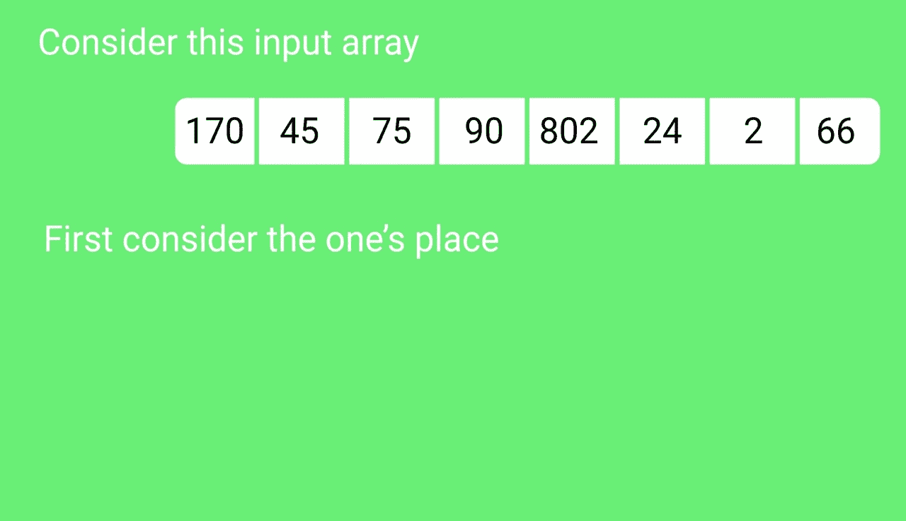
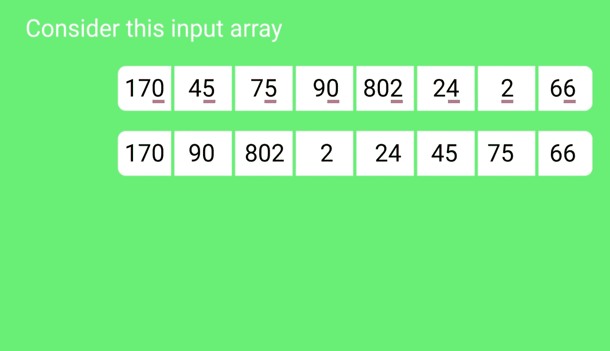
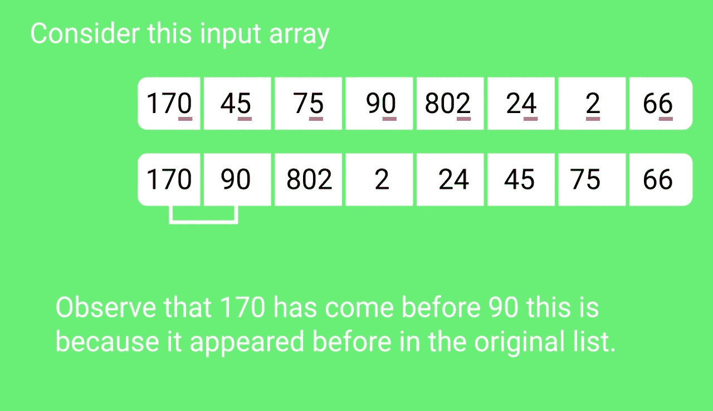
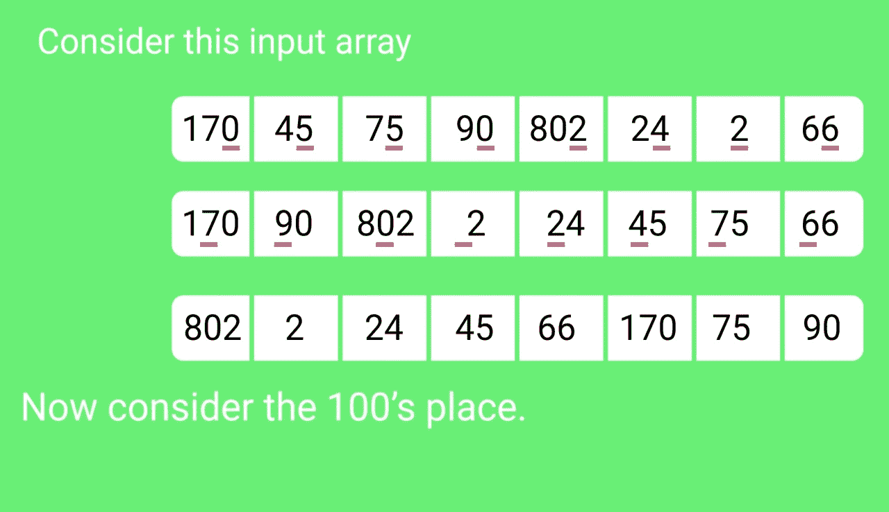
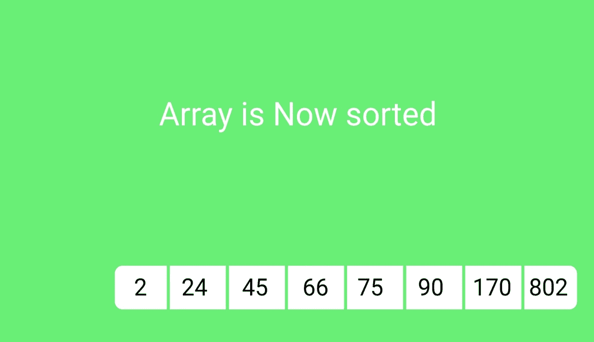

# 基数排序

> 原文:[https://www.geeksforgeeks.org/radix-sort/](https://www.geeksforgeeks.org/radix-sort/)

基于比较的排序算法的[下限](https://www.geeksforgeeks.org/lower-bound-on-comparison-based-sorting-algorithms/)(合并排序、堆排序、快速排序..etc)是ω(nLogn)，即它们不能比 nLogn 做得更好。

[计数排序](https://www.geeksforgeeks.org/counting-sort/)是一种线性时间排序算法，当元素在 1 到 k 的范围内时，按 O(n+k)时间排序。

***如果元素在********范围从 1 到 n <sup>2</sup> 呢？***
我们不能用计数排序，因为计数排序会取 O(n <sup>2</sup> )，比基于比较的排序算法差。我们能在线性时间内对这样的数组进行排序吗？**

**[基数排序](http://en.wikipedia.org/wiki/Radix_sort)就是答案。基数排序的思想是从最低有效位到最高有效位进行逐位排序。基数排序使用计数排序作为子例程来排序。**

*****基数排序算法*****

1.  **对每个数字 I 执行以下操作，其中 I 从最低有效数字到最高有效数字不等。

    *   根据第 I 位数字使用计数排序(或任何稳定排序)对输入数组进行排序。** 

****示例:****

```
Original, unsorted list:
170, 45, 75, 90, 802, 24, 2, 66

Sorting by least significant digit (1s place) gives: 
[*Notice that we keep 802 before 2, because 802 occurred 
before 2 in the original list, and similarly for pairs 
170 & 90 and 45 & 75.]

17<u>0</u>, 9<u>0</u>, 80<u>2</u>, <u>2</u>, 2<u>4</u>, 4<u>5</u>, 7<u>5</u>, 6<u>6</u>

Sorting by next digit (10s place) gives: 
[*Notice that 802 again comes before 2 as 802 comes before 
2 in the previous list.]

8<u>0</u>2, 2, <u>2</u>4, <u>4</u>5, <u>6</u>6, 1<u>7</u>0, <u>7</u>5, <u>9</u>0

Sorting by the most significant digit (100s place) gives:
2, 24, 45, 66, 75, 90, <u>1</u>70, <u>8</u>02
```

*****基数排序的运行时间是多少？***
输入整数时要有 d 位数字。基数排序需要 O(d*(n+b))时间，其中 b 是表示数字的基数，例如，对于十进制系统，b 是 10。d 的值是多少？如果 k 是最大可能值，那么 d 就是 O(log <sub>b</sub> (k))。所以整体时间复杂度为 O((n+b) * log <sub>b</sub> (k))。这看起来比基于比较的排序算法对于一个大 k 的时间复杂度还多，我们先限制 k，让 k < = n <sup>c</sup> 其中 c 是常数。在这种情况下，复杂度变成了 O(nLog <sub>b</sub> (n))。但是它仍然比不上基于比较的排序算法。
如果我们把 b 的值变大呢？。b 的值应该是多少才能使时间复杂度线性？如果我们把 b 设为 n，我们得到的时间复杂度为 O(n)。换句话说，如果数字以 n 为基数表示(或者每个数字取 log <sub>2</sub> (n)位)，我们可以对范围从 1 到 n 的整数数组进行排序 <sup>c</sup> 。**

*****基数排序的应用:*****

*   **在一台典型的计算机中，它是一台顺序随机存取机器，其中记录由多个字段键入，使用基数排序。例如，您想要对月、日和年这三个关键字进行排序。你可以比较两个记录的年份、月份和日期。或者，可以使用基数排序对数据进行三次排序，首先是日期，然后是月份，最后是年份。**
*   **它用于有 80 列的卡片分类机，每列机器只能在 12 个地方打孔。然后根据卡片被打孔的位置，分类器被编程来分类卡片。然后操作员用它来收集第一排打孔的卡片，接着是第二排，依此类推。**

*****基数排序比快速排序等基于比较的排序算法更可取吗？***
如果每个数字都有 log <sub>2</sub> n 位，那么对于大范围的输入数字，基数的运行时间似乎比快速排序要好。对于基数排序，渐近表示法中隐藏的常数因子更高，快速排序更有效地使用硬件缓存。此外，基数排序使用计数排序作为子程序，计数排序需要额外的空间来排序数字。** 

****基数排序的实现****

**下面是基数排序的一个简单实现。为简单起见，假设 d 的值为 10。我们建议您查看下面代码中的[计数排序](https://www.geeksforgeeks.org/counting-sort/)来了解 countSort()函数的详细信息。**

## **C++**

```
// C++ implementation of Radix Sort
#include <iostream>
using namespace std;

// A utility function to get maximum value in arr[]
int getMax(int arr[], int n)
{
    int mx = arr[0];
    for (int i = 1; i < n; i++)
        if (arr[i] > mx)
            mx = arr[i];
    return mx;
}

// A function to do counting sort of arr[] according to
// the digit represented by exp.
void countSort(int arr[], int n, int exp)
{
    int output[n]; // output array
    int i, count[10] = { 0 };

    // Store count of occurrences in count[]
    for (i = 0; i < n; i++)
        count[(arr[i] / exp) % 10]++;

    // Change count[i] so that count[i] now contains actual
    //  position of this digit in output[]
    for (i = 1; i < 10; i++)
        count[i] += count[i - 1];

    // Build the output array
    for (i = n - 1; i >= 0; i--) {
        output[count[(arr[i] / exp) % 10] - 1] = arr[i];
        count[(arr[i] / exp) % 10]--;
    }

    // Copy the output array to arr[], so that arr[] now
    // contains sorted numbers according to current digit
    for (i = 0; i < n; i++)
        arr[i] = output[i];
}

// The main function to that sorts arr[] of size n using
// Radix Sort
void radixsort(int arr[], int n)
{
    // Find the maximum number to know number of digits
    int m = getMax(arr, n);

    // Do counting sort for every digit. Note that instead
    // of passing digit number, exp is passed. exp is 10^i
    // where i is current digit number
    for (int exp = 1; m / exp > 0; exp *= 10)
        countSort(arr, n, exp);
}

// A utility function to print an array
void print(int arr[], int n)
{
    for (int i = 0; i < n; i++)
        cout << arr[i] << " ";
}

// Driver Code
int main()
{
    int arr[] = { 170, 45, 75, 90, 802, 24, 2, 66 };
    int n = sizeof(arr) / sizeof(arr[0]);

      // Function Call
      radixsort(arr, n);
    print(arr, n);
    return 0;
}
```

## **Java 语言(一种计算机语言，尤用于创建网站)**

```
// Radix sort Java implementation
import java.io.*;
import java.util.*;

class Radix {

    // A utility function to get maximum value in arr[]
    static int getMax(int arr[], int n)
    {
        int mx = arr[0];
        for (int i = 1; i < n; i++)
            if (arr[i] > mx)
                mx = arr[i];
        return mx;
    }

    // A function to do counting sort of arr[] according to
    // the digit represented by exp.
    static void countSort(int arr[], int n, int exp)
    {
        int output[] = new int[n]; // output array
        int i;
        int count[] = new int[10];
        Arrays.fill(count, 0);

        // Store count of occurrences in count[]
        for (i = 0; i < n; i++)
            count[(arr[i] / exp) % 10]++;

        // Change count[i] so that count[i] now contains
        // actual position of this digit in output[]
        for (i = 1; i < 10; i++)
            count[i] += count[i - 1];

        // Build the output array
        for (i = n - 1; i >= 0; i--) {
            output[count[(arr[i] / exp) % 10] - 1] = arr[i];
            count[(arr[i] / exp) % 10]--;
        }

        // Copy the output array to arr[], so that arr[] now
        // contains sorted numbers according to current digit
        for (i = 0; i < n; i++)
            arr[i] = output[i];
    }

    // The main function to that sorts arr[] of size n using
    // Radix Sort
    static void radixsort(int arr[], int n)
    {
        // Find the maximum number to know number of digits
        int m = getMax(arr, n);

        // Do counting sort for every digit. Note that
        // instead of passing digit number, exp is passed.
        // exp is 10^i where i is current digit number
        for (int exp = 1; m / exp > 0; exp *= 10)
            countSort(arr, n, exp);
    }

    // A utility function to print an array
    static void print(int arr[], int n)
    {
        for (int i = 0; i < n; i++)
            System.out.print(arr[i] + " ");
    }

    /*Driver Code*/
    public static void main(String[] args)
    {
        int arr[] = { 170, 45, 75, 90, 802, 24, 2, 66 };
        int n = arr.length;

          // Function Call
        radixsort(arr, n);
        print(arr, n);
    }
}
/* This code is contributed by Devesh Agrawal */
```

## **计算机编程语言**

```
# Python program for implementation of Radix Sort
# A function to do counting sort of arr[] according to
# the digit represented by exp.

def countingSort(arr, exp1):

    n = len(arr)

    # The output array elements that will have sorted arr
    output = [0] * (n)

    # initialize count array as 0
    count = [0] * (10)

    # Store count of occurrences in count[]
    for i in range(0, n):
        index = arr[i] // exp1
        count[index % 10] += 1

    # Change count[i] so that count[i] now contains actual
    # position of this digit in output array
    for i in range(1, 10):
        count[i] += count[i - 1]

    # Build the output array
    i = n - 1
    while i >= 0:
        index = arr[i] // exp1
        output[count[index % 10] - 1] = arr[i]
        count[index % 10] -= 1
        i -= 1

    # Copying the output array to arr[],
    # so that arr now contains sorted numbers
    i = 0
    for i in range(0, len(arr)):
        arr[i] = output[i]

# Method to do Radix Sort
def radixSort(arr):

    # Find the maximum number to know number of digits
    max1 = max(arr)

    # Do counting sort for every digit. Note that instead
    # of passing digit number, exp is passed. exp is 10^i
    # where i is current digit number
    exp = 1
    while max1 / exp > 1:
        countingSort(arr, exp)
        exp *= 10

# Driver code
arr = [170, 45, 75, 90, 802, 24, 2, 66]

# Function Call
radixSort(arr)

for i in range(len(arr)):
    print(arr[i])

# This code is contributed by Mohit Kumra
# Edited by Patrick Gallagher
```

## **C#**

```
// C# implementation of Radix Sort
using System;

class GFG {
    public static int getMax(int[] arr, int n)
    {
        int mx = arr[0];
        for (int i = 1; i < n; i++)
            if (arr[i] > mx)
                mx = arr[i];
        return mx;
    }

    // A function to do counting sort of arr[] according to
    // the digit represented by exp.
    public static void countSort(int[] arr, int n, int exp)
    {
        int[] output = new int[n]; // output array
        int i;
        int[] count = new int[10];

        // initializing all elements of count to 0
        for (i = 0; i < 10; i++)
            count[i] = 0;

        // Store count of occurrences in count[]
        for (i = 0; i < n; i++)
            count[(arr[i] / exp) % 10]++;

        // Change count[i] so that count[i] now contains
        // actual
        //  position of this digit in output[]
        for (i = 1; i < 10; i++)
            count[i] += count[i - 1];

        // Build the output array
        for (i = n - 1; i >= 0; i--) {
            output[count[(arr[i] / exp) % 10] - 1] = arr[i];
            count[(arr[i] / exp) % 10]--;
        }

        // Copy the output array to arr[], so that arr[] now
        // contains sorted numbers according to current
        // digit
        for (i = 0; i < n; i++)
            arr[i] = output[i];
    }

    // The main function to that sorts arr[] of size n using
    // Radix Sort
    public static void radixsort(int[] arr, int n)
    {
        // Find the maximum number to know number of digits
        int m = getMax(arr, n);

        // Do counting sort for every digit. Note that
        // instead of passing digit number, exp is passed.
        // exp is 10^i where i is current digit number
        for (int exp = 1; m / exp > 0; exp *= 10)
            countSort(arr, n, exp);
    }

    // A utility function to print an array
    public static void print(int[] arr, int n)
    {
        for (int i = 0; i < n; i++)
            Console.Write(arr[i] + " ");
    }

    // Driver Code
    public static void Main()
    {
        int[] arr = { 170, 45, 75, 90, 802, 24, 2, 66 };
        int n = arr.Length;

        // Function Call
        radixsort(arr, n);
        print(arr, n);
    }

    // This code is contributed by DrRoot_
}
```

## **服务器端编程语言（Professional Hypertext Preprocessor 的缩写）**

```
<?php
// PHP implementation of Radix Sort

// A function to do counting sort of arr[]
// according to the digit represented by exp.
function countSort(&$arr, $n, $exp)
{
    $output = array_fill(0, $n, 0); // output array
    $count = array_fill(0, 10, 0);

    // Store count of occurrences in count[]
    for ($i = 0; $i < $n; $i++)
        $count[ ($arr[$i] / $exp) % 10 ]++;

    // Change count[i] so that count[i]
    // now contains actual position of
    // this digit in output[]
    for ($i = 1; $i < 10; $i++)
        $count[$i] += $count[$i - 1];

    // Build the output array
    for ($i = $n - 1; $i >= 0; $i--)
    {
        $output[$count[ ($arr[$i] /
                         $exp) % 10 ] - 1] = $arr[$i];
        $count[ ($arr[$i] / $exp) % 10 ]--;
    }

    // Copy the output array to arr[], so
    // that arr[] now contains sorted numbers
    // according to current digit
    for ($i = 0; $i < $n; $i++)
        $arr[$i] = $output[$i];
}

// The main function to that sorts arr[]
// of size n using Radix Sort
function radixsort(&$arr, $n)
{

    // Find the maximum number to know
    // number of digits
    $m = max($arr);

    // Do counting sort for every digit. Note
    // that instead of passing digit number,
    // exp is passed. exp is 10^i where i is
    // current digit number
    for ($exp = 1; $m / $exp > 0; $exp *= 10)
        countSort($arr, $n, $exp);
}

// A utility function to print an array
function PrintArray(&$arr,$n)
{
    for ($i = 0; $i < $n; $i++)
        echo $arr[$i] . " ";
}

// Driver Code
$arr = array(170, 45, 75, 90, 802, 24, 2, 66);
$n = count($arr);

// Function Call
radixsort($arr, $n);
PrintArray($arr, $n);

// This code is contributed by rathbhupendra
?>
```

## **java 描述语言**

```
<script>
// Radix sort Javascript implementation

// A utility function to get maximum value in arr[]
function getMax(arr,n)
{
    let mx = arr[0];
        for (let i = 1; i < n; i++)
            if (arr[i] > mx)
                mx = arr[i];
        return mx;
}

// A function to do counting sort of arr[] according to
    // the digit represented by exp.
function countSort(arr,n,exp)
{
    let output = new Array(n); // output array
        let i;
        let count = new Array(10);
        for(let i=0;i<10;i++)
            count[i]=0;

        // Store count of occurrences in count[]
        for (i = 0; i < n; i++)
            count[Math.floor(arr[i] / exp) % 10]++;

        // Change count[i] so that count[i] now contains
        // actual position of this digit in output[]
        for (i = 1; i < 10; i++)
            count[i] += count[i - 1];

        // Build the output array
        for (i = n - 1; i >= 0; i--) {
            output[count[Math.floor(arr[i] / exp) % 10] - 1] = arr[i];
            count[Math.floor(arr[i] / exp) % 10]--;
        }

        // Copy the output array to arr[], so that arr[] now
        // contains sorted numbers according to current digit
        for (i = 0; i < n; i++)
            arr[i] = output[i];
}

// The main function to that sorts arr[] of size n using
    // Radix Sort
function radixsort(arr,n)
{
    // Find the maximum number to know number of digits
        let m = getMax(arr, n);

        // Do counting sort for every digit. Note that
        // instead of passing digit number, exp is passed.
        // exp is 10^i where i is current digit number
        for (let exp = 1; Math.floor(m / exp) > 0; exp *= 10)
            countSort(arr, n, exp);
}

// A utility function to print an array
function print(arr,n)
{
    for (let i = 0; i < n; i++)
            document.write(arr[i] + " ");
}

/*Driver Code*/
let arr=[170, 45, 75, 90, 802, 24, 2, 66];
let n = arr.length;

// Function Call
radixsort(arr, n);
print(arr, n);

// This code is contributed by rag2127
</script>
```

**下面是使用桶排序技术实现基数排序的另一种方式，看代码时可能看起来不简单，但如果你尝试一下，就很容易了，要了解桶排序的更多信息，请点击这里[**【https://www.geeksforgeeks.org/bucket-sort-2】**](https://www.geeksforgeeks.org/bucket-sort-2)，了解该技术背后的逻辑。**

## **C++**

```
// implementation of radix sort using bin/bucket sort
#include <bits/stdc++.h>
using namespace std;

// structure for a single linked list to help further in the
// sorting
struct node {
    int data;
    node* next;
};

// function for creating a new node in the linked list
struct node* create(int x)
{
    node* temp = new node();
    temp->data = x;
    temp->next = NULL;

    return temp;
}

// utility function to append node in the linked list
// here head is passed by reference, to know more about this
// search pass by reference
void insert(node*& head, int n)
{
    if (head == NULL) {
        head = create(n);
        return;
    }

    node* t = head;
    while (t->next != NULL)
        t = t->next;
    t->next = create(n);
}

// utility function to pop an element from front in the list
// for the sake of stability in sorting
int del(node*& head)
{
    if (head == NULL)
        return 0;
    node* temp = head;
    // storing the value of head before updating
    int val = head->data;

    // updation of head to next node
    head = head->next;

    delete temp;
    return val;
}

// utility function to get the number of digits in the
// max_element
int digits(int n)
{
    int i = 1;
    if (n < 10)
        return 1;

    while (n > (int)pow(10, i))
        i++;
    return i;
}

void radix_sort(vector<int>& arr)
{
    // size of the array to be sorted
    int sz = arr.size();

    // getting the maximum element in the array
    int max_val = *max_element(arr.begin(), arr.end());

    // getting digits in the maximum element
    int d = digits(max_val);

    // creating buckets to store the pointers
    node** bins;

    // array of pointers to linked list of size 10 as
    // integers are decimal numbers so they can hold numbers
    // from 0-9 only, that's why size of 10

    bins = new node*[10];

    // initializing the hash array with null to all
    for (int i = 0; i < 10; i++)
        bins[i] = NULL;

    // first loop working for a constant time only and inner
    // loop is iterating through the array to store elements
    // of array in the linked list by their digits value
    for (int i = 0; i < d; i++) {
        for (int j = 0; j < sz; j++) // bins updation
            insert(bins[(arr[j] / (int)pow(10, i)) % 10],
                   arr[j]);

        int x = 0, y = 0;
        // write back to the array after each pass

        while (x < 10) {
            while (bins[x] != NULL)
                arr[y++] = del(bins[x]);
            x++;
        }
    }
}

// a utility function to print the sorted array
void print(vector<int> arr)
{
    for (int i = 0; i < arr.size(); i++)
        cout << arr[i] << " ";
    cout << endl;
}

int main()
{
    vector<int> arr = { 573, 25, 415, 12, 161, 6 };

    // function call
    radix_sort(arr);
    print(arr);

    return 0;
}
```

****Output**

```
6 12 25 161 415 573 
```** 

**时间复杂度与第一种方法相同，只是通过另一种方法实现。**

****快照:****

**    **

## **[基数排序测验](http://geeksquiz.com/quiz-radixsort/)**

****极客上的其他排序算法/极客 sQuiz:****

*   **[选择排序](http://geeksquiz.com/selection-sort/)**
*   **[气泡排序](http://geeksquiz.com/bubble-sort/)**
*   **[插入输出](http://geeksquiz.com/insertion-sort/)**
*   **[合并排序](http://geeksquiz.com/merge-sort/)**
*   **[堆排序](http://geeksquiz.com/heap-sort/)**
*   **[快速排序](http://geeksquiz.com/quick-sort/)**
*   **[计数排序](https://www.geeksforgeeks.org/counting-sort/)**
*   **[桶排序](https://www.geeksforgeeks.org/bucket-sort-2/)**
*   **[shell place](http://geeksquiz.com/shellsort/)**

****参考文献:**
[【http://en.wikipedia.org/wiki/Radix_sort】](http://en.wikipedia.org/wiki/Radix_sort)
[【http://alg12.wikischolars.columbia.edu/file/view/RADIX.pdf】](http://alg12.wikischolars.columbia.edu/file/view/RADIX.pdf)
[麻省理工学院视频讲座](http://www.youtube.com/watch?v=Nz1KZXbghj8)
[算法导论第三版作者:克利福德·斯坦、托马斯·h·科曼、查尔斯·e·莱瑟森、罗纳德·L·李维斯特](http://www.flipkart.com/introduction-algorithms-3/p/itmczynzhyhxv2gs?pid=9788120340077&affid=sandeepgfg)
如果您发现任何不正确的地方，请写评论，或者您想分享更多关于上述主题的信息。**