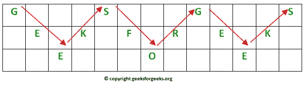

# 围栏密码–加密和解密

> 原文:[https://www . geesforgeks . org/rail-fence-cipher-encryption-decryption/](https://www.geeksforgeeks.org/rail-fence-cipher-encryption-decryption/)

给定纯文本消息和数字密钥，使用 Rail Fence 算法对给定文本进行加密/解密。
围栏密码(也叫之字形密码)是换位密码的一种形式。它的名字来源于它的编码方式。
**例:**

```
Encryption
Input :  "GeeksforGeeks "
Key = 3
Output : GsGsekfrek eoe
Decryption
Input : GsGsekfrek eoe
Key = 3
Output :  "GeeksforGeeks "

Encryption
Input :  "defend the east wall"
Key = 3
Output : dnhaweedtees alf  tl
Decryption
Input : dnhaweedtees alf  tl
Key = 3
Output : defend the east wall

Encryption
Input : "attack at once"
Key = 2 
Output : atc toctaka ne 
Decryption
Input : "atc toctaka ne"
Key = 2
Output : attack at once
```

**加密**

在换位密码中，字母的顺序被重新排列以获得密码文本。

*   在围栏密码中，纯文本写在假想围栏的连续围栏上，并沿对角线向下。
*   当我们到达底轨时，我们沿对角线向上移动，到达顶轨后，方向再次改变。因此，信息的字母以之字形书写。
*   在每一个字母都写好之后，单独的行被组合起来得到密码文本。

例如，如果消息是“GeeksforGeeks”，并且轨道数= 3，则密码准备为:



**解密**

正如我们前面看到的，铁路围栏密码中的列数仍然等于纯文本消息的长度。键对应于轨道的数量。

*   因此，可以相应地构造轨道矩阵。一旦我们得到了矩阵，我们就可以计算出文本应该放在哪里(使用同样的方式交替地上下移动)。
*   然后，我们逐行填充密文。填充后，我们以之字形方式遍历矩阵以获得原始文本。

实现:
让密文=“GsGsekfrek eoe”，Key = 3

*   矩阵中的列数= len(密文)= 13
*   行数=键= 3

因此原始矩阵将是 3*13，现在用文本标记地方为' * '我们得到

```
* _ _ _ * _ _ _ * _ _ _ *
_ * _ * _ * _ * _ * _ * 
_ _ * _ _ _ *  _ _ _ * _ 
```

下面是使用上述算法加密/解密消息的程序。

## C++

```
// C++ program to illustrate Rail Fence Cipher
// Encryption and Decryption
#include <bits/stdc++.h>
using namespace std;

// function to encrypt a message
string encryptRailFence(string text, int key)
{
    // create the matrix to cipher plain text
    // key = rows , length(text) = columns
    char rail[key][(text.length())];

    // filling the rail matrix to distinguish filled
    // spaces from blank ones
    for (int i=0; i < key; i++)
        for (int j = 0; j < text.length(); j++)
            rail[i][j] = '\n';

    // to find the direction
    bool dir_down = false;
    int row = 0, col = 0;

    for (int i=0; i < text.length(); i++)
    {
        // check the direction of flow
        // reverse the direction if we've just
        // filled the top or bottom rail
        if (row == 0 || row == key-1)
            dir_down = !dir_down;

        // fill the corresponding alphabet
        rail[row][col++] = text[i];

        // find the next row using direction flag
        dir_down?row++ : row--;
    }

    //now we can construct the cipher using the rail matrix
    string result;
    for (int i=0; i < key; i++)
        for (int j=0; j < text.length(); j++)
            if (rail[i][j]!='\n')
                result.push_back(rail[i][j]);

    return result;
}

// This function receives cipher-text and key
// and returns the original text after decryption
string decryptRailFence(string cipher, int key)
{
    // create the matrix to cipher plain text
    // key = rows , length(text) = columns
    char rail[key][cipher.length()];

    // filling the rail matrix to distinguish filled
    // spaces from blank ones
    for (int i=0; i < key; i++)
        for (int j=0; j < cipher.length(); j++)
            rail[i][j] = '\n';

    // to find the direction
    bool dir_down;

    int row = 0, col = 0;

    // mark the places with '*'
    for (int i=0; i < cipher.length(); i++)
    {
        // check the direction of flow
        if (row == 0)
            dir_down = true;
        if (row == key-1)
            dir_down = false;

        // place the marker
        rail[row][col++] = '*';

        // find the next row using direction flag
        dir_down?row++ : row--;
    }

    // now we can construct the fill the rail matrix
    int index = 0;
    for (int i=0; i<key; i++)
        for (int j=0; j<cipher.length(); j++)
            if (rail[i][j] == '*' && index<cipher.length())
                rail[i][j] = cipher[index++];

    // now read the matrix in zig-zag manner to construct
    // the resultant text
    string result;

    row = 0, col = 0;
    for (int i=0; i< cipher.length(); i++)
    {
        // check the direction of flow
        if (row == 0)
            dir_down = true;
        if (row == key-1)
            dir_down = false;

        // place the marker
        if (rail[row][col] != '*')
            result.push_back(rail[row][col++]);

        // find the next row using direction flag
        dir_down?row++: row--;
    }
    return result;
}

//driver program to check the above functions
int main()
{
    cout << encryptRailFence("attack at once", 2) << endl;
    cout << encryptRailFence("GeeksforGeeks ", 3) << endl;
    cout << encryptRailFence("defend the east wall", 3) << endl;

    //Now decryption of the same cipher-text
    cout << decryptRailFence("GsGsekfrek eoe",3) << endl;
    cout << decryptRailFence("atc toctaka ne",2) << endl;
    cout << decryptRailFence("dnhaweedtees alf tl",3) << endl;

    return 0;
}
```

## 蟒蛇 3

```
# Python3 program to illustrate
# Rail Fence Cipher Encryption
# and Decryption

# function to encrypt a message
def encryptRailFence(text, key):

    # create the matrix to cipher
    # plain text key = rows ,
    # length(text) = columns
    # filling the rail matrix
    # to distinguish filled
    # spaces from blank ones
    rail = [['\n' for i in range(len(text))]
                  for j in range(key)]

    # to find the direction
    dir_down = False
    row, col = 0, 0

    for i in range(len(text)):

        # check the direction of flow
        # reverse the direction if we've just
        # filled the top or bottom rail
        if (row == 0) or (row == key - 1):
            dir_down = not dir_down

        # fill the corresponding alphabet
        rail[row][col] = text[i]
        col += 1

        # find the next row using
        # direction flag
        if dir_down:
            row += 1
        else:
            row -= 1
    # now we can construct the cipher
    # using the rail matrix
    result = []
    for i in range(key):
        for j in range(len(text)):
            if rail[i][j] != '\n':
                result.append(rail[i][j])
    return("" . join(result))

# This function receives cipher-text
# and key and returns the original
# text after decryption
def decryptRailFence(cipher, key):

    # create the matrix to cipher
    # plain text key = rows ,
    # length(text) = columns
    # filling the rail matrix to
    # distinguish filled spaces
    # from blank ones
    rail = [['\n' for i in range(len(cipher))]
                  for j in range(key)]

    # to find the direction
    dir_down = None
    row, col = 0, 0

    # mark the places with '*'
    for i in range(len(cipher)):
        if row == 0:
            dir_down = True
        if row == key - 1:
            dir_down = False

        # place the marker
        rail[row][col] = '*'
        col += 1

        # find the next row
        # using direction flag
        if dir_down:
            row += 1
        else:
            row -= 1

    # now we can construct the
    # fill the rail matrix
    index = 0
    for i in range(key):
        for j in range(len(cipher)):
            if ((rail[i][j] == '*') and
               (index < len(cipher))):
                rail[i][j] = cipher[index]
                index += 1

    # now read the matrix in
    # zig-zag manner to construct
    # the resultant text
    result = []
    row, col = 0, 0
    for i in range(len(cipher)):

        # check the direction of flow
        if row == 0:
            dir_down = True
        if row == key-1:
            dir_down = False

        # place the marker
        if (rail[row][col] != '*'):
            result.append(rail[row][col])
            col += 1

        # find the next row using
        # direction flag
        if dir_down:
            row += 1
        else:
            row -= 1
    return("".join(result))

# Driver code
if __name__ == "__main__":
    print(encryptRailFence("attack at once", 2))
    print(encryptRailFence("GeeksforGeeks ", 3))
    print(encryptRailFence("defend the east wall", 3))

    # Now decryption of the
    # same cipher-text
    print(decryptRailFence("GsGsekfrek eoe", 3))
    print(decryptRailFence("atc toctaka ne", 2))
    print(decryptRailFence("dnhaweedtees alf tl", 3))

# This code is contributed
# by Pratik Somwanshi
```

**输出:**

```
atc toctaka ne
GsGsekfrek eoe
dnhaweedtees alf  tl
GeeksforGeeks 
attack at once
delendfthe east wal
```

**时间复杂度:** O(row * col)
**辅助空间:** O(row * col)
**参考文献:**
[https://en.wikipedia.org/wiki/Rail_fence_cipher](https://en.wikipedia.org/wiki/Rail_fence_cipher)
本文由[**Ashutosh Kumar**](https://in.linkedin.com/in/ashutosh-kumar-9527a7105)投稿如果你喜欢 GeeksforGeeks 并愿意投稿，也可以使用[write.geeksforgeeks.org](https://write.geeksforgeeks.org)写一篇文章或者将文章邮寄到 review-team@geeksforgeeks.org。看到你的文章出现在极客博客主页上，帮助其他极客。
如果发现有不正确的地方，或者想分享更多关于上述话题的信息，请写评论。