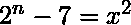

# ramanujan-nail 猜想

> 哎哎哎:# t0]https://www . geeksforgeeks . org/ramanujan-nail-猜想/

**Ramanujan-Nagell 方程是一个平方数(比如 x)和另一个数(比如 z)之间的方程，这样 z = ** 。这里，n 可以是满足等式的任何正自然数。这是一个指数[丢番图方程](https://www.geeksforgeeks.org/linear-diophantine-equations/)的例子，这是一个只能有积分解的方程，其中一个变量(这里是 n)在方程中作为指数出现。

因此，方程为:

，自然数 x 和 n 中的解只在 n = 3、4、5、7 和 15 时存在。

```
Some examples are 
2^3 - 7 = (1)^2, where n = 3 and x = 1
2^4 - 7 = (3)^2, where n = 4 and x = 3
2^5 - 7 = (5)^2, where n = 5 and x = 5

```

这个猜想是寻找[三角梅森数](https://en.wikipedia.org/wiki/Ramanujan%E2%80%93Nagell_equation#Triangular_Mersenne_numbers)问题的精髓