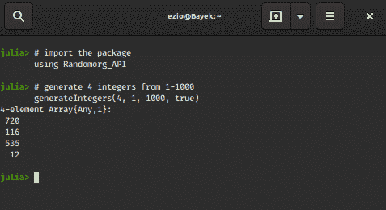
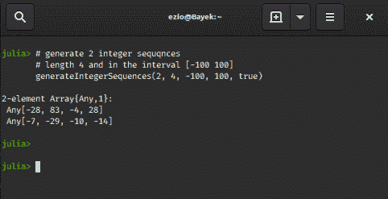

# 朱莉娅的随机数生态系统——自然的一面

> 原文:[https://www . geesforgeks . org/random-numbers-生态系统-in-julia-the-natural-side/](https://www.geeksforgeeks.org/random-numbers-ecosystem-in-julia-the-natural-side/)

如果我们敏锐地观察到，**随机性**可以有效地从**自然**中推导出来。尽管可以用科学现象来解释，但地球上大多数物质的行为是随机的(尽管它可能取决于周围的条件)。树叶在树上的飘动虽然在物理学上是合理的，但在人眼看来是随机的，球员在足球场上的运动也是相当随机的，尽管受到策略/球的位置等的影响。
在[的最后一篇文章](https://www.geeksforgeeks.org/random-numbers-ecosystem-in-julia-the-pseudo-side/)中，我们谈到了**数学/算法**生成随机数的方法，因此**为伪**。伪随机数发生器非常适合一般应用。但是他们有一个缺点。如果第三个人知道 RNG 初始化时使用的**种子**值，他/她可以很容易地预测 RNG 可能给出的数字序列。这可能会导致申请阶段出现严重失误。

### 真随机数发生器

要解决这个问题，一种方法是使用**随机数生成器**代替**随机数生成器**。
但是**trng**的生成往往非常慢，用户可能需要等待才能获得所需数量的随机值。此外，它们的性能/有效性在很大程度上取决于**来源**。初始值可能是不可预测的，但我们最终可能会得到一个一致的随机数模式/流。
另一种方法是给 **PRNG** 播种一个由 **TRNG** 生成的值。这样我们的种子值，因此最终的输出会变得更加**安全**，因为**种子**的值也是随机的。有许多 **TRNG** 的来源。最随机的一个来源是**大气噪音**导致的打雷、**空间碎片**等。这种方法非常有效，并且被广泛使用。

### 将自然的随机性输入计算机

从自然界生成随机数是一种经典而有效的方法。[**Random.org**](http://Random.org)是一个从大气噪音中产生随机性的组织。您可以查看以上链接并使用他们提供的服务。但是，如果我们运行的是一个**模拟**，需要在特定的步骤中自动连续地输入随机数，会怎么样呢？我们只是不能每次都去**random.org**网站抄号。幸运的是**Random.org**提供了一个**应用编程接口**，允许开发人员为他们的界面编写**客户端**。**应用编程接口客户端**将直接对 Random.org 服务器进行 **HTTP 调用**，获取所需数据。

### 特里廷斯在茱莉亚

来到 **Julia** ，提供利用 **JSON-RPC** 请求和 **HTTP** 调用(分别通过 **HTTP.jl** 和 **JSON.jl** )。但是手动发出 **POST** 请求，每次我们需要随机数的时候可能会变得很无聊。幸运的是**random morg _ API . JL**包为我们处理了这个。带有详细自述文件的软件包链接可在此处获得。
目前该包支持以下功能:

#### generateIntegers()函数

该方法在用户定义的范围内生成真随机**整数**。

> **语法:**
> 生成整数(n，min，max，replacement)
> **参数:**
> 
> *   **n:** 指定需要多少个随机整数。
> *   **min:** 这是将从中挑选随机数的范围的下限。
> *   **最大值:**这是将从中挑选随机数的范围的上限。
> *   **替换:**指定随机数是否应该替换拾取。缺省值( **true** )将导致数字被替换，即结果数字可能包含重复值。如果您希望选取的数字是唯一的，请将此值设置为**假**。

**例:**

## 蟒蛇 3

```
# import the package
using Randomorg_API

# generate 4 integers from 1-1000
generateIntegers(4, 1, 1000, true)
```

**输出:**



#### generateIntegerSequences()函数

该方法在用户定义的范围内生成统一或多种形式的真随机整数**序列**。
**语法:**

```
generateIntegerSequences(n, length, min, max, replacement)
```

**例:**

## 蟒蛇 3

```
# generate 2 integer sequqnces
# length 4 and in the interval [-100 100]
generateIntegerSequences(2, 4, -100, 100, true)
```

**输出:**



#### generateDecimalFractions()函数

该方法通过用户定义的小数位数在
【0，1】区间内均匀分布，生成真正随机的**小数**。

> **语法:**
> generated cimalfractions(n，decimalPlaces，replacement)
> **参数:**
> **decimalPlaces:** 要使用的小数位数。

**例:**

## 蟒蛇 3

```
# generate 4 float values
# with 3 decimal places each
generateDecimalFractions(4, 3, true)
```