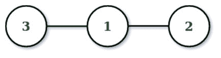
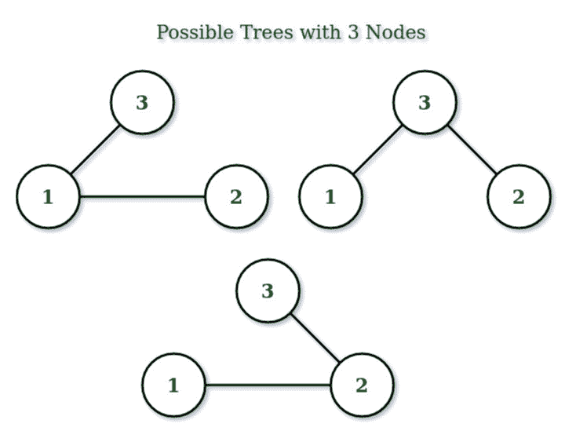

# 使用概率序列的随机树生成器，示例

> 原文:[https://www . geesforgeks . org/random-tree-generator-use-prufer-sequence-with-examples/](https://www.geeksforgeeks.org/random-tree-generator-using-prufer-sequence-with-examples/)

给定一个整数 **N** ，任务是生成一个带有**(N–1)**边的 **N** 节点的随机标记树，不形成循环。
**注意:**下面生成的输出是随机的，可能与代码生成的输出不匹配。
**举例:**

> **输入:** N = 3
> **输出:**
> 1 3
> 1 2
> 
> 
> 
> **输入:** N = 5
> **输出:**
> 3 2
> 4 3
> 1 4
> 1 5

这种方法使用[概率序列](https://www.geeksforgeeks.org/prufer-code-tree-creation/)来生成随机树。
**什么是普吕弗序列？**
在[组合数学](https://www.geeksforgeeks.org/mathematics-combinatorics-basics/)中，标记树的普吕弗序列(也称为普吕弗码或普吕弗数)是与树相关联的唯一序列。n 个顶点上的树的序列长度为 n–2，可以通过简单的迭代算法生成。
如果节点数为 N，则 Prüfer 序列的长度为(N–2)，每个位置可以有 N 个可能的值。所以有 **N** 节点的可能标记树的数量为**N<sup>(N–2)</sup>**。
**随机树是如何使用概率序列生成的？**
一般情况下，N 个节点的随机树生成按以下步骤进行:

*   生成随机序列

```
S = {s1, s2, s3.....sn-2}
```

*   其中序列的每个元素**s<sub>I</sub>∑{ 1，2，3，… N}** 允许元素重复
*   从生成的程序序列**生成树**:
    1.  用值 **{1，2，3，… N}** 创建 N 个节点
    2.  找到最小元素 x，使得**x∞{ 1，2，3，… N}** 和 **X ∉ S**
    3.  将值为 X 的节点连接到值为**s<sub>1</sub>T3 的节点**
    4.  从 **S** 中删除**S<sub>1</sub>T3**
    5.  重复步骤 2 中的相同过程，直到程序序列为空。

**例如:**

*   节点数= **3**

*   那么预测序列的长度将是**(N–2)**，因为在这种情况下，它将是 1，并且可能的值可以是 **{1，2，3}** 。

*   可能的随机序列是 **{{1}、{2}、{3}}** 。



下面是上述方法的实现。

## C++

```
// C++ Implementation for random
// tree generator using Prufer Sequence
#include<bits/stdc++.h>
using namespace std;

// Prints edges of tree
// represented by give Prufer code
void printTreeEdges(vector<int> prufer, int m)
{
    int vertices = m + 2;
    vector<int> vertex_set(vertices);

    // Initialize the array of vertices
    for (int i = 0; i < vertices; i++)
        vertex_set[i] = 0;

    // Number of occurrences of vertex in code
    for (int i = 0; i < vertices - 2; i++)
        vertex_set[prufer[i] - 1] += 1;

    cout<<("\nThe edge set E(G) is:\n");

    int j = 0;

    // Find the smallest label not present in
    // prufer[].
    for (int i = 0; i < vertices - 2; i++)
    {
        for (j = 0; j < vertices; j++)
        {

            // If j+1 is not present in prufer set
            if (vertex_set[j] == 0)
            {

                // Remove from Prufer set and print
                // pair.
                vertex_set[j] = -1;
                cout<<"(" << (j + 1) << ", "
                                << prufer[i] << ") ";

                vertex_set[prufer[i] - 1]--;

                break;
            }
        }
    }

    j = 0;

    // For the last element
    for (int i = 0; i < vertices; i++)
    {
        if (vertex_set[i] == 0 && j == 0)
        {

            cout << "(" << (i + 1) << ", ";
            j++;
        }
        else if (vertex_set[i] == 0 && j == 1)
            cout << (i + 1) << ")\n";
    }
}

// generate random numbers in between l an r
int ran(int l, int r)
{
    return l + (rand() % (r - l + 1));
}

// Function to Generate Random Tree
void generateRandomTree(int n)
{

    int length = n - 2;
    vector<int> arr(length);

    // Loop to Generate Random Array
    for (int i = 0; i < length; i++)
    {
        arr[i] = ran(0, length + 1) + 1;
    }
    printTreeEdges(arr, length);
}

// Driver Code
int main()
{
    srand(time(0));
    int n = 5;
    generateRandomTree(n);

    return 0;
}
```

## Java 语言(一种计算机语言，尤用于创建网站)

```
// Java Implementation for random
// tree generator using Prufer Sequence

import java.util.Arrays;
import java.util.Random;

class GFG {

    // Prints edges of tree
    // represented by give Prufer code
    static void printTreeEdges(int prufer[], int m)
    {
        int vertices = m + 2;
        int vertex_set[] = new int[vertices];

        // Initialize the array of vertices
        for (int i = 0; i < vertices; i++)
            vertex_set[i] = 0;

        // Number of occurrences of vertex in code
        for (int i = 0; i < vertices - 2; i++)
            vertex_set[prufer[i] - 1] += 1;

        System.out.print("\nThe edge set E(G) is:\n");

        int j = 0;

        // Find the smallest label not present in
        // prufer[].
        for (int i = 0; i < vertices - 2; i++) {
            for (j = 0; j < vertices; j++) {

                // If j+1 is not present in prufer set
                if (vertex_set[j] == 0) {

                    // Remove from Prufer set and print
                    // pair.
                    vertex_set[j] = -1;
                    System.out.print("(" + (j + 1) + ", "
                                     + prufer[i] + ") ");

                    vertex_set[prufer[i] - 1]--;

                    break;
                }
            }
        }

        j = 0;

        // For the last element
        for (int i = 0; i < vertices; i++) {
            if (vertex_set[i] == 0 && j == 0) {

                System.out.print("(" + (i + 1) + ", ");
                j++;
            }
            else if (vertex_set[i] == 0 && j == 1)
                System.out.print((i + 1) + ")\n");
        }
    }

    // Function to Generate Random Tree
    static void generateRandomTree(int n)
    {

        Random rand = new Random();
        int length = n - 2;
        int[] arr = new int[length];

        // Loop to Generate Random Array
        for (int i = 0; i < length; i++) {
            arr[i] = rand.nextInt(length + 1) + 1;
        }
        printTreeEdges(arr, length);
    }

    // Driver Code
    public static void main(String[] args)
    {
        int n = 5;
        generateRandomTree(n);
    }
}
```

## C#

```
// C# Implementation for random
// tree generator using Prufer Sequence
using System;

class GFG
{

    // Prints edges of tree
    // represented by give Prufer code
    static void printTreeEdges(int []prufer, int m)
    {
        int vertices = m + 2;
        int []vertex_set = new int[vertices];

        // Initialize the array of vertices
        for (int i = 0; i < vertices; i++)
            vertex_set[i] = 0;

        // Number of occurrences of vertex in code
        for (int i = 0; i < vertices - 2; i++)
            vertex_set[prufer[i] - 1] += 1;

        Console.Write("\nThe edge set E(G) is:\n");

        int j = 0;

        // Find the smallest label not present in
        // prufer[].
        for (int i = 0; i < vertices - 2; i++)
        {
            for (j = 0; j < vertices; j++)
            {

                // If j + 1 is not present in prufer set
                if (vertex_set[j] == 0)
                {

                    // Remove from Prufer set and print
                    // pair.
                    vertex_set[j] = -1;
                    Console.Write("(" + (j + 1) + ", "
                                    + prufer[i] + ") ");

                    vertex_set[prufer[i] - 1]--;

                    break;
                }
            }
        }

        j = 0;

        // For the last element
        for (int i = 0; i < vertices; i++)
        {
            if (vertex_set[i] == 0 && j == 0)
            {

                Console.Write("(" + (i + 1) + ", ");
                j++;
            }
            else if (vertex_set[i] == 0 && j == 1)
                Console.Write((i + 1) + ")\n");
        }
    }

    // Function to Generate Random Tree
    static void generateRandomTree(int n)
    {

        Random rand = new Random();
        int length = n - 2;
        int[] arr = new int[length];

        // Loop to Generate Random Array
        for (int i = 0; i < length; i++)
        {
            arr[i] = rand.Next(length + 1) + 1;
        }
        printTreeEdges(arr, length);
    }

    // Driver Code
    public static void Main(String[] args)
    {
        int n = 5;
        generateRandomTree(n);
    }
}

// This code is contributed by 29AjayKumar
```

## java 描述语言

```
<script>
// Javascript Implementation for random
// tree generator using Prufer Sequence

// Prints edges of tree
    // represented by give Prufer code
function printTreeEdges(prufer,m)
{
    let vertices = m + 2;
        let vertex_set = new Array(vertices);

        // Initialize the array of vertices
        for (let i = 0; i < vertices; i++)
            vertex_set[i] = 0;

        // Number of occurrences of vertex in code
        for (let i = 0; i < vertices - 2; i++)
            vertex_set[prufer[i] - 1] += 1;

        document.write("<br>The edge set E(G) is:<br>");

        let j = 0;

        // Find the smallest label not present in
        // prufer[].
        for (let i = 0; i < vertices - 2; i++) {
            for (j = 0; j < vertices; j++) {

                // If j+1 is not present in prufer set
                if (vertex_set[j] == 0) {

                    // Remove from Prufer set and print
                    // pair.
                    vertex_set[j] = -1;
                    document.write("(" + (j + 1) + ", "
                                     + prufer[i] + ") ");

                    vertex_set[prufer[i] - 1]--;

                    break;
                }
            }
        }

        j = 0;

        // For the last element
        for (let i = 0; i < vertices; i++) {
            if (vertex_set[i] == 0 && j == 0) {

                document.write("(" + (i + 1) + ", ");
                j++;
            }
            else if (vertex_set[i] == 0 && j == 1)
                document.write((i + 1) + ")<br>");
        }
}

// Function to Generate Random Tree
function generateRandomTree(n)
{
    let length = n - 2;
        let arr = new Array(length);

        // Loop to Generate Random Array
        for (let i = 0; i < length; i++) {
            arr[i] = Math.floor(Math.random()*(length + 1)) + 1;
        }
        printTreeEdges(arr, length);
}

// Driver Code
let n = 5;
generateRandomTree(n);

// This code is contributed by unknown2108
</script>
```

**Output:** 

```
The edge set E(G) is:
(2, 4) (4, 3) (3, 1) (1, 5)
```

**时间复杂度:**O(N * N)
T3】辅助空间: O(N)