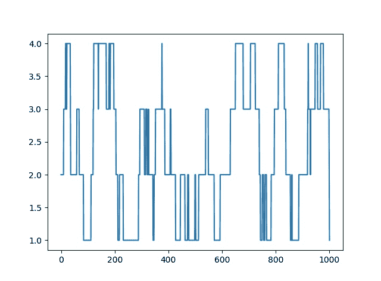
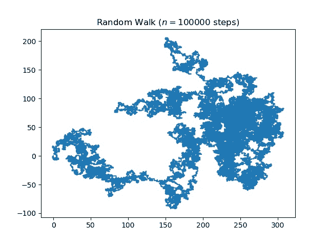

# 随机漫步(Python 实现)

> 原文:[https://www . geesforgeks . org/random-walk-implementation-python/](https://www.geeksforgeeks.org/random-walk-implementation-python/)

**引言**随机漫步是一种数学对象，被称为随机或随机过程，它描述了一条由一些数学空间(如整数)上的一系列随机步骤组成的路径。随机游走的一个基本例子是整数线上的随机游走，从 0 开始，每一步都以相等的概率移动+1 或-1。其他例子包括分子在液体或气体中行进的路径、觅食动物的搜索路径、波动股票的价格和赌徒的财务状况都可以用随机行走模型来近似，尽管它们在现实中可能不是真正随机的。这些例子说明，随机漫步可以应用于许多科学领域，包括生态学、心理学、计算机科学、物理学、化学、生物学以及经济学。随机漫步解释了这些领域中许多过程的观察到的行为，因此作为记录的随机活动的基本模型。作为一个更数学的应用，pi 的值可以通过在基于代理的建模环境中使用随机游走来近似。

厌倦了无聊的理论。让我们休息一下，了解一下代码。因此，为了编码出随机游走，我们基本上需要 python 中的一些库，一些库用来做数学，一些库用来绘制曲线。

**所需库**

*   **matplotlib** 这是一个外部库，可以帮助你绘制曲线。要安装此库，请在 cmd 中键入以下代码。

```
pip install matplotlib
```

这足以让你完成安装。

*   **numpy** 它也是 python 中的一个外部库，可以帮助你处理数组和矩阵。要安装库，请在 cmd 中键入以下代码。

```
pip install numpy
```

*   **随机**这是一个内置的 python 库，我们将使用它来生成随机点。

**一维随机漫步**随机漫步的一个基本例子是整数线上的随机漫步，从 0 开始，每走一步就移动+1 或？1 的概率相等。

所以让我们试着用 python 实现一维随机漫步。

## 蟒蛇 3

```
# Python code for 1-D random walk.
import random
import numpy as np
import matplotlib.pyplot as plt

# Probability to move up or down
prob = [0.05, 0.95] 

# statically defining the starting position
start = 2 
positions = [start]

# creating the random points
rr = np.random.random(1000)
downp = rr < prob[0]
upp = rr > prob[1]

for idownp, iupp in zip(downp, upp):
    down = idownp and positions[-1] > 1
    up = iupp and positions[-1] < 4
    positions.append(positions[-1] - down + up)

# plotting down the graph of the random walk in 1D
plt.plot(positions)
plt.show()
```

**输出:**



**更高维度**在更高维度中，随机行走的点集合具有有趣的几何属性。事实上，我们得到了一个离散的分形，即在大尺度上表现出随机自相似性的集合。在小尺度上，人们可以观察到行走时网格产生的“锯齿”。下面引用的劳勒的两本书是这个话题的很好的来源。随机行走的轨迹是所访问的点的集合，被认为是一个集合，不考虑行走何时到达该点。在一维中，轨迹只是行走所达到的最小高度和最大高度之间的所有点(平均来说，两者的数量级都是？n)。

让我们尝试在 2D 创建一个随机漫步。

## 蟒蛇 3

```
# Python code for 2D random walk.
import numpy
import pylab
import random

# defining the number of steps
n = 100000

#creating two array for containing x and y coordinate
#of size equals to the number of size and filled up with 0's
x = numpy.zeros(n)
y = numpy.zeros(n)

# filling the coordinates with random variables
for i in range(1, n):
    val = random.randint(1, 4)
    if val == 1:
        x[i] = x[i - 1] + 1
        y[i] = y[i - 1]
    elif val == 2:
        x[i] = x[i - 1] - 1
        y[i] = y[i - 1]
    elif val == 3:
        x[i] = x[i - 1]
        y[i] = y[i - 1] + 1
    else:
        x[i] = x[i - 1]
        y[i] = y[i - 1] - 1

# plotting stuff:
pylab.title("Random Walk ($n = " + str(n) + "$ steps)")
pylab.plot(x, y)
pylab.savefig("rand_walk"+str(n)+".png",bbox_inches="tight",dpi=600)
pylab.show()
```

**输出:**



**应用程序**

1.  在计算机网络中，随机漫步可以模拟服务器上缓冲的传输数据包的数量。
2.  在群体遗传学中，随机游走描述了遗传漂移的统计特性。
3.  在图像分割中，随机游走用于确定与每个像素相关联的标签(即，“对象”或“背景”)。
4.  在大脑研究中，随机游走和强化随机游走被用来模拟大脑中神经元放电的级联反应。
5.  随机漫步也被用于在线社交网络等海量在线图表的采样。

**参考文献**T2【1】。[维基百科-随机漫步](https://en.wikipedia.org/wiki/Random_walk)T5】2。[Stackoverflow–随机漫步 1D](https://stackoverflow.com/questions/37052140/1d-random-walk-from-matlab-to-python)T8】3。 [matplotlib 文档](https://matplotlib.org/users/pyplot_tutorial.html)
本文由 [**Subhajit Saha**](https://www.linkedin.com/in/subhajit-saha-06aa29131/) 供稿。如果你喜欢 GeeksforGeeks 并想投稿，你也可以使用[write.geeksforgeeks.org](https://write.geeksforgeeks.org)写一篇文章或者把你的文章邮寄到 review-team@geeksforgeeks.org。看到你的文章出现在极客博客主页上，帮助其他极客。
如果发现有不正确的地方，或者想分享更多关于上述话题的信息，请写评论。