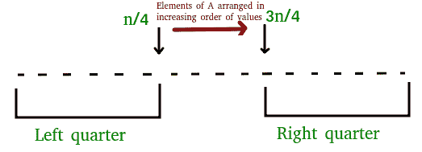
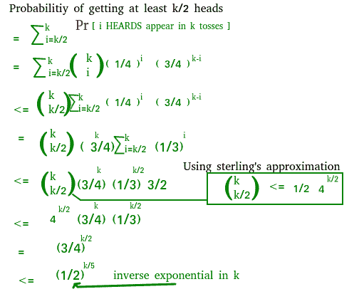

# 随机化算法|集合 3 (1/2 近似中值)

> 原文:[https://www . geesforgeks . org/随机化-算法-集合-3-12-近似-中位数/](https://www.geeksforgeeks.org/randomized-algorithms-set-3-12-approximate-median/)

我们强烈建议参考以下文章作为前提。

[随机化算法|集合 1(介绍和分析)](https://www.geeksforgeeks.org/randomized-algorithms-set-1-introduction-and-analysis/)
[随机化算法|集合 2(分类和应用)](https://www.geeksforgeeks.org/randomized-algorithms-set-2-classification-and-applications/)

在这篇文章中，讨论了蒙特卡罗算法。

**问题陈述:**给定一个由 n 个数字和ε > 0 组成的未排序数组 A[]，计算一个元素，该元素的秩(在已排序数组 A[])在[(1–ε)n/2，(1 + ε)n/2]的范围内。
求近似中值算法&爱普西隆；is 1/2 = >秩应在[n/4，3n/4]范围内

我们可以在 [O(n)预期时间](https://www.geeksforgeeks.org/kth-smallestlargest-element-unsorted-array-set-2-expected-linear-time/)和 [O(n)最坏情况](https://www.geeksforgeeks.org/kth-smallestlargest-element-unsorted-array-set-3-worst-case-linear-time/)时间中找到 k 的最小元素。

**如果我们希望在不到 O(n)的时间内获得允许的低概率误差，该怎么办？**
以下步骤代表的算法为 O((Log n) x (Log Log n))时间，产生不正确结果的概率小于或等于 2/n <sup>2</sup> 。

1.  从数组中随机选择 k 个元素，其中 k=c log n (c 是某个常数)
2.  然后插入一组。
3.  对集合中的元素进行排序。
4.  Return median of the set i.e. (k/2)th element from the set

    ## C

    ```
    /* C++ program to find Approximate Median using
       1/2 Approximate Algorithm */
    #include<bits/stdc++.h>
    using namespace std;

    // This function returns the Approximate Median
    int randApproxMedian(int arr[],int n)
    {
        // Declaration for the random number generator
        random_device rand_dev;
        mt19937 generator(rand_dev());

        // Random number generated will be in the range [0,n-1]
        uniform_int_distribution<int> distribution(0, n-1);

        if (n==0)
            return 0;

        int k = 10*log2(n); // Taking c as 10

        // A set stores unique elements in sorted order
        set<int> s;
        for (int i=0; i<k; i++)
        {
            // Generating a random index
            int index = distribution(generator);

            //Inserting into the set
            s.insert(arr[index]);
        }

        set<int> ::iterator itr = s.begin();

        // Report the median of the set at k/2 position
        // Move the itr to k/2th position
        advance(itr, (s.size()/2) - 1);

        // Return the median
        return *itr;
    }

    // Driver method to test above method
    int main()
    {
        int arr[] = {1, 3, 2, 4, 5, 6, 8, 7};
        int n = sizeof(arr)/sizeof(int);
        printf("Approximate Median is %d\n",randApproxMedian(arr,n));
        return 0
    }
    ```

    ## Java 语言(一种计算机语言，尤用于创建网站)

    ```
    /* Java program to find Approximate Median using
       1/2 Approximate Algorithm */
    import java.util.Iterator;
    import java.util.Random;
    import java.util.TreeSet;

    class Test
    {
        static int arr[] = new int[]{1, 3, 2, 4, 5, 6, 8, 7} ;

        // This function returns the Approximate Median
        static int randApproxMedian(int n)
        {
            // Declaration for the random number 
            Random r = new Random();

            if (n==0)
                return 0;

            double k1 = 10*Math.log(n); // Taking c as 10

            int k = (int)k1;

            // A treeset stores unique elements in sorted order
            TreeSet s = new TreeSet<Integer>();
            for (int i=0; i<k; i++)
            {
                // Generating a random index
                // Random number generated will be in the range [0,n-1]
                int index = r.nextInt(n);

                //Inserting into the set
                s.add(arr[index]);
            }

            Iterator<Integer> itr = s.iterator();

            int temp = s.size()/2 - 1;

            for (int i = 0; i < temp; i++) {
                itr.next();
            }

            // Return the median
            return itr.next();
        }

        // Driver method to test the above function
        public static void main(String[] args) {

            System.out.println("Approximate Median is " + randApproxMedian(arr.length));

        }
    }
    ```

    输出:

    ```
    Approximate Median is 4
    ```

    **时间复杂度:**
    我们使用 C++中 STL 提供的一个集合。在 STL 集中，每个元素的插入都需要 0(对数 k)。所以对于 k 次插入，花费的时间是 O (k log k)。
    现在将 k 替换为 c log n
    =>O(c log n(log(clog n)))=>O(log n(log log n))

    **误差概率如何小于 2/n <sup>2</sup> ？**
    如果集合 S 至少有 k/2 个元素来自左四分之一或右四分之一，算法会出错。
    

    这种说法很容易想象，因为我们报告的中位数是第(k/2)个元素，如果我们从左四分之一(或右四分之一)取 k/2 个元素，中位数将是从左四分之一(或右四分之一)。

    一个数组可以分成 4 个四分之一，每个四分之一大小为 n/4。所以 P(选择左四分之一)是 1/4。那么至少 k/2 个元素来自左四分之一或右四分之一的概率是多少呢？这个概率问题如下:

    给定一枚概率为 1/4 的正面和概率为 3/4 的反面的硬币。硬币被抛了 k 次。我们得到至少 k/2 HEADS 小于或等于的概率是多少？

    **说明:** 

    ```
    If we put k = c log n for c = 10, we get 
    P <= (1/2)2log n
    P <= (1/2)log n<sup>2</sup>
    P <= n-2

    ```

    从左四分之一选择至少 k/2 个元素的概率)<= 1/n <sup>2</sup>
    从左四分之一或右四分之一选择至少 k/2 个元素的概率)< = 2/n <sup>2</sup>

    因此，算法产生不正确的结果，概率小于或等于 2/n <sup>2</sup> 。

     **参考文献:**

    本文由 **Chirag Agarwal** 供稿。如果你喜欢极客博客并想投稿，你也可以写一篇文章并把你的文章邮寄到 contribute@geeksforgeeks.org。看到你的文章出现在极客博客主页上，帮助其他极客。

    如果您发现任何不正确的地方，或者您想分享更多关于上面讨论的主题的信息，请写评论