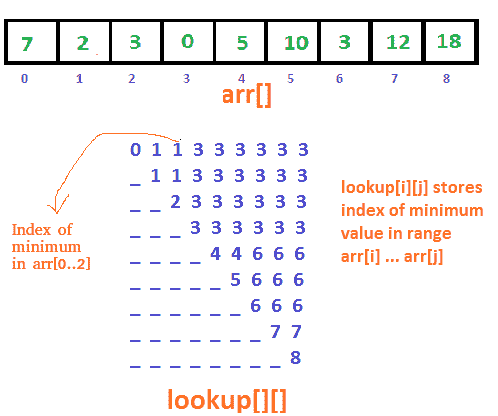

# 最小值的范围查询（平方根分解和稀疏表）

> 原文： [https://www.geeksforgeeks.org/range-minimum-query-for-static-array/](https://www.geeksforgeeks.org/range-minimum-query-for-static-array/)

我们有一个数组`arr[0 ... n-1]`。 我们应该能够有效地找到从索引`L`（查询开始）到`R`（查询结束）的最小值，其中`0 <= L <= R <= n-1`。 考虑存在许多范围查询的情况。

**示例**：

```
Input:  arr[]   = {7, 2, 3, 0, 5, 10, 3, 12, 18};
        query[] = [0, 4], [4, 7], [7, 8]

Output: Minimum of [0, 4] is 0
        Minimum of [4, 7] is 3
        Minimum of [7, 8] is 12

```

**简单解决方案**是运行从`L`到`R`的循环，并找到给定范围内的最小元素。 在最坏的情况下，此解决方案需要`O(n)`时间来查询。

另一种方法是使用[**段树**](https://www.geeksforgeeks.org/segment-tree-set-1-range-minimum-query/)。 对于段树，预处理时间为`O(n)`，到范围最小查询的时间为`O(log n)`。 存储段树所需的额外空间为`O(n)`。 段树也允许在`O(log n)`时间进行更新。

### 如果我们知道数组是静态的，我们可以做得更好吗？

没有更新操作且范围最小查询很多时，如何优化查询时间？

以下是不同的方法。

**方法 1（简单解决方案）**：

一个简单解决方案是创建 2D 数组`lookup[][]`，其中条目`lookup[i][j]`将最小值存储在`arr[i, j]`中。 现在可以在`O(1)`时间中计算给定范围的最小值。



## C++ 

```cpp

// C++ program to do range minimum query in O(1) time with O(n*n) 
// extra space and O(n*n) preprocessing time. 
#include<bits/stdc++.h> 
using namespace std; 
#define MAX 500 

// lookup[i][j] is going to store index of minimum value in 
// arr[i..j] 
int lookup[MAX][MAX]; 

// Structure to represent a query range 
struct Query 
{ 
    int L, R; 
}; 

// Fills lookup array lookup[n][n] for all possible values of 
// query ranges 
void preprocess(int arr[], int n) 
{ 
    // Initialize lookup[][] for the intervals with length 1 
    for (int i = 0; i < n; i++) 
        lookup[i][i] = i; 

    // Fill rest of the entries in bottom up manner 
    for (int i=0; i<n; i++) 
    { 
        for (int j = i+1; j<n; j++) 

           // To find minimum of [0,4], we compare minimum of 
           // arr[lookup[0][3]] with arr[4]. 
           if (arr[lookup[i][j - 1]] < arr[j]) 
              lookup[i][j] = lookup[i][j - 1]; 
           else
              lookup[i][j] = j; 
    } 
} 

// Prints minimum of given m query ranges in arr[0..n-1] 
void RMQ(int arr[], int n, Query q[], int m) 
{ 
    // Fill lookup table for all possible input queries 
    preprocess(arr, n); 

    // One by one compute sum of all queries 
    for (int i=0; i<m; i++) 
    { 
        // Left and right boundaries of current range 
        int L = q[i].L, R = q[i].R; 

        // Print sum of current query range 
        cout << "Minimum of [" << L << ", "
             << R << "] is "  << arr[lookup[L][R]] << endl; 
    } 
} 

// Driver program 
int main() 
{ 
    int a[] = {7, 2, 3, 0, 5, 10, 3, 12, 18}; 
    int n = sizeof(a)/sizeof(a[0]); 
    Query q[] = {{0, 4}, {4, 7}, {7, 8}}; 
    int m = sizeof(q)/sizeof(q[0]); 
    RMQ(a, n, q, m); 
    return 0; 
} 

```

## Java

```java
// Java program to do range minimum query  
// in O(1) time with O(n*n) extra space  
// and O(n*n) preprocessing time. 
import java.util.*; 
  
class GFG  
{ 
static int MAX = 500; 
  
// lookup[i][j] is going to store index of  
// minimum value in arr[i..j] 
static int [][]lookup = new int[MAX][MAX]; 
  
// Structure to represent a query range 
static class Query 
{ 
    int L, R; 
  
    public Query(int L, int R) 
    { 
        this.L = L; 
        this.R = R; 
    } 
}; 
  
// Fills lookup array lookup[n][n] for  
// all possible values of query ranges 
static void preprocess(int arr[], int n) 
{ 
    // Initialize lookup[][] for 
    // the intervals with length 1 
    for (int i = 0; i < n; i++) 
        lookup[i][i] = i; 
  
    // Fill rest of the entries in bottom up manner 
    for (int i = 0; i < n; i++) 
    { 
        for (int j = i + 1; j < n; j++) 
  
        // To find minimum of [0,4],  
        // we compare minimum of  
        // arr[lookup[0][3]] with arr[4]. 
        if (arr[lookup[i][j - 1]] < arr[j]) 
            lookup[i][j] = lookup[i][j - 1]; 
        else
            lookup[i][j] = j; 
    } 
} 
  
// Prints minimum of given m query 
// ranges in arr[0..n-1] 
static void RMQ(int arr[], int n,  
                Query q[], int m) 
{ 
    // Fill lookup table for  
    // all possible input queries 
    preprocess(arr, n); 
  
    // One by one compute sum of all queries 
    for (int i = 0; i < m; i++) 
    { 
        // Left and right boundaries 
        // of current range 
        int L = q[i].L, R = q[i].R; 
  
        // Print sum of current query range 
        System.out.println("Minimum of [" + L +  
                           ", " + R + "] is " +  
                            arr[lookup[L][R]]); 
    } 
} 
  
// Driver Code 
public static void main(String[] args) 
{ 
    int a[] = {7, 2, 3, 0, 5, 10, 3, 12, 18}; 
    int n = a.length; 
    Query q[] = {new Query(0, 4),  
                 new Query(4, 7),  
                 new Query(7, 8)}; 
    int m = q.length; 
    RMQ(a, n, q, m); 
} 
}  
  
// This code is contributed by 29AjayKumar
```

## C#

```cs
// C# program to do range minimum query  
// in O(1) time with O(n*n) extra space  
// and O(n*n) preprocessing time. 
using System; 
  
class GFG  
{ 
static int MAX = 500; 
  
// lookup[i][j] is going to store index of  
// minimum value in arr[i..j] 
static int [,]lookup = new int[MAX, MAX]; 
  
// Structure to represent a query range 
public class Query 
{ 
    public int L, R; 
  
    public Query(int L, int R) 
    { 
        this.L = L; 
        this.R = R; 
    } 
}; 
  
// Fills lookup array lookup[n][n] for  
// all possible values of query ranges 
static void preprocess(int []arr, int n) 
{ 
    // Initialize lookup[][] for 
    // the intervals with length 1 
    for (int i = 0; i < n; i++) 
        lookup[i, i] = i; 
  
    // Fill rest of the entries in bottom up manner 
    for (int i = 0; i < n; i++) 
    { 
        for (int j = i + 1; j < n; j++) 
  
        // To find minimum of [0,4],  
        // we compare minimum of  
        // arr[lookup[0][3]] with arr[4]. 
        if (arr[lookup[i, j - 1]] < arr[j]) 
            lookup[i, j] = lookup[i, j - 1]; 
        else
            lookup[i, j] = j; 
    } 
} 
  
// Prints minimum of given m query 
// ranges in arr[0..n-1] 
static void RMQ(int []arr, int n,  
                Query []q, int m) 
{ 
    // Fill lookup table for  
    // all possible input queries 
    preprocess(arr, n); 
  
    // One by one compute sum of all queries 
    for (int i = 0; i < m; i++) 
    { 
        // Left and right boundaries 
        // of current range 
        int L = q[i].L, R = q[i].R; 
  
        // Print sum of current query range 
        Console.WriteLine("Minimum of [" + L +  
                          ", " + R + "] is " +  
                           arr[lookup[L, R]]); 
    } 
} 
  
// Driver Code 
public static void Main(String[] args) 
{ 
    int []a = {7, 2, 3, 0, 5, 10, 3, 12, 18}; 
    int n = a.Length; 
    Query []q = {new Query(0, 4),  
                 new Query(4, 7),  
                 new Query(7, 8)}; 
    int m = q.Length; 
    RMQ(a, n, q, m); 
} 
}  
  
// This code is contributed by PrinciRaj1992
```

此方法支持`O(1)`中的查询，但预处理需要`O(n ^ 2)`时间。 同样，此方法需要`O(n ^ 2)`额外空间，这对于大型输入阵列可能会变得很大。


方法 2（平方根分解）：

我们可以使用平方根分解来减少上述方法所需的空间。

预处理：

1.  将范围`[0, n-1]`划分为`√n`的不同块。
2.  计算每个大小为`√n`的块的最小值，并存储结果。

预处理需要`O(√n*√n) = O(n)`时间和`O(√n)`空间。


查询：

要查询范围`[L, R]`，我们取该范围内所有块的最小值。 对于可能与给定范围部分重叠的左右角块，我们进行线性扫描以找到最小值。

查询的时间复杂度为`O(√n)`。 请注意，我们有最少的中间块可以直接访问，并且最多可以有`O(√n)`个中间块。 我们可能最多需要扫描两个角块，因此我们可能必须扫描角块的`2 * O(√n)`个元素。 因此，总体时间复杂度为`O(√n)`。

参考[平方根（Sqrt）分解技术 | 系列 1（简介）](https://www.geeksforgeeks.org/sqrt-square-root-decomposition-technique-set-1-introduction/)以获取详细信息。

方法 3（稀疏表算法）：

上面的解决方案只需要`O(√n)`空间，但是要花`O(√n)`时间查询。 稀疏表方法支持具有额外空间`O(n Log n)`的查询时间`O(1)`。

这个想法是预先计算所有大小为`2j`的子数组的最小值，其中`j`从 0 到`Log n`变化。 与方法 1 一样，我们创建一个查找表。 在这里，`lookup[i][j]`包含从`i`开始且范围为`2j`的最小范围。 例如，`lookup[0][3]`包含范围为`[0, 7]`的最小值（从 0 开始，大小为 23）。

预处理：

如何填写此查询表？ 这个想法很简单，使用先前计算的值以自下而上的方式填充。

例如，要找到范围`[0, 7]`的最小值，我们可以使用以下两个最小值。

1.  范围`[0, 3]`的最小值。
2.  范围`[4, 7]`的最小值。

根据上面的示例，下面是公式：

```
// If arr[lookup[0][2]] <=  arr[lookup[4][2]], 
// then lookup[0][3] = lookup[0][2]
If arr[lookup[i][j-1]] <= arr[lookup[i+2j-1-1][j-1]]
   lookup[i][j] = lookup[i][j-1]

// If arr[lookup[0][2]] >  arr[lookup[4][2]], 
// then lookup[0][3] = lookup[4][2]
Else 
   lookup[i][j] = lookup[i+2j-1-1][j-1] 
```


查询：

对于任何任意范围`[l, R]`，我们都需要使用 2 的幂的范围。想法是使用 2 的最接近的幂。我们总是需要最多进行一次比较（比较两个 2 的幂的范围的最小值）。 一个范围以`L`开头，以“`L +`最近的 2 的幂”结尾。 另一个范围以`R`结束，并以“`R –`的最近的 2 的幂`+ 1`”开头。 例如，如果给定范围是`(2, 10)`，我们比较两个范围`(2, 9)`和`(3, 10)`中的最小值。

根据上面的示例，下面是公式：

```
// For (2,10), j = floor(Log2(10-2+1)) = 3
j = floor(Log(R-L+1))

// If arr[lookup[0][3]] <=  arr[lookup[3][3]], 
// then RMQ(2,10) = lookup[0][3]
If arr[lookup[L][j]] <= arr[lookup[R-(int)pow(2,j)+1][j]]
   RMQ(L, R) = lookup[L][j]

// If arr[lookup[0][3]] >  arr[lookup[3][3]], 
// then RMQ(2,10) = lookup[3][3]
Else 
   RMQ(L, R) = lookup[R-(int)pow(2,j)+1][j]
```

由于我们只进行一次比较，因此查询的时间复杂度为`O(1)`。

以下是上述想法的实现。

## C++

```cpp
// C++ program to do range minimum query in O(1) time with 
// O(n Log n) extra space and O(n Log n) preprocessing time 
#include<bits/stdc++.h> 
using namespace std; 
#define MAX 500 
  
// lookup[i][j] is going to store index of minimum value in 
// arr[i..j]. Ideally lookup table size should not be fixed and 
// should be determined using n Log n. It is kept constant to 
// keep code simple. 
int lookup[MAX][MAX]; 
  
// Structure to represent a query range 
struct Query 
{ 
    int L, R; 
}; 
  
// Fills lookup array lookup[][] in bottom up manner. 
void preprocess(int arr[], int n) 
{ 
    // Initialize M for the intervals with length 1 
    for (int i = 0; i < n; i++) 
        lookup[i][0] = i; 
  
    // Compute values from smaller to bigger intervals 
    for (int j=1; (1<<j)<=n; j++) 
    { 
        // Compute minimum value for all intervals with size 2^j 
        for (int i=0; (i+(1<<j)-1) < n; i++) 
        {  
            // For arr[2][10], we compare arr[lookup[0][3]] and 
            // arr[lookup[3][3]] 
            if (arr[lookup[i][j-1]] < arr[lookup[i + (1<<(j-1))][j-1]]) 
                lookup[i][j] = lookup[i][j-1]; 
            else
                lookup[i][j] = lookup[i + (1 << (j-1))][j-1];       
        } 
    } 
} 
  
// Returns minimum of arr[L..R] 
int query(int arr[], int L, int R) 
{ 
    // For [2,10], j = 3 
    int j = (int)log2(R-L+1); 
  
    // For [2,10], we compare arr[lookup[0][3]] and 
    // arr[lookup[3][3]],  
    if (arr[lookup[L][j]] <= arr[lookup[R - (1<<j) + 1][j]]) 
        return arr[lookup[L][j]]; 
  
   else return arr[lookup[R - (1<<j) + 1][j]]; 
} 
  
// Prints minimum of given m query ranges in arr[0..n-1] 
void RMQ(int arr[], int n, Query q[], int m) 
{ 
    // Fills table lookup[n][Log n] 
    preprocess(arr, n); 
  
    // One by one compute sum of all queries 
    for (int i=0; i<m; i++) 
    { 
        // Left and right boundaries of current range 
        int L = q[i].L, R = q[i].R; 
  
        // Print sum of current query range 
        cout << "Minimum of [" << L << ", "
             << R << "] is "  << query(arr, L, R) << endl; 
    } 
} 
  
// Driver program 
int main() 
{ 
    int a[] = {7, 2, 3, 0, 5, 10, 3, 12, 18}; 
    int n = sizeof(a)/sizeof(a[0]); 
    Query q[] = {{0, 4}, {4, 7}, {7, 8}}; 
    int m = sizeof(q)/sizeof(q[0]); 
    RMQ(a, n, q, m); 
    return 0; 
}
```

## Java

```java
// Java program to do range minimum query  
// in O(1) time with O(n Log n) extra space  
// and O(n Log n) preprocessing time 
import java.util.*; 
  
class GFG  
{ 
      
static int MAX = 500; 
  
// lookup[i][j] is going to store index  
// of minimum value in arr[i..j].  
// Ideally lookup table size should not be fixed  
// and should be determined using n Log n.  
// It is kept constant to keep code simple. 
static int [][]lookup = new int[MAX][MAX]; 
  
// Structure to represent a query range 
static class Query 
{ 
    int L, R; 
  
    public Query(int L, int R) 
    { 
        this.L = L; 
        this.R = R; 
    } 
}; 
  
// Fills lookup array lookup[][] 
// in bottom up manner. 
static void preprocess(int arr[], int n) 
{ 
    // Initialize M for the intervals 
    // with length 1 
    for (int i = 0; i < n; i++) 
        lookup[i][0] = i; 
  
    // Compute values from smaller  
    // to bigger intervals 
    for (int j = 1; (1 << j) <= n; j++) 
    { 
        // Compute minimum value for 
        // all intervals with size 2^j 
        for (int i = 0; (i + (1 << j) - 1) < n; i++) 
        {  
            // For arr[2][10], we compare  
            // arr[lookup[0][3]] and arr[lookup[3][3]] 
            if (arr[lookup[i][j - 1]] <  
                arr[lookup[i + (1 << (j - 1))][j - 1]]) 
                lookup[i][j] = lookup[i][j - 1]; 
            else
                lookup[i][j] = lookup[i + (1 << (j - 1))][j - 1];      
        } 
    } 
} 
  
// Returns minimum of arr[L..R] 
static int query(int arr[], int L, int R) 
{ 
    // For [2,10], j = 3 
    int j = (int)Math.log(R - L + 1); 
  
    // For [2,10], we compare arr[lookup[0][3]]  
    // and arr[lookup[3][3]],  
    if (arr[lookup[L][j]] <=  
        arr[lookup[R - (1 << j) + 1][j]]) 
        return arr[lookup[L][j]]; 
  
    else return arr[lookup[R - (1<<j) + 1][j]]; 
} 
  
// Prints minimum of given m query ranges in arr[0..n-1] 
static void RMQ(int arr[], int n, Query q[], int m) 
{ 
    // Fills table lookup[n][Log n] 
    preprocess(arr, n); 
  
    // One by one compute sum of all queries 
    for (int i = 0; i < m; i++) 
    { 
        // Left and right boundaries of current range 
        int L = q[i].L, R = q[i].R; 
  
        // Print sum of current query range 
        System.out.println("Minimum of [" + L + ", " + R +  
                           "] is " + query(arr, L, R)); 
    } 
} 
  
// Driver Code 
public static void main(String[] args)  
{ 
    int a[] = {7, 2, 3, 0, 5, 10, 3, 12, 18}; 
    int n = a.length; 
    Query q[] = {new Query(0, 4),  
                 new Query(4, 7),  
                 new Query(7, 8)}; 
    int m = q.length; 
    RMQ(a, n, q, m); 
} 
}  
  
// This code is contributed by Rajput-Ji
```

## Python3

```py
# Python3 program to do range minimum query  
# in O(1) time with O(n Log n) extra space 
# and O(n Log n) preprocessing time 
from math import log2 
  
MAX = 500
  
# lookup[i][j] is going to store index of  
# minimum value in arr[i..j].  
# Ideally lookup table size should  
# not be fixed and should be determined  
# using n Log n. It is kept constant 
# to keep code simple. 
lookup = [[0 for i in range(500)]  
             for j in range(500)] 
  
# Structure to represent a query range 
class Query: 
    def __init__(self, l, r): 
        self.L = l 
        self.R = r 
  
# Fills lookup array lookup[][] 
# in bottom up manner. 
def preprocess(arr: list, n: int): 
    global lookup 
  
    # Initialize M for the  
    # intervals with length 1 
    for i in range(n): 
        lookup[i][0] = i 
  
    # Compute values from  
    # smaller to bigger intervals 
    j = 1
    while (1 << j) <= n: 
  
        # Compute minimum value for 
        # all intervals with size 2^j 
        i = 0
        while i + (1 << j) - 1 < n: 
  
            # For arr[2][10], we compare  
            # arr[lookup[0][3]] and  
            # arr[lookup[3][3]] 
            if (arr[lookup[i][j - 1]] <  
                arr[lookup[i + (1 << (j - 1))][j - 1]]): 
                lookup[i][j] = lookup[i][j - 1] 
            else: 
                lookup[i][j] = lookup[i + 
                               (1 << (j - 1))][j - 1] 
  
            i += 1
        j += 1
  
# Returns minimum of arr[L..R] 
def query(arr: list, L: int, R: int) -> int: 
    global lookup 
  
    # For [2,10], j = 3 
    j = int(log2(R - L + 1)) 
  
    # For [2,10], we compare  
    # arr[lookup[0][3]] and  
    # arr[lookup[3][3]], 
    if (arr[lookup[L][j]] <= 
        arr[lookup[R - (1 << j) + 1][j]]): 
        return arr[lookup[L][j]] 
    else: 
        return arr[lookup[R - (1 << j) + 1][j]] 
  
# Prints minimum of given  
# m query ranges in arr[0..n-1] 
def RMQ(arr: list, n: int, q: list, m: int): 
  
    # Fills table lookup[n][Log n] 
    preprocess(arr, n) 
  
    # One by one compute sum of all queries 
    for i in range(m): 
  
        # Left and right boundaries 
        # of current range 
        L = q[i].L 
        R = q[i].R 
  
        # Print sum of current query range 
        print("Minimum of [%d, %d] is %d" % 
                  (L, R, query(arr, L, R))) 
  
# Driver Code 
if __name__ == "__main__": 
    a = [7, 2, 3, 0, 5, 10, 3, 12, 18] 
    n = len(a) 
    q = [Query(0, 4), Query(4, 7),  
                      Query(7, 8)] 
    m = len(q) 
  
    RMQ(a, n, q, m) 
  
# This code is contributed by 
# sanjeev2552
```

## C#

```cs
// C# program to do range minimum query  
// in O(1) time with O(n Log n) extra space  
// and O(n Log n) preprocessing time 
using System; 
      
class GFG  
{ 
      
static int MAX = 500; 
  
// lookup[i,j] is going to store index  
// of minimum value in arr[i..j].  
// Ideally lookup table size should not be fixed  
// and should be determined using n Log n.  
// It is kept constant to keep code simple. 
static int [,]lookup = new int[MAX, MAX]; 
  
// Structure to represent a query range 
public class Query 
{ 
    public int L, R; 
  
    public Query(int L, int R) 
    { 
        this.L = L; 
        this.R = R; 
    } 
}; 
  
// Fills lookup array lookup[,] 
// in bottom up manner. 
static void preprocess(int []arr, int n) 
{ 
    // Initialize M for the intervals 
    // with length 1 
    for (int i = 0; i < n; i++) 
        lookup[i, 0] = i; 
  
    // Compute values from smaller  
    // to bigger intervals 
    for (int j = 1; (1 << j) <= n; j++) 
    { 
        // Compute minimum value for 
        // all intervals with size 2^j 
        for (int i = 0; (i + (1 << j) - 1) < n; i++) 
        {  
            // For arr[2,10], we compare  
            // arr[lookup[0,3]] and arr[lookup[3,3]] 
            if (arr[lookup[i, j - 1]] <  
                arr[lookup[i + (1 << (j - 1)), j - 1]]) 
                lookup[i, j] = lookup[i, j - 1]; 
            else
                lookup[i, j] = lookup[i + (1 << (j - 1)), j - 1];      
        } 
    } 
} 
  
// Returns minimum of arr[L..R] 
static int query(int []arr, int L, int R) 
{ 
    // For [2,10], j = 3 
    int j = (int)Math.Log(R - L + 1); 
  
    // For [2,10], we compare arr[lookup[0,3]]  
    // and arr[lookup[3,3]],  
    if (arr[lookup[L, j]] <=  
        arr[lookup[R - (1 << j) + 1,j]]) 
        return arr[lookup[L, j]]; 
  
    else return arr[lookup[R - (1 << j) + 1, j]]; 
} 
  
// Prints minimum of given m query ranges in arr[0..n-1] 
static void RMQ(int []arr, int n, Query []q, int m) 
{ 
    // Fills table lookup[n,Log n] 
    preprocess(arr, n); 
  
    // One by one compute sum of all queries 
    for (int i = 0; i < m; i++) 
    { 
        // Left and right boundaries of current range 
        int L = q[i].L, R = q[i].R; 
  
        // Print sum of current query range 
        Console.WriteLine("Minimum of [" + L + ", " + R +  
                          "] is " + query(arr, L, R)); 
    } 
} 
  
// Driver Code 
public static void Main(String[] args)  
{ 
    int []a = {7, 2, 3, 0, 5, 10, 3, 12, 18}; 
    int n = a.Length; 
    Query []q = {new Query(0, 4),  
                 new Query(4, 7),  
                 new Query(7, 8)}; 
    int m = q.Length; 
    RMQ(a, n, q, m); 
} 
}  
  
// This code is contributed by Princi Singh
```

输出：

```
Minimum of [0, 4] is 0
Minimum of [4, 7] is 3
Minimum of [7, 8] is 12
```

因此，稀疏表方法支持在`O(1)`时间内具有`O(n Log n)`预处理时间和`O(n Log n)`空间的查询操作。