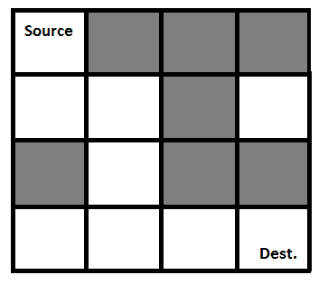
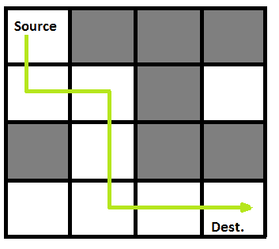

# 迷宫中的老鼠|回溯-2

> 原文:[https://www.geeksforgeeks.org/rat-in-a-maze-backtracking-2/](https://www.geeksforgeeks.org/rat-in-a-maze-backtracking-2/)

我们已经在[集 1](https://www.geeksforgeeks.org/backtracking-set-1-the-knights-tour-problem/) 中讨论了回溯和骑士之旅的问题。让我们讨论老鼠在[迷宫](http://en.wikipedia.org/wiki/Maze)作为另一个例子问题，可以使用回溯来解决。

迷宫被给出为 N*N 个二进制块矩阵，其中源块是最左上的块，即迷宫[0][0]，目的块是最右下的块，即迷宫[N-1][N-1]。老鼠从源头开始，必须到达目的地。老鼠只能朝两个方向移动:向前和向下。

在迷宫矩阵中，0 表示该块是死胡同，1 表示该块可用于从源到目的地的路径中。请注意，这是典型的迷宫问题的简单版本。例如，更复杂的版本可以是大鼠可以在 4 个方向上移动，而更复杂的版本可以是具有有限数量的移动。

**下面是一个迷宫的例子。**

```
 Gray blocks are dead ends (value = 0).
```



下面是上述迷宫的二进制矩阵表示。

```
{1, 0, 0, 0}
{1, 1, 0, 1}
{0, 1, 0, 0}
{1, 1, 1, 1}
```

下面是一个突出显示解决方案路径的迷宫。



以下是上述输入矩阵的解矩阵(程序输出)。

```
{1, 0, 0, 0}
{1, 1, 0, 0}
{0, 1, 0, 0}
{0, 1, 1, 1}
All entries in solution path are marked as 1.
```

[**<u>回溯算法</u>**](https://www.geeksforgeeks.org/backtracking-algorithms/) **<u>:</u>** 回溯是一种算法技术，通过尝试逐步构建解决方案来递归解决问题。一次解决一个问题，并在任何时间点移除那些无法满足问题约束的解决方案(这里的时间指的是到达搜索树的任何级别所经过的时间)是回溯的过程。

**逼近:**形成递归函数，它会跟随一条路径，检查路径是否到达目的地。如果路径没有到达目的地，那么回溯并尝试其他路径。

**算法:**

1.  创建解决方案矩阵，最初用 0 填充。
2.  创建一个递归函数，该函数获取初始矩阵、输出矩阵和 rat (i，j)的位置。
3.  如果位置超出矩阵或者位置无效，则返回。
4.  将位置输出[i][j]标记为 1，并检查当前位置是否为目的地。如果到达目的地，打印输出矩阵并返回。
5.  递归调用位置(i+1，j)和(I，j+1)。
6.  取消标记位置(I，j)，即输出[i][j] = 0。

## C++

```
/* C++ program to solve Rat in
a Maze problem using backtracking */
#include <stdio.h>

// Maze size
#define N 4

bool solveMazeUtil(
    int maze[N][N], int x,
    int y, int sol[N][N]);

/* A utility function to print
solution matrix sol[N][N] */
void printSolution(int sol[N][N])
{
    for (int i = 0; i < N; i++) {
        for (int j = 0; j < N; j++)
            printf(" %d ", sol[i][j]);
        printf("\n");
    }
}

/* A utility function to check if x,
y is valid index for N*N maze */
bool isSafe(int maze[N][N], int x, int y)
{
    // if (x, y outside maze) return false
    if (
        x >= 0 && x < N && y >= 0
        && y < N && maze[x][y] == 1)
        return true;

    return false;
}

/* This function solves the Maze problem
using Backtracking. It mainly uses
solveMazeUtil() to solve the problem.
It returns false if no path is possible,
otherwise return true and prints the path
in the form of 1s. Please note that there
may be more than one solutions, this
function prints one of the feasible
solutions.*/
bool solveMaze(int maze[N][N])
{
    int sol[N][N] = { { 0, 0, 0, 0 },
                    { 0, 0, 0, 0 },
                    { 0, 0, 0, 0 },
                    { 0, 0, 0, 0 } };

    if (solveMazeUtil(
            maze, 0, 0, sol)
        == false) {
        printf("Solution doesn't exist");
        return false;
    }

    printSolution(sol);
    return true;
}

/* A recursive utility function
to solve Maze problem */
bool solveMazeUtil(
    int maze[N][N], int x,
    int y, int sol[N][N])
{
    // if (x, y is goal) return true
    if (
        x == N - 1 && y == N - 1
        && maze[x][y] == 1) {
        sol[x][y] = 1;
        return true;
    }

    // Check if maze[x][y] is valid
    if (isSafe(maze, x, y) == true) {
          // Check if the current block is already part of solution path.   
          if (sol[x][y] == 1)
              return false;

        // mark x, y as part of solution path
        sol[x][y] = 1;

        /* Move forward in x direction */
        if (solveMazeUtil(
                maze, x + 1, y, sol)
            == true)
            return true;

        /* If moving in x direction
        doesn't give solution then
        Move down in y direction */
        if (solveMazeUtil(
                maze, x, y + 1, sol)
            == true)
            return true;

        /* If none of the above movements
        work then BACKTRACK: unmark
        x, y as part of solution path */
        sol[x][y] = 0;
        return false;
    }

    return false;
}

// driver program to test above function
int main()
{
    int maze[N][N] = { { 1, 0, 0, 0 },
                    { 1, 1, 0, 1 },
                    { 0, 1, 0, 0 },
                    { 1, 1, 1, 1 } };

    solveMaze(maze);
    return 0;
}
```

## Java 语言(一种计算机语言，尤用于创建网站)

```
/* Java program to solve Rat in
 a Maze problem using backtracking */

public class RatMaze {

    // Size of the maze
    static int N;

    /* A utility function to print
    solution matrix sol[N][N] */
    void printSolution(int sol[][])
    {
        for (int i = 0; i < N; i++) {
            for (int j = 0; j < N; j++)
                System.out.print(
                    " " + sol[i][j] + " ");
            System.out.println();
        }
    }

    /* A utility function to check
        if x, y is valid index for N*N maze */
    boolean isSafe(
        int maze[][], int x, int y)
    {
        // if (x, y outside maze) return false
        return (x >= 0 && x < N && y >= 0
                && y < N && maze[x][y] == 1);
    }

    /* This function solves the Maze problem using
    Backtracking. It mainly uses solveMazeUtil()
    to solve the problem. It returns false if no
    path is possible, otherwise return true and
    prints the path in the form of 1s. Please note
    that there may be more than one solutions, this
    function prints one of the feasible solutions.*/
    boolean solveMaze(int maze[][])
    {
        int sol[][] = new int[N][N];

        if (solveMazeUtil(maze, 0, 0, sol) == false) {
            System.out.print("Solution doesn't exist");
            return false;
        }

        printSolution(sol);
        return true;
    }

    /* A recursive utility function to solve Maze
    problem */
    boolean solveMazeUtil(int maze[][], int x, int y,
                          int sol[][])
    {
        // if (x, y is goal) return true
        if (x == N - 1 && y == N - 1
            && maze[x][y] == 1) {
            sol[x][y] = 1;
            return true;
        }

        // Check if maze[x][y] is valid
        if (isSafe(maze, x, y) == true) {
              // Check if the current block is already part of solution path.   
              if (sol[x][y] == 1)
                  return false;

            // mark x, y as part of solution path
            sol[x][y] = 1;

            /* Move forward in x direction */
            if (solveMazeUtil(maze, x + 1, y, sol))
                return true;

            /* If moving in x direction doesn't give
            solution then Move down in y direction */
            if (solveMazeUtil(maze, x, y + 1, sol))
                return true;

            /* If moving in y direction doesn't give
            solution then Move backwards in x direction */
            if (solveMazeUtil(maze, x - 1, y, sol))
                return true;

            /* If moving backwards in x direction doesn't give
            solution then Move upwards in y direction */
            if (solveMazeUtil(maze, x, y - 1, sol))
                return true;

            /* If none of the above movements works then
            BACKTRACK: unmark x, y as part of solution
            path */
            sol[x][y] = 0;
            return false;
        }

        return false;
    }

    public static void main(String args[])
    {
        RatMaze rat = new RatMaze();
        int maze[][] = { { 1, 0, 0, 0 },
                         { 1, 1, 0, 1 },
                         { 0, 1, 0, 0 },
                         { 1, 1, 1, 1 } };

        N = maze.length;
        rat.solveMaze(maze);
    }
}
// This code is contributed by Abhishek Shankhadhar
```

## 蟒蛇 3

```
# Python3 program to solve Rat in a Maze
# problem using backracking

# Maze size
N = 4

# A utility function to print solution matrix sol
def printSolution( sol ):

    for i in sol:
        for j in i:
            print(str(j) + " ", end ="")
        print("")

# A utility function to check if x, y is valid
# index for N * N Maze
def isSafe( maze, x, y ):

    if x >= 0 and x < N and y >= 0 and y < N and maze[x][y] == 1:
        return True

    return False

""" This function solves the Maze problem using Backtracking.
    It mainly uses solveMazeUtil() to solve the problem. It
    returns false if no path is possible, otherwise return
    true and prints the path in the form of 1s. Please note
    that there may be more than one solutions, this function
    prints one of the feasable solutions. """
def solveMaze( maze ):

    # Creating a 4 * 4 2-D list
    sol = [ [ 0 for j in range(4) ] for i in range(4) ]

    if solveMazeUtil(maze, 0, 0, sol) == False:
        print("Solution doesn't exist");
        return False

    printSolution(sol)
    return True

# A recursive utility function to solve Maze problem
def solveMazeUtil(maze, x, y, sol):

    # if (x, y is goal) return True
    if x == N - 1 and y == N - 1 and maze[x][y]== 1:
        sol[x][y] = 1
        return True

    # Check if maze[x][y] is valid
    if isSafe(maze, x, y) == True:
        # Check if the current block is already part of solution path.   
        if sol[x][y] == 1:
            return False

        # mark x, y as part of solution path
        sol[x][y] = 1

        # Move forward in x direction
        if solveMazeUtil(maze, x + 1, y, sol) == True:
            return True

        # If moving in x direction doesn't give solution
        # then Move down in y direction
        if solveMazeUtil(maze, x, y + 1, sol) == True:
            return True

        # If moving in y direction doesn't give solution then
        # Move back in x direction
        if solveMazeUtil(maze, x - 1, y, sol) == True:
            return True

        # If moving in backwards in x direction doesn't give solution
        # then Move upwards in y direction
        if solveMazeUtil(maze, x, y - 1, sol) == True:
            return True

        # If none of the above movements work then
        # BACKTRACK: unmark x, y as part of solution path
        sol[x][y] = 0
        return False

# Driver program to test above function
if __name__ == "__main__":
    # Initialising the maze
    maze = [ [1, 0, 0, 0],
             [1, 1, 0, 1],
             [0, 1, 0, 0],
             [1, 1, 1, 1] ]

    solveMaze(maze)

# This code is contributed by Shiv Shankar
```

## C#

```
// C# program to solve Rat in a Maze
// problem using backtracking
using System;

class RatMaze{

// Size of the maze
static int N;

// A utility function to print
// solution matrix sol[N,N]
void printSolution(int [,]sol)
{
    for(int i = 0; i < N; i++)
    {
        for(int j = 0; j < N; j++)
            Console.Write(" " + sol[i, j] + " ");

        Console.WriteLine();
    }
}

// A utility function to check if x, y
// is valid index for N*N maze
bool isSafe(int [,]maze, int x, int y)
{

    // If (x, y outside maze) return false
    return (x >= 0 && x < N && y >= 0 &&
            y < N && maze[x, y] == 1);
}

// This function solves the Maze problem using
// Backtracking. It mainly uses solveMazeUtil()
// to solve the problem. It returns false if no
// path is possible, otherwise return true and
// prints the path in the form of 1s. Please note
// that there may be more than one solutions, this
// function prints one of the feasible solutions.
bool solveMaze(int [,]maze)
{
    int [,]sol = new int[N, N];

    if (solveMazeUtil(maze, 0, 0, sol) == false)
    {
        Console.Write("Solution doesn't exist");
        return false;
    }

    printSolution(sol);
    return true;
}

// A recursive utility function to solve Maze
// problem
bool solveMazeUtil(int [,]maze, int x, int y,
                   int [,]sol)
{

    // If (x, y is goal) return true
    if (x == N - 1 && y == N - 1 &&
        maze[x, y] == 1)
    {
        sol[x, y] = 1;
        return true;
    }

    // Check if maze[x,y] is valid
    if (isSafe(maze, x, y) == true)
    {
          // Check if the current block is already part of solution path.   
          if (sol[x, y] == 1)
              return false;

        // Mark x, y as part of solution path
        sol[x, y] = 1;

        // Move forward in x direction
        if (solveMazeUtil(maze, x + 1, y, sol))
            return true;

        // If moving in x direction doesn't give
        // solution then Move down in y direction
        if (solveMazeUtil(maze, x, y + 1, sol))
            return true;

          // If moving in y direction doesm't give
        // solution then Move backward in x direction
        if (solveMazeUtil(maze, x - 1, y, sol))
            return true;

        // If moving in backwards in x direction doesn't give
        // solution then Move upwards in y direction
        if (solveMazeUtil(maze, x, y - 1, sol))
            return true;

        // If none of the above movements works then
        // BACKTRACK: unmark x, y as part of solution
        // path
        sol[x, y] = 0;
        return false;
    }
    return false;
}

// Driver Code
public static void Main(String []args)
{
    RatMaze rat = new RatMaze();

    int [,]maze = { { 1, 0, 0, 0 },
                    { 1, 1, 0, 1 },
                    { 0, 1, 0, 0 },
                    { 1, 1, 1, 1 } };

    N = maze.GetLength(0);
    rat.solveMaze(maze);
}
}

// This code is contributed by gauravrajput1
```

## java 描述语言

```
<script>
/* Javascript program to solve Rat in
 a Maze problem using backtracking */

// Size of the maze
let N;

/* A utility function to print
    solution matrix sol[N][N] */
function printSolution(sol)
{
    for (let i = 0; i < N; i++) {
            for (let j = 0; j < N; j++)
                document.write(
                    " " + sol[i][j] + " ");
            document.write("<br>");
        }
}

/* A utility function to check
        if x, y is valid index for N*N maze */
function isSafe(maze,x,y)
{
    // if (x, y outside maze) return false
        return (x >= 0 && x < N && y >= 0
                && y < N && maze[x][y] == 1);
}

/* This function solves the Maze problem using
    Backtracking. It mainly uses solveMazeUtil()
    to solve the problem. It returns false if no
    path is possible, otherwise return true and
    prints the path in the form of 1s. Please note
    that there may be more than one solutions, this
    function prints one of the feasible solutions.*/
function solveMaze(maze)
{
    let sol = new Array(N);
    for(let i=0;i<N;i++)
    {
        sol[i]=new Array(N);
        for(let j=0;j<N;j++)
        {
            sol[i][j]=0;
        }
    }

        if (solveMazeUtil(maze, 0, 0, sol) == false) {
            document.write("Solution doesn't exist");
            return false;
        }

        printSolution(sol);
        return true;
}
/* A recursive utility function to solve Maze
    problem */
function solveMazeUtil(maze,x,y,sol)
{
    // if (x, y is goal) return true
        if (x == N - 1 && y == N - 1
            && maze[x][y] == 1) {
            sol[x][y] = 1;
            return true;
        }

        // Check if maze[x][y] is valid
        if (isSafe(maze, x, y) == true) {
              // Check if the current block is already part of solution path.  
              if (sol[x][y] == 1)
                  return false;

            // mark x, y as part of solution path
            sol[x][y] = 1;

            /* Move forward in x direction */
            if (solveMazeUtil(maze, x + 1, y, sol))
                return true;

            /* If moving in x direction doesn't give
            solution then Move down in y direction */
            if (solveMazeUtil(maze, x, y + 1, sol))
                return true;

            /* If moving in y direction doesn't give
            solution then Move backwards in x direction */
            if (solveMazeUtil(maze, x - 1, y, sol))
                return true;

            /* If moving backwards in x direction doesn't give
            solution then Move upwards in y direction */
            if (solveMazeUtil(maze, x, y - 1, sol))
                return true;

            /* If none of the above movements works then
            BACKTRACK: unmark x, y as part of solution
            path */
            sol[x][y] = 0;
            return false;
        }

        return false;
}

let maze=[[ 1, 0, 0, 0 ],
                         [ 1, 1, 0, 1 ],
                         [ 0, 1, 0, 0 ],
                         [ 1, 1, 1, 1 ] ];
N = maze.length;
solveMaze(maze);

// This code is contributed by avanitrachhadiya2155
</script>
```

**输出:**
1 值显示的是大鼠的路径

```
 1  0  0  0 
 1  1  0  0 
 0  1  0  0 
 0  1  1  1
```

**复杂度分析:**

*   **时间复杂度:** O(2^(n^2)).
    递归可以运行上限 2^(n^2)次。
*   **空间复杂度:** O(n^2).
    需要输出矩阵，因此需要 n*n 大小的额外空间。

下面是这个问题的扩展版本。[计算迷宫中到达目的地的方法数量](https://www.geeksforgeeks.org/count-number-ways-reach-destination-maze/)
如果您发现任何不正确的地方，或者您想分享更多关于上述主题的信息，请写下您的评论。