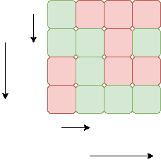
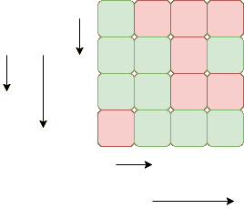

# 当允许在所有可能的方向上运动时，迷宫中的老鼠问题

> 原文:[https://www . geesforgeks . org/迷宫中的老鼠-允许全方位移动时的问题/](https://www.geeksforgeeks.org/rat-in-a-maze-problem-when-movement-in-all-possible-directions-is-allowed/)

假设一只老鼠被放在一个正方形矩阵中的 **(0，0)** 处**m【】【】T3**n**并且必须在 **(n-1，n-1)** 到达目的地。任务是找到一个排序的字符串数组，表示老鼠到达目的地 **(n-1，n-1)** 的所有可能方向。老鼠可以移动的方向是“U”(向上)、“D”(向下)、“L”(向左)、“R”(向右)。**

**示例:**

> **输入:**N = 4
> 1 0 0 0
> 1 1 0 1
> 0 1 0 0
> 0 1 1
> T7】输出:T9】DRDDRR
> 
> 
> 
> **输入:**N = 4
> 1 0 0 0
> 1 1 0 1
> 1 1 0 0
> 0 1 1 1
> T7】输出:T9】DDR DRDDRR
> T11】解释:
> 
> 

**<u>解:</u>**
**进场:**

1.  从初始索引(即(0，0))开始，在网格中按照**向下- >向左- >向右- >向上**的顺序寻找相邻单元格中的有效移动(以便获得排序的路径)。
2.  如果移动是可能的，则移动到该单元格，同时存储对应于该移动的字符(D，L，R，U)，并再次开始寻找有效的移动，直到到达最后一个索引(即(n-1，n-1))。
3.  此外，继续将单元格标记为已访问，当我们遍历该单元格中所有可能的路径时，为其他不同的路径取消该单元格的标记，并从形成的路径中删除字符。
4.  当到达网格的最后一个索引(右下角)时，存储遍历的路径。

下面是上述方法的实现:

## C++

```
// C++ implementation of the above approach
#include <bits/stdc++.h>
#define MAX 5
using namespace std;

// Function returns true if the
// move taken is valid else
// it will return false.
bool isSafe(int row, int col, int m[][MAX],
                 int n, bool visited[][MAX])
{
    if (row == -1 || row == n || col == -1 ||
                  col == n || visited[row][col]
                           || m[row][col] == 0)
        return false;

    return true;
}

// Function to print all the possible
// paths from (0, 0) to (n-1, n-1).
void printPathUtil(int row, int col, int m[][MAX],
              int n, string& path, vector<string>&
               possiblePaths, bool visited[][MAX])
{
    // This will check the initial point
    // (i.e. (0, 0)) to start the paths.
    if (row == -1 || row == n || col == -1
               || col == n || visited[row][col]
                           || m[row][col] == 0)
        return;

    // If reach the last cell (n-1, n-1)
    // then store the path and return
    if (row == n - 1 && col == n - 1) {
        possiblePaths.push_back(path);
        return;
    }

    // Mark the cell as visited
    visited[row][col] = true;

    // Try for all the 4 directions (down, left,
    // right, up) in the given order to get the
    // paths in lexicographical order

    // Check if downward move is valid
    if (isSafe(row + 1, col, m, n, visited))
    {
        path.push_back('D');
        printPathUtil(row + 1, col, m, n,
                 path, possiblePaths, visited);
        path.pop_back();
    }

    // Check if the left move is valid
    if (isSafe(row, col - 1, m, n, visited))
    {
        path.push_back('L');
        printPathUtil(row, col - 1, m, n,
                   path, possiblePaths, visited);
        path.pop_back();
    }

    // Check if the right move is valid
    if (isSafe(row, col + 1, m, n, visited))
    {
        path.push_back('R');
        printPathUtil(row, col + 1, m, n,
                   path, possiblePaths, visited);
        path.pop_back();
    }

     // Check if the upper move is valid
    if (isSafe(row - 1, col, m, n, visited))
    {
        path.push_back('U');
        printPathUtil(row - 1, col, m, n,
               path, possiblePaths, visited);
        path.pop_back();
    }

    // Mark the cell as unvisited for
    // other possible paths
    visited[row][col] = false;
}

// Function to store and print
// all the valid paths
void printPath(int m[MAX][MAX], int n)
{
    // vector to store all the possible paths
    vector<string> possiblePaths;
    string path;
    bool visited[n][MAX];
    memset(visited, false, sizeof(visited));

    // Call the utility function to
    // find the valid paths
    printPathUtil(0, 0, m, n, path,
                      possiblePaths, visited);

    // Print all possible paths
    for (int i = 0; i < possiblePaths.size(); i++)
        cout << possiblePaths[i] << " ";
}

// Driver code
int main()
{
    int m[MAX][MAX] = { { 1, 0, 0, 0, 0 },
                        { 1, 1, 1, 1, 1 },
                        { 1, 1, 1, 0, 1 },
                        { 0, 0, 0, 0, 1 },
                        { 0, 0, 0, 0, 1 } };
    int n = sizeof(m) / sizeof(m[0]);
    printPath(m, n);

    return 0;
}
```

## Java 语言(一种计算机语言，尤用于创建网站)

```
// Java implementation of the above approach
import java.util.*;

class GFG{

// Vector to store all the possible paths
static Vector<String> possiblePaths = new Vector<>();
static String path = "";
static final int MAX =  5;

// Function returns true if the
// move taken is valid else
// it will return false.
static boolean isSafe(int row, int col, int m[][],
                      int n, boolean visited[][])
{
    if (row == -1 || row == n || col == -1 ||
         col == n || visited[row][col] ||
                     m[row][col] == 0)
        return false;

    return true;
}

// Function to print all the possible
// paths from (0, 0) to (n-1, n-1).
static void printPathUtil(int row, int col, int m[][],
                          int n, boolean visited[][])
{

    // This will check the initial point
    // (i.e. (0, 0)) to start the paths.
    if (row == -1 || row == n || col == -1 ||
         col == n || visited[row][col] ||
                     m[row][col] == 0)
        return;

    // If reach the last cell (n-1, n-1)
    // then store the path and return
    if (row == n - 1 && col == n - 1)
    {
        possiblePaths.add(path);
        return;
    }

    // Mark the cell as visited
    visited[row][col] = true;

    // Try for all the 4 directions (down, left,
    // right, up) in the given order to get the
    // paths in lexicographical order

    // Check if downward move is valid
    if (isSafe(row + 1, col, m, n, visited))
    {
        path += 'D';
        printPathUtil(row + 1, col, m, n,
                      visited);
        path = path.substring(0, path.length() - 1);
    }

    // Check if the left move is valid
    if (isSafe(row, col - 1, m, n, visited))
    {
        path += 'L';
        printPathUtil(row, col - 1, m, n,
                      visited);
        path = path.substring(0, path.length() - 1);
    }

    // Check if the right move is valid
    if (isSafe(row, col + 1, m, n, visited))
    {
        path += 'R';
        printPathUtil(row, col + 1, m, n,
                      visited);
        path = path.substring(0, path.length() - 1);
    }

    // Check if the upper move is valid
    if (isSafe(row - 1, col, m, n, visited))
    {
        path += 'U';
        printPathUtil(row - 1, col, m, n,
                      visited);
        path = path.substring(0, path.length() - 1);
    }

    // Mark the cell as unvisited for
    // other possible paths
    visited[row][col] = false;
}

// Function to store and print
// all the valid paths
static void printPath(int m[][], int n)
{
    boolean [][]visited = new boolean[n][MAX];

    // Call the utility function to
    // find the valid paths
    printPathUtil(0, 0, m, n, visited);

    // Print all possible paths
    for(int i = 0; i < possiblePaths.size(); i++)
        System.out.print(possiblePaths.get(i) + " ");
}

// Driver code
public static void main(String[] args)
{
    int m[][] = { { 1, 0, 0, 0, 0 },
                  { 1, 1, 1, 1, 1 },
                  { 1, 1, 1, 0, 1 },
                  { 0, 0, 0, 0, 1 },
                  { 0, 0, 0, 0, 1 } };
    int n = m.length;

    printPath(m, n);
}
}

// This code is contributed by gauravrajput1
```

## 蟒蛇 3

```
# Python3 implementation of the above approach
from typing import List

MAX = 5

# Function returns true if the
# move taken is valid else
# it will return false.
def isSafe(row: int, col: int,
           m: List[List[int]], n: int,
           visited: List[List[bool]]) -> bool:

    if (row == -1 or row == n or
        col == -1 or col == n or
        visited[row][col] or m[row][col] == 0):
        return False

    return True

# Function to print all the possible
# paths from (0, 0) to (n-1, n-1).
def printPathUtil(row: int, col: int,
                  m: List[List[int]],
                  n: int, path: str,
                  possiblePaths: List[str],
                  visited: List[List[bool]]) -> None:

    # This will check the initial point
    # (i.e. (0, 0)) to start the paths.
    if (row == -1 or row == n or
        col == -1 or col == n or
        visited[row][col] or m[row][col] == 0):
        return

    # If reach the last cell (n-1, n-1)
    # then store the path and return
    if (row == n - 1 and col == n - 1):
        possiblePaths.append(path)
        return

    # Mark the cell as visited
    visited[row][col] = True

    # Try for all the 4 directions (down, left,
    # right, up) in the given order to get the
    # paths in lexicographical order

    # Check if downward move is valid
    if (isSafe(row + 1, col, m, n, visited)):
        path += 'D'
        printPathUtil(row + 1, col, m, n,
                      path, possiblePaths, visited)
        path = path[:-1]

    # Check if the left move is valid
    if (isSafe(row, col - 1, m, n, visited)):
        path += 'L'
        printPathUtil(row, col - 1, m, n,
                      path, possiblePaths, visited)
        path = path[:-1]

    # Check if the right move is valid
    if (isSafe(row, col + 1, m, n, visited)):
        path += 'R'
        printPathUtil(row, col + 1, m, n,
                      path, possiblePaths, visited)
        path = path[:-1]

    # Check if the upper move is valid
    if (isSafe(row - 1, col, m, n, visited)):
        path += 'U'
        printPathUtil(row - 1, col, m, n,
                      path, possiblePaths, visited)
        path = path[:-1]

    # Mark the cell as unvisited for
    # other possible paths
    visited[row][col] = False

# Function to store and print
# all the valid paths
def printPath(m: List[List[int]], n: int) -> None:

    # vector to store all the possible paths
    possiblePaths = []
    path = ""
    visited = [[False for _ in range(MAX)]
                      for _ in range(n)]

    # Call the utility function to
    # find the valid paths
    printPathUtil(0, 0, m, n, path,
                  possiblePaths, visited)

    # Print all possible paths
    for i in range(len(possiblePaths)):
        print(possiblePaths[i], end = " ")

# Driver code
if __name__ == "__main__":

    m = [ [ 1, 0, 0, 0, 0 ],
          [ 1, 1, 1, 1, 1 ],
          [ 1, 1, 1, 0, 1 ],
          [ 0, 0, 0, 0, 1 ],
          [ 0, 0, 0, 0, 1 ] ]
    n = len(m)

    printPath(m, n)

# This code is contributed by sanjeev2552
```

## C#

```
// C# implementation of the above approach
using System;
using System.Collections.Generic;
class GFG{

// List to store all the possible paths
static List<String> possiblePaths = new List<String>();
static String path = "";
static readonly int MAX =  5;

// Function returns true if the
// move taken is valid else
// it will return false.
static bool isSafe(int row, int col, int [,]m,
                      int n, bool [,]visited)
{
    if (row == -1 || row == n || col == -1 ||
         col == n || visited[row,col] ||
                     m[row,col] == 0)
        return false;
    return true;
}

// Function to print all the possible
// paths from (0, 0) to (n-1, n-1).
static void printPathUtil(int row, int col, int [,]m,
                          int n, bool [,]visited)
{

    // This will check the initial point
    // (i.e. (0, 0)) to start the paths.
    if (row == -1 || row == n || col == -1 ||
         col == n || visited[row,col] ||
                     m[row,col] == 0)
        return;

    // If reach the last cell (n-1, n-1)
    // then store the path and return
    if (row == n - 1 && col == n - 1)
    {
        possiblePaths.Add(path);
        return;
    }

    // Mark the cell as visited
    visited[row,col] = true;

    // Try for all the 4 directions (down, left,
    // right, up) in the given order to get the
    // paths in lexicographical order

    // Check if downward move is valid
    if (isSafe(row + 1, col, m, n, visited))
    {
        path += 'D';
        printPathUtil(row + 1, col, m, n,
                      visited);
        path = path.Substring(0, path.Length - 1);
    }

    // Check if the left move is valid
    if (isSafe(row, col - 1, m, n, visited))
    {
        path += 'L';
        printPathUtil(row, col - 1, m, n,
                      visited);
        path = path.Substring(0, path.Length - 1);
    }

    // Check if the right move is valid
    if (isSafe(row, col + 1, m, n, visited))
    {
        path += 'R';
        printPathUtil(row, col + 1, m, n,
                      visited);
        path = path.Substring(0, path.Length - 1);
    }

    // Check if the upper move is valid
    if (isSafe(row - 1, col, m, n, visited))
    {
        path += 'U';
        printPathUtil(row - 1, col, m, n,
                      visited);
        path = path.Substring(0, path.Length - 1);
    }

    // Mark the cell as unvisited for
    // other possible paths
    visited[row,col] = false;
}

// Function to store and print
// all the valid paths
static void printPath(int [,]m, int n)
{
    bool [,]visited = new bool[n,MAX];

    // Call the utility function to
    // find the valid paths
    printPathUtil(0, 0, m, n, visited);

    // Print all possible paths
    for(int i = 0; i < possiblePaths.Count; i++)
        Console.Write(possiblePaths[i] + " ");
}

// Driver code
public static void Main(String[] args)
{
    int [,]m = { { 1, 0, 0, 0, 0 },
                  { 1, 1, 1, 1, 1 },
                  { 1, 1, 1, 0, 1 },
                  { 0, 0, 0, 0, 1 },
                  { 0, 0, 0, 0, 1 } };
    int n = m.GetLength(0);  
    printPath(m, n);
}
}

// This code is contributed by gauravrajput1
```

## java 描述语言

```
<script>

// Javascript implementation of the above approach

// Vector to store all the possible paths
let possiblePaths = [];
let path = "";
let MAX =  5;

// Function returns true if the
// move taken is valid else
// it will return false.
function isSafe(row, col, m, n, visited)
{
    if (row == -1 || row == n || col == -1 ||
         col == n || visited[row][col] ||
                           m[row][col] == 0)
        return false;

    return true;
}

// Function to print all the possible
// paths from (0, 0) to (n-1, n-1).
function printPathUtil(row, col, m, n, visited)
{

    // This will check the initial point
    // (i.e. (0, 0)) to start the paths.
    if (row == -1 || row == n || col == -1 ||
         col == n || visited[row][col] ||
                           m[row][col] == 0)
        return;

    // If reach the last cell (n-1, n-1)
    // then store the path and return
    if (row == n - 1 && col == n - 1)
    {
        possiblePaths.push(path);
        return;
    }

    // Mark the cell as visited
    visited[row][col] = true;

    // Try for all the 4 directions (down, left,
    // right, up) in the given order to get the
    // paths in lexicographical order

    // Check if downward move is valid
    if (isSafe(row + 1, col, m, n, visited))
    {
        path += 'D';
        printPathUtil(row + 1, col, m, n,
                      visited);
        path = path.substring(0, path.length - 1);
    }

    // Check if the left move is valid
    if (isSafe(row, col - 1, m, n, visited))
    {
        path += 'L';
        printPathUtil(row, col - 1, m, n,
                      visited);
        path = path.substring(0, path.length - 1);
    }

    // Check if the right move is valid
    if (isSafe(row, col + 1, m, n, visited))
    {
        path += 'R';
        printPathUtil(row, col + 1, m, n,
                      visited);
        path = path.substring(0, path.length - 1);
    }

    // Check if the upper move is valid
    if (isSafe(row - 1, col, m, n, visited))
    {
        path += 'U';
        printPathUtil(row - 1, col, m, n,
                      visited);
        path = path.substring(0, path.length - 1);
    }

    // Mark the cell as unvisited for
    // other possible paths
    visited[row][col] = false;
}

// Function to store and print
// all the valid paths
function printPath(m, n)
{
    let visited = new Array(n);
    for(let i = 0; i < n; i++)
    {
        visited[i] = new Array(MAX);
        for(let j = 0; j < MAX; j++)
            visited[i][j] = false;
    }

    // Call the utility function to
    // find the valid paths
    printPathUtil(0, 0, m, n, visited);

    // Print all possible paths
    for(let i = 0; i < possiblePaths.length; i++)
        document.write(possiblePaths[i] + " ");
}

// Driver code
let m = [ [ 1, 0, 0, 0, 0 ],
          [ 1, 1, 1, 1, 1 ],
          [ 1, 1, 1, 0, 1 ],
          [ 0, 0, 0, 0, 1 ],
          [ 0, 0, 0, 0, 1 ] ];
let n = m.length;

printPath(m, n);

// This code is contributed by patel2127

</script>
```

**Output:** 

```
DDRRURRDDD DDRURRRDDD DRDRURRDDD DRRRRDDD
```

**复杂度分析:**

*   **时间复杂度** : O(3^(n^2)).
    由于每个细胞中有 N^2 细胞，因此有 3 个未观察到的相邻细胞。所以 O(3^(N^2).的时间复杂性
*   **辅助空间:** O(3^(n^2)).
    因为答案中可能有 Atmos(3^(n^2)单元，所以空间复杂度是 O(3^(n^2)).