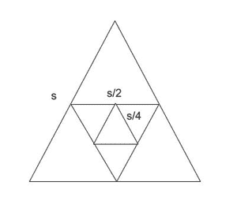
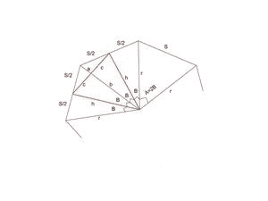
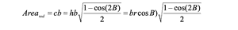
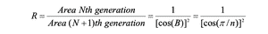

# 由正 N 边多边形的边中点连接而成的两个嵌套多边形的面积比

> 原文:[https://www . geesforgeks . org/两个嵌套多边形的面积比-通过连接正多边形的边中点形成/](https://www.geeksforgeeks.org/ratio-of-area-of-two-nested-polygons-formed-by-connecting-midpoints-of-sides-of-a-regular-n-sided-polygon/)

给定一个 **N-** 边的[多边形](https://www.geeksforgeeks.org/gre-geometry-polygons/)，任务是找到**N<sup>th</sup>T7】与**(N+1)<sup>th</sup>****N**边的规则嵌套[多边形](https://www.geeksforgeeks.org/gre-geometry-polygons/)的面积比，该多边形是通过连接原始多边形边的中点而生成的。**

**示例:**

> **输入:**N = 3
> T3】输出:4.000000
> T6】说明:
> 
> 
> 
> 嵌套三角形
> 
> 三角形中点连接而成的边长与原三角形边长之比为 0.5。因此，R =(第 N <sup>个</sup>三角形的面积)/(第(N + 1) <sup>个</sup>三角形的面积)= 4
> 
> **输入:**N = 4
> T3】输出: 2.000000

**方法:**根据以下观察结果可以解决问题:

*   考虑一个 **N** 边的正多边形，如下图所示。



N 边嵌套正多边形的表示。

*   **a = 2 *ⅰ/n**
    【B3】【b =ⅲ/n】**【h = r * cos(b)****【b = h * cos(b)**
*   黑色[等腰三角形](https://www.geeksforgeeks.org/find-the-altitude-and-area-of-an-isosceles-triangle/)的面积:

[](https://media.geeksforgeeks.org/wp-content/uploads/20210414030631/Screenshot20210414at30401AM-300x45.png)

*   红色等腰三角形的面积:

[](https://media.geeksforgeeks.org/wp-content/uploads/20210414030934/Screenshot20210414at30425AM-300x38.png)

*   **r = s/(2 *[1–cos(2B)]<sup>1/2</sup>**和 **b = r * [cos(B)] <sup>2</sup>**
*   结合以上等式后:

[](https://media.geeksforgeeks.org/wp-content/uploads/20210414031207/Screenshot20210414at30447AM-300x53.png)

*   最终结果如下:

[](https://media.geeksforgeeks.org/wp-content/uploads/20210414031302/Screenshot20210414at30503AM-300x39.png)

下面是上述方法的实现:

## C++

```
// C++ code for the above approach
#include <bits/stdc++.h>
using namespace std;

// Function to calculate the ratio of
// area of N-th and (N + 1)-th nested
// polygons formed by connecting midpoints
void AreaFactor(int n)
{
    // Stores the value of PI
    double pi = 3.14159265;

    // Calculating area the factor
    double areaf = 1 / (cos(pi / n)
                        * cos(pi / n));

    // Printing the ratio
    // precise upto 6 decimal places
    cout << fixed << setprecision(6)
         << areaf << endl;
}

// Driver Code
int main()
{
    int n = 4;
    AreaFactor(n);

    return 0;
}
```

## Java 语言(一种计算机语言，尤用于创建网站)

```
// Java program for the above approach
import java.io.*;

class GFG{

// Function to calculate the ratio of
// area of N-th and (N + 1)-th nested
// polygons formed by connecting midpoints
static void AreaFactor(int n)
{

    // Stores the value of PI
    double pi = 3.14159265;

    // Calculating area the factor
    double areaf = 1 / (Math.cos(pi / n) *
                        Math.cos(pi / n));

    // Printing the ratio
    // precise upto 6 decimal places
    System.out.format("%.6f", areaf);
}

// Driver Code
public static void main(String[] args)
{
    int n = 4;

    AreaFactor(n);
}
}

// This code is contributed by code_hunt
```

## 蟒蛇 3

```
# Python3 code for the above approach
import math

# Function to calculate the ratio of
# area of N-th and (N + 1)-th nested
# polygons formed by connecting midpoints
def AreaFactor(n):

    # Stores the value of PI
    pi = 3.14159265

    # Calculating area the factor
    areaf = 1 / (math.cos(pi / n) *
                 math.cos(pi / n))

    # Printing the ratio
    # precise upto 6 decimal places
    print('%.6f' % areaf)

# Driver Code
if __name__ == "__main__":

    n = 4
    AreaFactor(n)

# This code is contributed by ukasp
```

## C#

```
// C# program for the above approach
using System;
using System.Collections.Generic;

class GFG {

// Function to calculate the ratio of
// area of N-th and (N + 1)-th nested
// polygons formed by connecting midpoints
static void AreaFactor(int n)
{

    // Stores the value of PI
    double pi = 3.14159265;

    // Calculating area the factor
    double areaf = 1 / (Math.Cos(pi / n) *
                        Math.Cos(pi / n));

    // Printing the ratio
    // precise upto 6 decimal places
    Console.WriteLine(Math.Round(areaf));

}
    // Driver Code
    public static void Main(string[] args)
    {
        int n = 4;

        AreaFactor(n);
    }
}

// This code is contributed by susmitakundugoaldanga.
```

## java 描述语言

```
<script>

// Javascript program implementation
// of the approach

// Function to calculate the ratio of
// area of N-th and (N + 1)-th nested
// polygons formed by connecting midpoints
function AreaFactor(n)
{
    // Stores the value of PI
    let pi = 3.14159265;

    // Calculating area the factor
    let areaf = (1 / (Math.cos(pi / n)
                        * Math.cos(pi / n)));

    // Printing the ratio
    // precise upto 6 decimal places
    document.write(areaf.toFixed(6));
}

// Driver Code

        let n = 4;
    AreaFactor(n);

// This code is contributed by splevel62.
</script>
```

**Output:** 

```
2.000000
```

***时间复杂度:**O(1)*
T5**辅助空间:** O(1)