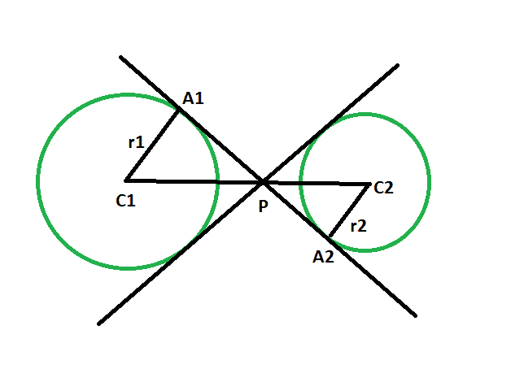
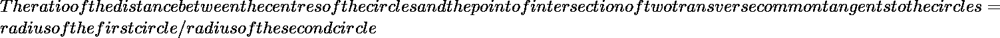

# 圆心与圆的两条横向公共切线交点的距离比

> 原文:[https://www . geeksforgeeks . org/圆心与两个横向公共切线交点之间的距离比率/](https://www.geeksforgeeks.org/ratio-of-the-distance-between-the-centers-of-the-circles-and-the-point-of-intersection-of-two-transverse-common-tangents-to-the-circles/)

给定半径的两个圆，这样两个圆就不会相互接触。任务是找出圆心与圆的两条横向公共切线的交点之间的距离比。
**例:**

```
Input :r1 = 4, r2 = 8 
Output :1:2

Input :r1 = 5, r2 = 13
Output :5:13
```



**接近** :

*   让圆的半径分别为 **r1** & **r2** 和 **C1** & **C2** 。
*   设 **P** 为圆的两条横向公共切线的交点， **A1** & **A2** 为切线与圆的接触点。
*   在三角形 **PC1A1** &三角形 **PC2A2** 、
    角 **C1A1P** =角 **C2A2P** = 90 度{圆心到接触点的连线与切线成 90 度角}，
    同样，角**a1p 1**=角**A2PC2**{垂直方向相反的角总是相等的}
    所以，角【T11
*   所以，由于三角形的相似性，
    **C1P/C2P = C1 a1/C2 a2 = R1/R2**



## C++

```
// C++ program to find the ratio
// of the distance between the centres of the circles
// and the point of intersection
// of two transverse common tangents
// to the circles which do not touch each other

#include <bits/stdc++.h>
using namespace std;

int GCD(int a, int b)
{
    return (b != 0 ? GCD(b, a % b) : a);
}

// Function to find the ratio
void ratiotang(int r1, int r2)
{
    cout << "The ratio is "
         << r1 / GCD(r1, r2)
         << ":"
         << r2 / GCD(r1, r2)
         << endl;
}

// Driver code
int main()
{
    int r1 = 4, r2 = 8;
    ratiotang(r1, r2);
    return 0;
}
```

## Java 语言(一种计算机语言，尤用于创建网站)

```
// Java program to find the ratio
// of the distance between the centres of the circles
// and the point of intersection
// of two transverse common tangents
// to the circles which do not touch each other

import java.io.*;

class GFG{

    static int GCD(int a, int b)
    {
        return (b != 0 ? GCD(b, a % b) : a);
    }

    // Function to find the ratio
    static void ratiotang(int r1, int r2)
    {
        System.out.println("The ratio is "
            + r1 / GCD(r1, r2)
            + ":"
            + r2 / GCD(r1, r2));
    }

    // Driver code
    public static void main (String[] args)
    {
        int r1 = 4, r2 = 8;
        ratiotang(r1, r2);
    }
}

// This code is contributed by NamrataSrivastava1
```

## 计算机编程语言

```
# Python3 program to find the ratio
# of the distance between the centres of the circles
# and the point of intersection
# of two transverse common tangents
# to the circles which do not touch each other

def GCD(a, b):
    if(b!=0):
        return GCD(b, a%b);
    else:
        return a;

# Function to find the ratio
def ratiotang(r1, r2):

    print("The ratio is", r1 // GCD(r1, r2),
                     ":", r2 // GCD(r1, r2));

# Driver code
r1 = 4; r2 = 8;
ratiotang(r1, r2);

# This code is contributed by Code_Mech
```

## C#

```
// C# program to find the ratio
// of the distance between the centres of the circles
// and the point of intersection
// of two transverse common tangents
// to the circles which do not touch each other
using System;

class GFG
{

    static int GCD(int a, int b)
    {
        return (b != 0 ? GCD(b, a % b) : a);
    }

    // Function to find the ratio
    static void ratiotang(int r1, int r2)
    {
        Console.WriteLine("The ratio is "
            + r1 / GCD(r1, r2)
            + ":"
            + r2 / GCD(r1, r2));
    }

    // Driver code
    static public void Main ()
    {

        int r1 = 4, r2 = 8;
        ratiotang(r1, r2);
    }
}

// This code is contributed by Tushil.
```

## 服务器端编程语言（Professional Hypertext Preprocessor 的缩写）

```
<?php
// PHP program to find the ratio
// of the distance between the centres of the circles
// and the point of intersection
// of two transverse common tangents
// to the circles which do not touch each other

function GCD($a, $b)
{
    return ($b != 0 ? GCD($b, $a % $b) : $a);
}

// Function to find the ratio
function ratiotang($r1, $r2)
{
    echo "The ratio is ", $r1 / GCD($r1, $r2),
                     ":", $r2 / GCD($r1, $r2);
}

// Driver code
$r1 = 4;
$r2 = 8;
ratiotang($r1, $r2);

// This code is contributed by AnkitRai01
?>
```

## java 描述语言

```
<script>
// javascript program to find the ratio
// of the distance between the centres of the circles
// and the point of intersection
// of two transverse common tangents
// to the circles which do not touch each other
function GCD(a , b)
{
    return (b != 0 ? GCD(b, a % b) : a);
}

// Function to find the ratio
function ratiotang(r1 , r2)
{
    document.write("The ratio is "
        + r1 / GCD(r1, r2)
        + ":"
        + r2 / GCD(r1, r2));
}

// Driver code
var r1 = 4, r2 = 8;
ratiotang(r1, r2);

// This code is contributed by Princi Singh
</script>
```

**Output:** 

```
The ratio is 1:2
```