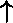
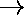
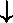
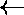
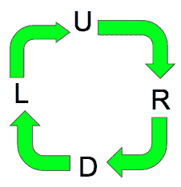

# 使用顺时针或逆时针运动到达一个点

> 原文:[https://www . geeksforgeeks . org/使用顺时针或逆时针移动到达一个点/](https://www.geeksforgeeks.org/reaching-a-point-using-clockwise-or-anticlockwise-movements/)

给定开始和结束位置以及一个数字 n。给定我们只能在四个方向上移动，如下图所示。招式方向为 **U** ( )、 **R** 、 **D** 、 **L** 。我们需要写一个程序来确定从给定的起始位置开始，我们是否能准确地到达**中给定的结束位置** N 在任何方向上移动(**顺时针或逆时针**)。



**例:**

```
Input: start = U , end = L , N = 3 
Output: Clockwise 
Explanation: Step 1: move clockwise to reach R
             Step 2: move clockwise to reach D
             Step 3: move clockwise to reach L 
So we reach from U to L in 3 steps moving in 
clockwise direction.

Input: start = R , end = L , N = 3
Output: Not possible 
Explanation: It is not possible to start from 
R and end at L in 3 steps moving about in any 
direction. 

Input: start = D , end = R , N = 7 
Output: Clockwise
Explanation: Starting at D, we complete one 
complete clockwise round in 4 steps to reach D 
again, then it takes 3 step to reach R 
```

解决这个问题的思路是观察我们可以通过任意方向(顺时针或逆时针)行进，4 步完成一轮，所以走 n%4 步相当于从起点开始走 n 步。因此 **n 减少到 n%4** 。考虑**的值“U”为 0，“R”为 1，“D”为 2，“L”为 3** 。如果 **abs(值(a)-值(b))是 2，n 也是 2，**那么我们可以顺时针或逆时针移动，从起始位置到达结束位置。如果顺时针方向移动 **k** 步将我们从开始位置带到结束位置，那么我们可以说顺时针移动的条件将是**(值(a)+k)% 4 = =值(b)** 。同样，逆时针移动的条件将是**(值(a)+k * 3)% 4 = =值(b)** ，因为从位置 a 顺时针方向走 k 步相当于逆时针方向走(a + k*3)%4 步。
以下是上述方法的实施:

## C++

```
// CPP program to determine if
// starting from the starting
// position we can reach the 
// end position in N moves
// moving about any direction
#include <bits/stdc++.h>
using namespace std;

// function that returns mark
// up value of directions
int value(char a)
{
    if (a == 'U')
        return 0;
    if (a == 'R')
        return 1;
    if (a == 'D')
        return 2;
    if (a == 'L')
        return 3;
}

// function to print
// the possible move
void printMove(char a, char b, int n)
{
    // mod with 4 as completing
    // 4 steps means completing
    // one single round
    n = n % 4;

    // when n is 2 and the
    // difference between moves is 2
    if (n == 2 and abs(value(a) -
                       value(b)) == 2)
        cout << "Clockwise or Anticlockwise";

    // anticlockwise condition
    else if ((value(a) + n * 3) % 4 == value(b))
        cout << "Anticlockwise";

    // clockwise condition
    else if ((value(a) + n) % 4 == value(b))
        cout << "Clockwise";
    else
        cout << "Not Possible";
}

// Driver Code
int main()
{
    char a = 'D', b = 'R';
    int n = 7;
    printMove(a, b, n);

    return 0;
}
```

## Java 语言(一种计算机语言，尤用于创建网站)

```
// Java program to determine if
// starting from the starting
// position we can reach the
// end position in N moves
// moving about any direction
class GFG
{
    // function that returns mark
    // up value of directions
    static int value(char a)
    {
        if (a == 'U')
            return 0;
        if (a == 'R')
            return 1;
        if (a == 'D')
            return 2;
        if (a == 'L')
            return 3;

            return -1;
    }

    // function to print
    // the possible move
    static void printMove(char a,
                          char b,
                          int n)
    {
        // mod with 4 as completing
        // 4 steps means completing
        // one single round
        n = n % 4;

        // when n is 2 and
        // the difference
        // between moves is 2
        if (n == 2 && Math.abs(value(a) -
                               value(b)) == 2)
            System.out.println("Clockwise " +
                        " or Anticlockwise");

        // anticlockwise condition
        else if ((value(a) + n * 3) %
                       4 == value(b))
            System.out.println("Anticlockwise");

        // clockwise condition
        else if ((value(a) + n) % 4 == value(b))
            System.out.println("Clockwise");
        else
            System.out.println("Not Possible");
    }

    // Driver Code
    public static void main(String args[])
    {
        char a = 'D', b = 'R';
        int n = 7;
        printMove(a, b, n);
    }
}

// This code is contributed by Sam007
```

## 蟒蛇 3

```
# python program to determine
# if starting from the starting
# position we can reach the end
# position in N moves moving 
# any direction

# function that returns mark
# up value of directions
def value(a):

    if (a == 'U'):
        return 0
    if (a == 'R'):
        return 1
    if (a == 'D'):
        return 2
    if (a == 'L'):
        return 3

# function to print
# the possible move
def printMove(a, b, n):

    # mod with 4 as completing
    # 4 steps means completing
    # one single round
    n = n % 4;

    # when n is 2 and
    # the difference
    # between moves is 2
    if (n == 2 and
        abs(value(a) - value(b)) == 2):
        print ("Clockwise or Anticlockwise")

    # anticlockwise condition
    elif ((value(a) + n * 3) % 4 == value(b)):
        print ("Anticlockwise")

    # clockwise condition
    elif ((value(a) + n) % 4 == value(b)):
        print ("Clockwise")
    else:
        print ("Not Possible")

# Driver Code
a = 'D'
b = 'R'
n = 7
printMove(a, b, n)

# This code is contributed by Sam007.
```

## C#

```
// C# program to determine
// if starting from the
// starting position we
// can reach the end position
// in N moves moving about
// any direction
using System;

class GFG
{
    // function that returns mark
    // up value of directions
    static int value(char a)
    {
        if (a == 'U')
            return 0;
        if (a == 'R')
            return 1;
        if (a == 'D')
            return 2;
        if (a == 'L')
            return 3;

            return -1;
    }

    // function to print
    // the possible move
    static void printMove(char a,
                          char b,
                          int n)
    {
        // mod with 4 as completing
        // 4 steps means completing
        // one single round
        n = n % 4;

        // when n is 2 and
        // the difference
        // between moves is 2
        if (n == 2 && Math.Abs(value(a) -
                               value(b)) == 2)
            Console.Write("Clockwise " +
                    "or Anticlockwise");

        // anticlockwise condition
        else if ((value(a) + n * 3) %
                        4 == value(b))
            Console.Write("Anticlockwise");

        // clockwise condition
        else if ((value(a) + n) %
                    4 == value(b))
            Console.WriteLine("Clockwise");
        else
            Console.WriteLine("Not Possible");
    }

    // Driver Code
    public static void Main()
    {
    char a = 'D', b = 'R';
    int n = 7;
    printMove(a, b, n);
    }
}

// This code is contributed by Sam007
```

## 服务器端编程语言（Professional Hypertext Preprocessor 的缩写）

```
<?php
// PHP program to determine
// if starting from the
// starting position we can
// reach the end position in
// N moves moving about
// any direction

// function that returns mark
// up value of directions

function value($a)
{
    if ($a == 'U')
        return 0;
    if ($a == 'R')
        return 1;
    if ($a == 'D')
        return 2;
    if ($a == 'L')
        return 3;
}

// function to print
// the possible move
function printMove($a, $b,$n)
{
    // mod with 4 as completing
    // 4 steps means completing
    // one single round
    $n = $n % 4;

    // when n is 2 and the
    // difference between
    // moves is 2
    if ($n == 2 and abs(value($a) -
                        value($b)) == 2)
        echo "Clockwise or Anticlockwise";

    // anticlockwise condition
    else if ((value($a) + $n * 3) %
                    4 == value($b))
        echo "Anticlockwise";

    // clockwise condition
    else if ((value($a) + $n) %
                4 == value($b))
        echo "Clockwise";
    else
        echo "Not Possible";
}

// Driver Code
$a = 'D'; $b = 'R';
$n = 7;
printMove($a, $b, $n);

// This code is contributed ajit.
?>
```

## java 描述语言

```
<script>

// JavaScript program to determine if
// starting from the starting
// position we can reach the
// end position in N moves
// moving about any direction

    // function that returns mark
    // up value of directions
    function value(a)
    {
        if (a == 'U')
            return 0;
        if (a == 'R')
            return 1;
        if (a == 'D')
            return 2;
        if (a == 'L')
            return 3;

            return -1;
    }

    // function to print
    // the possible move
    function printMove(a, b, n)
    {
        // mod with 4 as completing
        // 4 steps means completing
        // one single round
        n = n % 4;

        // when n is 2 and
        // the difference
        // between moves is 2
        if (n == 2 && Math.abs(value(a) -
                               value(b)) == 2)
            document.write("Clockwise " +
                        " or Anticlockwise");

        // anticlockwise condition
        else if ((value(a) + n * 3) %
                       4 == value(b))
            document.write("Anticlockwise");

        // clockwise condition
        else if ((value(a) + n) % 4 == value(b))
            document.write("Clockwise");
        else
            document.write("Not Possible");
    }

// Driver code

        let a = 'D', b = 'R';
        let n = 7;
        printMove(a, b, n);

    // This code is contributed by code_hunt.
</script>
```

**输出:**

```
Clockwise
```