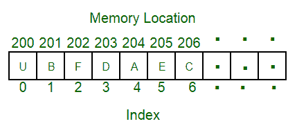
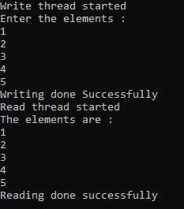

# 使用线程在数组中读写

> 原文:[https://www . geesforgeks . org/使用线程在阵列中读写/](https://www.geeksforgeeks.org/reading-and-writing-in-the-array-using-threads/)

[数组](https://www.geeksforgeeks.org/introduction-to-arrays/)是存储在连续存储位置的项目的集合。想法是将多个相同类型的项目存储在一起。这使得通过简单地将偏移加到基值，即数组的第一个元素的存储位置(通常由数组的名称表示)，来计算每个元素的位置变得更容易。数组用于存储同类数据。如果有许多元素，将元素存储在数组中以及从数组中读取元素的传统方式会花费大量时间。



在数组中写入和读取元素是一个小问题，每个元素首先被添加到数组中，然后整个数组被逐个元素读取并打印在控制台上。但是当元素的数量太大时，可能需要很多时间。但这可以通过将写作和阅读任务分成几部分来解决。

这可以通过使用处理器的每个内核的[多线程](https://www.geeksforgeeks.org/multithreading-in-operating-system/)来实现。在这种情况下，使用两个线程，其中一个线程负责写入数组，另一个线程负责读取数组。通过这种方式，可以提高程序的性能，并利用处理器的内核。最好每个内核使用一个线程。尽管为了更好地理解多线程，可以创建任意多的线程。

本文着重于使用多线程的概念来编写和读取数组的元素。

**方法:**本节说明了使用多线程来设计读写数组元素的程序所遵循的算法:

*   第一步，将创建两个线程。
*   一个用于写操作，一个用于读操作。
*   这里 synchronized 关键字与数组一起使用，这样一次只有一个线程可以访问数组。
*   首先，将在阵列上执行写操作。
*   然后，对阵列执行读取操作。

下面是实现上述方法的 Java 程序——

## Java 语言(一种计算机语言，尤用于创建网站)

```
// Java program for the above approach
import java.io.*;
import java.util.*;
class GFG {
    public static void main(String[] args)
    {
        // Array created for 5 elements
        int a[] = new int[5];

        // Thread created for write operation
        Thread t1 = new Thread(new Runnable() {
            public void run()
            {
                // Here the array is being
                // synchronized
                synchronized (a)
                {
                    Scanner s = new Scanner(System.in);
                    System.out.println(
                        "Enter the elements : ");

                    for (int i = 0; i < 5; i++) {
                        a[i] = s.nextInt();
                    }

                    System.out.println(
                        "Writing done Successfully");
                }
            }
        });

        // Thread created for read operation
        Thread t2 = new Thread(new Runnable() {
            public void run()
            {
                // Here the array is being
                // synchronized
                synchronized (a)
                {
                    System.out.println(
                        "The elements are : ");

                    for (int i = 0; i < 5; i++) {
                        System.out.println(a[i]);
                    }

                    System.out.println(
                        "Reading done successfully");
                }
            }
        });

        // Write thread is started
        t1.start();

        // Read thread is started
        t2.start();
    }
}
```

**输出:**



**说明:**这里首先启动写线程，此时读线程不会因为数组同步而干扰。同样，在读取过程中，写线程也不会干扰。