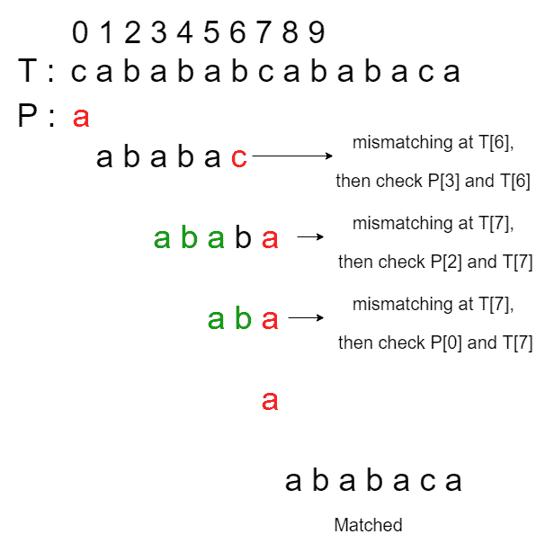
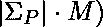
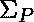
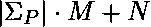
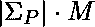

# 用于模式搜索的实时优化 KMP 算法

> 原文:[https://www . geesforgeks . org/实时优化-KMP-算法模式搜索/](https://www.geeksforgeeks.org/real-time-optimized-kmp-algorithm-for-pattern-searching/)

在[篇](https://www.geeksforgeeks.org/kmp-algorithm-for-pattern-searching/)中，我们已经讨论了模式搜索的 KMP 算法。本文讨论了一种实时优化的 KMP 算法。

从上一篇文章可知， [KMP](https://www.geeksforgeeks.org/kmp-algorithm-for-pattern-searching/) (又名 Knuth-Morris-Pratt)算法对模式 P 进行预处理，并构造失效函数 F(也称为 lps[])来存储子模式 P[1]的最长后缀的长度..l]，也是 P 的前缀，对于 l = 0 到 m-1。请注意，子模式从索引 1 开始，因为后缀可以是字符串本身。在索引 P[j]发生不匹配后，我们将 j 更新为 F[j-1]。

原始 KMP 算法的运行时复杂度为 O(M + N)和辅助空间 O(M)，其中 N 是输入文本的大小，M 是模式的大小。预处理步骤耗费时间。很难实现比这更好的运行时复杂性，但是我们仍然能够消除一些低效的转换。

**原始 KMP 算法的低效率:**使用原始 KMP 算法考虑以下情况:

> **输入:**T = " cababababcababaca "，P = " ababaca "
> T3】输出:在索引 8 找到

上述测试用例中最长的正确前缀或 lps[]是{0，0，1，2，3，0，1}。让我们假设<font color="Red">红色</font>代表发生了不匹配，<font color="Green">绿色</font>代表我们跳过的检查。因此，根据原始 KMP 算法的搜索过程发生如下:
[](https://media.geeksforgeeks.org/wp-content/cdn-uploads/20200520123449/KMP-Algorithm-Page-1.png)

可以注意到的一点是，在第三、第四和第五次匹配中，失配发生在相同的位置，T[7]。如果我们可以跳过第四个和第五个匹配，那么原始的 KMP 算法可以进一步优化以回答实时查询。

**实时优化:**本例中的术语**实时**可以解释为最多检查一次文本 T 中的每个字符。在这种情况下，我们的目标是适当地移动模式(就像 KMP 算法一样)，但是不需要再次检查不匹配的字符。也就是说，对于上面相同的例子，优化后的 KMP 算法应该按照以下方式工作:
[](https://media.geeksforgeeks.org/wp-content/cdn-uploads/20200520123730/KMP-Algorithm-Page-2.png)

**方法:**实现目标的一种方法是修改预处理过程。

*   让 **K** 为图案 **P** 的字母大小。我们将构建一个故障表来包含 **K** 故障函数(即 lps[])。
*   故障表中的每个故障函数被映射到模式 p 字母表中的一个字符(故障表中的键)
*   回想一下，原来的失效函数 **F[l]** (或 lps[])存储了 P[1]最长后缀的长度..l]，也是 **P** 的前缀，表示 l = 0 到 m-1，其中 m 是图案的大小。
*   如果在 **T[i]** 和 **P[j]** 出现不匹配，j 的新值将更新为 **F[j-1]** ，计数器“I”将保持不变。
*   在我们新的故障表 **FT[][]** 中，如果故障函数 F '被映射为字符 c， **F'[l]** 应该存储 P[1]的最长后缀的长度..l] + c ('+'代表追加)，也是 P 的前缀，表示 l = 0 到 m-1。
*   直觉是做出适当的改变，但也取决于不匹配的角色。这里的字符 c，也是故障表中的一个键，是我们对文本 t 中不匹配字符的“猜测”。
*   也就是说，如果不匹配的字符是 c，我们应该如何正确地转换模式？由于我们在预处理步骤中构建了失败表，因此我们必须对不匹配的字符进行足够的猜测。
*   因此，故障表中 lps[]的数量等于模式字母表的大小，每个值(故障函数)相对于键应该是不同的，键是 **P** 中的一个字符。
*   假设我们已经构建了所需的故障表。让 **FT[][]** 为故障表， **T** 为正文， **P** 为图样。
*   那么在匹配过程中，如果在 **T[i]** 和 **P[j]** 出现不匹配(即 T[i]！= P[j]):
    1.  如果 **T[i]** 是 **P** 中的字符， **j** 将更新为**FT【T[I]【j-1】**，“ **i** 将更新为“ **i + 1** ”。我们这样做是因为我们保证 **T[i]** 匹配或跳过。
    2.  如果 T[i]不是字符，“j”将更新为 0，“I”将更新为“i + 1”。
*   请注意，如果没有出现不匹配，则行为与原始 KMP 算法完全相同。

**构建故障表:**

*   为了构造故障表 FT[][]，我们将需要来自原始 KMP 算法的故障函数 F(或 lps[])。
*   因为 F[l]告诉我们子模式 P[1]的最长后缀的长度..l]，也是 P 的前缀，存储在故障表中的值比它多一步。
*   也就是说，对于故障表 FT[][]中的任何键 t，存储在 FT[t]中的值是满足字符“t”的故障函数，并且 FT[t][l]存储子模式 P[1]的最长后缀的长度..l] + t('+'表示追加)，也是 P 的前缀，表示 l 从 0 到 m-1。
*   F[l]已经保证 P[0..F[l]-1]是子模式 P[1]的最长后缀..所以我们需要检查 P[F[l]]是否为 t。
*   如果为真，那么我们可以将 FT[t][l]指定为 F[l] + 1，因为我们保证 P[0..F[l]]是子模式 P[1]的最长后缀..l] + t。
*   如果为假，则表明 P[F[l]]不是 t。也就是说，我们在字符 P[F[l]]处与字符 t 的匹配失败，但 P[0..F[l]-1]匹配后缀 P[1..l]。
*   通过借用 KMP 算法的思想，就像我们如何计算原始 KMP 算法中的失败函数一样，如果不匹配发生在字符 t 不匹配的 P[F[l]]处，我们希望从 FT[t][F[l]-1 开始更新下一个匹配。
*   也就是说，我们使用 KMP 算法的思想来计算故障表。请注意，F[l]–1 总是小于 l，因此当我们计算 FT[t][l]时，FT[t][F[l]–1 已经为我们准备好了。
*   一种特殊情况是，如果 F[l]为 0，P[F[l]]不是 t，F[l]–1 的值为-1，在这种情况下，我们将把 FT[t][l]更新为 0。(即没有后缀 P[1..l] + t 的存在使得它是 p 的前缀。)
*   As a conclusion of failure table construction, when we are computing FT[t][l], for any key t and l from 0 to m-1, we will check:

    ```
    If P[F[l]] is t,
      if yes:
        FT[t][l] <- F[l] + 1;
      if no: 
        check if F[l] is 0,
          if yes:
            FT[t][l] <- 0;
          if no:
            FT[t][l] <- FT[t][F[t] - 1];

    ```

    以下是上述示例的期望输出，为了更好地说明，输出包括故障表。

    **示例:**

    > **输入:** T = "卡瓦巴卡巴巴卡"，P = "阿巴巴卡"
    > T3】输出:故障表:
    > 键值
    > a '[1 1 1 3 1 1 1 1]
    > ' b '[0 0 2 0 4 0 2]
    > ' c '[0 0 0 0 0 0 0 0]
    > 在索引 8 找到模式

    下面是上述方法的实现:

    ## C++

    ```
    // C++ program to implement a
    // real time optimized KMP
    // algorithm for pattern searching

    #include <iostream>
    #include <set>
    #include <string>
    #include <unordered_map>

    using std::string;
    using std::unordered_map;
    using std::set;
    using std::cout;

    // Function to print
    // an array of length len
    void printArr(int* F, int len,
                  char name)
    {
        cout << '(' << name << ')'
             << "contain: [";

        // Loop to iterate through
        // and print the array
        for (int i = 0; i < len; i++) {
            cout << F[i] << " ";
        }
        cout << "]\n";
    }

    // Function to print a table.
    // len is the length of each array
    // in the map.
    void printTable(
        unordered_map<char, int*>& FT,
        int len)
    {
        cout << "Failure Table: {\n";

        // Iterating through the table
        // and printing it
        for (auto& pair : FT) {

            printArr(pair.second,
                     len, pair.first);
        }
        cout << "}\n";
    }

    // Function to construct
    // the failure function
    // corresponding to the pattern
    void constructFailureFunction(
        string& P, int* F)
    {

        // P is the pattern,
        // F is the FailureFunction
        // assume F has length m,
        // where m is the size of P

        int len = P.size();

        // F[0] must have the value 0
        F[0] = 0;

        // The index, we are parsing P[1..j]
        int j = 1;
        int l = 0;

        // Loop to iterate through the
        // pattern
        while (j < len) {

            // Computing the failure function or
            // lps[] similar to KMP Algorithm
            if (P[j] == P[l]) {
                l++;
                F[j] = l;
                j++;
            }
            else if (l > 0) {
                l = F[l - 1];
            }
            else {
                F[j] = 0;
                j++;
            }
        }
    }

    // Function to construct the failure table.
    // P is the pattern, F is the original
    // failure function. The table is stored in
    // FT[][]
    void constructFailureTable(
        string& P,
        set<char>& pattern_alphabet,
        int* F,
        unordered_map<char, int*>& FT)
    {
        int len = P.size();

        // T is the char where we mismatched
        for (char t : pattern_alphabet) {

            // Allocate an array
            FT[t] = new int[len];
            int l = 0;
            while (l < len) {
                if (P[F[l]] == t)

                    // Old failure function gives
                    // a good shifting
                    FT[t][l] = F[l] + 1;
                else {

                    // Move to the next char if
                    // the entry in the failure
                    // function is 0
                    if (F[l] == 0)
                        FT[t][l] = 0;

                    // Fill the table if F[l] > 0
                    else
                        FT[t][l] = FT[t][F[l] - 1];
                }
                l++;
            }
        }
    }

    // Function to implement the realtime
    // optimized KMP algorithm for
    // pattern searching. T is the text
    // we are searching on and
    // P is the pattern we are searching for
    void KMP(string& T, string& P,
             set<char>& pattern_alphabet)
    {

        // Size of the pattern
        int m = P.size();

        // Size of the text
        int n = T.size();

        // Initialize the Failure Function
        int F[m];

        // Constructing the failure function
        // using KMP algorithm
        constructFailureFunction(P, F);
        printArr(F, m, 'F');

        unordered_map<char, int*> FT;

        // Construct the failure table and
        // store it in FT[][]
        constructFailureTable(
            P,
            pattern_alphabet,
            F, FT);
        printTable(FT, m);

        // The starting index will be when
        // the first match occurs
        int found_index = -1;

        // Variable to iterate over the
        // indices in Text T
        int i = 0;

        // Variable to iterate over the
        // indices in Pattern P
        int j = 0;

        // Loop to iterate over the text
        while (i < n) {
            if (P[j] == T[i]) {

                // Matched the last character in P
                if (j == m - 1) {
                    found_index = i - m + 1;
                    break;
                }
                else {
                    i++;
                    j++;
                }
            }
            else {
                if (j > 0) {

                    // T[i] is not in P's alphabet
                    if (FT.find(T[i]) == FT.end())

                        // Begin a new
                        // matching process
                        j = 0;

                    else
                        j = FT[T[i]][j - 1];

                    // Update 'j' to be the length of
                    // the longest  suffix of P[1..j]
                    // which is also a prefix of P

                    i++;
                }
                else
                    i++;
            }
        }

        // Printing the index at which
        // the pattern is found
        if (found_index != -1)
            cout << "Found at index "
                 << found_index << '\n';
        else
            cout << "Not Found \n";

        for (char t : pattern_alphabet)

            // Deallocate the arrays in FT
            delete[] FT[t];

        return;
    }

    // Driver code
    int main()
    {
        string T = "cabababcababaca";
        string P = "ababaca";
        set<char> pattern_alphabet
            = { 'a', 'b', 'c' };
        KMP(T, P, pattern_alphabet);
    }
    ```

    **Output:**

    ```
    (F)contain: [0 0 1 2 3 0 1 ]
    Failure Table: {
    (c)contain: [0 0 0 0 0 0 0 ]
    (a)contain: [1 1 1 3 1 1 1 ]
    (b)contain: [0 0 2 0 4 0 2 ]
    }
    Found at index 8

    ```

    **注意:**上面的源代码会找到**第一个**出现的模式。稍加修改，它就可以用来查找所有的事件。

    **时间复杂度:**

    *   新的预处理步骤运行时间复杂度为 O( ，其中是模式 P 的字母表集合，M 是 P 的大小。
    *   整个改进的 KMP 算法的运行时间复杂度为 0()。O( )的辅助空间使用情况。
    *   运行时间和空间使用看起来比最初的 KMP 算法“更差”。然而，如果我们在多个文本中搜索相同的模式，或者模式的字母表集很小，因为预处理步骤只需要完成一次，并且文本中的每个字符最多将被比较一次(实时)。因此，它比原来的 KMP 算法更有效，在实践中效果良好。