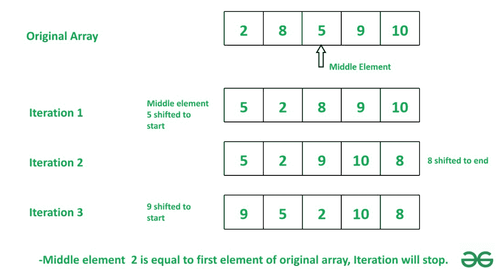

# 通过交替移动中间元素开始和结束来重新排列数组

> 原文:[https://www . geeksforgeeks . org/通过将中间元素移动到开始和结束来重新排列数组-或者/](https://www.geeksforgeeks.org/rearrange-the-array-by-shifting-middle-elements-to-start-and-end-alternatively/)

给定一个数组，任务是交替地将中间元素移动到数组的开始和结束，直到中间元素等于原始数组的第一个元素。

> **输入:**arr[]=【2，8，5，9，10】
> **输出:**【9，5，2，10，8】
> **解释:**我们可以通过移动中间元素
> 来得到这个输出步骤 1:中间元素 5 被移动到数组【5，2，8，9，10】
> 的前面步骤 2:中间元素 8 被移动到数组【5，2，9，10，8】的末尾
> 步骤 3
> 
> 
> 
> **输入:**arr[]=【10，12，6，5，3，1】
> **输出:**【1，3，5，10，6，12】

**天真方法:**将数组的中间元素交替移动到数组的开始和结束。
取中间的元素，如果 c 是偶数，移到数组的开头，如果 c 是奇数，移到数组的结尾。当中间元素等于原始数组的第一个元素时，终止循环。

下面是上述方法的实现:

## C++

```
// C++ program for above approach
#include <bits/stdc++.h>
using namespace std;

// Function for shifting middle element.
void AlternateShift(vector<int>& arr, int x)
{

    // get middle index
    int mid = arr.size() / 2;

    // initialize c to 0
    int c = 0;

    // Shift middle element
    // till its value not equals to x.
    while (arr[mid] != x) {

        // pop middle element

        int z = arr[mid];
        arr.erase(arr.begin() + mid);

        // if c is even then insert z
        // at start of the array
        if (c % 2 == 0)
            arr.insert(arr.begin() + 0, z);

        // if c is odd then insert z
        // at end of the array
        else
            arr.push_back(z);

        // increment count c
        c += 1;
    }
}

int main()
{
    vector<int> Arr = { 2, 8, 5, 9, 10 };

    // initialize a to zero index array value
    int a = Arr[0];

    // call AlternateShift function
    AlternateShift(Arr, a);

    // print the changed array Unpacking array
    for (int i = 0; i < Arr.size(); ++i) {
        cout << Arr[i] << " ";
    }

    return 0;
}

    // This code is contributed by rakeshsahni
```

## 蟒蛇 3

```
# Function for shifting middle element.
def AlternateShift(arr, x):

    # get middle index
    mid = len(arr) // 2

    # initialize c to 0
    c = 0

    # Shift middle element
    # till its value not equals to x.
    while arr[mid] != x:

        # pop middle element
        z = arr.pop(mid)

        # if c is even then insert z
        # at start of the array
        if c % 2 == 0:
            arr.insert(0, z)

        # if c is odd then insert z
        # at end of the array
        else:
            arr.append(z)

        # increment count c
        c += 1

Arr = [2, 8, 5, 9, 10]

# initialize a to zero index array value
a = Arr[0]

# call AlternateShift function
AlternateShift(Arr, a)

# print the changed array Unpacking array
print(*Arr)
```

## java 描述语言

```
<script>
    // JavaScript program for above approach

    // Function for shifting middle element.
    const AlternateShift = (arr, x) => {

        // get middle index
        let mid = parseInt(arr.length / 2);

        // initialize c to 0
        let c = 0;

        // Shift middle element
        // till its value not equals to x.
        while (arr[mid] != x) {

            // pop middle element

            let z = arr[mid];
            arr.splice(mid, 1);

            // if c is even then insert z
            // at start of the array
            if (c % 2 == 0)
                arr.splice(0, 0, z);

            // if c is odd then insert z
            // at end of the array
            else
                arr.push(z);

            // increment count c
            c += 1;
        }
    }

    Arr = [2, 8, 5, 9, 10];

    // initialize a to zero index array value
    let a = Arr[0];

    // call AlternateShift function
    AlternateShift(Arr, a);

    // print the changed array Unpacking array

    for (let i = 0; i < Arr.length; ++i) {
        document.write(`${Arr[i]} `);
    }

// This code is contributed by rakeshsahni

</script>
```

**Output**

```
9 5 2 10 8
```

**时间复杂度:***O(n<sup>2</sup>)*
**辅助空间:** *O(1)*

**有效途径:**交替移位也是阵列半反转的情况。如果 n 为偶数，首先从最后一个到中间取一个元素，或者从最后一秒到中间取一个元素，并插入新数组 br[]，然后将第一个元素插入 br[]。然后从中间 1 到索引 1 插入元素，并插入 br[]。所以它将以半反转的顺序返回数组。

**算法:**

> **步骤 1:** 声明新数组 **br** 并将 **pos** 初始化为 n-1。
> **步骤 2:** 如果 n 是从最后一个索引位置开始的偶数遍历，或者如果 n 是奇数，则从第二个最后一个索引位置-1 开始遍历。
> **步骤 3:** 将从位置索引到中间索引的元素存储到 br 数组中。
> **步骤 4:** 然后插入数组的第一个元素，使数组。
> **步骤 5:** 如果 n 为奇数，则将数组的最后一个值元素插入到 br 数组中。
> **步骤 6:** 将索引 1 到索引 1 中间的元素存储到 br 数组中。
> **第七步:**返回 br 数组。

下面是上述算法的实现:

## C++

```
// C++ Program of the above approach
#include <iostream>
using namespace std;

// Function to to shift the middle
// element to the start and end of
// the array alternatively, till
// the middle element becomes equal to
// the first element of the original Array
int* rearrange(int* ar, int n)
{
    // creating the array to store
    // rearranged value
    int* br = new int[n];

    // initialising pos to last index
    int pos = n - 1;

    // if n is odd then we will
    // transverse the array
    // from second last element
    if (n % 2 != 0)
        pos = pos - 1;

    // storing index of middle element
    int mid = n / 2;

    // index variable for rearranged array
    int c = 0;

    // transversing the array from
    // the pos to mid index
    // and storing it in br[] array
    for (; pos >= mid; pos--)
        br = ar[pos];

    // storing the first element as
    // mid value
    br = ar[0];

    // if n is odd then store
    // the last value in br[] the
    // transverse till 1st index
    if (n % 2 != 0)
        br = ar[n - 1];

    // storing the first element of
    // array as mid value
    for (; pos >= 1; pos--)
        br = ar[pos];

    // returning br[] array
    return br;
}
// Driver Code
int main()
{
    int ar[] = { 2, 8, 5, 9, 10 };
    int n = sizeof(ar) / sizeof(ar[0]);

    // Function Call
    int* res = rearrange(ar, n);

    // Print answer
    for (int i = 0; i < n; i++)
        cout << res[i] << " ";
}
```

## Java 语言(一种计算机语言，尤用于创建网站)

```
// Java Program of the above approach
import java.util.*;

class GFG
{

// Function to to shift the middle
// element to the start and end of
// the array alternatively, till
// the middle element becomes equal to
// the first element of the original Array
static int[] rearrange(int[] ar, int n)
{

    // creating the array to store
    // rearranged value
    int[] br = new int[n];

    // initialising pos to last index
    int pos = n - 1;

    // if n is odd then we will
    // transverse the array
    // from second last element
    if (n % 2 != 0)
        pos = pos - 1;

    // storing index of middle element
    int mid = n / 2;

    // index variable for rearranged array
    int c = 0;

    // transversing the array from
    // the pos to mid index
    // and storing it in br[] array
    for (; pos >= mid; pos--)
        br = ar[pos];

    // storing the first element as
    // mid value
    br = ar[0];

    // if n is odd then store
    // the last value in br[] the
    // transverse till 1st index
    if (n % 2 != 0)
        br = ar[n - 1];

    // storing the first element of
    // array as mid value
    for (; pos >= 1; pos--)
        br = ar[pos];

    // returning br[] array
    return br;
}

// Driver Code
public static void main(String[] args)
{
    int ar[] = { 2, 8, 5, 9, 10 };
    int n = ar.length;

    // Function Call
    int[] res = rearrange(ar, n);

    // Print answer
    for (int i = 0; i < n; i++)
        System.out.print(res[i]+ " ");
}
}

// This code is contributed by Amit Katiyar
```

## 蟒蛇 3

```
# Python 3 Program of the above approach

# Function to to shift the middle
# element to the start and end of
# the array alternatively, till
# the middle element becomes equal to
# the first element of the original Array
def rearrange(ar, n):
    # creating the array to store
    # rearranged value
    br = [0 for i in range(n)]

    # initialising pos to last index
    pos = n - 1

    # if n is odd then we will
    # transverse the array
    # from second last element
    if (n % 2 != 0):
        pos = pos - 1

    # storing index of middle element
    mid = n // 2

    # index variable for rearranged array
    c = 0

    # transversing the array from
    # the pos to mid index
    # and storing it in br[] array
    while(pos >= mid):
        br = ar[pos]
        c += 1
        pos -= 1

    # storing the first element as
    # mid value
    br = ar[0]
    c += 1

    # if n is odd then store
    # the last value in br[] the
    # transverse till 1st index
    if (n % 2 != 0):
        br = ar[n - 1]
        c += 1

    # storing the first element of
    # array as mid value
    while(pos >= 1):
        br = ar[pos]
        c += 1
        pos -= 1

    # returning br[] array
    return br

# Driver Code
if __name__ == '__main__':
    ar = [2, 8, 5, 9, 10]
    n = len(ar)

    # Function Call
    res = rearrange(ar, n)

    # Print answer
    for i in range(n):
        print(res[i],end = " ")

        # This code is contributed by ipg2016107.
```

## C#

```
// C# Program of the above approach
using System;

public class GFG
{

// Function to to shift the middle
// element to the start and end of
// the array alternatively, till
// the middle element becomes equal to
// the first element of the original Array
static int[] rearrange(int[] ar, int n)
{

    // creating the array to store
    // rearranged value
    int[] br = new int[n];

    // initialising pos to last index
    int pos = n - 1;

    // if n is odd then we will
    // transverse the array
    // from second last element
    if (n % 2 != 0)
        pos = pos - 1;

    // storing index of middle element
    int mid = n / 2;

    // index variable for rearranged array
    int c = 0;

    // transversing the array from
    // the pos to mid index
    // and storing it in br[] array
    for (; pos >= mid; pos--)
        br = ar[pos];

    // storing the first element as
    // mid value
    br = ar[0];

    // if n is odd then store
    // the last value in br[] the
    // transverse till 1st index
    if (n % 2 != 0)
        br = ar[n - 1];

    // storing the first element of
    // array as mid value
    for (; pos >= 1; pos--)
        br = ar[pos];

    // returning br[] array
    return br;
}

// Driver Code
public static void Main(String[] args)
{
    int []ar = { 2, 8, 5, 9, 10 };
    int n = ar.Length;

    // Function Call
    int[] res = rearrange(ar, n);

    // Print answer
    for (int i = 0; i < n; i++)
        Console.Write(res[i]+ " ");
}
}

// This code is contributed by Amit Katiyar
```

## java 描述语言

```
<script>
// javascript Program of the above approach

// Function to to shift the middle
// element to the start and end of
// the array alternatively, till
// the middle element becomes equal to
// the first element of the original Array
function rearrange(ar , n)
{

    // creating the array to store
    // rearranged value
    var br = Array.from({length: n}, (_, i) => 0);

    // initialising pos to last index
    var pos = n - 1;

    // if n is odd then we will
    // transverse the array
    // from second last element
    if (n % 2 != 0)
        pos = pos - 1;

    // storing index of middle element
    var mid = parseInt(n / 2);

    // index variable for rearranged array
    var c = 0;

    // transversing the array from
    // the pos to mid index
    // and storing it in br array
    for (; pos >= mid; pos--)
        br = ar[pos];

    // storing the first element as
    // mid value
    br = ar[0];

    // if n is odd then store
    // the last value in br the
    // transverse till 1st index
    if (n % 2 != 0)
        br = ar[n - 1];

    // storing the first element of
    // array as mid value
    for (; pos >= 1; pos--)
        br = ar[pos];

    // returning br array
    return br;
}

// Driver Code
    var ar = [ 2, 8, 5, 9, 10 ];
    var n = ar.length;

    // Function Call
    var res = rearrange(ar, n);

    // Print answer
    for (var i = 0; i < n; i++)
        document.write(res[i]+ " ");

// This code is contributed by Princi Singh
</script>
```

**Output**

```
9 5 2 10 8 
```

**时间复杂度:***O(n)*
T5】空间复杂度: *O(n)*