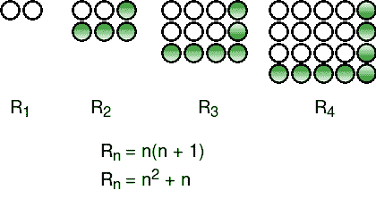

# 矩形(或叉形)数字

> 原文:[https://www.geeksforgeeks.org/rectangular-numbers/](https://www.geeksforgeeks.org/rectangular-numbers/)

可以排列成矩形的数字称为矩形数字(也称为 Pronic 数字)。前几个矩形数字是:
0、2、6、12、20、30、42、56、72、90、110、132、156、182、210、240、272、306、342、380、420、462。。。。。。
给定一个数 n，求第 n 个矩形数。
示例:

```
Input : 1
Output : 2

Input : 4
Output : 20

Input : 5
Output : 30
```

数字 2 是一个矩形数字，因为它是 1 行 2 列。数字 6 是一个矩形数字，因为它是 2 行 3 列，数字 12 是一个矩形数字，因为它是 3 行 4 列。
如果我们仔细观察这些数字，可以注意到第 n 个矩形数字是 **n(n+1)** 。



## C++

```
// CPP Program to find n-th rectangular number
#include <bits/stdc++.h>
using namespace std;

// Returns n-th rectangular number
int findRectNum(int n)
{
    return n * (n + 1);
}

// Driver code
int main()
{
    int n = 6;
    cout << findRectNum(n);
    return 0;
}
```

## Java 语言(一种计算机语言，尤用于创建网站)

```
// Java Program to find n-th rectangular number
import java.io.*;

class GFG {

    // Returns n-th rectangular number
    static int findRectNum(int n)
    {
        return n * (n + 1);
    }

    // Driver code
    public static void main(String[] args)
    {
        int n = 6;
        System.out.println(findRectNum(n));
    }
}

// This code is contributed by vt_m.
```

## C#

```
// C# Program to find n-th rectangular number

using System;

class GFG {

    // Returns n-th rectangular number
    static int findRectNum(int n)
    {
        return n * (n + 1);
    }

    // Driver code
    public static void Main()
    {
        int n = 6;
        Console.Write(findRectNum(n));
    }
}

// This code is contributed by vt_m.
```

## 计算机编程语言

```
# Python3 Program to find n-th rectangular number

# Returns n-th rectangular number
def findRectNum(n):
    return n*(n + 1)

# Driver code
n = 6
print (findRectNum(n))

# This code is contributed by Shreyanshi Arun.
```

## 服务器端编程语言（Professional Hypertext Preprocessor 的缩写）

```
<?php
// PHP Program to find n-th
// rectangular number

// Returns n-th rectangular
// number
function findRectNum($n)
{
    return $n * ($n + 1);
}

    // Driver Code
    $n = 6;
    echo findRectNum($n);

// This code is contributed by ajit
?>
```

## java 描述语言

```
<script>

// Javascript Program to find n-th rectangular number

// Returns n-th rectangular number
function findRectNum(n)
{
    return n * (n + 1);
}

// Driver code
var n = 6;
document.write(findRectNum(n));

// This code is contributed by noob2000.
</script>
```

输出:

```
42
```

[检查给定的数字是否为 Pronic |高效方法](https://www.geeksforgeeks.org/check-given-number-pronic-efficient-approach/)
本文由 [**丹麦语 _RAZA**](https://www.facebook.com/danish.raza.98096721) 供稿。如果你喜欢 GeeksforGeeks 并想投稿，你也可以使用[contribute.geeksforgeeks.org](http://contribute.geeksforgeeks.org)写一篇文章或者把你的文章邮寄到 contribute@geeksforgeeks.org。看到你的文章出现在极客博客主页上，帮助其他极客。
如果发现有不正确的地方，或者想分享更多关于上述话题的信息，请写评论。