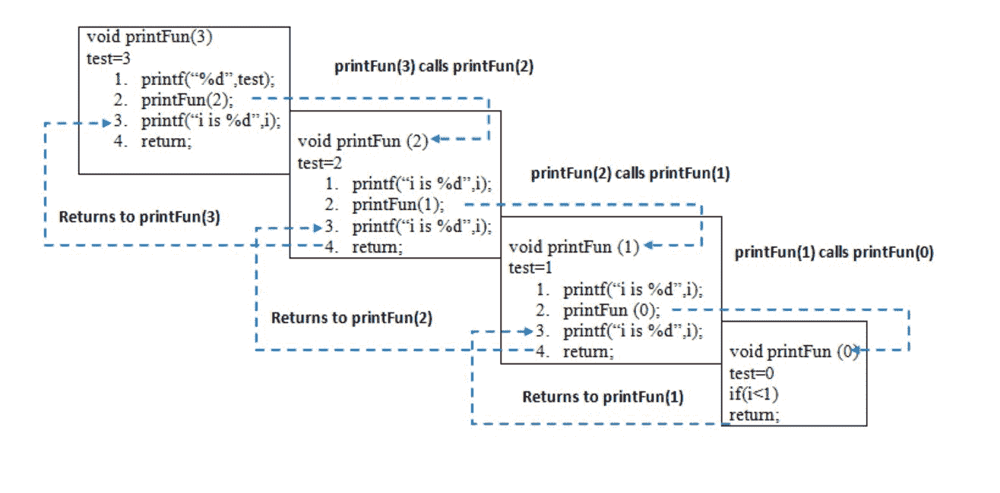
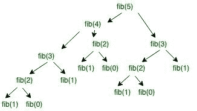
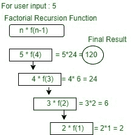

# 递归

> 原文:[https://www.geeksforgeeks.org/recursion/](https://www.geeksforgeeks.org/recursion/)

**什么是递归？**
函数直接或间接调用自身的过程称为递归，相应的函数称为递归函数。使用递归算法，某些问题可以很容易地解决。此类问题的例子有河内(TOH)[塔、](https://www.geeksforgeeks.org/c-program-for-tower-of-hanoi/)[有序/前序/后序树遍历](https://www.geeksforgeeks.org/tree-traversals-inorder-preorder-and-postorder/)、[图的 DFS](https://www.geeksforgeeks.org/depth-first-traversal-for-a-graph/)等。

**一种数学解释**

让我们考虑一个问题，程序员必须确定前 n 个自然数的和，有几种方法可以做到这一点，但最简单的方法是简单地将从 1 到 n 开始的数字相加。所以这个函数看起来很简单，

> **逼近(1)–简单的一个个相加**
> 
> **f(n) = 1 + 2 + 3 +……..+ n**

但是还有另一种数学方法来表示这一点，

> **方法(2)–递归加法**
> 
> **f(n) = 1 n=1**
> 
> **f(n) = n + f(n-1) n > 1**

方法(1)和方法(2)之间有一个简单的区别，那就是在**方法(2)** 中，函数“ **f( )** ”本身是在函数内部被调用的，所以这种现象被称为递归，而包含递归的函数被称为递归函数，归根结底这是程序员手中的一个很好的工具，可以更容易、更有效地编码一些问题。

**递归中的基条件是什么？**
在递归程序中，提供基本情况的解，较大问题的解用较小的问题表示。

```
int fact(int n)
{
    if (n < = 1) // base case
        return 1;
    else    
        return n*fact(n-1);    
}
```

在上面的例子中，定义了 n < = 1 的基本情况，并且可以通过转换成较小的数值直到达到基本情况来解决较大的数值。

**如何使用递归解决特定问题？**
这个想法是用一个或多个较小的问题来表示一个问题，并添加一个或多个停止递归的基本条件。例如，如果我们知道(n-1)的阶乘，我们就计算阶乘 n。阶乘的基本情况是 n = 0。当 n = 0 时，我们返回 1。

**递归中为什么会出现堆栈溢出错误？**
如果没有达到或者没有定义基本情况，那么可能会出现栈溢出问题。让我们举个例子来理解这一点。

```
int fact(int n)
{
    // wrong base case (it may cause
    // stack overflow).
    if (n == 100) 
        return 1;

    else
        return n*fact(n-1);
}
```

如果调用 fact(10)，它会调用 fact(9)、fact(8)、fact(7)等等，但这个数字永远不会达到 100。所以，基本情况是达不到的。如果堆栈上的这些函数耗尽了内存，将导致堆栈溢出错误。

**直接递归和间接递归有什么区别？**
一个函数 fun 如果调用同一个函数 fun，叫做直接递归。如果函数 fun 调用另一个函数，比如 fun_new，fun_new 直接或间接调用 fun，那么这个函数叫做间接递归。表 1 说明了直接递归和间接递归的区别。

```
// An example of direct recursion
void directRecFun()
{
    // Some code....

    directRecFun();

    // Some code...
}

// An example of indirect recursion
void indirectRecFun1()
{
    // Some code...

    indirectRecFun2();

    // Some code...
}
void indirectRecFun2()
{
    // Some code...

    indirectRecFun1();

    // Some code...
}
```

**有尾递归和无尾递归有什么区别？**
当递归调用是函数执行的最后一件事时，递归函数是尾部递归。详见[尾部递归篇](https://www.geeksforgeeks.org/tail-recursion/)。

**递归中不同的函数调用是如何分配内存的？**
当从 main()调用任何函数时，内存会在堆栈上分配给它。递归函数调用自己，被调用函数的内存分配在分配给调用函数的内存之上，并且为每个函数调用创建不同的局部变量副本。当达到基本情况时，函数将其值返回给调用它的函数，内存被取消分配，过程继续。
我们举一个简单的函数来说明递归是如何工作的。

## 卡片打印处理机（Card Print Processor 的缩写）

```
// A C++ program to demonstrate working of
// recursion
#include <bits/stdc++.h>
using namespace std;

void printFun(int test)
{
    if (test < 1)
        return;
    else {
        cout << test << " ";
        printFun(test - 1); // statement 2
        cout << test << " ";
        return;
    }
}

// Driver Code
int main()
{
    int test = 3;
    printFun(test);
}
```

## Java 语言(一种计算机语言，尤用于创建网站)

```
// A Java program to demonstrate working of
// recursion
class GFG {
    static void printFun(int test)
    {
        if (test < 1)
            return;
        else {
            System.out.printf("%d ", test);
            printFun(test - 1); // statement 2
            System.out.printf("%d ", test);
            return;
        }
    }

    // Driver Code
    public static void main(String[] args)
    {
        int test = 3;
        printFun(test);
    }
}

// This code is contributed by
// Smitha Dinesh Semwal
```

## 蟒蛇 3

```
# A Python 3 program to
# demonstrate working of
# recursion

def printFun(test):

    if (test < 1):
        return
    else:

        print(test, end=" ")
        printFun(test-1)  # statement 2
        print(test, end=" ")
        return

# Driver Code
test = 3
printFun(test)

# This code is contributed by
# Smitha Dinesh Semwal
```

## C#

```
// A C# program to demonstrate
// working of recursion
using System;

class GFG {

    // function to demonstrate
    // working of recursion
    static void printFun(int test)
    {
        if (test < 1)
            return;
        else {
            Console.Write(test + " ");

            // statement 2
            printFun(test - 1);

            Console.Write(test + " ");
            return;
        }
    }

    // Driver Code
    public static void Main(String[] args)
    {
        int test = 3;
        printFun(test);
    }
}

// This code is contributed by Anshul Aggarwal.
```

## 服务器端编程语言（Professional Hypertext Preprocessor 的缩写）

```
<?php
// PHP program to demonstrate
// working of recursion

// function to demonstrate
// working of recursion
function printFun($test)
{
    if ($test < 1)
        return;
    else
    {
        echo("$test ");

        // statement 2
        printFun($test-1);

        echo("$test ");
        return;
    }
}

// Driver Code
$test = 3;
printFun($test);

// This code is contributed by
// Smitha Dinesh Semwal.
?>
```

## java 描述语言

```
<script>

// JavaScript program to demonstrate working of
// recursion

function printFun(test)
    {
        if (test < 1)
            return;
        else {
            document.write(test + " ");
            printFun(test - 1); // statement 2
            document.write(test + " ");
            return;
        }
    }

// Driver code
    let test = 3;
    printFun(test);

</script>
```

**输出:**

```
3 2 1 1 2 3
```

当从 main()调用 **printFun(3)** 时，内存被分配给 **printFun(3)** ，一个局部变量测试被初始化为 3，语句 1 到 4 被推送到堆栈上，如下图所示。它首先打印“3”。在语句 2 中，调用 **printFun(2)** 并将内存分配给 **printFun(2)** ，并将局部变量测试初始化为 2，并将语句 1 至 4 推入堆栈。同样的， **printFun(2)** 调用**print fun(1)****print fun(1)**调用 **printFun(0)** 。 **printFun(0)** 转到 if 语句，返回 **printFun(1)** 。执行 **printFun(1)** 的剩余语句，返回 **printFun(2)** 以此类推。在输出中，打印从 3 到 1 的值，然后打印 1 到 3。内存堆栈如下图所示。



现在，让我们讨论几个可以用递归解决的实际问题，并了解它的基本工作原理。为了获得基本的理解，请阅读以下文章。
[递归的基本理解。](https://www.geeksforgeeks.org/recursion/)
**问题 1:** 写一个程序和递推关系找到 n 的斐波那契数列其中 n > 2。
*数学方程:*

```
n if n == 0, n == 1;      
fib(n) = fib(n-1) + fib(n-2) otherwise;
```

*复发关系:*

```
T(n) = T(n-1) + T(n-2) + O(1)
```

**递归程序:**

```
Input: n = 5 
Output:
Fibonacci series of 5 numbers is : 0 1 1 2 3
```

**实施:**

## C++

```
// C++ code to implement Fibonacci series
#include <bits/stdc++.h>
using namespace std;

// Function for fibonacci

int fib(int n)
{
    // Stop condition
    if (n == 0)
        return 0;

    // Stop condition
    if (n == 1 || n == 2)
        return 1;

    // Recursion function
    else
        return (fib(n - 1) + fib(n - 2));
}

// Driver Code
int main()
{
    // Initialize variable n.
    int n = 5;
    cout<<"Fibonacci series of 5 numbers is: ";

    // for loop to print the fibonacci series.
    for (int i = 0; i < n; i++)
    {
        cout<<fib(i)<<" ";
    }
    return 0;
}
```

## C

```
// C code to implement Fibonacci series
#include <stdio.h>

// Function for fibonacci
int fib(int n)
{
    // Stop condition
    if (n == 0)
        return 0;

    // Stop condition
    if (n == 1 || n == 2)
        return 1;

    // Recursion function
    else
        return (fib(n - 1) + fib(n - 2));
}

// Driver Code
int main()
{
    // Initialize variable n.
    int n = 5;
    printf("Fibonacci series "
           "of %d numbers is: ",
           n);

    // for loop to print the fibonacci series.
    for (int i = 0; i < n; i++) {
        printf("%d ", fib(i));
    }
    return 0;
}
```

## Java 语言(一种计算机语言，尤用于创建网站)

```
// Java code to implement Fibonacci series
import java.util.*;

class GFG
{

// Function for fibonacci
static int fib(int n)
{
    // Stop condition
    if (n == 0)
        return 0;

    // Stop condition
    if (n == 1 || n == 2)
        return 1;

    // Recursion function
    else
        return (fib(n - 1) + fib(n - 2));
}

// Driver Code
public static void main(String []args)
{

    // Initialize variable n.
    int n = 5;
    System.out.print("Fibonacci series of 5 numbers is: ");

    // for loop to print the fibonacci series.
    for (int i = 0; i < n; i++)
    {
        System.out.print(fib(i)+" ");
    }
}
}

// This code is contributed by rutvik_56.
```

## 蟒蛇 3

```
# Python code to implement Fibonacci series

# Function for fibonacci
def fib(n):

    # Stop condition
    if (n == 0):
        return 0

    # Stop condition
    if (n == 1 or n == 2):
        return 1

    # Recursion function
    else:
        return (fib(n - 1) + fib(n - 2))

# Driver Code

# Initialize variable n.
n = 5;
print("Fibonacci series of 5 numbers is :",end=" ")

# for loop to print the fibonacci series.
for i in range(0,n):
    print(fib(i),end=" ")
```

## C#

```
using System;

public class GFG
{

  // Function for fibonacci
  static int fib(int n)
  {

    // Stop condition
    if (n == 0)
      return 0;

    // Stop condition
    if (n == 1 || n == 2)
      return 1;

    // Recursion function
    else
      return (fib(n - 1) + fib(n - 2));
  }

  // Driver Code
  static public void Main ()
  {

    // Initialize variable n.
    int n = 5;
    Console.Write("Fibonacci series of 5 numbers is: ");

    // for loop to print the fibonacci series.
    for (int i = 0; i < n; i++)
    {
      Console.Write(fib(i) + " ");
    }
  }
}

// This code is contributed by avanitrachhadiya2155
```

## java 描述语言

```
<script>
// JavaScript code to implement Fibonacci series

// Function for fibonacci
function fib(n)
{
   // Stop condition
   if(n == 0)
     return 0;

   // Stop condition
   if(n == 1 || n == 2)
      return 1;
   // Recursion function
   else
      return fib(n-1) + fib(n-2);
}

// Initialize variable n.
let n = 5;

document.write("Fibonacci series of 5 numbers is: ");

// for loop to print the fibonacci series.
for(let i = 0; i < n; i++)
{
    document.write(fib(i) + " ");
}

</script>
```

**Output**

```
Fibonacci series of 5 numbers is: 0 1 1 2 3 
```

这是输入 5 的递归树，它清楚地展示了如何将一个大问题分解成小问题。
fib(n)是斐波那契函数。给定程序的时间复杂度取决于函数调用。

> fib(n) -> level CBT (UB) -> 2^n-1 节点-> 2^n 函数调用-> 2^n*O(1) -> T(n) = O(2^n)

最佳案例。

```
T(n) =   θ(2^n\2)
```

**工作:**



**问题 2:** 写一个程序和递推关系求 n 的阶乘，其中 n > 2。
**数学方程式:**

```
1 if n == 0 or n == 1;      
f(n) = n*f(n-1) if n> 1;
```

**复发关系:**

```
T(n) = 1 for n = 0
T(n) = 1 + T(n-1) for n > 0
```

**递归程序:**
**输入:** n = 5
**输出:**
5 的阶乘为:120
**实现:**

## C++

```
// C++ code to implement factorial
#include <bits/stdc++.h>
using namespace std;

// Factorial function
int f(int n)
{
    // Stop condition
    if (n == 0 || n == 1)
        return 1;

    // Recursive condition
    else
        return n * f(n - 1);
}

// Driver code
int main()
{
    int n = 5;
    cout<<"factorial of "<<n<<" is: "<<f(n);
    return 0;
}
```

## C

```
// C code to implement factorial
#include <stdio.h>

// Factorial function
int f(int n)
{
    // Stop condition
    if (n == 0 || n == 1)
        return 1;

    // Recursive condition
    else
        return n * f(n - 1);
}

// Driver code
int main()
{
    int n = 5;
    printf("factorial of %d is: %d", n, f(n));
    return 0;
}
```

## Java 语言(一种计算机语言，尤用于创建网站)

```
// Java code to implement factorial
public class GFG
{

  // Factorial function
  static int f(int n)
  {

    // Stop condition
    if (n == 0 || n == 1)
      return 1;

    // Recursive condition
    else
      return n * f(n - 1);
  }

  // Driver code
  public static void main(String[] args)
  {
    int n = 5;
    System.out.println("factorial of " + n + " is: " + f(n));
  }
}

// This code is contributed by divyesh072019.
```

## 蟒蛇 3

```
# Python3 code to implement factorial

# Factorial function
def f(n):

    # Stop condition
    if (n == 0 or n == 1):
        return 1;

    # Recursive condition
    else:
        return n * f(n - 1);

# Driver code
if __name__=='__main__':

    n = 5;
    print("factorial of",n,"is:",f(n))

    # This code is contributed by pratham76.
```

## C#

```
// C# code to implement factorial
using System;
class GFG {

  // Factorial function
  static int f(int n)
  {
    // Stop condition
    if (n == 0 || n == 1)
      return 1;

    // Recursive condition
    else
      return n * f(n - 1);
  }

  // Driver code
  static void Main()
  {
    int n = 5;
    Console.WriteLine("factorial of " + n + " is: " + f(n));
  }
}

// This code is contributed by divyeshrabadiya07.
```

## java 描述语言

```
<script>
// JavaScript code to implement factorial

// Factorial function
function f(n)
{
   // Stop condition
   if(n == 0 || n == 1)
     return 1;

   // Recursive condition
   else
      return n*f(n-1);
}

// Initialize variable n.
let n = 5;
document.write("factorial of "+ n +" is: " + f(n));

// This code is contributed by probinsah.
</script>
```

**Output**

```
factorial of 5 is: 120
```

**工作:**

[](https://media.geeksforgeeks.org/wp-content/uploads/20191108122114/Untitled-Diagram58.jpg)

用户输入的阶乘递归函数图 5。

**递归编程相对于迭代编程有哪些缺点？**
注意递归和迭代程序都有相同的解题能力，即每个递归程序都可以迭代编写，反之亦然。递归程序比迭代程序有更大的空间需求，因为所有函数都将保留在堆栈中，直到达到基本情况。由于函数调用和返回开销，它也有更大的时间要求。

**递归编程相比迭代编程有哪些优势？**
递归提供了一种简洁明了的代码编写方式。有些问题本质上是递归的，比如树遍历、[汉诺塔](https://www.geeksforgeeks.org/c-program-for-tower-of-hanoi/)等。对于此类问题，最好编写递归代码。借助堆栈数据结构，我们也可以迭代地编写这样的代码。例如参考[无递归有序树遍历](https://www.geeksforgeeks.org/inorder-tree-traversal-without-recursion/)、[河内迭代塔](https://www.geeksforgeeks.org/iterative-tower-of-hanoi/)。

**基于输出的初学者练习题:**
[递归练习题|集 1](https://www.geeksforgeeks.org/practice-questions-for-recursion/)
[递归练习题|集 2](https://www.geeksforgeeks.org/practice-questions-for-recursion-set-2/)
[递归练习题|集 3](https://www.geeksforgeeks.org/practice-questions-for-recursion-set-3/)
[递归练习题|集 4](https://www.geeksforgeeks.org/practice-questions-for-recursion-set-4/)
[递归练习题|集 5](https://www.geeksforgeeks.org/practice-questions-for-recursion-set-5/)
[递归练习题|集 6](https://www.geeksforgeeks.org/practice-questions-for-recursion-set-6/)
T21】递归练习题| 第七集
[**递归小测验**](https://www.geeksforgeeks.org/algorithms-gq/recursion-gq/)
[**递归上的编码练习:**](https://practice.geeksforgeeks.org/tag-page.php?tag=recursion&isCmp=0)
[**所有关于递归的文章**](https://www.geeksforgeeks.org/tag/recursion/)
[递归练习题带解法](https://www.geeksforgeeks.org/recursion-practice-problems-solutions/)
本文由**索纳尔·图特佳**供稿。 如果你喜欢 GeeksforGeeks 并想投稿，你也可以使用[write.geeksforgeeks.org](https://write.geeksforgeeks.org)写一篇文章或者把你的文章邮寄到 review-team@geeksforgeeks.org。看到你的文章出现在极客博客主页上，帮助其他极客。
如果发现任何不正确的地方，或者你想分享更多关于上面讨论的话题的信息，请写评论