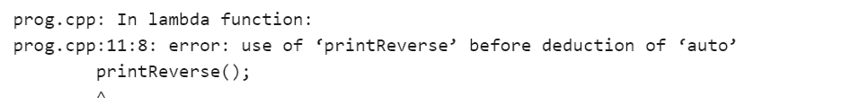

# c++中的递归 lambda 表达式

> 原文:[https://www . geesforgeks . org/recursive-lambda-expressions-in-CPP/](https://www.geeksforgeeks.org/recursive-lambda-expressions-in-cpp/)

递归λ表达式是一个[函数](https://www.geeksforgeeks.org/functions-in-c/)直接或间接调用自身的过程，称为[递归](https://www.geeksforgeeks.org/recursion/)，对应的函数称为[递归函数](https://www.geeksforgeeks.org/recursion/)。使用递归算法，某些问题可以很容易地解决。此类问题的示例有河内(TOH)塔、[有序/前序/后序树遍历](https://www.geeksforgeeks.org/tree-traversals-inorder-preorder-and-postorder/)、[图的 DFS](https://www.geeksforgeeks.org/depth-first-traversal-for-a-graph/)等。

递归函数只是一种循环结构。不同的是，它自己维护一个[内存堆栈](https://www.geeksforgeeks.org/memory-layout-of-c-program/)。显然，它必须有一个像[一样的](https://www.geeksforgeeks.org/loops-in-c-and-cpp/)[破环条件](https://www.geeksforgeeks.org/break-statement-cc/)和。因此，递归函数具有以下结构-

```
function name(arguments)
{
    a base case (a breaking condition)   
    recursive code (the actual logic)
}
```

```
int fact(int n)
{
    // Base Case
    if (n < = 1)
        return 1;
    else    
        return n * fact(n - 1);    
}
```

[C++ 11](https://www.geeksforgeeks.org/c-11-vs-c-14-vs-c-17/) 引入了 [lambda 表达式](https://www.geeksforgeeks.org/lambda-expression-in-c/)来允许我们编写一个[内联函数](https://www.geeksforgeeks.org/inline-functions-cpp/)，该函数可以用于那些不会被重用且不值得命名的简短代码片段。在其最简单的形式中，lambda 表达式可以定义如下:

```
[ capture clause ] (parameters) -> return-type  
{   
   definition of method   
} 
```

**程序 1:**

下面是 C++中 [sort()方法](https://www.geeksforgeeks.org/sort-c-stl/)中 lambda 表达式的程序:

## C++14

```
// C++ program to implement
// the above approach
#include <bits/stdc++.h>
using namespace std;

// Driver code
int main()
{
    int arr[] = { 5, 2, 1, 4, 3 };
    sort(arr, arr + 5, [](int& a,
                          int& b) {
        // Instant lambda function
        return a > b;
    });

    for (int i = 0; i < 5; i++)
        cout << arr[i] << " ";
    return 0;
}
```

**Output**

```
5 4 3 2 1 
```

**说明:**这里使用的是 instant lambda 函数，不能用在另一种[排序方式](https://www.geeksforgeeks.org/sorting-algorithms/)中，即需要重新编写相同的代码。此 lambda 表达式仅在 sort()方法执行期间存在。但是也可以将 lambda 表达式存储在变量中(最好称之为函数)，如下所示。通过存储它，它可以被进一步使用，当然，也可以执行递归。

**程序 2:**

## C++14

```
// C++ program to implement
// the above approach
#include <bits/stdc++.h>
using namespace std;

// Stored lambda expression
auto cmp = [](int& a, int& b) {
    return a > b;
};

// Driver code
int main()
{
    int arr[] = { 5, 2, 3, 1, 4 };
    sort(arr, arr + 5, cmp);

    for (int i = 0; i < 5; i++)
        cout << arr[i] << " ";

    return 0;
}
```

**Output**

```
5 4 3 2 1 
```

**说明:**这里，auto cmp 是 lambda stored 函数，可以用于任意多种排序方式。

**使用 lambda 的递归:**让我们通过考虑下面的递归函数来一起讨论递归和 Lambda 表达式的概念:

**程序 3:**

## C++14

```
// C++ program to implement
// the above approach
#include <iostream>
using namespace std;

// Recursive function to print
// the digits of a number
void printReverse(int n)
{
    if (n == 0)
        return;
    cout << n % 10 << " ";
    printReverse(n / 10);
}

// Driver code
int main()
{
    int n = 12345;
    printReverse(n);
    return 0;
}
```

**Output**

```
5 4 3 2 1 
```

**说明:**以上是用递归将一个数字的数字逆序打印出来的函数。使用 lambda 表达式也可以做到这一点。

**程序 4:**

下面是使用 lambda 表达式实现上述代码的 C++程序:

## C++14

```
// C++ program to implement
// the above approach
#include <iostream>
using namespace std;

// Driver code
int main()
{
    int n = 12345;

    // Recursive lambda function to
    // print the digits of a number
    auto printReverse = [&]() {
        if (n == 0)
            return;
        cout << n % 10;
        n = n / 10;
        printReverse();

        // As it is a part of main body,
        // semicolon is must
    };

    printReverse();
    return 0;
}
```

**输出:**



哎呀，必须先扣除使用自动返回类型定义的函数(编译器必须能够确定自动返回类型是否可以转换为 void 或 int 或其他)

**解释:**在这里，函数如何识别变量 n，即使它不是作为参数传递的。带有空 capture 子句[ ]的 lambda 只能访问其本地的变量。这里，使用了捕获关闭[ & ]，这允许函数访问变量 n(变量 n 的实际值正在被改变)。有两种方法可以解决上面的错误:

**1。通过将函数本身传递给函数参数:**

下面是实现上述概念的 C++程序:

**程序 5:**

## C++14

```
// C++ program to implement
// the above approach
#include <iostream>
using namespace std;

// Driver code
int main()
{
    int n = 12345;

    // Function itself as a parameter
    auto printReverse = [&](auto&& printReverse) {
        if (n == 0)
            return;
        cout << n % 10 << " ";
        n = n / 10;
        printReverse(printReverse);
    };

    // Function as an argument
    printReverse(printReverse);
    return 0;
}
```

**Output**

```
5 4 3 2 1 
```

**2。首先声明函数:**

声明一个函数意味着声明它的名称和参数类型，以便通知编译器有一个名为 xyz 的函数，它将在以后写它的主体。

**程序 6:**

下面是实现上述概念的 C++程序:

## C++

```
// C++ program to implement
// the above approach
#include <iostream>
using namespace std;

// Declaring of a function
void declaringFunction(string s);

// Driver code
int main()
{
    declaringFunction("Hello I am learning how to declare a function");
    return 0;
}

// Body of a function
void declaringFunction(string s)
{
    cout << s;
}
```

**Output**

```
Hello I am learning how to declare a function
```

**程序 7:**

因为它是一个 lambda 函数，所以必须有某种独特的方法来声明这个函数。下面是同样的 C++程序:

## C++14

```
// C++ program to implement
// the above approach
#include <functional>
#include <iostream>
using namespace std;

// Driver code
int main()
{
    int n = 12345;

    // Function < return type (parameter
    // types) > functionName

    // Don't forget to include functional
    // header

    // Declaration
    function<void()> printReverse;

    printReverse = [&]() {
        if (n == 0)
            return;

        // Defination
        cout << n % 10 << " ";
        n /= 10;
        printReverse();
    };

    printReverse();
}
```

**Output**

```
5 4 3 2 1 
```

**说明:**在上面的代码中，首先声明了函数 printReverse，然后我们定义了它的主体。相反，我们可以直接声明函数及其主体，这就是所谓的定义函数。下面是实现上述方法的 C++程序:

**程序 8:**

## C++14

```
// C++ program to implement
// the above approach
#include <functional>
#include <iostream>
using namespace std;

// Driver code
int main()
{
    int n = 12345;

    // Function < return type (parameter
    // types) > functionName
    function<void()> printReverse = [&]() {
        if (n == 0)
            return;

        // Declaration + Body
        cout << n % 10 << " ";
        n /= 10;
        printReverse();
    };

    printReverse();
}
```

**Output**

```
5 4 3 2 1 
```

**示例:**下面是一些使用 lambda 表达式的递归函数示例。

**程序 9:**

## C++14

```
// C++ program to implement
// the above approach
#include <iostream>
using namespace std;

// Driver code
int main()
{
    int n = 6;

    // Recursive Lambda function to
    // find the factorial of a number
    auto factorial = [&](auto&& factorial) {
        if (n == 1)
            return n;
        return n-- * factorial(factorial);
    };

    auto factorial2 = [](int n, auto&& factorial2) {
        if (n == 1)
            return n;
        return n * factorial2(n - 1, factorial2);
    };

    // Given n = 6
    cout << factorial(factorial) << endl;

    // Given n = 5
    cout << factorial2(5, factorial2);
}
```

**Output**

```
720
120
```

**解释:**在阶乘函数中，使用[ & ] capture 子句直接访问 n。在阶乘 2 函数中，n 作为参数传递。因此，不需要[ & ]条款。

**程序 10:**

## C++14

```
// C++ program to implement
// the above approach
#include <iostream>
using namespace std;

// Driver code
int main()
{
    // Sorted array
    int arr[] = { 1, 2, 5, 7, 10, 12, 15 };
    int size = 7;

    // Item to be searched
    int key = 10;

    auto binarySearch = [&](int startIndex,
                            int endIndex,
                            auto&& binarySearch) {
        if (startIndex > endIndex)
            return -1;
        int midIndex = (startIndex + endIndex) / 2;
        if (arr[midIndex] == key)
            return midIndex;
        if (arr[midIndex] > key)
            return binarySearch(startIndex,
                                midIndex - 1,
                                binarySearch);
        if (arr[midIndex] < key)
            return binarySearch(midIndex + 1,
                                endIndex,
                                binarySearch);
        // Not found
        return -1;
    };

    int index = binarySearch(0, size - 1,
                             binarySearch);
    if (index == -1)
        cout << "Not found";
    else
        cout << "Found on index " << index;

    return 0;
}
```

**Output**

```
Found on index 4
```