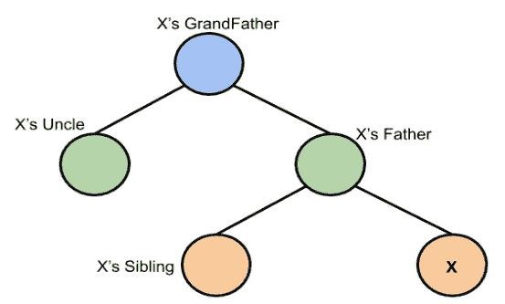
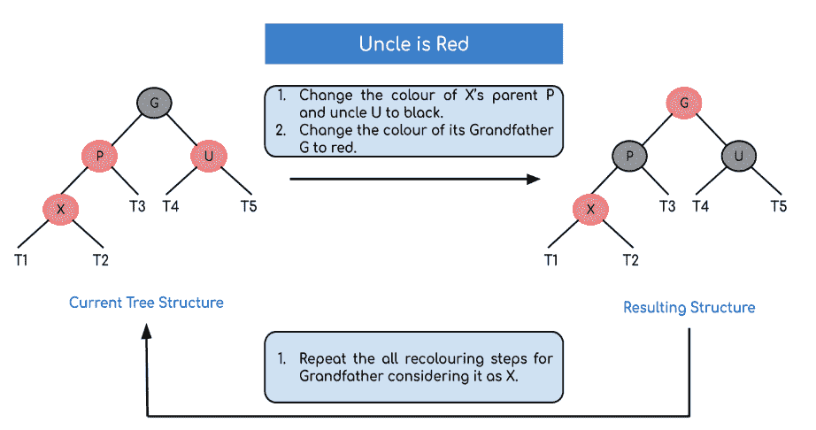
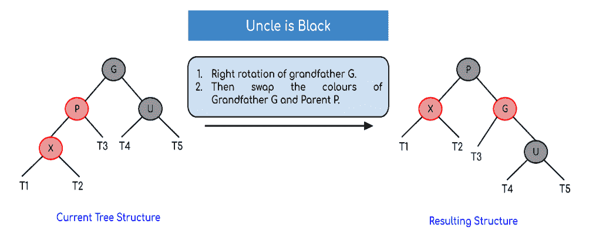
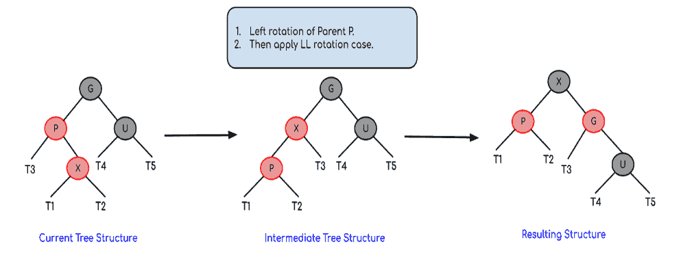
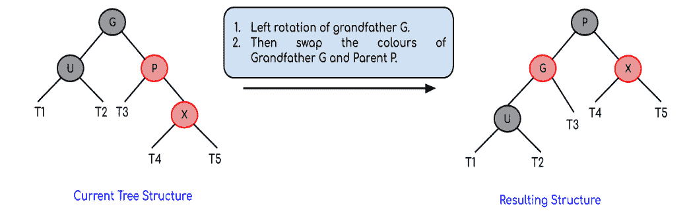
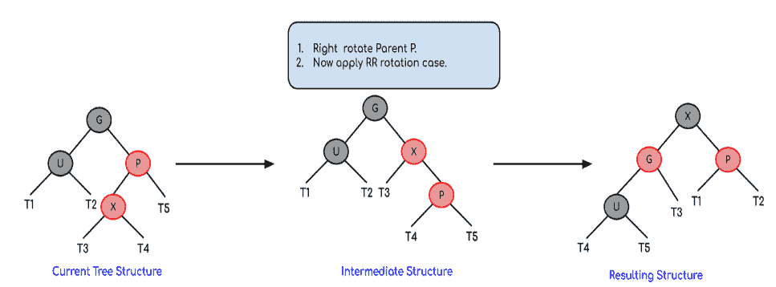
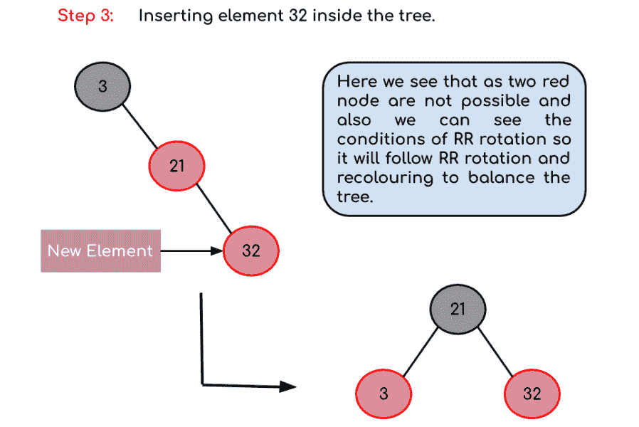

# 红黑树|第二组(插入)

> 原文:[https://www.geeksforgeeks.org/red-black-tree-set-2-insert/](https://www.geeksforgeeks.org/red-black-tree-set-2-insert/)

在[之前的帖子](https://www.geeksforgeeks.org/red-black-tree-set-1-introduction-2/)中，我们讨论了红黑树的介绍。在这篇文章中，插入被讨论。在 [AVL 树插入](https://www.geeksforgeeks.org/avl-tree-set-1-insertion/)中，我们使用旋转作为插入后做平衡的工具。在红黑树中，我们使用两种工具来进行平衡。

1.  重新着色
2.  [旋转](http://en.wikipedia.org/wiki/Tree_rotation)

重新着色是节点颜色的变化，也就是说，如果它是红色的，那么就把它变成黑色，反之亦然。必须注意，空节点的颜色总是黑色。此外，我们总是先尝试重新着色，如果重新着色不起作用，那么我们就进行旋转。下面是详细的算法。算法主要有两种情况，取决于叔叔的颜色。如果叔叔是红色的，我们会回忆。如果叔叔是黑人，我们做旋转和/或重新着色。

#### **我们将使用的表示是:**



这种表示基于 X

#### **逻辑:**

首先，您必须插入与二叉树中相似的节点，并为其分配红色。现在，如果节点是根节点，那么将其颜色更改为黑色，但是如果不是，那么检查父节点的颜色。如果它的颜色是黑色，那么不要改变颜色，但如果它不是，即它是红色，那么检查节点的叔叔的颜色。如果节点的叔叔有红色，那么将节点的父母和叔叔的颜色更改为黑色，祖父的颜色更改为红色，并为他(即祖父)重复相同的过程。



但是，如果节点的叔叔有黑色，那么有 4 种可能的情况:

*   左左机箱(左旋转):



*   左右壳体(左后旋转):



*   右右壳体(右旋转):



*   右左壳体(左后旋转):



现在，在这些旋转之后，如果节点的颜色不匹配，那么重新着色它们。

#### **算法:**

假设 x 是新插入的节点。

1.  执行[标准 BST 插入](http://geeksquiz.com/binary-search-tree-set-1-search-and-insertion/)，使新插入节点的颜色为红色。
2.  如果 x 是根，则将 x 的颜色更改为黑色(完整树的黑色高度增加 1)。
3.  如果 x 的父代颜色不是黑色**，** x 不是根，请执行以下操作。
    **a)如果 x 的叔叔是** **RED** (祖父母一定是来自[属性 4](https://www.geeksforgeeks.org/red-black-tree-set-1-introduction-2/) )
    **(i)** 将父母和叔叔的颜色改为 black。
    **(二)**祖父母的颜色为红色。
    **(三)**更改 x = x 的祖父母，对新 x 重复步骤 2 和 3 .
    **b)如果 x 的叔叔是 BLACK** ，那么 x 可以有四种配置， x 的父母( **p** )和 x 的祖父母( **g** )(这类似于[AVL Tree](https://www.geeksforgeeks.org/avl-tree-set-1-insertion/))
    **(I)**左格(p 是 g 的左子，x 是 p 的左子)
    **(ii)** 左右格(p 是 g 的左子，x 是 p 的右子)
    **(iii)**

**示例:在一棵空树上创建一棵包含元素 3、21、32 和 15 的红黑树。**

**解决方案:**


当插入第一个元素时，它作为根节点插入，并且根节点具有黑色，因此它获得黑色。


新元素总是以红色插入，颜色为 21 > 3，因此它成为根节点右子树的一部分。



现在，当我们插入 32 时，我们看到有一个红色的父子对，它违反了红黑树规则，所以我们必须旋转它。此外，我们看到 RR 旋转的条件(将根节点的空节点视为黑色)，因此在旋转之后，由于根节点不能为红色，因此我们必须在树中执行重新着色，从而产生上面所示的树。


**最终树形结构:**


最终的树会是这样的

以上算法的完整实现请参考 [**【红黑树插入的 C 程序】**](http://geeksquiz.com/c-program-red-black-tree-insertion/) 。

[红黑树|第三集(删除)](https://www.geeksforgeeks.org/red-black-tree-set-3-delete-2/)

## Java 中的插入代码。

下面是用 **<u>java</u>** 编写的代码，用于**实现红黑树**

下面的代码还实现了树插入和树遍历。

最后，你也可以想象构建的树！！！。

## Java 语言(一种计算机语言，尤用于创建网站)

```
/*package whatever //do not write package name here */

import java.io.*;

// considering that you know what are red-black trees here is the implementation in java for insertion and traversal.
// RedBlackTree class. This class contains subclass for node
// as well as all the functionalities of RedBlackTree such as - rotations, insertion and
// inoredr traversal
public class RedBlackTree
{
    public Node root;//root node
    public RedBlackTree()
    {
        super();
        root = null;
    }
    // node creating sublass
    class Node
    {
        int data;
        Node left;
        Node right;
        char colour;
        Node parent;

        Node(int data)
        {
            super();
            this.data = data;   // only including data. not key
            this.left = null; // left subtree
            this.right = null; // right subtree
            this.colour = 'R'; // colour . either 'R' or 'B'
            this.parent = null; // required at time of rechecking.
        }
    }
    // this function performs left rotation
    Node rotateLeft(Node node)
    {
        Node x = node.right;
        Node y = x.left;
        x.left = node;
        node.right = y;
        node.parent = x; // parent resetting is also important.
        if(y!=null)
            y.parent = node;
        return(x);
    }
    //this function performs right rotation
    Node rotateRight(Node node)
    {
        Node x = node.left;
        Node y = x.right;
        x.right = node;
        node.left = y;
        node.parent = x;
        if(y!=null)
            y.parent = node;
        return(x);
    }

    // these are some flags.
    // Respective rotations are performed during traceback.
    // rotations are done if flags are true.
    boolean ll = false;
    boolean rr = false;
    boolean lr = false;
    boolean rl = false;
    // helper function for insertion. Actually this function performs all tasks in single pass only.
    Node insertHelp(Node root, int data)
    {
        // f is true when RED RED conflict is there.
        boolean f=false;

        //recursive calls to insert at proper position according to BST properties.
        if(root==null)
            return(new Node(data));
        else if(data<root.data)
        {
            root.left = insertHelp(root.left, data);
            root.left.parent = root;
            if(root!=this.root)
            {
                if(root.colour=='R' && root.left.colour=='R')
                    f = true;
            }
        }
        else
        {
            root.right = insertHelp(root.right,data);
            root.right.parent = root;
            if(root!=this.root)
            {
                if(root.colour=='R' && root.right.colour=='R')
                    f = true;
            }
        // at the same time of insertion, we are also assigning parent nodes
        // also we are checking for RED RED conflicts
        }

        // now lets rotate.
        if(this.ll) // for left rotate.
        {
            root = rotateLeft(root);
            root.colour = 'B';
            root.left.colour = 'R';
            this.ll = false;
        }
        else if(this.rr) // for right rotate
        {
            root = rotateRight(root);
            root.colour = 'B';
            root.right.colour = 'R';
            this.rr  = false;
        }
        else if(this.rl)  // for right and then left
        {
            root.right = rotateRight(root.right);
            root.right.parent = root;
            root = rotateLeft(root);
            root.colour = 'B';
            root.left.colour = 'R';

            this.rl = false;
        }
        else if(this.lr)  // for left and then right.
        {
            root.left = rotateLeft(root.left);
            root.left.parent = root;
            root = rotateRight(root);
            root.colour = 'B';
            root.right.colour = 'R';
            this.lr = false;
        }
        // when rotation and recolouring is done flags are reset.
        // Now lets take care of RED RED conflict
        if(f)
        {
            if(root.parent.right == root)  // to check which child is the current node of its parent
            {
                if(root.parent.left==null || root.parent.left.colour=='B')  // case when parent's sibling is black
                {// perform certaing rotation and recolouring. This will be done while backtracking. Hence setting up respective flags.
                    if(root.left!=null && root.left.colour=='R')
                        this.rl = true;
                    else if(root.right!=null && root.right.colour=='R')
                        this.ll = true;
                }
                else // case when parent's sibling is red
                {
                    root.parent.left.colour = 'B';
                    root.colour = 'B';
                    if(root.parent!=this.root)
                        root.parent.colour = 'R';
                }
            }
            else  
            {
                if(root.parent.right==null || root.parent.right.colour=='B')
                {
                    if(root.left!=null && root.left.colour=='R')
                        this.rr = true;
                    else if(root.right!=null && root.right.colour=='R')
                        this.lr = true;
                }
                else
                {
                    root.parent.right.colour = 'B';
                    root.colour = 'B';
                    if(root.parent!=this.root)
                        root.parent.colour = 'R';
                }
            }
            f = false;
        }
        return(root); 
    }

    // function to insert data into tree.
    public void insert(int data)
    {
        if(this.root==null)
        {
            this.root = new Node(data);
            this.root.colour = 'B';
        }
        else
            this.root = insertHelp(this.root,data);
    }
    // helper function to print inorder traversal
    void inorderTraversalHelper(Node node)
    {
        if(node!=null)
        {
            inorderTraversalHelper(node.left);
            System.out.printf("%d ", node.data);
            inorderTraversalHelper(node.right);
        }
    }
    //function to print inorder traversal
    public void inorderTraversal()
    {
        inorderTraversalHelper(this.root);
    }
    // helper function to print the tree.
    void printTreeHelper(Node root, int space)
    {
        int i;
        if(root != null)
        {
            space = space + 10;
            printTreeHelper(root.right, space);
            System.out.printf("\n");
            for ( i = 10; i < space; i++)
            {
                System.out.printf(" ");
            }
            System.out.printf("%d", root.data);
            System.out.printf("\n");
            printTreeHelper(root.left, space);
        }
    }
    // function to print the tree.
    public void printTree()
    {
        printTreeHelper(this.root, 0);
    }
    public static void main(String[] args)
    {
        // let us try to insert some data into tree and try to visualize the tree as well as traverse.
        RedBlackTree t = new RedBlackTree();
        int[] arr = {1,4,6,3,5,7,8,2,9};
        for(int i=0;i<9;i++)
        {
            t.insert(arr[i]);
            System.out.println();
            t.inorderTraversal();
        }
        // you can check colour of any node by with its attribute node.colour
        t.printTree();
    }
}
```

**Output**

```
1 
1 4 
1 4 6 
1 3 4 6 
1 3 4 5 6 
1 3 4 5 6 7 
1 3 4 5 6 7 8 
1 2 3 4 5 6 7 8 
1 2 3 4 5 6 7 8 9 
                              9

                    8

                              7

          6

                    5

4

                    3

          2

                    1
```