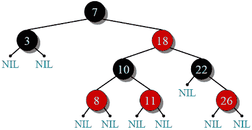
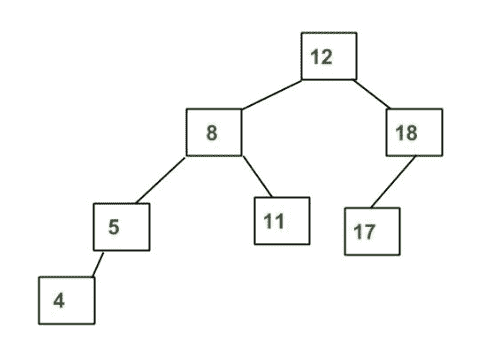

# 红黑树 vs AVL 树

> 原文:[https://www.geeksforgeeks.org/red-black-tree-vs-avl-tree/](https://www.geeksforgeeks.org/red-black-tree-vs-avl-tree/)

在这篇文章中，我们将比较红黑树和 AVL 树。

***红黑树*** :

***属性*** :

1.  通过用一种或两种颜色(红色或黑色)绘制每个节点来提供自平衡。
2.  当树被修改时，新树随后被重新排列和重画。
3.  对于树中的每个节点，它需要 1 位颜色信息。

**红黑树**维护的约束:

1.  根总是黑色的。
2.  所有空叶都是黑色的，红色节点的两个子节点都是黑色的。
3.  从给定节点到其任何后代叶子的每个简单路径都包含相同数量的黑色
    节点。
4.  从根到最远叶子的路径不超过从根到最近叶子的路径的两倍。

**AVL(阿德尔森-维尔斯基和兰迪斯)树**

***属性*** :

1.  节点左右子树的高度差应小于 2。
2.  当一个节点的两个子树的高度相差一个以上时，重新平衡就完成了。
3.  更快的检索严格平衡。

***差* :**

1.  AVL 树比红黑树提供更快的查找，因为它们更严格地平衡。
2.  与 AVL 树相比，红黑树提供了更快的插入和移除操作，因为相对轻松的平衡使得旋转更少。
3.  AVL 树存储每个节点的平衡因子或高度，因此每个节点需要存储一个整数，而红黑树每个节点只需要 1 位信息。
4.  大多数语言库中都使用了红黑树，比如 C++中的**[多映射](https://www.geeksforgeeks.org/multimap-associative-containers-the-c-standard-template-library-stl/)****[多集合](https://www.geeksforgeeks.org/multiset-in-cpp-stl/)** ，而需要更快检索的**数据库**则使用了 AVL 树。