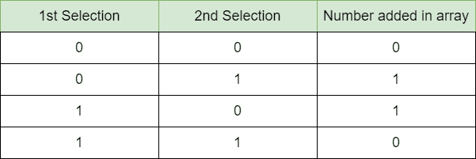

# 将 0 或 1 对替换为 0，将 10 或 01 对替换为 1，从而减少二进制数组

> 原文:[https://www . geesforgeks . org/reduce-binary-array-by-both-0s-or-both-1s-pair-with-0 和-10-or-01-pair-with-1/](https://www.geeksforgeeks.org/reduce-binary-array-by-replacing-both-0s-or-both-1s-pair-with-0-and-10-or-01-pair-with-1/)

给定大小为 **N** 的二进制[数组](https://www.geeksforgeeks.org/introduction-to-arrays/) **arr[]** ，任务是在执行一组操作后找到数组中剩余的最后一个数字。在每个操作中，选择任意两个数字并执行以下操作:

*   如果两个数字相同，将其从数组中移除，并插入一个 **0** 。
*   如果两个数字不同，请将两个数字都去掉，并插入一个 **1** 。

**示例:**

> **输入:** arr[]={0，0，1}
> **输出:** 1
> **说明:**有两种可能的操作顺序如下:
> 
> *   arr[] = {0，0，1}，删除(0，1)并插入 0 => arr[] = {0，0}，删除(0，0)并插入 1=> arr[] = {1}。
> *   arr[] = {0，0，1}，删除(0，0)并插入 0 => arr[] = {0，1}，删除(0，1)并插入 1=> arr[] = {1}。
> 
> 因此剩下的元素是 1。
> 
> **输入:** arr[]={1，0，0，0，1}
> **输出:** 0

**方法:**给定的问题可以基于以下观察来解决:

*   2 相同的数字被 0 代替。
*   两个不同的数字被一个 1 代替。

现在，为每个结果创建一个表:



仔细观察上表，可以发现该表代表[位异或](https://www.geeksforgeeks.org/bitwise-operators-in-c-cpp/)运算。因此，剩余的整数将等于给定数组元素的按位异或，可以进一步简化为 1 的频率为偶数，结果为 **0** ，否则为 **1** 。

下面是上述方法的实现。

## C++

```
// C++ program of the above approach
#include <bits/stdc++.h>
using namespace std;

// Function to find last remaining
// integer in the given array
int lastNumber(vector<int>& arr)
{

    // Variable to store the
    // frequency of 1
    int one = 0;

    // Loop to iterate the
    // given array
    for (int x : arr) {
        if (x == 1) {
            one += 1;
        }
    }

    // If frequency of 1 is even
    if (one % 2 == 0)
        return 0;

    // If frequency of 1 is odd
    return 1;
}

// Driver Code
int main()
{
    vector<int> arr = { 1, 0, 0, 0, 1 };
    cout << lastNumber(arr);
}
```

## Java 语言(一种计算机语言，尤用于创建网站)

```
// Java program of the above approach
import java.util.ArrayList;
class GFG {

  // Function to find last remaining
  // integer in the given array
  static Integer lastNumber(ArrayList<Integer> arr)
  {

    // Variable to store the
    // frequency of 1
    int one = 0;

    // Loop to iterate the
    // given array
    for (int x : arr) {
      if (x == 1) {
        one += 1;
      }
    }

    // If frequency of 1 is even
    if (one % 2 == 0)
      return 0;

    // If frequency of 1 is odd
    return 1;
  }

  // Driver Code
  public static void main(String args[]) {
    ArrayList<Integer> arr = new ArrayList<Integer>();
    arr.add(1);
    arr.add(0);
    arr.add(0);
    arr.add(0);
    arr.add(1);

    System.out.println(lastNumber(arr));
  }
}

// This code is contributed by gfgking
```

## 蟒蛇 3

```
# python program of the above approach

# Function to find last remaining
# integer in the given array
def lastNumber(arr):

    # Variable to store the
    # frequency of 1
    one = 0

    # Loop to iterate the
    # given array
    for x in arr:
        if (x == 1):
            one += 1

    # If frequency of 1 is even
    if (one % 2 == 0):
        return 0

    # If frequency of 1 is odd
    return 1

# Driver Code
if __name__ == "__main__":

    arr = [1, 0, 0, 0, 1]
    print(lastNumber(arr))

# This code is contributed by rakeshsahni
```

## C#

```
// C# program of the above approach
using System;
using System.Collections.Generic;

class GFG{

// Function to find last remaining
// integer in the given array
static int lastNumber(List<int> arr)
{

    // Variable to store the
    // frequency of 1
    int one = 0;

    // Loop to iterate the
    // given array
    foreach(int x in arr)
    {
        if (x == 1)
        {
            one += 1;
        }
    }

    // If frequency of 1 is even
    if (one % 2 == 0)
        return 0;

    // If frequency of 1 is odd
    return 1;
}

// Driver Code
public static void Main()
{
    List<int> arr = new List<int>(){ 1, 0, 0, 0, 1 };

    Console.WriteLine(lastNumber(arr));
}
}

// This code is contributed by ukasp
```

## java 描述语言

```
<script>
      // JavaScript code for the above approach

      // Function to find last remaining
      // integer in the given array
      function lastNumber(arr) {

          // Variable to store the
          // frequency of 1
          let one = 0;

          // Loop to iterate the
          // given array
          for (let x of arr) {
              if (x == 1) {
                  one += 1;
              }
          }

          // If frequency of 1 is even
          if (one % 2 == 0)
              return 0;

          // If frequency of 1 is odd
          return 1;
      }

      // Driver Code

      let arr = [1, 0, 0, 0, 1];
      document.write(lastNumber(arr));

// This code is contributed by Potta Lokesh
  </script>
```

**Output**

```
0
```

***时间复杂度:**O(N)*
T5**辅助空间:** O(1)