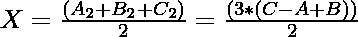
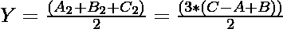

# 通过成对递减来减少给定的三个数字

> 原文:[https://www . geeksforgeeks . org/通过成对递减来减少给定的三个数字/](https://www.geeksforgeeks.org/reduce-given-three-numbers-by-decrementing-in-pairs/)

给定三个整数 **A** 、 **B** 和 **C** 。在一个操作中，选择三个整数中的任意两个，条件是两个都要大于 0，并减少 **1** 。任务是找到可以执行的最大操作数，直到其中至少两个变成 **0** 。

**示例:**

> **输入:** A = 1，B = 3，C = 1
> **输出:** 2
> **说明:**
> 操作 1:选择 A 和 B，两者减 1。当前值:A = 0，B = 2，C = 1
> 操作二:选择 B 和 C，两者减 1。当前值:A = 0，B = 1，C = 0
> 不可能有更多的操作，因为选择的任何一对都至少有一个 0。
> **输入:** A = 8，B = 1，C = 4
> **输出:** 5

**逼近:**思路是在以下条件的基础上对给定的数进行降序排列，求最大运算数:
T3】情况 1:当 A ≥ (B + C)

*   B 次选择 A 对和 B 对。因此，在 B 操作之后，当前状态将是 A =(A–B)和 B = 0。
*   正如 A ≥ (B + C)所暗示的(A–B)≥C .所以 C 运算可以选择 A 和 C 对，当前状态为 A =(A–B–C)，B = 0，C = 0。
*   执行的操作总数= **(B + C)**

**案例二:当 A < (B + C)**

*   在执行一些操作后，尝试使 A、B、C 相等。
*   首先，使 A 和 B 相等。为此，选择 A 和 C 执行(A–B)操作。将更新后的值命名为 **A <sub>1</sub> ，B<sub>1</sub>T5，**C<sub>1</sub>T9】。A <sub>1</sub> 、B <sub>1</sub> 、C <sub>1</sub> 的数值为:****

> **A<sub>1</sub>= A–(A–B)**T4**B<sub>1</sub>= B**
> T10】C<sub>1</sub>= C–(A–B)

*   执行的操作数=**(A–B)**。
*   A <sub>1</sub> 和 B <sub>1</sub> 相等。所以，选择 A <sub>1</sub> 和 B <sub>1</sub> 对(A<sub>1</sub>–C<sub>1</sub>)进行操作。
*   让 A <sub>2</sub> 、B <sub>2</sub> 、C <sub>2</sub> 成为上述操作后 A、B、C 的更新值。A <sub>2</sub> 、B <sub>2、</sub>和 C <sub>2</sub> 的值将相同，即:

> **A<sub>2</sub>T3】= A<sub>1</sub>–(A<sub>1</sub>–C<sub>1</sub>)= C<sub>1</sub>=**(C–A+B)**
> T15】B<sub>2</sub>= C–A+B**
> T20】C<sub>2</sub>= C–A+B

*   假设现在执行的操作总数为 **Z** 。所以 Z 的值将是:

> **Z**=(A–B)+(A<sub>1</sub>–C<sub>1</sub>)=(A–B)+(B–C+A–B)=**2A–B–C**

*   当 A2 = B2 = C2 时，会出现两种情况:
    *   **A2、B2、C2 为偶数:**每对(A2、B2)、(B2、C2)和(C2、A2)进行 3 次运算，则 **A2、B2** 、**和 C2 的计数减少 2** 。
        让 A2 = B2 = C2 = 4。设可执行的运算为 X，那么，X = (4 + 4 + 4) / 2 = 6。因此，X 的值可以概括为:

> 

*   **A2、B2、C2 为奇数:**对(A2、B2)、(B2、C2)和(C2、A2)的每组 3 次运算， **A2、B2** 、**和 C2 的计数减少 2** ，最终值 A2、B2 和 C2 分别达到 1、1 和 1。这里可以执行一个附加操作。
    让 A2 = B2 = C2 = 5。执行 6 次运算后，A2 = B2 = C2 = 1。这里可以再进行一次操作。因此，可以执行的操作总数为 7 (6+1)。让可执行的运算为 Y，那么，Y = floor((5 + 5 + 5) / 2) = 7。因此，Y 的值可以概括为:

> 

*   由于从上述步骤中 X = Y，因此可能原因的总数可以由下式给出:

> 可能案例总数= (Z + X) = (Z + Y) = (A + B + C) / 2。

下面是上述方法的实现:

## C++

```
// C++ program for the above approach
#include <bits/stdc++.h>
using namespace std;

// Function to find the minimum number
// operations
int solution(int A, int B, int C)
{
    int arr[3];

    // Insert the three numbers in array
    arr[0] = A, arr[1] = B, arr[2] = C;

    // Sort the array
    sort(arr, arr + 3);

    // Case 2
    if (arr[2] < arr[0] + arr[1])
        return ((arr[0] + arr[1]
                 + arr[2])
                / 2);
    // Case 1
    else
        return (arr[0] + arr[1]);
}

// Driver Code
int main()
{
    // Given A, B, C
    int A = 8, B = 1, C = 5;

    // Function Call
    cout << solution(A, B, C);
    return 0;
}
```

## Java 语言(一种计算机语言，尤用于创建网站)

```
// Java program for the above approach
import java.util.*;

class GFG{

// Function to find the minimum number
// operations
public static int solution(int A, int B, int C)
{
    int arr[] = new int[3];

    // Insert the three numbers in array
    arr[0] = A; arr[1] = B; arr[2] = C;

    // Sort the array
    Arrays.sort(arr);

    // Case 2
    if (arr[2] < arr[0] + arr[1])
        return ((arr[0] + arr[1] + arr[2]) / 2);

    // Case 1
    else
        return (arr[0] + arr[1]);
}

// Driver Code
public static void main(String[] args)
{

    // Given A, B, C
    int A = 8, B = 1, C = 5;

    // Function call
    System.out.println(solution(A, B, C));
}
}

// This code is contributed by jrishabh99
```

## 计算机编程语言

```
#Python3 program for the above approach
#Function to find the minimum number
#operations
def solution(A, B, C):
    arr=[0] * 3

    #Insert the three numbers in array
    arr[0] = A
    arr[1] = B
    arr[2] = C

    #Sort the array
    arr = sorted(arr)

    #Case 2
    if (arr[2] < arr[0] + arr[1]):
        return ((arr[0] + arr[1] + arr[2]) // 2)

    #Case 1
    else:
        return (arr[0] + arr[1])

#Driver Code
if __name__ == '__main__':

    #Given A, B, C
    A = 8
    B = 1
    C = 5

    #Function Call
    print(solution(A, B, C))

# This code is contributed by Mohit Kumar 29
```

## C#

```
// C# program for the above approach
using System;

class GFG{

// Function to find the minimum number
// operations
public static int solution(int A, int B, int C)
{
    int []arr = new int[3];

    // Insert the three numbers in array
    arr[0] = A; arr[1] = B; arr[2] = C;

    // Sort the array
    Array.Sort(arr);

    // Case 2
    if (arr[2] < arr[0] + arr[1])
        return ((arr[0] + arr[1] + arr[2]) / 2);

    // Case 1
    else
        return (arr[0] + arr[1]);
}

// Driver Code
public static void Main(String[] args)
{

    // Given A, B, C
    int A = 8, B = 1, C = 5;

    // Function call
    Console.WriteLine(solution(A, B, C));
}
}

// This code is contributed by Rajput-Ji
```

## java 描述语言

```
<script>
// JavaScript program for the above approach

// Function to find the minimum number
// operations
function solution(A, B, C)
{
    let arr = Array.from({length: 3}, (_, i) => 0);

    // Insert the three numbers in array
    arr[0] = A; arr[1] = B; arr[2] = C;

    // Sort the array
    arr.sort();

    // Case 2
    if (arr[2] < arr[0] + arr[1])
        return ((arr[0] + arr[1] + arr[2]) / 2);

    // Case 1
    else
        return (arr[0] + arr[1]);
}

// Driver Code

    // Given A, B, C
    let A = 8, B = 1, C = 5;

    // Function call
    document.write(solution(A, B, C));

</script>
```

**Output:** 

```
6
```

***时间复杂度:** O(1)*
***空间复杂度:** O(1)*