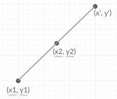

# 一个点在另一个点旋转 180 度时的反射

> 原文:[https://www . geesforgeks . org/反射点-180 度旋转-另一点/](https://www.geeksforgeeks.org/reflection-point-180-degree-rotation-another-point/)

给定 2D 平面上的两点坐标 **(x <sub>1</sub> 、y <sub>1</sub> )** 和 **(x <sub>2</sub> 、y <sub>2</sub> )** 。任务是在(x <sub>2</sub> 、y<sub>2</sub>180 度旋转时，寻找(x <sub>1</sub> 、y <sub>1</sub> )的反射。
**例:**

```
Input : x1 = 0, y1 = 0, x2 = 1, y2 = 1
Output : (2, 2)
```


```
Input : x1 = 1, y1 = 1, x2 = 2, y2 = 2
Output : (3, 3)
```

让点(x <sub>1</sub> 、y <sub>1</sub> )关于(x <sub>2</sub> 、y <sub>2</sub> )的反射点为(x’，y’)。
对于(x’，y’)是点(x <sub>1</sub> 、y <sub>1</sub> )围绕点(x <sub>2</sub> 、y <sub>2</sub> )的 180 度旋转，它们都必须共线，即所有三个点必须位于同一条直线上。此外，观察(x <sub>2</sub> 、y <sub>2</sub> )将成为(x <sub>1</sub> 、y <sub>1</sub> )和(x’，y’)之间的中点。



所以，
x’–x<sub>2</sub>= x<sub>2</sub>–x<sub>1</sub>
y’–y<sub>2</sub>= y<sub>2</sub>–y<sub>1</sub>
x’= 2 * x<sub>2</sub>–x<sub>1</sub>
y’= 2 * y<sub>2</sub>–y<sub>1【t26</sub>

## C++

```
// CPP Program tof find the 180 degree reflection
// of one point around another point.
#include <bits/stdc++.h>
using namespace std;

void findPoint(int x1, int y1, int x2, int y2)
{
    cout << "(" << 2 * x2 - x1 << ", "
         << 2 * y2 - y1 << ")";
}

int main()
{
    int x1 = 0, y1 = 0, x2 = 1, y2 = 1;
    findPoint(x1, y1, x2, y2);
    return 0;
}
```

## Java 语言(一种计算机语言，尤用于创建网站)

```
// Java Program to find the 180 degree
// reflection of one point around
// another point.
class GFG {

    static void findPoint(int x1, int y1,
                          int x2, int y2)
    {
        System.out.println("(" + (int)(2 * x2 - x1)
               + "," + (int)(2 * y2 - y1 ) + " )");
    }

    // Driver code
    public static void main(String args[])
    {
        int x1 = 0, y1 = 0, x2 = 1, y2 = 1;

        findPoint(x1, y1, x2, y2);
    }
}

// This code is contributed by Arnab Kundu.
```

## 蟒蛇 3

```
# Python3 Program for find the 180
# degree reflection of one point
# around another point.

def findPoint(x1, y1, x2, y2):
    print("(" , 2 * x2 - x1 , ",",
                2 * y2 - y1 ,")");

# Driver Code
x1 = 0;
y1 = 0;
x2 = 1;
y2 = 1;
findPoint(x1, y1, x2, y2);

# This code is contributed by mits
```

## C#

```
// C# Program to find the 180 degree reflection
// of one point around another point.
using System;

public class GFG {

    static void findPoint(int x1, int y1,
                          int x2, int y2)
    {
        Console.WriteLine("(" + (int)(2 * x2 - x1)
               + "," + (int)(2 * y2 - y1 ) + " )");
    }

    // Driver code
    static public void Main(String []args)
    {
        int x1 = 0, y1 = 0, x2 = 1, y2 = 1;

        findPoint(x1, y1, x2, y2);
    }
}

// This code is contributed by Arnab Kundu.
```

## 服务器端编程语言（Professional Hypertext Preprocessor 的缩写）

```
<?php
// PHP Program for find the 180
// degree reflection of one point
// around another point.

function findPoint($x1, $y1, $x2, $y2)
{
    echo "(" , 2 * $x2 - $x1 , ", "
                , 2 * $y2 - $y1 ,")";
}

    // Driver Code
    $x1 = 0;
    $y1 = 0;
    $x2 = 1;
    $y2 = 1;
    findPoint($x1, $y1, $x2, $y2);

// This code is contributed by anuj_67
?>
```

## java 描述语言

```
<script>

// Javascript Program to find the 180 degree reflection
// of one point around another point.

function findPoint(x1, y1, x2, y2)
{
    document.write("(" + 2 * (x2 - x1) + ", "
        + 2 * (y2 - y1) + ")");
}

    let x1 = 0, y1 = 0, x2 = 1, y2 = 1;
    findPoint(x1, y1, x2, y2);

// This code is contributed by Mayank Tyagi

</script>
```

**Output:** 

```
(2, 2)
```

**时间复杂度:** O(1)