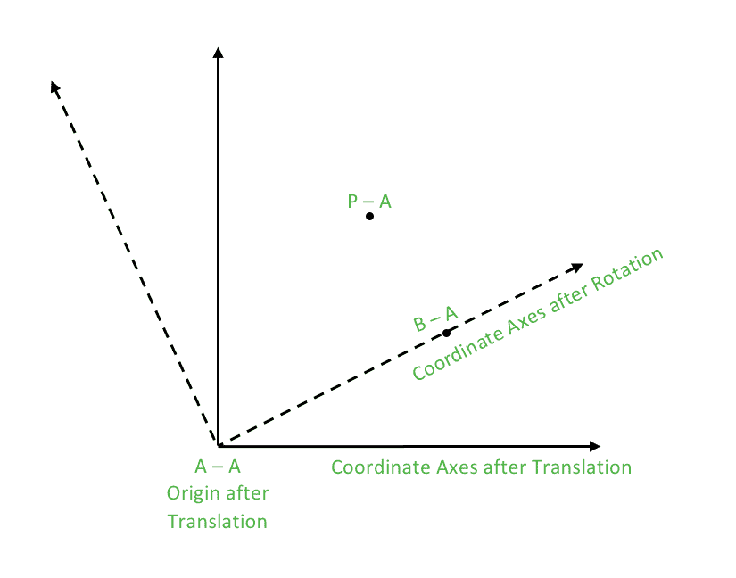

# c++中一个点对一条线的反射

> 原文:[https://www.geeksforgeeks.org/reflection-point-line-c/](https://www.geeksforgeeks.org/reflection-point-line-c/)

让我们首先考虑一个一般情况，其中直线除了 X 轴什么也不是。我们现在可以肯定地说，一个点的共轭是该点关于 X 轴的反射。
现在，使用坐标轴的平移和旋转方法，我们将找出一个点关于一般直线的反射。
翻译的想法在之前的帖子里有描述。这里我们描述旋转的概念。
**什么是自转？**
在欧几里得几何中，二维轴的旋转是从 xy-笛卡尔坐标系到 x ' y '-笛卡尔坐标系的映射，其中原点保持固定，x '和 y '轴通过将 x 轴和 y 轴旋转角度θ获得。
**如何进行旋转？**
旋转可以解释为将坐标系的每个点乘以(逆时针方向旋转)或除以(顺时针方向旋转)一个恒定矢量。
这里注意，如果我们想围绕原点逆时针方向旋转一个点θ，我们将其乘以极坐标(1.0，θ)，如 [SET 1](https://www.geeksforgeeks.org/geometry-using-complex-numbers-stdcomplex-in-c/) 中所述。同样，我们除以极坐标(1.0，θ)，使点顺时针旋转θ。
旋转后，执行所需的计算，并通过将每个点分别除以或乘以常数向量来使旋转无效。
所以，我们要反映一个点 P 关于一条由点 A 和点 B 指定的线，表示为 AB。因为，我们知道点的共轭是点关于 X 轴的反射。为了能够利用这个事实，我们将首先执行平移(在新的坐标系中以 A 为原点)，然后旋转坐标轴，使直线成为新坐标系中的 X 轴。
现在我们可以简单地应用关于 X 轴的反射公式，然后取消旋转和平移的影响，得到最终的结果。
这些步骤可以描述为:

**1。平移(在 A 处移动原点):**从所有点中减去 A。

```
Pt = P – A
Bt = B – A
At is origin
```

**2。旋转(将 B <sub>t</sub> A <sub>t</sub> 移动到 X 轴):**将所有点除以 B <sub>t</sub> (分割是指顺时针方向旋转，这是这里引入 X 轴的要求)。

```
Pr = Pt/Bt 
```

**3。P <sub>r</sub> 关于 B <sub>r</sub> A <sub>r</sub> 的反射(只不过是 X 轴):**简单取点的共轭。

```
Prreflected = conj(Pr) 
```

**4。从旋转恢复回来:**将所有点乘以 Bt。

```
Ptreflected= conj(Pr)*Bt 
```

**5。从翻译恢复回来:**给所有点加一个 A。
P 反射= conj(P <sub>r</sub> )*B <sub>t</sub> + A

因此，

```
return conj(Pr)*Bt + A
where, Bt = B – A 
Pt = P – A 
Pr = Pt/Bt
```



## 卡片打印处理机（Card Print Processor 的缩写）

```
// CPP example to illustrate the
// reflection of a point about a line
#include <iostream>
#include <complex>

using namespace std;

typedef complex<double> point;
#define x real()
#define y imag()

// Constant PI for providing angles in radians
#define PI 3.1415926535897932384626

// Function used to display X and Y coordinates of a point
void displayPoint(point P)
{
    cout << "(" << P.x << ", " << P.y << ")" << endl;
}

// Function for Reflection of P about line AB
point reflect(point P, point A, point B)
{
    // Performing translation and shifting origin at A
    point Pt = P-A;
    point Bt = B-A;

    // Performing rotation in clockwise direction
    // BtAt becomes the X-Axis in the new coordinate system
    point Pr = Pt/Bt;

    // Reflection of Pr about the new X-Axis
    // Followed by restoring from rotation
    // Followed by restoring from translation

    return conj(Pr)*Bt + A;
}

int main()
{
    // Rotate P about line AB
    point P(4.0, 7.0);
    point A(1.0, 1.0);
    point B(3.0, 3.0);

    point P_reflected = reflect(P, A, B);
    cout << "The point P on reflecting about AB becomes:";
    cout << "P_reflected"; displayPoint(P_reflected);

    return 0;
}
```

输出:

```
The point P on reflecting about AB becomes: P_reflected(7, 4)
```

本文由**安雅金达尔**供稿。如果你喜欢 GeeksforGeeks 并想投稿，你也可以使用[write.geeksforgeeks.org](https://write.geeksforgeeks.org)写一篇文章或者把你的文章邮寄到 review-team@geeksforgeeks.org。看到你的文章出现在极客博客主页上，帮助其他极客。
如果你发现任何不正确的地方，或者你想分享更多关于上面讨论的话题的信息，请写评论。