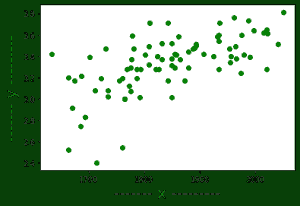
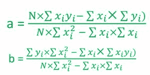
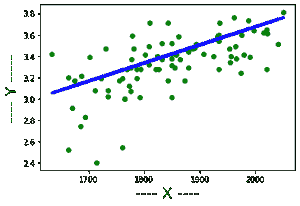

# 用 C++进行回归分析和最佳拟合线

> 原文:[https://www . geesforgeks . org/回归分析和最佳拟合线-使用-c/](https://www.geeksforgeeks.org/regression-analysis-and-the-best-fitting-line-using-c/)

本文讨论线性回归的基础知识及其在 C++编程语言中的实现。[回归](https://www.geeksforgeeks.org/ml-linear-regression/)分析是数据科学家用于预测某些输入数据对应值的常用分析方法。

简单的回归分析方法是[线性回归](https://www.geeksforgeeks.org/linear-regression-python-implementation/)。线性回归是一种统计方法，用于建模因变量与给定的一组自变量之间的关系。我们将在 C++中实现同样的功能。

输入数据集通常以. csv(逗号分隔值)文件的形式出现，我们将从该文件中复制该文件，并将其放入. txt 文件中作为 C++程序的输入文件。要从文件中获取输入，请在与程序文件相同的目录中创建一个名为 input.txt 的文件，并将数据放入该文件中，使第一行的值为 **N** ，即该数据集中的条目数。

**实施:**

## C++

```
// C++ program to implement
// the above approach
#include <iostream>
#include <stdio.h>
#include <vector>
using namespace std;
class regression {
    // Dynamic arrary which is going
    // to contain all (i-th x)
    vector<float> x;

    // Dynamic arrary which is going
    // to contain all (i-th y)
    vector<float> y;

    // Store the coefficient/slope in
    // the best fitting line
    float coeff;

    // Store the constant term in
    // the best fitting line
    float constTerm;

    // Contains sum of product of
    // all (i-th x) and (i-th y)
    float sum_xy;

    // Contains sum of all (i-th x)
    float sum_x;

    // Contains sum of all (i-th y)
    float sum_y;

    // Contains sum of square of
    // all (i-th x)
    float sum_x_square;

    // Contains sum of square of
    // all (i-th y)
    float sum_y_square;

public:
    // Constructor to provide the default
    // values to all the terms in the
    // object of class regression
    regression()
    {
        coeff = 0;
        constTerm = 0;
        sum_y = 0;
        sum_y_square = 0;
        sum_x_square = 0;
        sum_x = 0;
        sum_xy = 0;
    }

    // Function that calculate the coefficient/
    // slope of the best fitting line
    void calculateCoefficient()
    {
        float N = x.size();
        float numerator
            = (N * sum_xy - sum_x * sum_y);
        float denominator
            = (N * sum_x_square - sum_x * sum_x);
        coeff = numerator / denominator;
    }

    // Member function that will calculate
    // the constant term of the best
    // fitting line
    void calculateConstantTerm()
    {
        float N = x.size();
        float numerator
            = (sum_y * sum_x_square - sum_x * sum_xy);
        float denominator
            = (N * sum_x_square - sum_x * sum_x);
        constTerm = numerator / denominator;
    }

    // Function that return the number
    // of entries (xi, yi) in the data set
    int sizeOfData()
    {
        return x.size();
    }

    // Function that return the coeffecient/
    // slope of the best fitting line
    float coefficient()
    {
        if (coeff == 0)
            calculateCoefficient();
        return coeff;
    }

    // Function that return the constant
    // term of the best fitting line
    float constant()
    {
        if (constTerm == 0)
            calculateConstantTerm();
        return constTerm;
    }

    // Function that print the best
    // fitting line
    void PrintBestFittingLine()
    {
        if (coeff == 0 && constTerm == 0) {
            calculateCoefficient();
            calculateConstantTerm();
        }
        cout << "The best fitting line is y = "
             << coeff << "x + " << constTerm << endl;
    }

    // Function to take input from the dataset
    void takeInput(int n)
    {
        for (int i = 0; i < n; i++) {
            // In a csv file all the values of
            // xi and yi are seperated by commas
            char comma;
            float xi;
            float yi;
            cin >> xi >> comma >> yi;
            sum_xy += xi * yi;
            sum_x += xi;
            sum_y += yi;
            sum_x_square += xi * xi;
            sum_y_square += yi * yi;
            x.push_back(xi);
            y.push_back(yi);
        }
    }

    // Function to show the data set
    showData()
    {
        for (int i = 0; i < 62; i++) {
            printf("_");
        }
        printf("\n\n");
        printf("|%15s%5s %15s%5s%20s\n",
               "X", "", "Y", "", "|");

        for (int i = 0; i < x.size(); i++) {
            printf("|%20f %20f%20s\n",
                   x[i], y[i], "|");
        }

        for (int i = 0; i < 62; i++) {
            printf("_");
        }
        printf("\n");
    }

    // Function to predict the value
    // correspondng to some input
    float predict(float x)
    {
        return coeff * x + constTerm;
    }

    // Function that returns overall
    // sum of square of errors
    float errorSquare()
    {
        float ans = 0;
        for (int i = 0;
             i < x.size(); i++) {
            ans += ((predict(x[i]) - y[i])
                    * (predict(x[i]) - y[i]));
        }
        return ans;
    }

    // Functions that return the error
    // i.e the difference between the
    // actual value and value predicted
    // by our model
    float errorIn(float num)
    {
        for (int i = 0;
             i < x.size(); i++) {
            if (num == x[i]) {
                return (y[i] - predict(x[i]));
            }
        }
        return 0;
    }
};

// Driver code
int main()
{
    freopen("input.txt", "r",
            stdin);
    regression reg;

    // Number of pairs of (xi, yi)
    // in the dataset
    int n;
    cin >> n;

    // Calling function takeInput to
    // take input of n pairs
    reg.takeInput(n);

    // Printing the best fitting line
    reg.PrintBestFittingLine();
    cout << "Predicted value at 2060 = "
         << reg.predict(2060) << endl;
    cout << "The errorSquared  = "
         << reg.errorSquare() << endl;
    cout << "Error in 2050 = "
         << reg.errorIn(2050) << endl;
}
```

**input . txt 文件内容为:**

```
84
1714, 2.4
1664, 2.52
1760, 2.54
1685, 2.74
1693, 2.83
1670, 2.91
1764, 3
1764, 3
1792, 3.01
1850, 3.01
1735, 3.02
1775, 3.07
1735, 3.08
1712, 3.08
1773, 3.12
1872, 3.17
1755, 3.17
1674, 3.17
1842, 3.17
1786, 3.19
1761, 3.19
1722, 3.19
1663, 3.2
1687, 3.21
1974, 3.24
1826, 3.28
1787, 3.28
1821, 3.28
2020, 3.28
1794, 3.28
1769, 3.28
1934, 3.28
1775, 3.29
1855, 3.29
1880, 3.29
1849, 3.31
1808, 3.32
1954, 3.34
1777, 3.37
1831, 3.37
1865, 3.37
1850, 3.38
1966, 3.38
1702, 3.39
1990, 3.39
1925, 3.4
1824, 3.4
1956, 3.4
1857, 3.41
1979, 3.41
1802, 3.41
1855, 3.42
1907, 3.42
1634, 3.42
1879, 3.44
1887, 3.47
1730, 3.47
1953, 3.47
1781, 3.47
1891, 3.48
1964, 3.49
1808, 3.49
1893, 3.5
2041, 3.51
1893, 3.51
1832, 3.52
1850, 3.52
1934, 3.54
1861, 3.58
1931, 3.58
1933, 3.59
1778, 3.59
1975, 3.6
1934, 3.6
2021, 3.61
2015, 3.62
1997, 3.64
2020, 3.65
1843, 3.71
1936, 3.71
1810, 3.71
1987, 3.73
1962, 3.76
2050, 3.81
```

**输出:**

```
The best fitting lne is y = 0.00165565x + 0.27511
Predicted value at 2060 = 3.68575
The errorSquared  = 3.63727
Error in 2050 = 0.140807
```

**说明:**
1。如果一个图中的所有数据项都被绘制出来，那么我们将在图中得到几个点，现在最佳拟合线是最接近图上每个点的线。



数据的图形表示

2.下一个任务是找到最佳拟合线。因为任何直线都可以用 y = ax + b 的形式表示，其中 a 是直线的系数或斜率，b 是常数项。
3。所以为了找到最佳拟合线，计算 **a** 和**b**的值，有一个简单的公式可以计算 a 和 b 的值，如下图所示-



a 和 b 的公式

4.计算 a 和 b 的值后，可以将图上的线表示为:



最合适的线